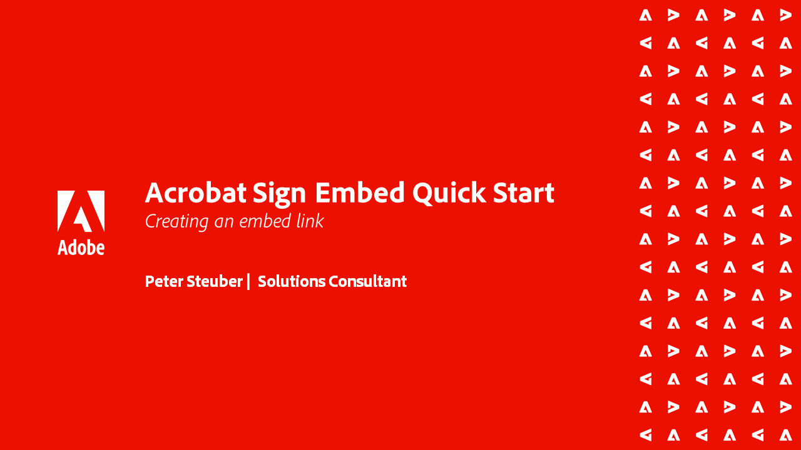
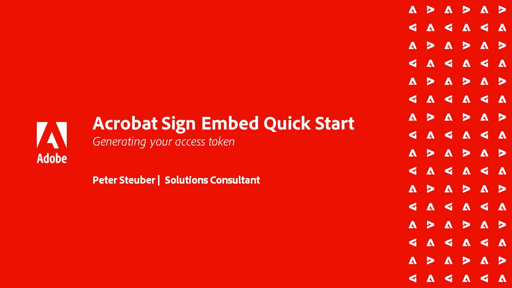
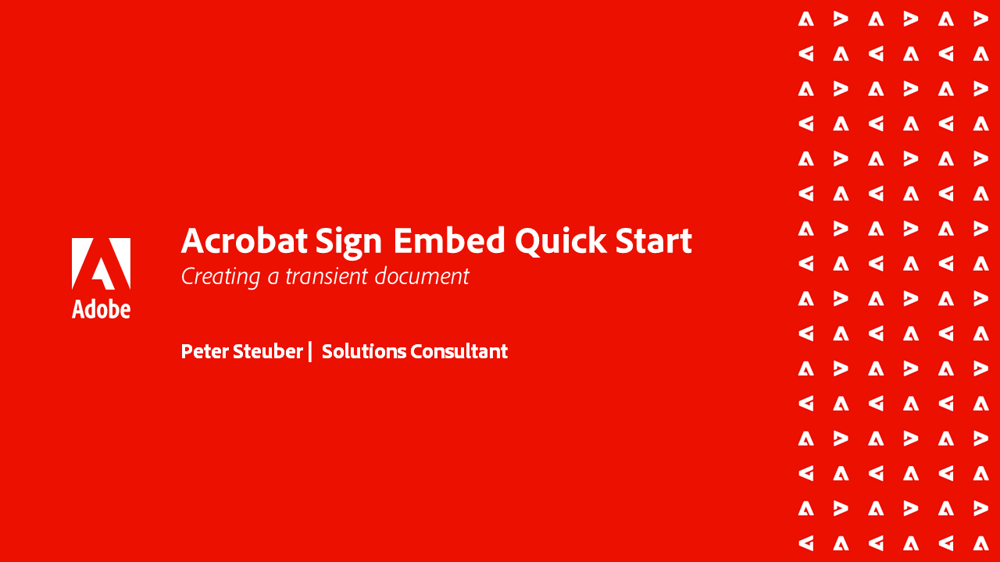

# Tutoriales de API de Acrobat Sign

Las API de Acrobat Sign le permiten crear aplicaciones e integrar la IU y la funcionalidad de Acrobat Sign en sus aplicaciones.

## Introducción

<table style="table-layout:fixed">
<tr>
   <td>
    
    

    <a href="signapi.md"><strong>Introducción</strong></a>
    

    <em>Obtenga información sobre cómo incluir la API de Sign en su aplicación para recopilar firmas y otra información</em>
     
  </td>
  <td>
    
    

     
  </td>
  <td>
    
    

     
  </td>
  <td>
    
    

     
  </td>
</tr>
</table>

## Guía de inicio rápido de Acrobat Sign Embed

Obtenga información sobre cómo empezar a incrustar la versión OEM de Acrobat Sign en la aplicación. Esta guía está diseñada específicamente para los socios OEM que crean e incrustan un proceso de firma en su aplicación.

<table style="table-layout:fixed">
<tr>
 <td>
   
    

   <a href="sign-up-developer-account.md"><strong>Registrarse para obtener una cuenta de desarrollador</strong></a>
    

    <em>Obtenga información sobre cómo registrarse para obtener una cuenta de desarrollador para Acrobat Sign, que está totalmente habilitada con la funcionalidad de Sign y API</em>
     
  </td>
  <td>
   
    

   <a href="creating-your-application.md"><strong>Crear la aplicación</strong></a>
    

    <em>Aprenda a crear una aplicación en Acrobat Sign</em>
     
  </td>
   <td>
   
    

   <a href="creating-an-embed-link.md"><strong>Creación de un vínculo incrustado</strong></a>
    

    <em>Aprenda a crear un vínculo incrustado para OAuth, que es el método por el que la aplicación obtiene permisos para los usuarios</em>
     
  </td>
  <td>
   
    

   <a href="generating-an-access-token.md"><strong>Generación de un token de acceso</strong></a>
    

    <em>Obtenga información sobre cómo generar un token de acceso que se puede utilizar con la API de Acrobat Sign</em>
     
  </td>
</tr>
<tr>
  <td>
   
    

   <a href="creating-a-transient-document.md"><strong>Creación de un documento transitorio</strong></a>
    

    <em>Aprenda a crear un documento transitorio que se pueda utilizar con la API de Acrobat Sign</em>
     
  </td>
  <td>
    
    

     
  </td>
   <td>
    
    

     
  </td>
  <td>
    
    

     
  </td>
</tr>
</table>
