# Introducción a la API de Adobe Sign


[API de Acrobat Sign](https://www.adobe.io/apis/documentcloud/sign.html) es una excelente forma de mejorar la forma de administrar los acuerdos firmados. Los desarrolladores pueden integrar fácilmente sus sistemas con la API de Sign, que proporciona una forma fiable y sencilla de cargar documentos, enviarlos para su firma, enviar recordatorios y recopilar firmas electrónicas.

## Lo que puedes aprender

Este tutorial práctico explica cómo los desarrolladores pueden utilizar la API de Sign para mejorar las aplicaciones y los flujos de trabajo creados con [!DNL Adobe Acrobat Services]. [!DNL Acrobat Services] incluye [API de servicios de Adobe PDF](https://www.adobe.io/apis/documentcloud/dcsdk/pdf-tools.html), [API Adobe PDF Embed](https://www.adobe.io/apis/documentcloud/viesdk) (gratuito), y [API de generación de documentos de Adobe](https://www.adobe.io/apis/documentcloud/dcsdk/doc-generation.html).

Más concretamente, aprende a incluir la API de Acrobat Sign en tu aplicación para recopilar firmas y otra información, como la información de los empleados en un formulario de seguro. Se utilizan pasos genéricos con solicitudes y respuestas HTTP simplificadas. Puede implementar estas solicitudes en su idioma preferido. Puede crear un PDF utilizando una combinación de [[!DNL Acrobat Services] API](https://www.adobe.io/apis/documentcloud/dcsdk/), cárguelo en la API de Sign como [transitorio](https://www.adobe.io/apis/documentcloud/sign/docs.html#!adobedocs/adobe-sign/master/overview/terminology.md) y solicitar firmas de usuario final mediante el acuerdo o [widget](https://www.adobe.io/apis/documentcloud/sign/docs.html#!adobedocs/adobe-sign/master/overview/terminology.md) flujo de trabajo.

## Creación de un documento de PDF

Para empezar, cree una plantilla de Microsoft Word y guárdela como PDF. O bien, puede automatizar la canalización mediante la API de generación de documentos para cargar una plantilla creada en Word y, a continuación, generar un documento de PDF. La API de generación de documentos forma parte de [!DNL Acrobat Services], [gratis durante seis meses y luego de pago por solo o $0.05 por transacción de documento](https://www.adobe.io/apis/documentcloud/dcsdk/pdf-pricing.html).

En este ejemplo, la plantilla es solo un documento sencillo con algunos campos de firmante que rellenar. Asigne un nombre a los campos ahora y, a continuación, inserte los campos reales en este tutorial.

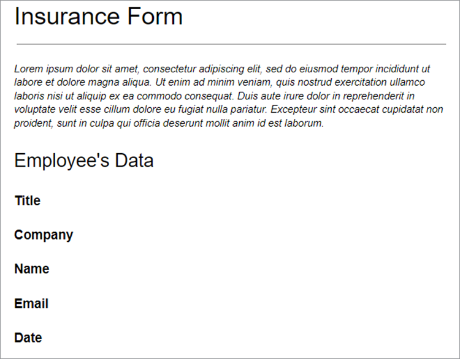

## Descubrimiento del punto de acceso de API válido

Antes de trabajar con la API de Sign, [crear una cuenta de desarrollador gratuita](https://acrobat.adobe.com/ca/en/sign/developer-form.html) para acceder a la API, pruebe el intercambio y la ejecución de documentos, y pruebe la función de correo electrónico.

Adobe distribuye la API de Acrobat Sign por todo el mundo en muchas unidades de implementación llamadas &quot;fragmentos&quot;. Cada recurso compartido sirve a una cuenta de cliente, como NA1, NA2, NA3, EU1, JP1, AU1, IN1 y otros. Los nombres compartidos corresponden a ubicaciones geográficas. Estos fragmentos componen el URI base (puntos de acceso) de los puntos finales de la API.

Para acceder a la API de Sign, primero debe descubrir el punto de acceso correcto para su cuenta, que puede ser api.na1.adobesign.com, api.na4.adobesign.com, api.eu1.adobesign.com u otros, según su ubicación.

```
  GET /api/rest/v6/baseUris HTTP/1.1
  Host: https://api.adobesign.com
  Authorization: Bearer {YOUR-INTEGRATION-KEY-HERE}
  Accept: application/json

  Response Body (example):

  {
    "apiAccessPoint": "https://api.na4.adobesign.com/", 
    "webAccessPoint": "https://secure.na4.adobesign.com/" 
  }
```

En el ejemplo anterior, hay una respuesta con el valor como punto de acceso.

>[!IMPORTANT]
>
>En este caso, todas las solicitudes posteriores que realice a la API de Sign deben utilizar ese punto de acceso. Si utiliza un punto de acceso que no sirve a su región, obtendrá un error.

## Carga de un documento transitorio

Adobe Sign le permite crear diferentes flujos que preparan documentos para las firmas o la recopilación de datos. Independientemente del flujo de la aplicación, primero debe cargar un documento, que solo estará disponible durante siete días. Las llamadas de API posteriores deben hacer referencia a este documento temporal.

El documento se carga mediante una solicitud del POST al `/transientDocuments` punto final. La solicitud de varias partes consta del nombre del archivo, una secuencia de archivos y el tipo MIME (medios) del archivo de documento. La respuesta del extremo contiene un ID que identifica el documento.

Además, la aplicación puede especificar una URL de devolución de llamada para que Acrobat Sign realice un ping, lo que notifica a la aplicación cuando se complete el proceso de firma.


```
  POST /api/rest/v6/transientDocuments HTTP/1.1
  Host: {YOUR-API-ACCESS-POINT}
  Authorization: Bearer {YOUR-INTEGRATION-KEY-HERE}
  x-api-user: email:your-api-user@your-domain.com
  Content-Type: multipart/form-data
  File-Name: "Insurance Form.pdf"
  File: "[path]\Insurance Form.pdf"
  Accept: application/json

  Response Body (example):

  {
     "transientDocumentId": "3AAA...BRZuM"
  }
```

## Crear un formulario web

Los formularios web (antes conocidos como widgets de firma) son documentos alojados que cualquier persona con acceso puede firmar. Algunos ejemplos de formularios web son las hojas de registro, las renuncias y otros documentos a los que muchas personas acceden y firman en línea.

Para crear un nuevo formulario web utilizando la API de Sign, primero debe cargar un documento transitorio. La solicitud del POST al `/widgets` endpoint utiliza el `transientDocumentId` .

En este ejemplo, el formulario web es `ACTIVE`, pero puede crearlo en uno de los tres estados diferentes:

* BORRADOR: para generar el formulario web de forma incremental

* CREACIÓN: para agregar o editar campos de formulario en el formulario web

* ACTIVO: para alojar inmediatamente el formulario web

También debe definirse la información sobre los participantes del formulario. La `memberInfos` contiene datos sobre los participantes, como el correo electrónico. Actualmente, este conjunto no admite más de un miembro. Sin embargo, como el correo electrónico del firmante del formulario web no se conoce en el momento de la creación del formulario web, el correo electrónico debe dejarse vacío, como en el ejemplo siguiente. La `role` define la función asumida por los miembros en el `memberInfos` (por ejemplo, el FIRMANTE y EL APROBADOR).

```
  POST /api/rest/v6/widgets HTTP/1.1
  Host: {YOUR-API-ACCESS-POINT}
  Authorization: Bearer {YOUR-INTEGRATION-KEY-HERE}
  x-api-user: email:your-api-user@your-domain.com
  Content-Type: application/json

  Request Body:

  {
    "fileInfos": [
      {
      "transientDocumentId": "YOUR-TRANSIENT-DOCUMENT-ID"
      }
     ],
    "name": "Insurance Form",
      "widgetParticipantSetInfo": {
          "memberInfos": [{
              "email": ""
          }],
      "role": "SIGNER"
      },
      "state": "ACTIVE"
  }

  Response Body (example):

  {
     "id": "CBJ...PXoK2o"
  }
```

Puede crear un formulario web como `DRAFT` o `AUTHORING`, luego cambie su estado a medida que el formulario pase por la canalización de la aplicación. Para cambiar el estado de un formulario web, consulte la [PUT /widgets/{widgetId}/state](https://secure.na4.adobesign.com/public/docs/restapi/v6#!/widgets/updateWidgetState) punto final.

## Leer la URL de alojamiento del formulario web

El siguiente paso es descubrir la dirección URL que aloja el formulario web. El extremo /widgets recupera una lista de datos de formulario web, incluida la dirección URL alojada del formulario web que reenvía a los usuarios, para recopilar firmas y otros datos de formulario.

Este extremo devuelve una lista para que pueda encontrar el formulario específico por su identificador en el `userWidgetList` antes de obtener la dirección URL que aloja el formulario web:

```
  GET /api/rest/v6/widgets HTTP/1.1
  Host: {YOUR-API-ACCESS-POINT}
  Authorization: Bearer {YOUR-INTEGRATION-KEY-HERE}
  Accept: application/json

  Response Body:

  {
    "userWidgetList": [
      {
        "id": "CBJCHB...FGf",
        "name": "Insurance Form",
        "groupId": "CBJCHB...W86",
        "javascript": "<script type='text/javascript' ...
        "modifiedDate": "2021-03-13T15:52:41Z",
        "status": "ACTIVE",
        "Url":
        "https://secure.na4.adobesign.com/public/esignWidget?wid=CBFCIB...Rag*",
        "hidden": false
      },
      {
        "id": "CBJCHB...I8_",
        "name": "Insurance Form",
        "groupId": "CBJCHBCAABAAyhgaehdJ9GTzvNRchxQEGH_H1ya0xW86",
        "javascript": "<script type='text/javascript' language='JavaScript'
        src='https://sec
        "modifiedDate": "2021-03-13T02:47:32Z",
        "status": "ACTIVE",
        "Url":
        "https://secure.na4.adobesign.com/public/esignWidget?wid=CBFCIB...AAB",
        "hidden": false
      },
      {
        "id": "CBJCHB...Wmc",
```

## Administrar el formulario web

Este formulario es un documento de PDF que los usuarios deben rellenar. Sin embargo, aún debe indicar al editor del formulario qué campos deben rellenar los usuarios y dónde se encuentran dentro del documento:


El documento anterior no muestra los campos, aún. Se añaden al definir qué campos recopilan la información del firmante, así como su tamaño y posición.

Ahora, vaya al [Formularios web](https://secure.na4.adobesign.com/public/agreements/#agreement_type=webform) en la página &quot;Sus acuerdos&quot; y busque el formulario que ha creado.

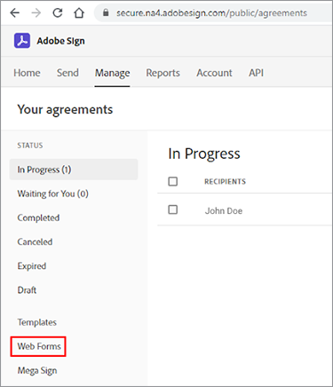

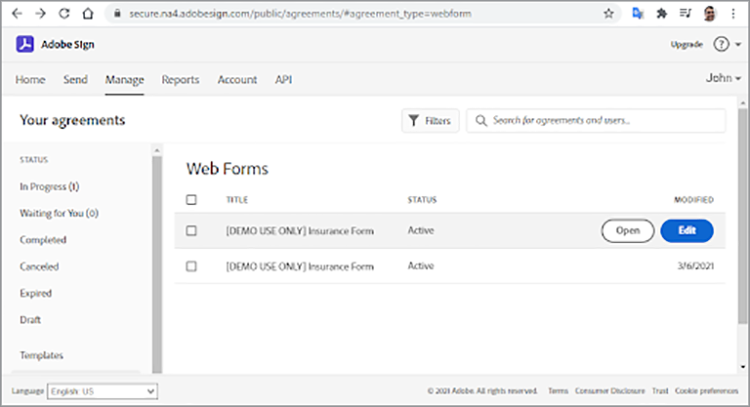

Haga clic en **Editar** para abrir la página de edición del documento. Los campos predefinidos disponibles se encuentran en el panel derecho.

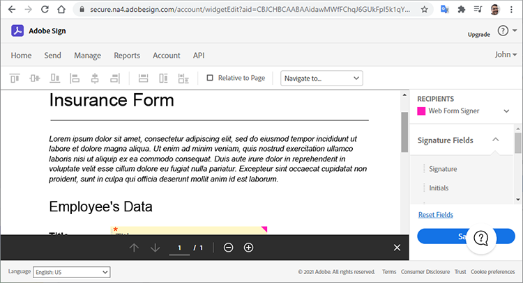

El editor le permite arrastrar y soltar campos de texto y firma. Después de agregar todos los campos necesarios, puede cambiar el tamaño y alinearlos para pulir el formulario. Por último, haga clic en **Guardar** para crear el formulario.

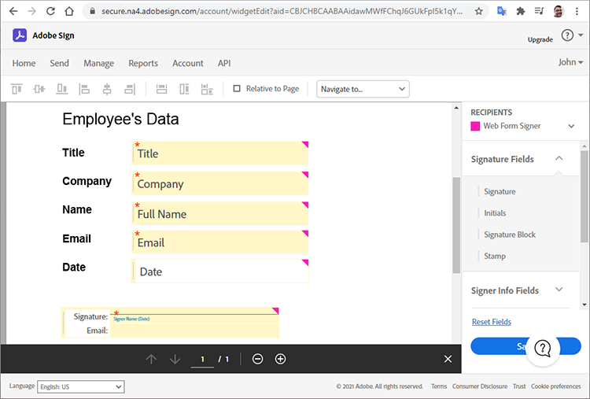

## Enviar un formulario web para firmar

Después de finalizar el formulario web, debe enviarlo para que los usuarios puedan rellenarlo y firmarlo. Una vez guardado el formulario, puede ver y copiar la dirección URL y el código incrustado.

**Copiar URL de formulario web**: utilice esta dirección URL para enviar a los usuarios a una versión alojada de este acuerdo para que la revisen y la firmen. Por ejemplo:

[https://secure.na4.adobesign.com/public/esignWidget?wid=CBFCIBAA3...babw\*](https://secure.na4.adobesign.com/public/esignWidget?wid=CBFCIBAA3AAABLblqZhCndYscuKcDMPiVfQlpaGPb-5D7ebE9NUTQ6x6jK7PIs8HCtTzr3HOx8U6D5qqbabw*)

**Copiar código incrustado de formulario web**: añada el acuerdo a su sitio web copiando este código y pegándolo en su HTML.

Por ejemplo:

```
<iframe
src="https://secure.na4.adobesign.com/public/esignWidget?wid=CBFC
...yx8*&hosted=false" width="100%" height="100%" frameborder="0"
style="border: 0;
overflow: hidden; min-height: 500px; min-width: 600px;"></iframe>
```

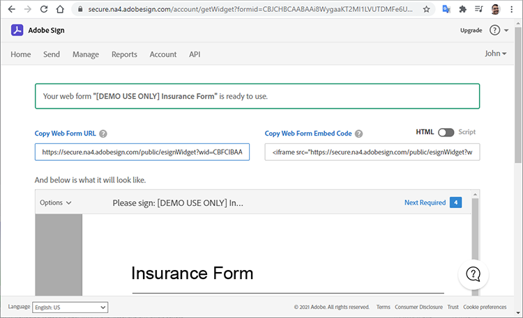

Cuando los usuarios obtienen acceso a la versión alojada del formulario, revisan el documento transitorio que se cargó primero con los campos colocados según lo especificado.

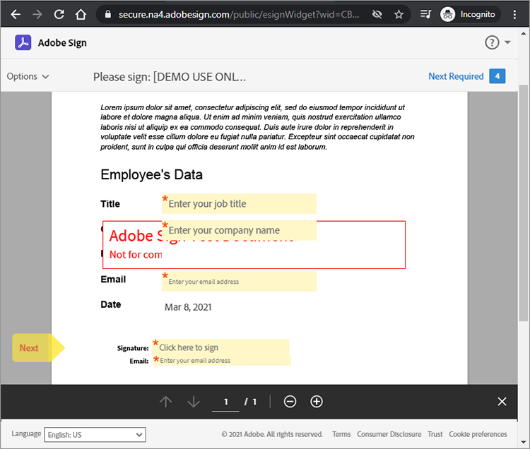

A continuación, el usuario rellena los campos y firma el formulario.

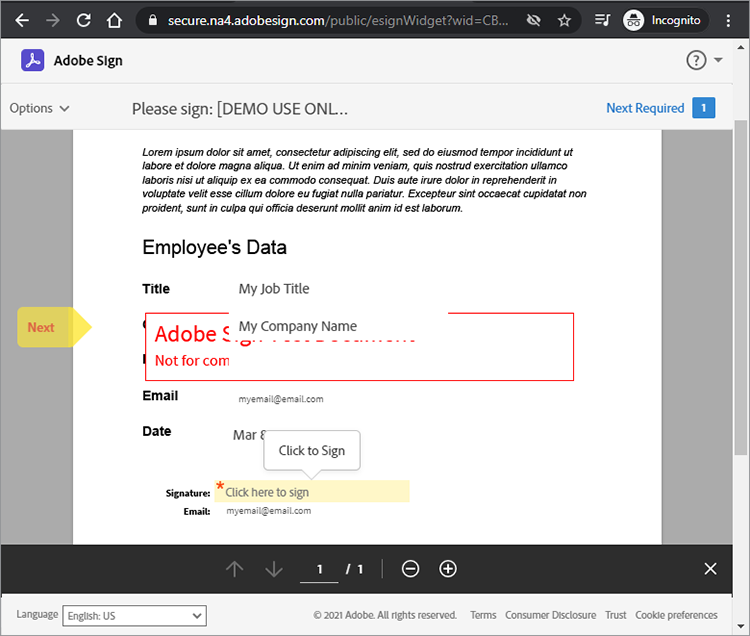

A continuación, el usuario firma el documento con una firma previamente almacenada o con una nueva.

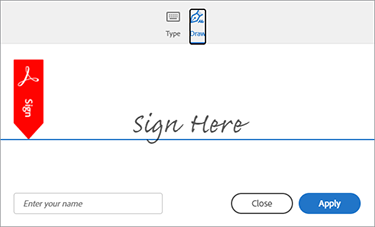

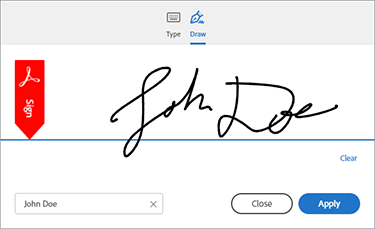

Cuando el usuario hace clic **Aplicar**, Adobe les indica que abran su correo electrónico y confirmen la firma. La firma permanece pendiente hasta que llegue la confirmación.

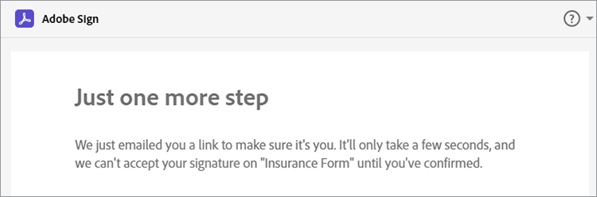

Esta autenticación añade autenticación de múltiples factores y refuerza la seguridad del proceso de firma.

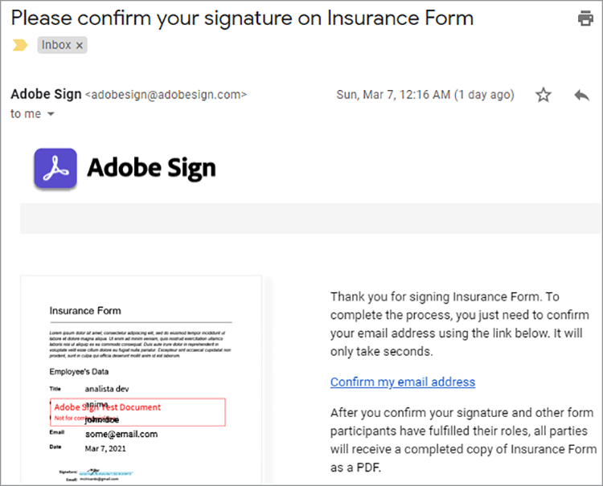

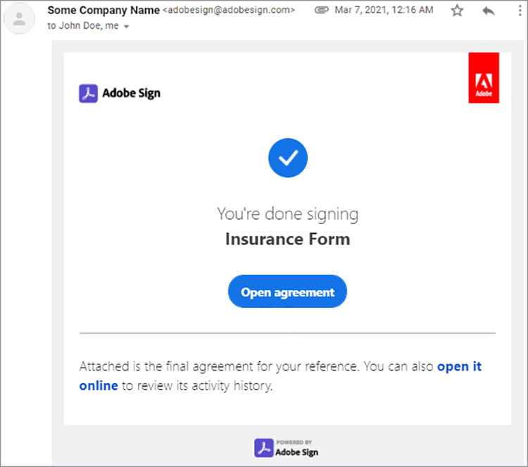

## Lectura de formularios web completados

Ahora es el momento de obtener los datos del formulario que los usuarios rellenaron. La `/widgets/{widgetId}/formData` endpoint recupera los datos introducidos por el usuario en un formulario interactivo cuando firmó el formulario.

```
GET /api/rest/v6/widgets/{widgetId}/formData HTTP/1.1
Host: {YOUR-API-ACCESS-POINT}
Authorization: Bearer {YOUR-INTEGRATION-KEY-HERE}
Accept: text/csv
```

La secuencia de archivo CSV resultante contiene datos de formulario.

```
Response Body:
"Agreement
name","completed","email","role","first","last","title","company","agreementId",
"email verified","web form signed/approved"
"Insurance Form","","myemail@email.com","SIGNER","John","Doe","My Job Title","My
Company Name","","","2021-03-07 19:32:59"
```

## Creación de un acuerdo

Como alternativa a los formularios web, puede crear acuerdos. En las siguientes secciones se muestran algunos pasos sencillos para administrar acuerdos mediante la API de Sign.

Enviar un documento a los destinatarios especificados para que lo firmen o aprueben crea un acuerdo. Puede realizar un seguimiento del estado y la finalización de un acuerdo mediante las API.

Puede crear un acuerdo mediante una [documento transitorio](https://helpx.adobe.com/sign/kb/how-to-send-an-agreement-through-REST-API.html), [documento de biblioteca](https://www.adobe.io/apis/documentcloud/sign/docs.html#!adobedocs/adobe-sign/master/samples/send_using_library_doc.md), o URL. En este ejemplo, el acuerdo se basa en la `transientDocumentId`, al igual que el formulario web creado anteriormente.

```
POST /api/rest/v6/agreements HTTP/1.1
Host: {YOUR-API-ACCESS-POINT}
Authorization: Bearer {YOUR-INTEGRATION-KEY-HERE}
x-api-user: email:your-api-user@your-domain.com
Content-Type: application/json
Accept: application/json
Request Body:
{
    "fileInfos": [
      {
      "transientDocumentId": "{transientDocumentId}"
      }
     ],
    "name": "{agreementName}",
    "participantSetsInfo": [
      {
      "memberInfos": [
          {
          "email": "{signerEmail}"
          }
        ],
        "order": 1,
        "role": "SIGNER"
      }
    ],
    "signatureType": "ESIGN",
    "state": "IN_PROCESS"
  }
```

En este ejemplo, el acuerdo se crea como IN_PROCESS, pero puede crearlo en uno de los tres estados diferentes:

* BORRADOR: para generar el acuerdo de forma incremental antes de enviarlo

* CREACIÓN: para añadir o editar campos de formulario en el acuerdo

* IN_PROCESS: para enviar inmediatamente el acuerdo

Para cambiar el estado de un acuerdo, utilice el `PUT /agreements/{agreementId}/state` punto final para realizar una de las transiciones de estado permitidas a continuación:

* BORRADOR a CREACIÓN

* AUTHORING a IN_PROCESS

* IN_PROCESS a CANCELLED

La `participantSetsInfo` la propiedad anterior proporciona correos electrónicos de las personas que se espera que participen en el acuerdo y qué acción realizan (firmar, aprobar, reconocer, etc.). En el ejemplo anterior, sólo hay un participante: el firmante. Las firmas escritas están limitadas a cuatro por documento.

A diferencia de los formularios web, cuando se crea un acuerdo, Adobe lo envía automáticamente para que se firme. El punto final devuelve el identificador único del acuerdo.


```
  Response Body:

  {
     id (string): The unique identifier of the agreement
  }
```

## Recuperar información sobre los miembros del acuerdo

Una vez creado un acuerdo, puede utilizar la `/agreements/{agreementId}/members` terminal para recuperar información sobre los miembros del acuerdo. Por ejemplo, puede comprobar si un participante ha firmado el acuerdo.

```
GET /api/rest/v6/agreements/{agreementId}/members HTTP/1.1
Host: {YOUR-API-ACCESS-POINT}
Authorization: Bearer {YOUR-INTEGRATION-KEY-HERE}
Accept: application/json
```

El cuerpo de respuesta JSON resultante contiene información sobre los participantes.

```
  Response Body:

  {
     "participantSets":[
        {
           "memberInfos":[
              {
                 "id":"CBJ...xvM",
                 "email":"participant@email.com",
                 "self":false,
                 "securityOption":{
                    "authenticationMethod":"NONE"
                 },
                 "name":"John Doe",
                 "status":"ACTIVE",
                 "createdDate":"2021-03-16T03:48:39Z",
                 "userId":"CBJ...vPv"
              }
           ],
           "id":"CBJ...81x",
           "role":"SIGNER",
           "status":"WAITING_FOR_MY_SIGNATURE",
           "order":1
        }
     ],
```

## Envío de recordatorios de acuerdos

Según las reglas de negocio, un plazo puede impedir a los participantes firmar el acuerdo después de una fecha específica. Si el acuerdo tiene una fecha de caducidad, puede recordárselo a los participantes cuando se acerque.

Según la información de los miembros del acuerdo que recibió después de la llamada al `/agreements/{agreementId}/members` punto final en la última sección, puede enviar recordatorios por correo electrónico a todos los participantes que aún no hayan firmado el acuerdo.

Una solicitud del POST al `/agreements/{agreementId}/reminders` terminal crea un recordatorio para los participantes especificados de un acuerdo identificado por el `agreementId` parámetro.

```
POST /agreements/{agreementId}/reminders HTTP/1.1
Host: {YOUR-API-ACCESS-POINT}
Authorization: Bearer {YOUR-INTEGRATION-KEY-HERE}
x-api-user: email:your-api-user@your-domain.com
Content-Type: application/json
Accept: application/json
  Request Body:

  {
    "recipientParticipantIds": [{agreementMemberIdList}],
    "agreementId": "{agreementId}",
    "note": "This is a reminder that you haven't signed the agreement yet.",
    "status": "ACTIVE"
  }

  Response Body:

  {
     id (string, optional): An identifier of the reminder resource created on the
     server. If provided in POST or PUT, it will be ignored
  }
```

Una vez que publique el recordatorio, los usuarios recibirán un correo electrónico con los detalles del acuerdo y un vínculo al mismo.

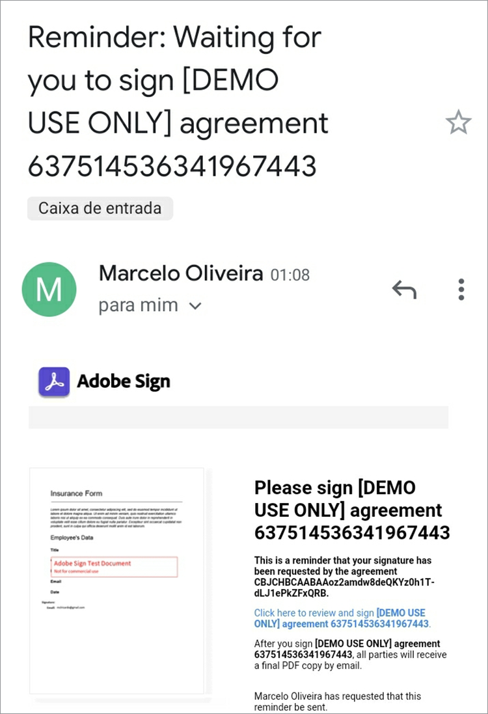

## Lectura de acuerdos completados

Al igual que en los formularios web, puede leer los detalles de los acuerdos que han firmado los destinatarios. La `/agreements/{agreementId}/formData` El extremo recupera los datos introducidos por el usuario cuando firmó el formulario web.

```
GET /api/rest/v6/agreements/{agreementId}/formData HTTP/1.1
Host: {YOUR-API-ACCESS-POINT}
Authorization: Bearer {YOUR-INTEGRATION-KEY-HERE}
Accept: text/csv
Response Body:
"completed","email","role","first","last","title","company","agreementId"
"2021-03-16 18:11:45","myemail@email.com","SIGNER","John","Doe","My Job Title","My
Company Name","CBJCHBCAABAA5Z84zy69q_Ilpuy5DzUAahVfcNZillDt"
```

## Pasos siguientes

La API de Acrobat Sign permite administrar documentos, formularios web y acuerdos. Los flujos de trabajo simplificados pero completos creados mediante formularios web y acuerdos se realizan de forma genérica que permite a los desarrolladores implementarlos utilizando cualquier lenguaje.

Para obtener una descripción general de cómo funciona la API de Sign, puede encontrar ejemplos en la [Guía del desarrollador de uso de API](https://www.adobe.io/apis/documentcloud/sign/docs.html#!adobedocs/adobe-sign/master/api_usage.md). Esta documentación contiene artículos cortos sobre muchos de los pasos seguidos a lo largo del artículo y otros temas relacionados.

La API de Acrobat Sign está disponible en varios niveles de [planes de firma electrónica para un solo usuario y varios usuarios](https://acrobat.adobe.com/es/es/sign/pricing/plans.html), para que puedas elegir el modelo de precios que mejor se adapte a tus necesidades. Ahora que ya sabes lo fácil que es incorporar la API de Sign en tus aplicaciones, es posible que te interesen otras funciones como [Acrobat Sign Webhooks](https://www.adobe.io/apis/documentcloud/sign/docs.html#!adobedocs/adobe-sign/master/webhooks.md), un modelo de programación basado en inserción. En lugar de requerir que la aplicación realice comprobaciones frecuentes en los eventos de Acrobat Sign, los webhooks le permiten registrar una dirección URL HTTP para la que la API de Sign ejecuta una solicitud de devolución de llamada del POST cada vez que se produce un evento. Los webhooks permiten una programación sólida al proporcionar a la aplicación actualizaciones instantáneas y en tiempo real.

Echa un vistazo al [precios de pago por uso](https://www.adobe.io/apis/documentcloud/dcsdk/pdf-pricing.html), para cuando finalice tu prueba gratis de seis meses de la API de servicios de Adobe PDF, y la API gratuita Adobe PDF Embed.

Para añadir funciones interesantes a tu aplicación, como la creación automática de documentos y la firma de documentos, empieza con [[!DNL Adobe Acrobat Services]](https://www.adobe.io/apis/documentcloud/dcsdk/gettingstarted.html).
