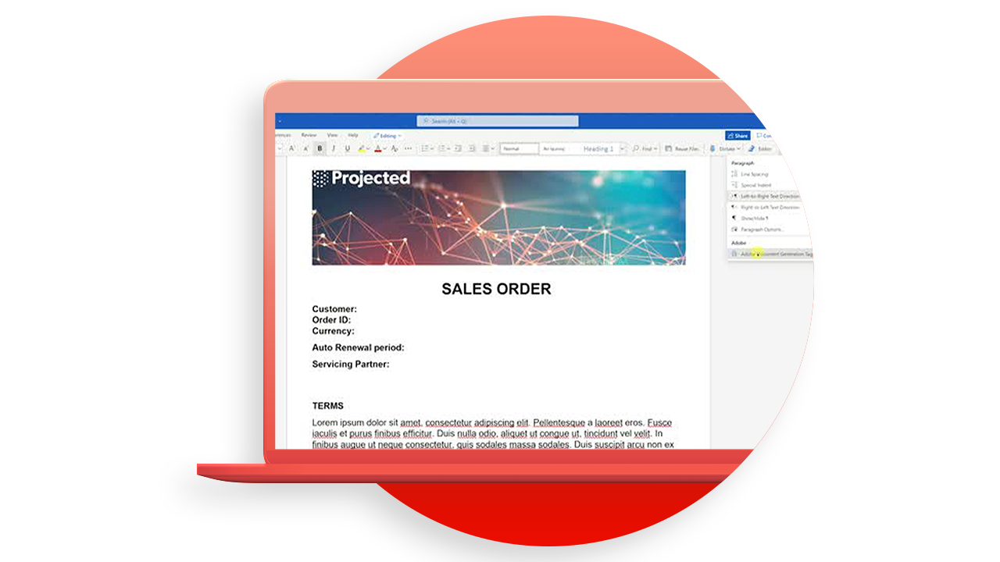
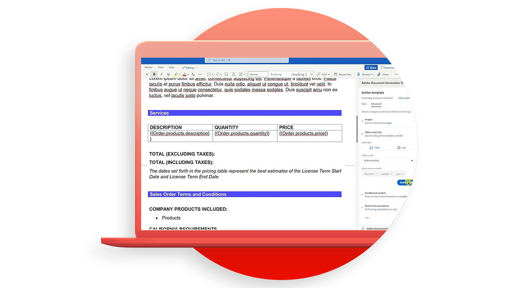
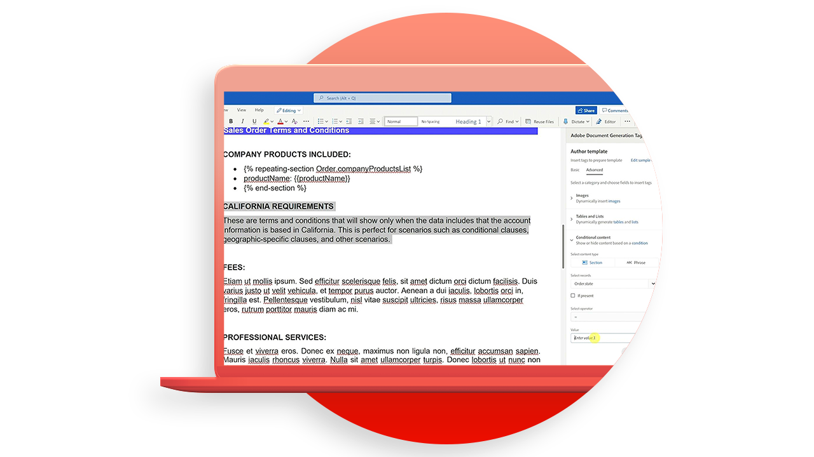

# Tutoriales de la API Document Generation

La API de generación de documentos crea documentos de PDF y Word a partir de plantillas de Word y datos JSON.

>[!NOTE]
>
>La API de generación de documentos se incluye en la API de servicios de PDF.

## Creación de plantillas

La API de generación de documentos acepta una plantilla de documento (con etiquetas de plantilla) junto con los datos de entrada para generar el documento final. El documento final se genera reemplazando todas las etiquetas de plantilla de la plantilla de documento por el contenido dinámico basado en los valores reales correspondientes a la entrada de datos.

<table style="table-layout:fixed">
<tr>
 <td>
   
    

   <a href="taggeroverview.md"><strong>Visión General del Etiquetador de Generación de Documentos de Adobe</strong></a>
    

    <em>Obtenga una descripción general del etiquetador de generación de documentos de Adobe diseñado para su uso con la API de generación de documentos de Adobe</em>
     
  </td>
  <td>
   
    

   <a href="taggeraddtexttags.md"><strong>Adición de etiquetas de texto</strong></a>
    

    <em>Aprenda a agregar etiquetas de texto a plantillas de Microsoft Word mediante el etiquetador de generación de documentos de Adobe para su uso con la API de generación de documentos de Adobe</em>
     
  </td>
  <td>
   
    

   <a href="taggeraddimagetags.md"><strong>Adición de etiquetas de imagen</strong></a>
    

    <em>Aprenda a agregar etiquetas de imagen a las plantillas de Microsoft Word mediante el etiquetador de generación de documentos de Adobe para insertar dinámicamente imágenes en los documentos mediante la API de generación de documentos de Adobe</em>
     
  </td>
  <td>
   
    

   <a href="taggertables.md"><strong>Adición de tablas y etiquetas de lista</strong></a>
    

    <em>Aprenda a agregar tablas y etiquetas de lista a plantillas de Microsoft Word mediante el etiquetador de generación de documentos de Adobe para agregar dinámicamente filas de tabla o de lista basadas en datos mediante la API de generación de documentos de Adobe</em>
     
  </td>
</tr>
<tr>
  <td>
   
    

   <a href="taggercalculations.md"><strong>Definición de etiquetas de cálculo numérico</strong></a>
    

    <em>Aprenda a establecer etiquetas de cálculo numérico en las plantillas de Microsoft Word mediante el etiquetador de generación de documentos de Adobe para calcular agregaciones o aritmética de valores de datos mediante la API de generación de documentos de Adobe</em>
     
  </td>
  <td>
   
    

   <a href="taggerconditional.md"><strong>Configuración del contenido condicional</strong></a>
    

    <em>Aprenda a definir secciones en plantillas de Microsoft Word mediante el etiquetador de generación de documentos de Adobe para incluir o excluir dinámicamente secciones de un documento basadas en datos mediante la API de generación de documentos de Adobe</em>
     
  </td>
  <td>
    
    

     
  </td>
   <td>
    
    

     
  </td>
</tr>
</table>
