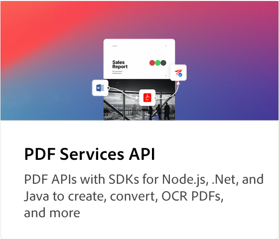
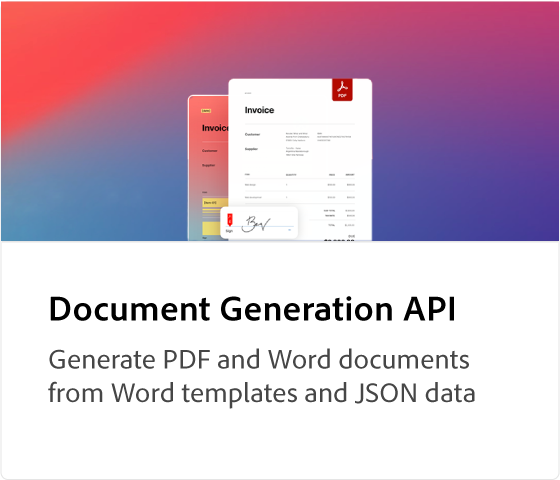
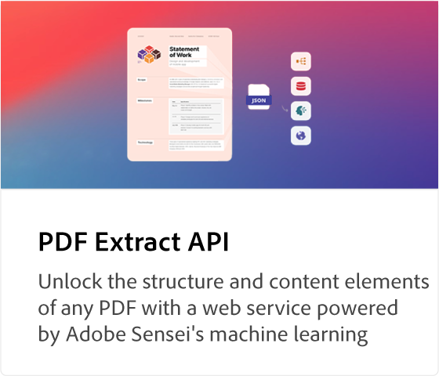
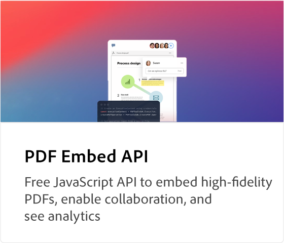
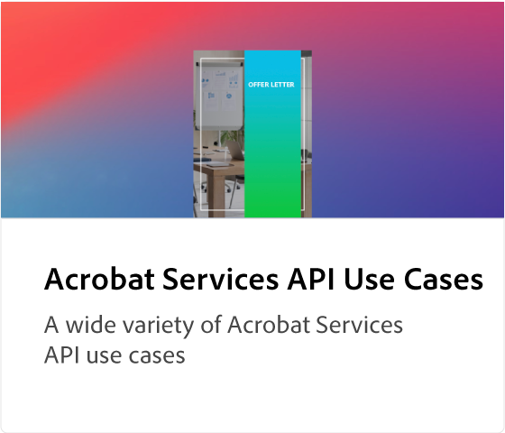

# [!DNL Adobe Acrobat Services] Tutoriales de API

![[!DNL Acrobat Services] Banner](assets/acrobatserviceshero.jpg)

[!DNL Adobe Acrobat Services] tiene cinco API principales: [!DNL Adobe PDF Services API], el [!DNL Adobe PDF Embed API], el [!DNL Adobe Document Generation API], el [!DNL Adobe PDF Extract API] y [!DNL Adobe PDF Accessibility Auto-Tag API]. Estas dos últimas API y sus SDK se incluyen en [!DNL Adobe PDF Services API] como parte de una oferta de pago. [!DNL PDF Embed API] es una oferta gratuita. Estas API automatizan la generación, manipulación y transformación del contenido de los documentos mediante un conjunto de servicios web modernos basados en la nube. Te ayudan a ofrecer experiencias más sencillas, rápidas y de marca para que controles la interacción del usuario con tus documentos, optimices los flujos de trabajo de los PDF y fomentes el uso y la retención. Estos tutoriales te ayudan a ponerte al día y a ofrecer experiencias de marca más sencillas, rápidas y con el [!DNL Adobe Acrobat Services] API.

<table style="table-layout:fixed">
<tr>
 <td>
   
  </td>
  <td>
   
  </td>
  <td>
   
  </td>
  <td>
   
  </td>
</tr>
<tr>
  <td>
   
  </td>
 <td>
   
  </td>
  <td>
    
    

     
  </td>
  <td>
    
    

     
  </td>
</tr>
</table>
