# Controla la experiencia online de tu PDF y recopila análisis

¿Su organización publica PDF en su sitio web? Aprenda a utilizar la API Adobe PDF Embed para controlar la apariencia, permitir la colaboración y recopilar análisis sobre cómo interactúan los usuarios con los PDF, incluido el tiempo dedicado a una página y las búsquedas. Para comenzar este tutorial práctico de 4 partes, seleccione *Introducción a la API de incrustación de PDF*.

<table style="table-layout:fixed">
<tr>
  <td>
    <a href="controlpdfexperience.md#part1">
        
    </a>
    <div>
    <a href="controlpdfexperience.md#part1"><strong>Parte 1: Introducción a la API de incrustación de PDF</strong></a>
    </div>
  </td>
  <td>
    <a href="controlpdfexperience.md#part2">
        
    </a>
    <div>
    <a href="controlpdfexperience.md#part2"><strong>Parte 2: Añadir la API de incrustación de PDF a una página web</strong></a>
    </div>
  </td>
  <td>
   <a href="controlpdfexperience.md#part3">
      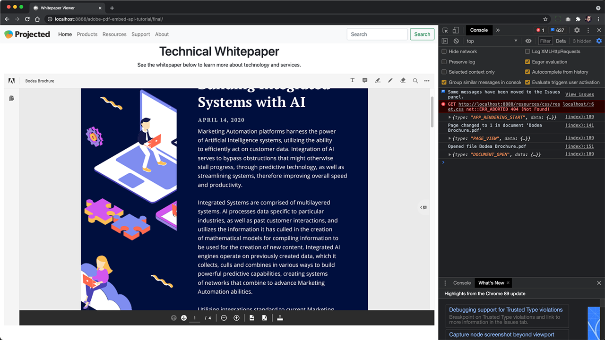
   </a>
    <div>
    <a href="controlpdfexperience.md#part3"><strong>Parte 3: Acceso a las API de Analytics</strong></a>
    </div>
  </td>
  <td>
   <a href="controlpdfexperience.md#part4">
      
   </a>
    <div>
    <a href="controlpdfexperience.md#part4"><strong>Parte 4: Añadir interactividad basada en eventos</strong></a>
    </div>
  </td>
</tr>
</table>

## Parte 1: Introducción a la API de incrustación de PDF {#part1}

En la parte 1, aprenda a empezar con todo lo que necesita para las partes 1-3. Empezará a obtener las credenciales de la API.

**Lo que necesitas**

* Recursos del tutorial [descargar](https://github.com/benvanderberg/adobe-pdf-embed-api-tutorial)
* Adobe ID [consigue uno aquí](https://accounts.adobe.com/es)
* Servidor web (Node JS, PHP, etc.)
* Conocimiento del funcionamiento del HTML / JavaScript / CSS

**Lo que estamos utilizando**

* Un servidor web básico (Node)
* Visual Studio Code
* GitHub

### Obtención de credenciales

1. Vaya a la [sitio web Adobe.io](https://www.adobe.io/).
1. Haga clic en **[!UICONTROL Más información]** en Crear experiencias de documentos atractivas.

   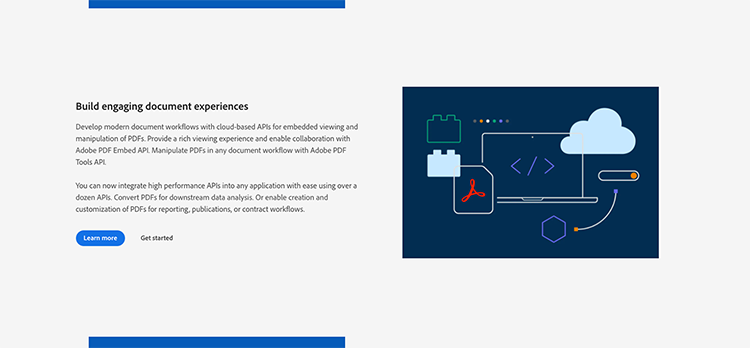

   Esto te lleva a la [!DNL Adobe Acrobat Services] página de inicio.

1. Haga clic en **[!UICONTROL Introducción]** en la barra de navegación.

   Verá una opción en la **Primeros pasos con [!DNL Acrobat Services] API** para **Crear nuevas credenciales** o **Administrar credenciales existentes**.

1. Haga clic en **[!UICONTROL Introducción]** botón situado debajo **[!UICONTROL Crear nuevas credenciales]**.

   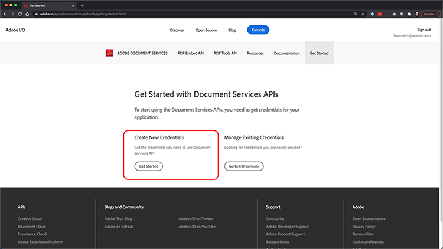

1. Elija el **[!UICONTROL API de incrustación de PDF]** y añada un nombre de credencial de su elección y un dominio de aplicación en la siguiente ventana.

   >[!NOTE]
   >
   >Estas credenciales solo se pueden utilizar en el dominio de aplicación que se muestra aquí. Puede utilizar cualquier dominio que elija.

   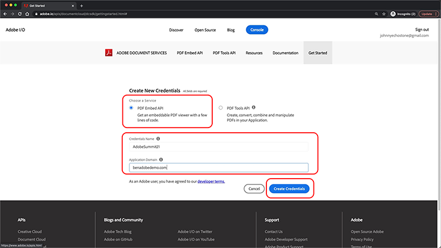

1. Haga clic en **[!UICONTROL Crear credenciales]**.

   La página final del asistente proporciona los detalles de las credenciales de cliente. Deje esta ventana abierta para poder volver a ella y copiar el ID de cliente (clave de API) para usarlo más adelante.

1. Haga clic en **[!UICONTROL Ver documentación]** para acceder a la documentación con información detallada sobre cómo utilizar esta API.

   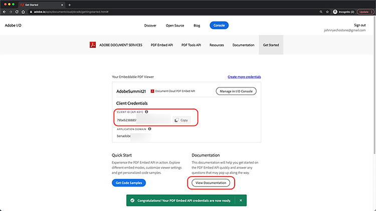

## Parte 2: Añadir la API de incrustación de PDF a una página web {#part2}

En la parte 2, aprenderás a incrustar fácilmente la API de incrustación de PDF en una página web. Para ello, utilizarás la demostración online de la API de Adobe PDF Embed API para crear tu código.

### Obtener el código de ejercicio

Hemos creado código para que lo utilice. Aunque puede utilizar su propio código, las demostraciones se realizarán en el contexto de los recursos del tutorial. Descargar código de ejemplo [aquí](https://github.com/benvanderberg/adobe-pdf-embed-api-tutorial).

1. Vaya a [[!DNL Adobe Acrobat Services] sitio web](https://www.adobe.io/apis/documentcloud/dcsdk/).

   ![Captura de pantalla de [!DNL Adobe Acrobat Services] sitio web](assets/ControlPDF_6.png)

1. Haga clic en **[!UICONTROL API]** en la barra de navegación y vaya a la **[!UICONTROL API de incrustación de PDF]** en el vínculo desplegable.

   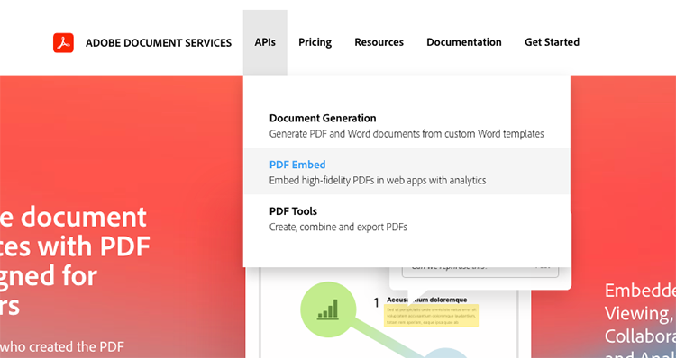

1. Haga clic en **[!UICONTROL Probar la demostración]**.

   Aparece una nueva ventana con el espacio aislado de desarrollador para la API de incrustación de PDF.

   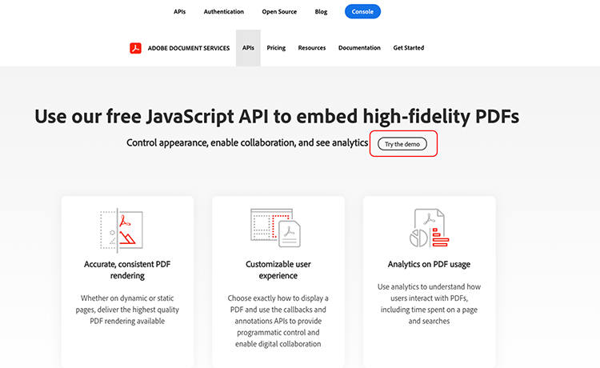

   Aquí puede ver las opciones para los diferentes modos de visualización.

1. Haga clic en los diferentes modos de visualización de Ventana completa, Contenedor de tamaño, En línea y Lightbox.

   

1. Haga clic en **[!UICONTROL Ventana completa]** modo de visualización y, a continuación, **[!UICONTROL Personalizar]** para activar y desactivar las opciones.

   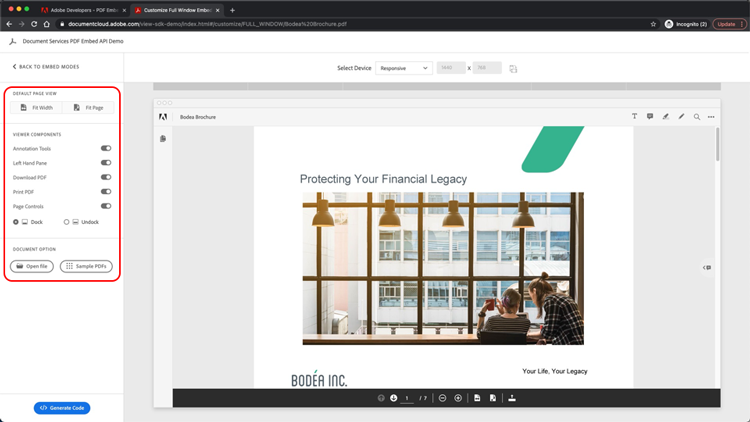

1. Desactivar **[!UICONTROL Descargar]** opción de PDF.
1. Haga clic en **[!UICONTROL Generar código]** para ver la vista previa del código.
1. Copiar **[!UICONTROL ID de cliente]** desde la ventana Credenciales de Cliente de la Parte 1.

   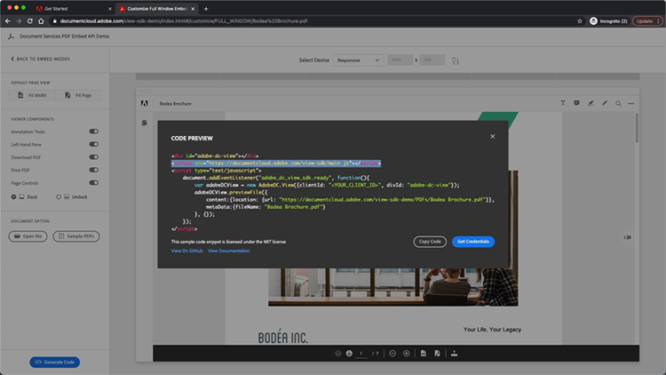

1. Abra el **[!UICONTROL Web]** -> **[!UICONTROL resources]** -> **[!UICONTROL js]** -> **[!UICONTROL dc-config.js]** en el editor de código.

   Verá que la variable clientID está allí.

1. Pegue las credenciales de cliente entre comillas dobles para establecer el ID de cliente en sus credenciales.

1. Vuelva a la vista previa del código del espacio aislado del desarrollador.

1. Copie la segunda línea que tiene el script de Adobe:

   ```
   <script src=https://documentccloud.adobe.com/view-sdk/main.js></script>
   ```

   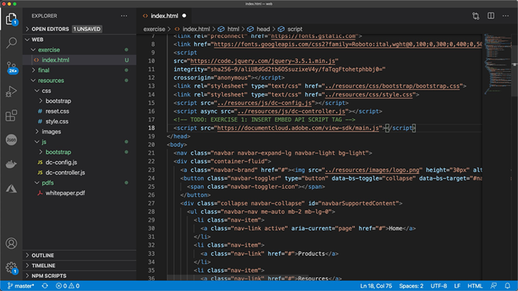

1. Vaya al editor de código y abra el **[!UICONTROL Web]** -> **[!UICONTROL ejercitar]** -> **[!UICONTROL index.html]** archivo.

1. Pegue el código de script en el `<head>` del archivo en la línea 18 bajo el comentario que dice: **TODO: EJERCICIO 1: INSERTAR ETIQUETA DE SCRIPT DE API EMBED**.

   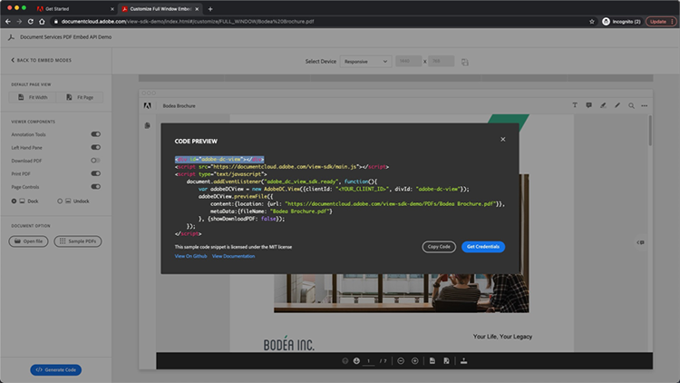

1. Vuelva a la vista previa del código del espacio aislado del desarrollador y copie la primera línea de código que tenga:

   ```
   <div id="adobe-dc-view"></div>
   ```

   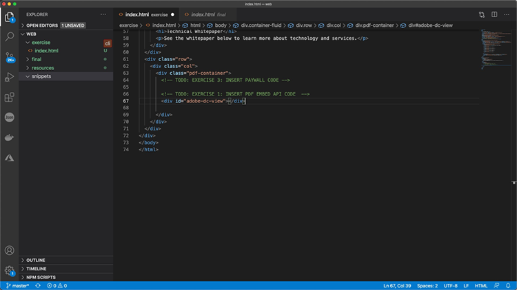

1. Vaya al editor de código y abra el **[!UICONTROL Web]** -> **[!UICONTROL ejercitar]** -> **[!UICONTROL index.html]** archivo de nuevo.

1. Pegue el `<div>` código en el `<body>` del archivo en la línea 67 bajo el comentario que dice **TODO: EJERCICIO 1: INSERTAR CÓDIGO DE API INCRUSTADA DE PDF**.

   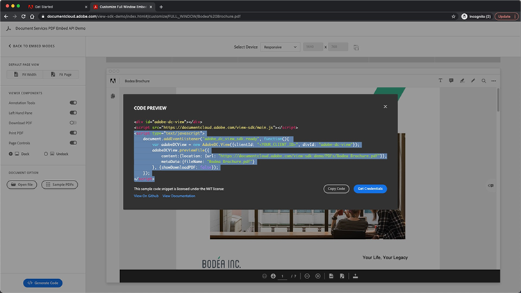

1. Vuelva a la vista previa del código del espacio aislado del desarrollador y copie las líneas de código del `<script>` a continuación:

   ```
   <script type="text/javascript">
       document.addEventListener("adobe_dc_view_sdk.ready",             function(){ 
           var adobeDCView = new AdobeDC.View({clientId:                     "<YOUR_CLIENT_ID>", divId: "adobe-dc-view"});
           adobeDCView.previewFile({
               content:{location: {url: "https://documentcloud.                adobe.com/view-sdk-demo/PDFs/Bodea Brochure.                    pdf"}},
               metaData:{fileName: "Bodea Brochure.pdf"}
           }, {showDownloadPDF: false});
       });
   </script>
   ```

1. Vaya al editor de código y abra el **[!UICONTROL Web]** -> **[!UICONTROL ejercitar]** -> **[!UICONTROL index.html]** archivo de nuevo.

1. Pegue el `<script>` código en el `<body>` del expediente de la línea 68 en el marco del `<div>` etiqueta.

1. Modificar la línea 70 de la misma **index.html** para incluir la variable clientID creada anteriormente.

   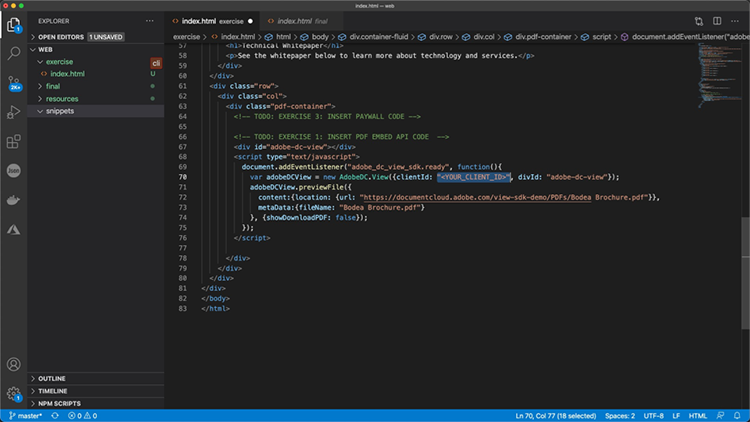

1. Modificar la línea 72 de la misma **index.html** para actualizar la ubicación del archivo de PDF y utilizar un archivo local.

   Hay uno disponible en los archivos del tutorial en **/resources/pdfs/whitepaper.pdf**.

1. Guarde los archivos modificados y obtenga una vista previa del sitio web en **`<your domain>`/summit21/web/exercise/**.

   Debería ver el informe técnico en modo de ventana completa en el navegador.

## Parte 3: Acceso a las API de Analytics {#part3}

Ahora que ha creado correctamente una página web que tiene la API de PDF Embed representando a un PDF, en la parte 3 puede explorar cómo utilizar eventos de JavaScript para medir análisis para comprender cómo los usuarios utilizan PDF.

### Encontrar documentación

Hay una gran cantidad de eventos de JavaScript diferentes disponibles como parte de la API de PDF Embed. Puede acceder a ellos desde [!DNL Adobe Acrobat Services] documentación.

1. Vaya a la [documentación](https://www.adobe.io/apis/documentcloud/dcsdk/docs.html) sitio.
1. Revise los diferentes tipos de eventos disponibles como parte de la API. Estos son útiles como referencia y también serán útiles para sus futuros proyectos.

   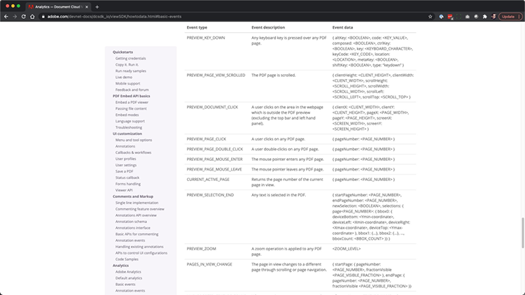

1. Copie el código de ejemplo que aparece en el sitio web.

   Utilice esto como base para nuestro código y modifíquelo.

   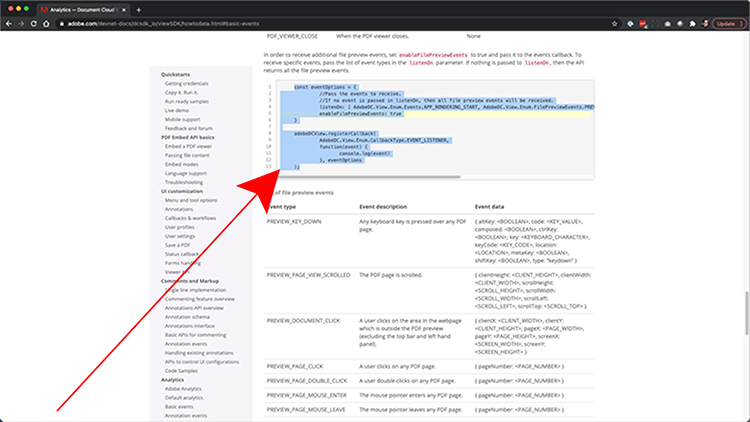

   ```
   const eventOptions = {
     //Pass the PDF analytics events to receive.
      //If no event is passed in listenOn, then all PDF         analytics events will be received.
   listenOn: [ AdobeDC.View.Enum.PDFAnalyticsEvents.    PAGE_VIEW, AdobeDC.View.Enum.PDFAnalyticsEvents.DOCUMENT_DOWNLOAD],
     enablePDFAnalytics: true
   }
   
   
   adobeDCView.registerCallback(
     AdobeDC.View.Enum.CallbackType.EVENT_LISTENER,
     function(event) {
       console.log("Type " + event.type);
       console.log("Data " + event.data);
     }, eventOptions
   );
   ```

1. Busque la sección de código que agregó anteriormente que se parece a la siguiente y agregue el código anterior después de este código en **index.html**:

   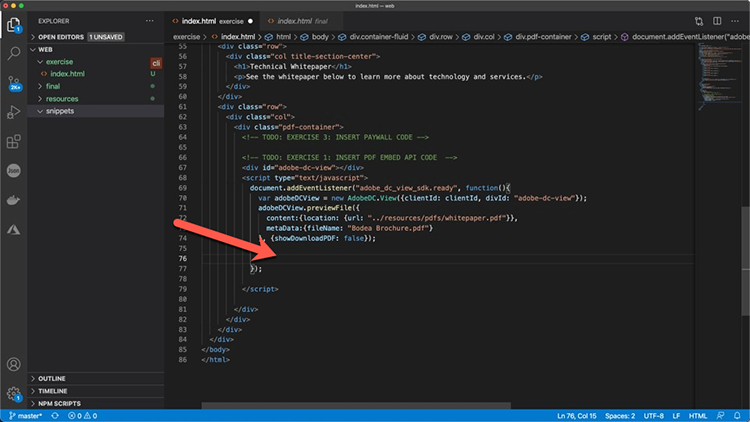

1. Cargue la página en el navegador web y abra la consola para ver las salidas de la consola de los diferentes eventos mientras interactúa con el visor del PDF.

   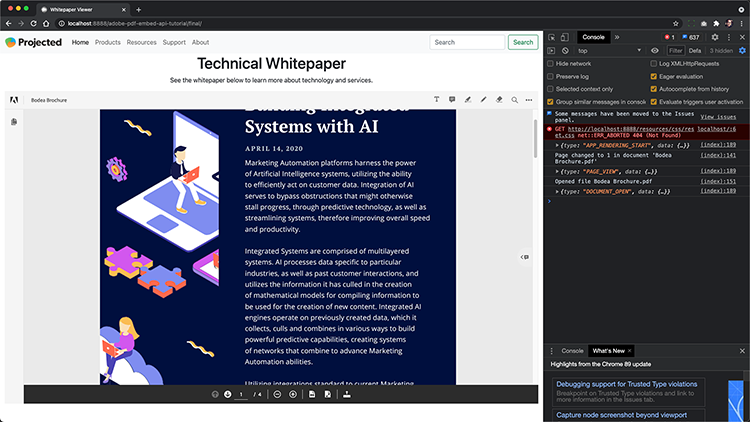

   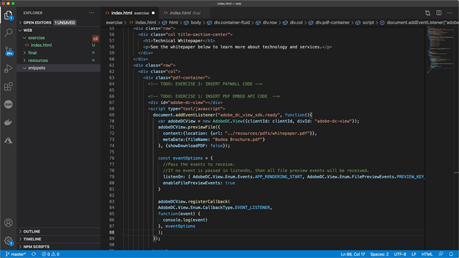

### Añadir modificador para capturar eventos

Ahora que los eventos se envían a console.log, cambiemos el comportamiento en función de los eventos. Para ello, utilizará un ejemplo de modificador.

1. Vaya a **snippets/eventsSwitch.js** y copie el contenido del archivo en el código del tutorial.

   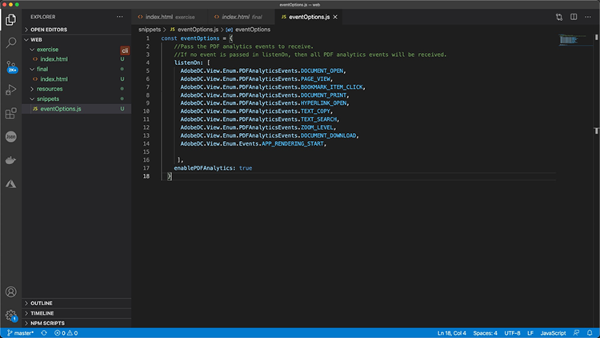

1. Pegue el código en la función de escucha de eventos.

   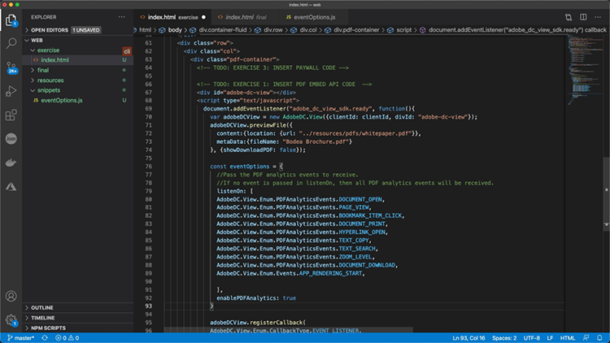

1. Confirme que la consola obtiene una salida correcta cuando se carga la página e interactúa con el Visor del PDF.

### Adobe Analytics

Si desea añadir la asistencia de Adobe Analytics a su visor, puede seguir las instrucciones que se indican en el sitio web.

>[!IMPORTANT]
>
>Su página web ya debe tener Adobe Analytics cargado en la página del encabezado.

Vaya a la [Documentación de Adobe Analytics](https://www.adobe.com/devnet-docs/dcsdk_io/viewSDK/howtodata.html#adobe-analytics) y revise si ya tiene Adobe Analytics habilitado en su página web. Siga las instrucciones para configurar una ReportSuite.

### Google Analytics

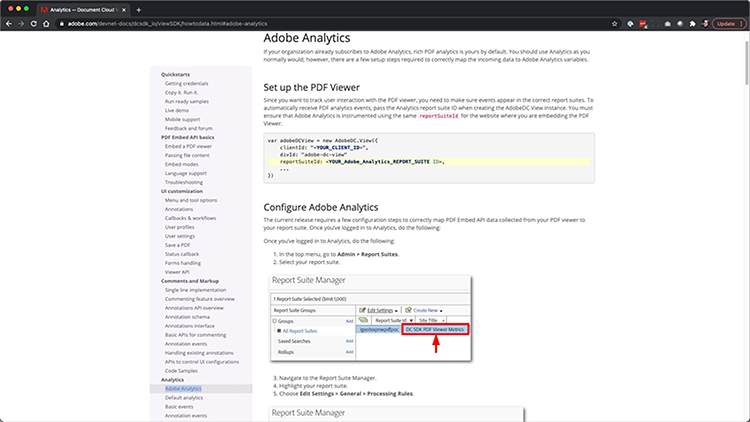

La API Adobe PDF Embed proporciona una integración inmediata con Adobe Analytics. Sin embargo, dado que todos los eventos están disponibles como eventos de JavaScript, es posible realizar la integración con los Google Analytics capturando los eventos del PDF y utilizando la función ga() para añadir el evento a Adobe Analytics.

1. Vaya a **snippets/eventsSwitchGA.js** para ver cómo puedes integrarte con los Google Analytics.
1. Revise y utilice este código como ejemplo si su página web se rastrea con Adobe Analytics y ya está incrustada en la página web.

   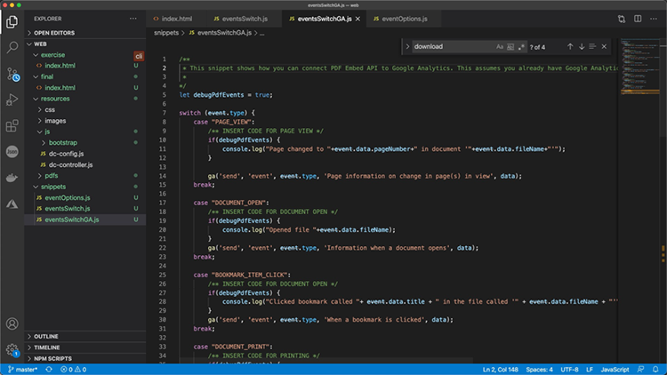

## Parte 4: Añadir interactividad basada en eventos {#part4}

En la parte 4, verás cómo colocar en la parte superior del visor del PDF un paywall que muestra después de desplazarte más allá de la segunda página.

### Ejemplo de paywall

Vaya a esta [ejemplo de un PDF detrás de un paywall](https://www3.technologyevaluation.com/research/white-paper/the-forrester-wave-digital-decisioning-platforms-q4-2020.html). En este ejemplo, aprenderá a añadir interactividad sobre la experiencia de visualización del PDF.

### Añadir código de paywall

1. Vaya a snippets/paywallCode.html y copie el contenido.
1. Buscar por `<!-- TODO: EXERCISE 3: INSERT PAYWALL CODE -->` en exercise/index.html.

   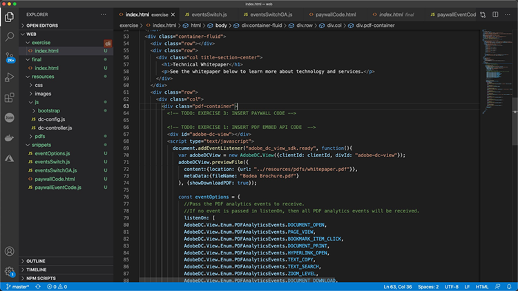

1. Pegue el código copiado después del comentario.
1. Vaya a **snippets/paywallCode.js** y copie el contenido.

   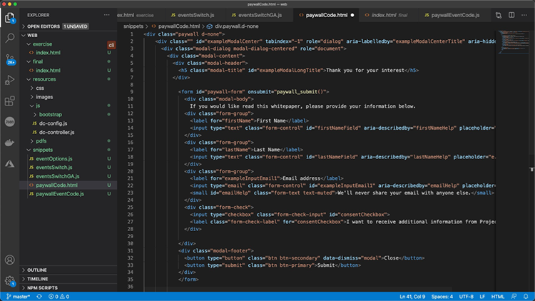

1. Pegue el código en esa ubicación.

### Probar una demostración con Paywall

Ahora puede ver la demostración.

1. Recargar **index.html** en su sitio web.
1. Desplácese hacia abajo hasta una página > 2.
1. Mostrar el cuadro de diálogo aparece para desafiar al usuario después de la segunda página.

   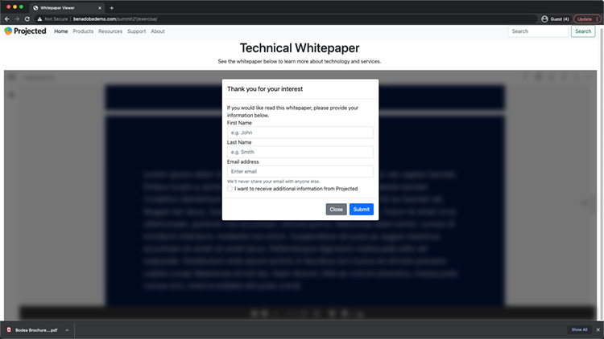

## Recursos adicionales

Se pueden encontrar recursos adicionales [aquí](https://www.adobe.io/apis/documentcloud/dcsdk/docs.html).
