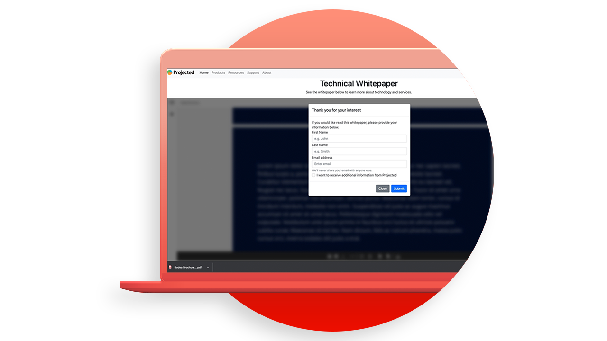

# Tutoriales de la API Adobe PDF Embed

La API PDF Embed es una API de JavaScript gratuita para incorporar PDF de alta fidelidad, permitir la colaboración y ver análisis.

<table style="table-layout:fixed">
<tr>
 <td>
   
    

   <a href="controlpdfexperience.md"><strong>Controla la experiencia online de tu PDF y recopila análisis</strong></a>
    

    <em>Aprenda a utilizar la API Adobe PDF Embed para controlar la apariencia, permitir la colaboración y recopilar análisis sobre cómo los usuarios interactúan con los PDF, incluido el tiempo dedicado a una página y las búsquedas</em>
     
  </td>
  <td>
   
    

   <a href="https://experienceleague.adobe.com/docs/adobe-developers-live-events/events/2021/oct2021/pdf-embed-api.html"><strong>Lucha contra los PDF en la web como un profesional</strong></a>
    

    <em>Descubre cómo usar la API Adobe PDF Embed gratuita para facilitar el uso de PDF en tu sitio web</em>
     
  </td>
  <td>
    
    

     
  </td>
</tr>
</table>
