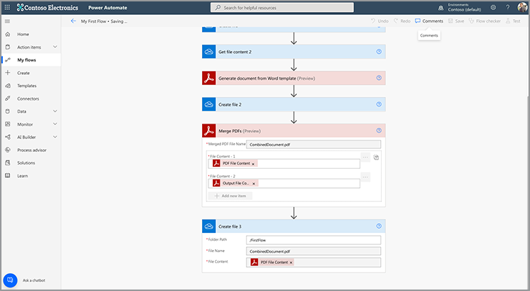
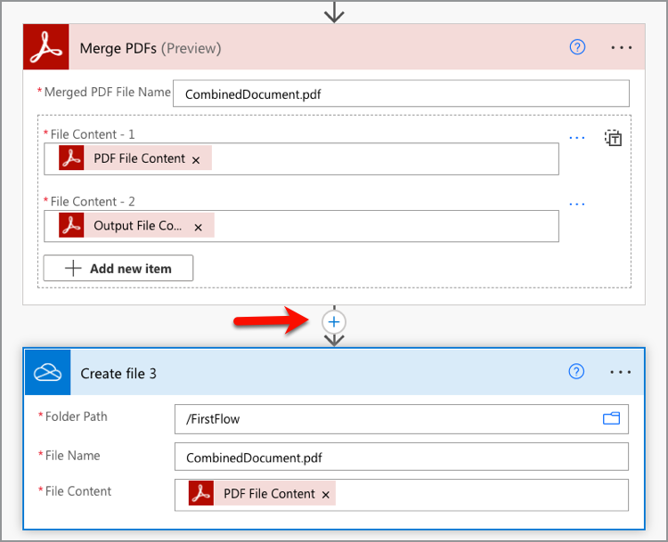

# Crea tu primer flujo en Microsoft Power Automate

Aprende a crear tu primer flujo en [Microsoft Power Automate](https://flow.microsoft.com) uso de la [Servicios de Adobe PDF](https://us.flow.microsoft.com/es-es/connectors/shared_adobepdftools/adobe-pdf-services/) conector.

En este tutorial práctico, aprenda a:

* Convertir documentos de Word en PDF
* Combinar documentos de PDF en un solo PDF
* Protect crea un documento de PDF con una contraseña

## Preparación

### Lo que necesitas

* **Credenciales de prueba o producción para los servicios de Adobe PDF**
Obtenga más información sobre cómo obtener y configurar credenciales en Microsoft Power Automate [aquí](https://experienceleague.adobe.com/docs/document-services/tutorials/pdfservices/getting-credentials-power-automate.html).
* **Microsoft Power Automate con conectores Premium**
Descubra cómo comprobar el nivel de licencias de Power Automate [aquí](https://docs.microsoft.com/en-us/power-platform/admin/power-automate-licensing/types).
* **OneDrive**
El conector de almacenamiento de OneDrive se utiliza en este tutorial, pero se puede sustituir cualquier conector de almacenamiento.

### Archivos de muestra

Hay dos [archivos de muestra](assets/sample-assets.zip) que necesita para descomprimir y cargar en OneDrive:

* WordDocument01.docx
* WordDocument02.docx

### Obtención de credenciales

Para completar este tutorial, necesita sus credenciales ya configuradas en Microsoft Power Automate para los servicios de Adobe PDF. Si no ha completado este paso, consulte la [instrucciones aquí](https://experienceleague.adobe.com/docs/document-services/tutorials/pdfservices/getting-credentials-power-automate.html).

## Parte 1: Crear nuevo flujo y convertir Word a PDF

### Crear el flujo

En esta parte, se crea un nuevo flujo en [Microsoft Power Automate](https://flow.microsoft.com) con un flujo instantáneo, agregue parámetros, obtenga los archivos de OneDrive y conviértalos a PDF.

1. Vaya a [Microsoft Power Automate](https://flow.microsoft.com) e inicie sesión con sus credenciales.
1. En la barra lateral, seleccione **[!UICONTROL Crear]**.

   

1. Seleccionar **[!UICONTROL Flujo instantáneo]**.
1. Dale un nombre a tu flujo.
1. Debajo *Elija cómo activar este flujo*, seleccione **[!UICONTROL Activar manualmente un flujo]**.
1. Seleccione **[!UICONTROL Crear]**.

### Obtener el contenido de los archivos

A continuación, obtenga el contenido de los archivos de muestra.

>[!PREREQUISITES]
>
>Si no ha cargado el [archivos de muestra](assets/sample-assets.zip) en OneDrive, descomprímalos y cárguelos.


1. En [Power Automate](https://flow.microsoft.com), seleccione **[!UICONTROL + Nuevo paso]**.
1. Buscar por *OneDrive* en la barra de búsqueda.
1. Elija su cuenta de OneDrive personal o de trabajo seleccionando **[!UICONTROL OneDrive para la Empresa]** o **[!UICONTROL OneDrive]**.
1. Buscar por *Obtener contenido del archivo* en la barra de búsqueda.
1. En la **[!UICONTROL Archivo]** , seleccione el icono Carpeta para desplazarse a la *WordDocument01.docx* en OneDrive.

   

### Convertir un archivo PDF

Ahora que tiene el contenido del archivo, puede convertir el documento en PDF.

1. En [Power Automate](https://flow.microsoft.com), seleccione **[!UICONTROL + Nuevo paso]**.
1. Buscar por *Servicios de Adobe PDF* en la barra de búsqueda.
1. Seleccionar **[!UICONTROL Servicios de Adobe PDF]**.
1. Buscar por *Convertir de Word a PDF* en la barra de búsqueda.
1. En **[!UICONTROL Nombre de archivo]**, asigne un nombre al archivo como desee, pero debe terminar en *.docx*. Esta extensión es necesaria para convertir documentos de Word a PDF.
1. Coloque el cursor en el **[!UICONTROL Contenido del archivo]** campo.
1. Uso de la **[!UICONTROL Contenido dinámico]** panel, seleccionar **[!UICONTROL Contenido del archivo]**.

   

### Guardar el archivo en OneDrive

Una vez que se genere el documento, vuelva a guardar el archivo en OneDrive.

1. En [Microsoft Power Automate](https://flow.microsoft.com), seleccione **[!UICONTROL + Nuevo paso]**.
1. Buscar por *OneDrive* en la barra de búsqueda.
1. Elija su cuenta de OneDrive personal o de trabajo seleccionando **[!UICONTROL OneDrive para la Empresa]** o **[!UICONTROL OneDrive]**.
1. Buscar por *Obtener contenido del archivo* en la barra de búsqueda.
1. Buscar por *Crear archivo* en la barra de búsqueda.
1. Seleccionar **[!UICONTROL Crear archivo]**.
1. En la **[!UICONTROL Ruta de carpeta]** , seleccione el icono de carpeta para especificar dónde guardar el archivo en OneDrive.
1. En **[!UICONTROL Nombre de archivo]**, asigne un nombre al archivo como desee, pero debe terminar en *.docx*. Esta extensión es necesaria para convertir documentos de Word a PDF.
1. En la **[!UICONTROL Contenido del archivo]** campo, uso **[!UICONTROL Contenido dinámico]** para insertar la variable Contenido de archivo del PDF.

### Probar flujo

1. En la parte superior izquierda, seleccione **[!UICONTROL Sin título]** para cambiar el nombre del flujo.
1. Seleccione **[!UICONTROL Guardar]**.
1. Seleccionar **[!UICONTROL Prueba]**.
1. Seleccionar **[!UICONTROL Manualmente]** y, a continuación **[!UICONTROL Guardar y probar]**.
1. Seleccione **[!UICONTROL Continuar]**.
1. Seleccionar **[!UICONTROL Ejecutar flujo]**.

En la carpeta OneDrive, debería ver el PDF convertido.


## Parte 2: Generar un documento dinámico a partir de una plantilla

La siguiente parte se basa en la parte 1 y utiliza la *Generar documento a partir de Word* para combinar dinámicamente datos en el documento.

### Revisar la plantilla del documento

Abrir *WordDocument02_.docx* de sus archivos de muestra en OneDrive. El documento de Word contiene varias etiquetas de texto diferentes que representan los lugares en los que se rellenan los datos en el documento.

### Añadir parámetros al activador

Para insertar datos dinámicos en el documento, debe crear algunos parámetros para que el activador solicite valores.

1. Al editar el flujo, seleccione **[!UICONTROL Activar manualmente un flujo]** para expandir la acción.
1. Seleccionar **[!UICONTROL Agregar una entrada]**.
1. Seleccionar **[!UICONTROL Texto]**.
1. Asignar nombre al campo *Nombre*.

Repita los pasos 2-4 para añadir los siguientes campos:

* Apellidos
* Salario


### Obtener el contenido de archivo de una plantilla

Para generar un documento, primero debe obtener el contenido del archivo de la plantilla de Word.

1. En Power Automate, seleccione + **[!UICONTROL Nuevo paso]**.
1. Buscar por *OneDrive* en la barra de búsqueda.
1. Elija su cuenta de OneDrive personal o de trabajo seleccionando **[!UICONTROL OneDrive para la Empresa]** o **[!UICONTROL OneDrive]**.
1. Buscar por *Obtener contenido del archivo* en la barra de búsqueda.
1. En la **[!UICONTROL Archivo]** , seleccione el icono Carpeta para desplazarse a la *WordDocument02.docx* en OneDrive.


### Generar documento a partir de plantilla

1. En Power Automate, seleccione **[!UICONTROL + Nuevo paso]**.
1. Buscar por *Servicios de Adobe PDF* en la barra de búsqueda.
1. Seleccionar **[!UICONTROL Servicios de Adobe PDF]**.
1. Seleccione la **[!UICONTROL Generar documento desde una plantilla de Word]** acción .
1. En la **[!UICONTROL Nombre de archivo de plantilla]** , asigne al archivo el nombre que desee, pero debe terminar con *.docx*.

#### Combinar datos

Uso de la *Generar documento desde una plantilla de Word* , puede combinar en su documento datos de cualquiera de las diferentes variables que se encontraban anteriormente en el flujo mediante el contenido dinámico.

Copie los datos JSON siguientes en el **Combinar datos** campo:

```
{
    "FirstName": "",
    "LastName": "",
    "Salary": ""
}
```

1. Coloque el cursor en el campo entre las dos comillas de la *FirstName* valor.
1. Uso de la **[!UICONTROL Contenido dinámico]** , inserte el *Nombre* del activador Manual de una acción de flujo.

   

1. Repita los pasos del 7 al 8 para el **[!UICONTROL LastName]** y **[!UICONTROL Salario]** campos.
1. En la **[!UICONTROL Contenido de archivo de plantilla]** , utilice el campo **[!UICONTROL Contenido dinámico]** para insertar el **[!UICONTROL Contenido del archivo]** valor de la *Obtener contenido del archivo* paso.


>[!TIP]
>
>La *Generar documento desde una plantilla de Word* Esta acción utiliza la API de generación de documentos de Adobe. Si desea obtener más información sobre cómo crear plantillas, aquí tiene algunos recursos:
>
>* [Más información sobre la generación de documentos de Adobe](https://developer.adobe.com/document-services/apis/doc-generation/)
>* [Etiquetador de generación de documentos de Adobe para Microsoft Word](https://appsource.microsoft.com/en-US/product/office/WA200002654)
>* [Documentación de la API de generación de documentos de Adobe](https://developer.adobe.com/document-services/docs/overview/document-generation-api/)

### Guardar el archivo en OneDrive

Una vez generado el documento, puede volver a guardar el archivo en OneDrive.

1. En Power Automate, seleccione **+ [!UICONTROL Nuevo paso]**.
1. Buscar por *OneDrive* en la barra de búsqueda.
1. Elija su cuenta de OneDrive personal o de trabajo seleccionando **[!UICONTROL OneDrive para la Empresa]** o **[!UICONTROL OneDrive]**.
1. Buscar por *Crear archivo* en la barra de búsqueda.
1. Seleccionar **[!UICONTROL Crear archivo]**.
1. En la **[!UICONTROL Ruta de carpeta]** , seleccione el icono de carpeta para especificar dónde guardar el archivo en OneDrive.
1. En la **[!UICONTROL Nombre de archivo]** , defina el nombre del archivo. Como el resultado es un PDF, el nombre del archivo debe terminar con la extensión .pdf.
1. Utilice la **[!UICONTROL Contenido dinámico]** para insertar la variable Contenido de archivo del PDF en el panel **[!UICONTROL Contenido del archivo]** campo.

### Probar flujo


1. Seleccione **[!UICONTROL Guardar]**.
1. Seleccionar **[!UICONTROL Prueba]**.
1. Seleccionar **[!UICONTROL Manualmente]** y, a continuación **[!UICONTROL Guardar y probar]**.
1. Seleccione **[!UICONTROL Continuar]**.
1. Introducir valores para *Nombre*, *Apellidos*, y *Salario*.
1. Seleccionar **[!UICONTROL Ejecutar flujo]**.

En la carpeta OneDrive, verá un PDF generado a partir del documento de Word. Al abrir el documento de PDF en OneDrive, verá que los datos se combinan en las ubicaciones de las etiquetas de texto.


## Parte 3: Combina el PDF en uno

Ahora que ha generado y convertido un documento de Word en un PDF, la siguiente parte es combinar varios documentos de PDF.

>[!NOTE]
>
>En las acciones anteriores, guardó una copia del documento como archivo en OneDrive. Para utilizar herramientas como Combinar PDF, no es necesario guardar el archivo en OneDrive. En su lugar, puede pasar el resultado directamente de una acción a la siguiente, lo que es mejor que guardarlo en OneDrive después de cada acción. Sin embargo, con fines de demostración, está guardando estos archivos en OneDrive.

### Paso Añadir PDF de combinación

1. Al editar el flujo, seleccione **[!UICONTROL + Siguiente paso]** para añadir una acción al final del flujo.
1. Buscar por *Servicios de Adobe PDF* en la barra de búsqueda.
1. Seleccionar **[!UICONTROL Servicios de Adobe PDF]**.
1. Seleccione la **[!UICONTROL Combinar PDF]** acción.
1. En la **[!UICONTROL Nombre de archivo del PDF de combinación]** , introduzca el nombre de archivo deseado (es decir,*CombinedDocument.pdf*).
1. En la **[!UICONTROL Contenido del archivo -1]** , utilice el campo **[!UICONTROL Contenido dinámico]** para insertar el *Contenido de archivo de PDF* valor de la **[!UICONTROL Convertir de Word a PDF]** paso.
1. Para añadir el siguiente documento, seleccione **+ [!UICONTROL agregar nuevo elemento]**.
1. En la **[!UICONTROL Contenido del archivo - 2]** , utilice el campo **[!UICONTROL Contenido dinámico]** para insertar el **[!UICONTROL Contenido del archivo de salida]** valor de la *Generar documento desde una plantilla de Word* paso.


### Guardar el PDF combinado en OneDrive

Una vez combinado el documento, puede volver a guardarlo en OneDrive.

1. En Power Automate, seleccione **+ [!UICONTROL Nuevo paso]**.
1. Buscar por *OneDrive* en la barra de búsqueda.
1. Elija su cuenta de OneDrive personal o de trabajo seleccionando **[!UICONTROL OneDrive para la Empresa]** o **[!UICONTROL OneDrive]**.
1. Buscar por *Crear archivo* en la barra de búsqueda.
1. Seleccionar **[!UICONTROL Crear archivo]**.
1. En la **[!UICONTROL Ruta de carpeta]** , seleccione el icono de carpeta para especificar dónde guardar el archivo en OneDrive.
1. En la **[!UICONTROL Nombre de archivo]** , defina el nombre del archivo. Como el resultado es un PDF, el nombre del archivo debe terminar en .pdf.
1. En la **[!UICONTROL Contenido del archivo]** campo, uso **[!UICONTROL Contenido dinámico]** para insertar el *Contenido de archivo de PDF* valor de la **[!UICONTROL Combinar PDF]** paso.

   

### Probar flujo

1. Seleccione **[!UICONTROL Guardar]**.
1. Seleccionar **[!UICONTROL Prueba]**.
1. Seleccionar **[!UICONTROL Manualmente]** y, a continuación **[!UICONTROL Guardar y probar]**.
1. Seleccione **[!UICONTROL Continuar]**.
1. Introducir valores para *Nombre*, *Apellidos*, y *Salario*.
1. Seleccionar **[!UICONTROL Ejecutar flujo]**.

En la carpeta OneDrive, verá el PDF combinado con las páginas del primer y segundo documento.

## Parte 4: Documento de Protect PDF

Después de generar el documento, puede protegerlo de la edición incluyendo un paso adicional antes de guardarlo en OneDrive.

### Protección de archivos PDF

1. Al editar el flujo en Power Automate, seleccione **+** entre el **[!UICONTROL Combinar PDF]** acción y la **[!UICONTROL Crear archivo 3]** acción.

   

1. Seleccionar **[!UICONTROL Añadir una acción]**.
1. Buscar por *Servicios de Adobe PDF* en la barra de búsqueda.
1. Seleccionar **[!UICONTROL Servicios de Adobe PDF]**.
1. Seleccione la **[!UICONTROL PDF de Protect desde la visualización]** acción.
1. En la **[!UICONTROL Nombre de archivo]** , defina el nombre como desee, siempre que termine con la extensión .pdf.
1. Establezca el **[!UICONTROL Contraseña]** de la contraseña especificada para abrir el documento.
1. En la **[!UICONTROL Contenido del archivo]** , utilice el campo **[!UICONTROL Contenido dinámico]** para insertar el *Contenido de archivo de PDF* valor de la **[!UICONTROL Combinar PDF]** paso.

### Actualizar guardar en OneDrive

Una vez protegido el documento, puede volver a guardar el archivo en OneDrive. En este ejemplo, está actualizando el **Crear archivo 3** acción con una nueva *Contenido del archivo* valor.

1. Seleccione el cursor en el **[!UICONTROL Contenido del archivo]** en el campo **[!UICONTROL Crear archivo 3]** acción.
1. Utilice la **[!UICONTROL Contenido dinámico]** para insertar el *Contenido de archivo de PDF* valor de la **PDF de Protect desde la visualización** paso.

### Probar flujo

1. Seleccione **[!UICONTROL Guardar]**.
1. Seleccionar **[!UICONTROL Prueba]**.
1. Seleccionar **[!UICONTROL Manualmente]** y, a continuación **[!UICONTROL Guardar y probar]**.
1. Seleccione **[!UICONTROL Continuar]**.
1. Introducir valores para *Nombre*, *Apellidos*, y *Salario*.
1. Seleccionar **[!UICONTROL Ejecutar flujo]**.

En la carpeta OneDrive, verá el PDF combinado que ahora le pide que introduzca una contraseña para ver el documento.

## Pasos siguientes

En este tutorial, ha convertido un documento de Word en un PDF, ha creado un documento basado en datos, ha combinado documentos y los ha protegido con una contraseña. Para obtener más información, explore algunas de las otras acciones disponibles en el conector de Servicios de Adobe PDF en Microsoft Power Automate:

* Vea las plantillas precreadas disponibles en Microsoft Power Automate.
* Aprende de [artículos](https://medium.com/adobetech/tagged/microsoft-power-automate) en el blog Adobe Tech.
* Revisión [documentación](https://developer.adobe.com/document-services/docs/overview/document-generation-api/) para la API de generación de documentos de Adobe.
