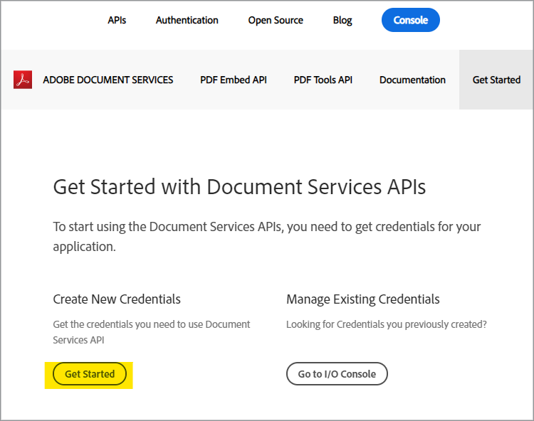
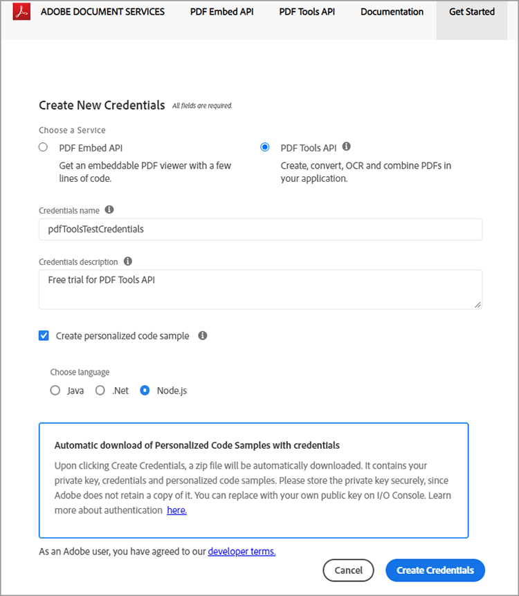
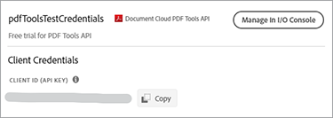
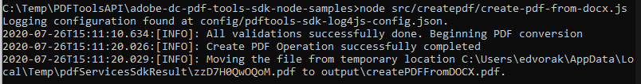

# Crea un PDF desde HTML o MS Office en unos minutos con la API de servicios de PDF y Node.js


Digitalizar los flujos de trabajo de los documentos nunca ha sido tan fácil con la nueva API de Adobe PDF Services, que proporciona a los desarrolladores libertad para elegir entre varios potentes servicios de manipulación de PDF para satisfacer las necesidades de complicados flujos de trabajo empresariales. Las arquitecturas complicadas, las estrategias de implementación y la expansión tecnológica se pueden agilizar con estos servicios web basados en la nube de fácil acceso.

En la API de servicios de PDF, hay varios servicios disponibles para crear y manipular PDF, o para exportar de PDF a MS Office y otros formatos.

* Cree un archivo de PDF a partir de HTML estáticos o dinámicos, MS Word, PowerPoint, Excel y mucho más
* Export PDF a MS Word, PowerPoint, Excel y mucho más
* OCR para reconocer texto en archivos de PDF y permitir la búsqueda de documentos
* PDF de Protect con una contraseña al abrir documentos
* Combinar páginas de PDF o documentos de PDF en un único PDF
* Comprime los PDF para reducir el tamaño del uso compartido a través de correo electrónico o en línea
* Alinea para optimizar un PDF para una visualización rápida en la web
* Organizar páginas de PDF con servicios de inserción, sustitución, reordenación, eliminación y rotación

Los desarrolladores pueden empezar en solo unos minutos con los archivos de muestra listos para ejecutar que se proporcionan para acceder a todos los servicios web disponibles. Así es como empezar.

## Obtener credenciales y descargar archivos de muestra

El primer paso es obtener una credencial (clave de API) para desbloquear el uso. [Suscríbase a la prueba gratuita aquí](https://www.adobe.com/go/dcsdks_credentials) y haz clic en &#39;Comenzar&#39; para crear tus nuevas credenciales.



Es importante elegir una &quot;cuenta personal&quot; para registrarse en la prueba gratis:


En el siguiente paso, seleccionará el servicio de API de servicios de PDF y, a continuación, agregará un nombre y una descripción para sus credenciales.

Hay una casilla de verificación para &quot;Crear ejemplo de código personalizado&quot;. Elija esta opción para agregar automáticamente sus nuevas credenciales a los archivos de muestra, omitiendo el paso manual.

A continuación, elija Node.js como idioma para recibir los ejemplos específicos de Node.js y haga clic en el botón &#39;Crear credenciales&#39;.



Recibirá un archivo .zip para descargar denominado PDFToolsSDK-Node.jsSamples.zip que se puede guardar en el sistema de archivos local.

## Agregar credenciales a los ejemplos de código

Si elige la opción para &quot;Crear ejemplo de código personalizado&quot;, no debe agregar manualmente su ID de cliente a los archivos de ejemplo de código y puede omitir el siguiente paso y pasar directamente a la sección Ejemplos de código en ejecución que se muestra a continuación.

Si no ha elegido la opción Crear ejemplo de código personalizado, deberá copiar el ID de cliente (clave de API) de la consola de Adobe.io:



Descomprima el contenido de PDFToolsSDK-Node.jsSamples.zip.

Vaya al directorio raíz en la carpeta adobe-dc-pdf-tools-sdk-node-samples .

Abra pdftools-api-credentials.json con cualquier editor de texto o IDE.

Pegue las credenciales en el campo para el ID de cliente en el código:

```javascript
{
 "client_credentials": {
  "client_id": "abcdefghijklmnopqrstuvwxyz",
```

Guarde el archivo y continúe con el siguiente paso para ejecutar los ejemplos de código.

## Ejecución del primer ejemplo de código

Con el símbolo del sistema, vaya al directorio raíz en la carpeta adobe-dc-pdf-tools-sdk-node-samples .

Escriba npm install:

C:\Temp\PDFToolsAPI\adobe-dc-pdf-tools-sdk-node-samples>instalación de npm

Ahora está listo para ejecutar los archivos de muestra.

Para la primera muestra, cree un PDF:

Mientras se encuentre en el símbolo del sistema, ejecute el ejemplo create PDF con el comando siguiente:

C:\Temp\PDFToolsAPI\adobe-dc-pdf-tools-sdk-node-samples>node src/createpdf/create-pdf-from-docx.js

Ejemplo de salida:



El PDF se creará en la ubicación designada en la salida, que de forma predeterminada es el directorio pdfServicesSdkResult.

## Recursos y pasos siguientes

* Para obtener ayuda y asistencia adicionales, visite el Adobe [[!DNL Acrobat Services] API](https://community.adobe.com/t5/document-cloud-sdk/bd-p/Document-Cloud-SDK?page=1&amp;sort=latest_replies&amp;filter=all) foro de la comunidad

API de servicios de PDF [Documentación](https://www.adobe.com/go/pdftoolsapi_doc)

* [FAQ](https://community.adobe.com/t5/document-cloud-sdk/faq-for-document-services-pdf-tools-api/m-p/10726197) para preguntas de API de servicios de PDF

* [Contacte con nosotros](https://www.adobe.com/go/pdftoolsapi_requestform) para preguntas sobre licencias y precios

* Artículos relacionados:
  [La nueva API de servicios de PDF ofrece aún más funciones para los flujos de trabajo de documentos](https://community.adobe.com/t5/document-services-apis/new-pdf-tools-api-brings-more-capabilities-for-document-services/m-p/11294170)

  [Versión de julio de [!DNL Adobe Acrobat Services]: Servicios de incrustación y PDF para PDF](https://medium.com/adobetech/july-release-of-adobe-document-services-pdf-embed-and-pdf-tools-17211bf7776d)
