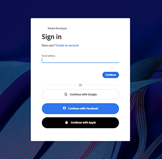
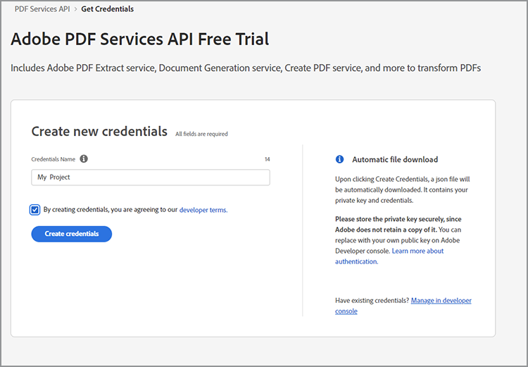
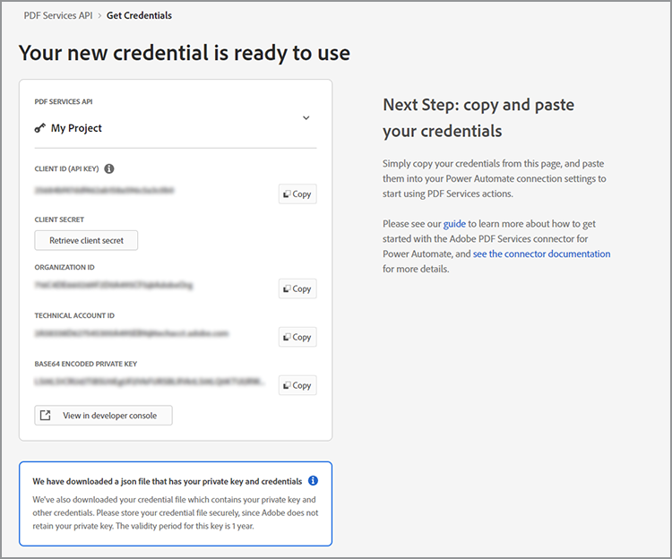
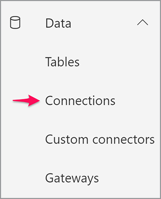
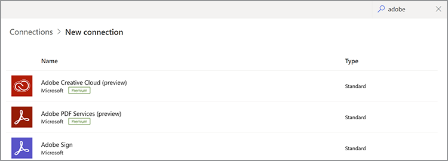
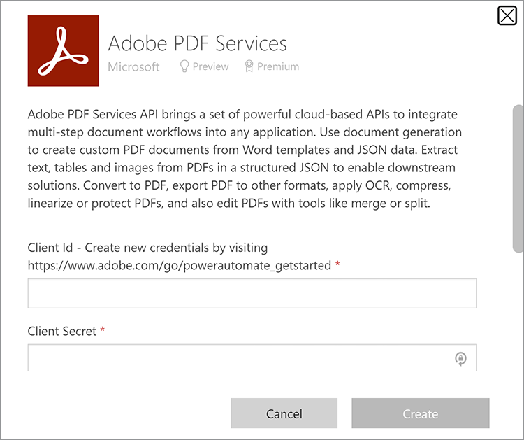
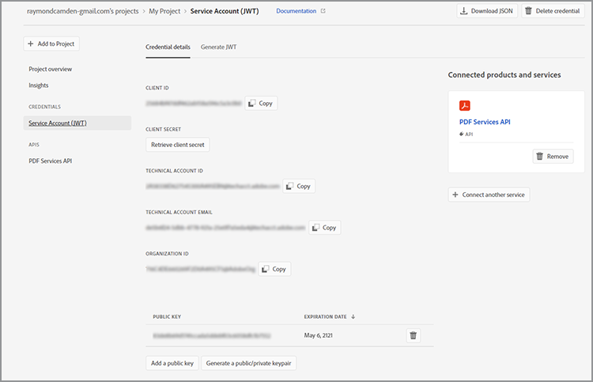
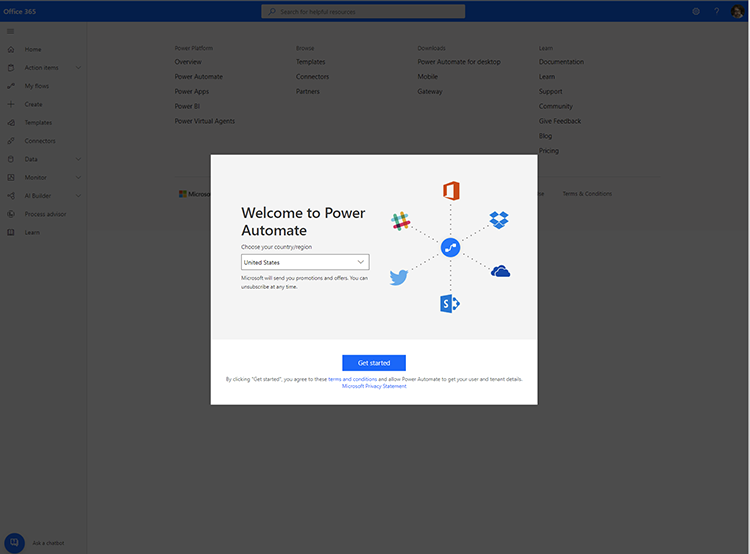
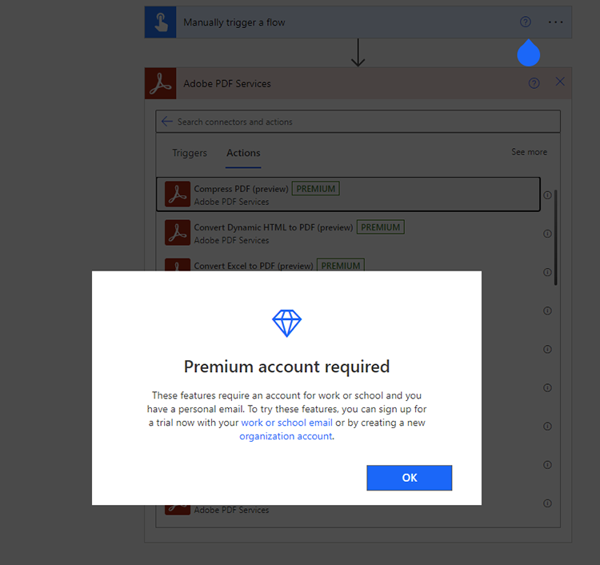

# Obtención de credenciales para Microsoft Power Automate

[Microsoft Power Automate](https://powerautomate.microsoft.com/es-es/) proporciona una forma eficaz para que los desarrolladores y desarrolladores ciudadanos creen potentes procesos automatizados para mejorar sus negocios sin escribir código. [Servicios de Adobe PDF](https://us.flow.microsoft.com/es-es/connectors/shared_adobepdftools/adobe-pdf-services/) conector, como parte de [[!DNL Adobe Acrobat Services]](https://developer.adobe.com/document-services), permite a los usuarios realizar cualquiera de las acciones disponibles en la API de servicios de Adobe PDF en Microsoft Power Automate.

En este tutorial, aprenderá a obtener credenciales para empezar a utilizar o probar los servicios de Adobe PDF. Dependiendo de si es un usuario de prueba o un cliente existente, este tutorial explica los pasos adecuados para obtener las credenciales.

## ¿Cómo pueden los usuarios de Microsoft Power Automate empezar a utilizar el conector de Adobe PDF Services?

Los usuarios existentes de Microsoft Power Automate pueden [obtener credenciales de prueba](https://www.adobe.com/go/powerautomate_getstarted) para los servicios de Adobe PDF. El vínculo anterior es un vínculo de registro especial que ayuda en este proceso específicamente para los usuarios de Microsoft Power Automate.




>[!IMPORTANT]
> Si inicia sesión para una versión de prueba, debe utilizar un Adobe ID y no un Enterprise ID. Si no está suscrito actualmente a la API de servicios de Adobe PDF e intenta iniciar sesión con su Enterprise ID, es posible que reciba un error de permisos porque su empresa no le ha concedido derechos para usar la API de servicios de Adobe PDF. Por esta razón, se recomienda utilizar un Adobe ID personal que es gratuito.
>

1. Después de iniciar sesión, se le pedirá que seleccione un nombre para las nuevas credenciales. Introduzca su *Nombre de credencial*.
1. Marque la casilla de verificación para aceptar las condiciones para desarrolladores.
1. Seleccionar **[!UICONTROL Crear credenciales]**.

   

Estas credenciales cubren cinco valores diferentes:

* ID de cliente (clave de API)
* Secreto de cliente
* Id. de la organización
* ID de cuenta técnica
* Base64 (clave privada codificada)



También se descarga automáticamente en el sistema un archivo JSON que contiene todos estos valores. Este archivo se denomina `pdfservices-api-pa-credentials.json` y tiene el siguiente aspecto:

```json
{
 "client_id": "client id value",
 "client_secret": "client secret value",
 "organization_id": "organized id value",
 "account_id": "account id value",
 "base64_encoded_private_key": "base64 version of the private key"
}
```

Almacene este archivo en una ubicación segura porque no es posible obtener de nuevo una copia de la clave privada.

### Agregar conexión en Microsoft Power Automate

Ahora que ya tiene sus credenciales, puede empezar a usarlas en los flujos de Microsoft Power Automate .

1. En el menú de la barra lateral, abra el **[!UICONTROL Datos]** y seleccione **Conexiones**:

   

1. Seleccionar **+ [!UICONTROL Nueva conexión]**.

1. La siguiente pantalla muestra una lista de posibles tipos de conexión. En la esquina superior derecha, introduzca &quot;adobe&quot; para filtrar las opciones:

   

1. Seleccionar **[!UICONTROL Adobe PDF Services (previsualización)]**.
1. En la ventana modal, introduzca los cinco valores generados anteriormente. Seleccionar **[!UICONTROL Crear]** cuando haya terminado.

   

Ya puede utilizar los servicios de Adobe PDF en Microsoft Power Automate.

### Acceso a las credenciales una vez creadas

Si ya ha creado credenciales y ha colocado incorrectamente las credenciales descargadas, puede recuperarlas de nuevo en [Adobe Developer Console](https://developer.adobe.com/console).

1. Después de iniciar sesión en [Adobe Developer Console](https://developer.adobe.com/console), busque primero el proyecto y selecciónelo.
1. En el menú de la izquierda, bajo *Credenciales*, seleccione **Cuenta de servicio (JWT)**:

   

1. Tenga en cuenta los cinco valores que se presentan aquí: *ID de cliente*, *Secreto de cliente*, *ID de cuenta técnica*, *Correo electrónico de cuenta técnica* y *ID de organización*.

Desafortunadamente, no puede descargar la clave privada anterior, pero puede utilizar el botón &quot;Generar un par de claves pública/privada&quot; para crear una nueva.

## Usar las credenciales existentes de Adobe PDF Services

Si tiene credenciales de API de servicios de Adobe PDF existentes generadas a partir de [!DNL Adobe Acrobat Services] , puede utilizarlas con Microsoft Power Automate. Si descargaste un SDK al registrarte, tus credenciales existentes vendrían en forma de un archivo JSON con el nombre más probable `pdfservices-api-credentials.json`. Ese archivo JSON contiene las cinco claves necesarias para crear las credenciales de conexión. Copie cada valor del archivo JSON en el campo de conexión correspondiente.

El valor de su clave privada procede de un segundo archivo denominado `private.key`.

También puede obtener los valores de Adobe Developer Console como se describe anteriormente.

## ¿Cómo puede [!DNL Adobe Acrobat Services] ¿Los usuarios comienzan a trabajar con Microsoft Power Automate?

Para empezar a trabajar con Power Automate, vaya primero a <https://powerautomate.microsoft.com> y usar el botón &quot;Start free&quot;. Si no tiene una cuenta de Microsoft, debe crear una. Después de iniciar sesión, se le mostrará el panel de Power Automate .



Como se describe al principio de este tutorial, cree un nuevo flujo, agregue un paso y busque los servicios de Adobe PDF. Seleccione una acción y es posible que se le advierta de que se requiere una cuenta premium.



Como muestra la captura de pantalla anterior, puede cambiar a una cuenta de trabajo o configurar una nueva cuenta de organización. Una vez que lo haya hecho, podrá añadir la acción Servicios de Adobe PDF .

Para obtener una visión más profunda al crear tu primer flujo de Microsoft Power Automate con [!DNL Adobe Acrobat Services], consulte [Crea tu primer flujo de trabajo en Microsoft Power Automate](https://experienceleague.adobe.com/docs/document-services/tutorials/pdfservices/create-workflow-power-automate.html).

## Recursos adicionales

Para ayudarle más, aquí hay una lista de recursos adicionales:

* En primer lugar están los documentos de Adobe PDF Services Power Automate: <https://docs.microsoft.com/en-us/connectors/adobepdftools/>. Estos recursos complementan lo aprendido aquí.
* ¿Necesitas ejemplos? Usted puede encontrar numerosos [Plantillas de Power Automate](https://powerautomate.microsoft.com/en-us/connectors/details/shared_adobepdftools/adobe-pdf-services/) demostración de los servicios de PDF.
* Nuestro contenido de vídeo en directo, [Clips de papel](https://www.youtube.com/playlist?list=PLcVEYUqU7VRe4sT-Bf8flvRz1XXUyGmtF), también contiene vídeos que muestran el uso de Power Automate.
* La [Blog de tecnología de Adobe](https://medium.com/adobetech/tagged/microsoft-power-automate) tiene muchos artículos sobre cómo trabajar con Power Automate.
* Por último, asegúrese de consultar el núcleo [Servicios de PDF](https://developer.adobe.com/document-services/docs/overview/) documentación también.
