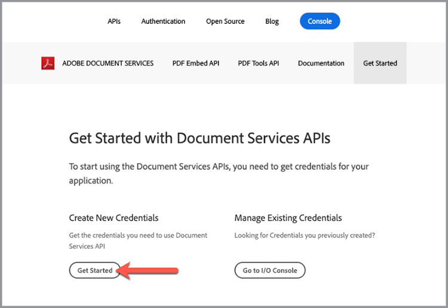

# Introducción a la API de servicios de Adobe PDF y Java

Los desarrolladores pueden empezar en solo unos minutos con los archivos de muestra listos para ejecutar que se proporcionan para acceder a todos los servicios web disponibles. Este tutorial le guiará por todos los pasos para comenzar a ejecutar los ejemplos mediante el SDK de Java de PDF Services:

## Paso 1: Obtener credenciales y descargar archivos de muestra

El primer paso es obtener una credencial (clave de API) para desbloquear el uso. [Suscríbase a la prueba gratuita aquí](https://www.adobe.io/apis/documentcloud/dcsdk/gettingstarted.html) y haz clic en &#39;Comenzar&#39; para crear tus nuevas credenciales.

Es importante elegir una &quot;cuenta personal&quot; para registrarse en la prueba gratis:

En el siguiente paso, seleccionará el servicio de API de servicios de PDF y, a continuación, agregará un nombre y una descripción para sus credenciales.

Hay una casilla de verificación para &quot;Crear ejemplo de código personalizado&quot;. Elija esta opción para agregar automáticamente sus nuevas credenciales a los archivos de muestra, lo que le ahorrará el paso manual de agregarlas al proyecto.

A continuación, seleccione Java como idioma para recibir los ejemplos específicos de Java y, a continuación, haga clic en el botón &quot;Crear credenciales&quot;.

Recibirá un archivo .zip para descargar denominado PDFToolsSDK-JavaSamples.zip que se puede guardar en su sistema de archivos local.

## Paso 2: Configurar el entorno Java

1. Instalar [Java 8 o superior](https://www.oracle.com/java/technologies/javase-downloads.html) si no lo has hecho ya.
1. Ejecutar `javac -version` para verificar su instalación.
1. Compruebe que la carpeta JDK bin está incluida en la variable PATH (el método varía según el sistema operativo).
1. Instalar [Maven](https://maven.apache.org/install.html) usar la herramienta que prefiera, si aún no lo ha hecho.

Los ejemplos personalizados proporcionan todo, desde código de ejemplo listo para ejecutarse, un archivo json de credenciales incrustado y conexiones preconfiguradas a dependencias.

1. Descargar [el proyecto de muestra](https://github.com/adobe/pdftools-java-sdk-samples).
1. Cree el proyecto de muestra con Maven: mvn clean install.
1. Pruebe el código de ejemplo en la línea de comandos o en su IDE preferido.

## Pensamientos finales

La API de servicios de PDF puede ayudarte a eliminar procesos manuales automatizando flujos de trabajo comunes y desplazando la carga de procesamiento a la nube. En un mundo en el que cada navegador trata a PDF de forma diferente, al aprovechar la API Adobe PDF Embed junto con la API de servicios de PDF, puede crear procesos optimizados, fiables y predecibles que se ejecuten y se muestren correctamente **siempre** independientemente de la plataforma o el dispositivo.

## Recursos y pasos siguientes

* Para obtener ayuda y asistencia adicionales, visite el Adobe [[!DNL Acrobat Services] API](https://community.adobe.com/t5/document-cloud-sdk/bd-p/Document-Cloud-SDK?page=1&amp;sort=latest_replies&amp;filter=all) foro de la comunidad

* API de servicios de PDF [Documentación](https://www.adobe.com/go/pdftoolsapi_doc)

* [FAQ](https://community.adobe.com/t5/document-cloud-sdk/faq-for-document-services-pdf-tools-api/m-p/10726197) para preguntas de API de servicios de PDF

* [Contacte con nosotros](https://www.adobe.com/go/pdftoolsapi_requestform) para preguntas sobre licencias y precios

* Artículos relacionados

  [La nueva API de servicios de PDF ofrece aún más funciones para los flujos de trabajo de documentos](https://community.adobe.com/t5/document-services-apis/new-pdf-tools-api-brings-more-capabilities-for-document-services/m-p/11294170)

  [Versión de julio de [!DNL Adobe Acrobat Services]: Servicios de incrustación y PDF para PDF](https://medium.com/adobetech/july-release-of-adobe-document-services-pdf-embed-and-pdf-tools-17211bf7776d)
