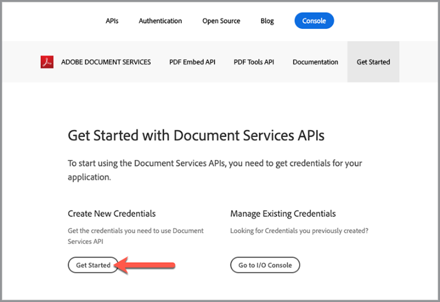
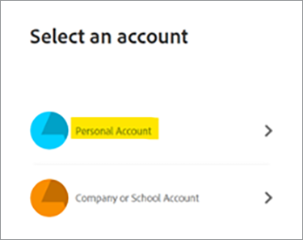
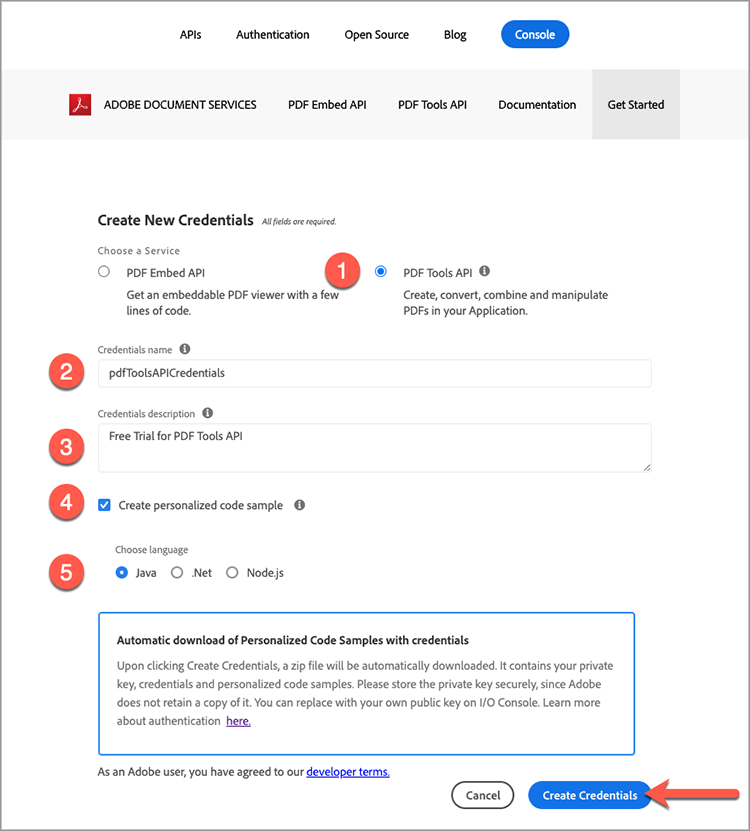

# Introducción a la API de servicios de Adobe PDF y .Net

Los desarrolladores pueden empezar en solo unos minutos con los archivos de muestra listos para ejecutar que se proporcionan para acceder a todos los servicios web disponibles. En este tutorial se describen todos los pasos para comenzar a ejecutar los ejemplos mediante Servicios de PDF .Net SDK:

## Paso 1: Obtener credenciales y descargar archivos de muestra

El primer paso es obtener una credencial (clave de API) para desbloquear el uso. [Suscríbase a la prueba gratuita aquí](https://www.adobe.io/apis/documentcloud/dcsdk/gettingstarted.html) y haz clic en &#39;Empezar&#39; para crear tus nuevas credenciales.

Es importante elegir una &quot;cuenta personal&quot; para registrarse en la prueba gratis:

En el siguiente paso, seleccionará el servicio de API de servicios de PDF y, a continuación, agregará un nombre y una descripción para sus credenciales.

Hay una casilla de verificación para &quot;Crear ejemplo de código personalizado&quot;. Elija esta opción para agregar automáticamente sus nuevas credenciales a los archivos de muestra, lo que le ahorrará el paso manual de agregarlas al proyecto.

A continuación, elija Node.js como idioma para recibir los ejemplos específicos de Node.js y haga clic en el botón &#39;Crear credenciales&#39;.

Recibirá un archivo .zip para descargar denominado PDFToolsSDK-.NetSamples.zip que se puede guardar en el sistema de archivos local.

## Paso 2: Configure el entorno .Net y ejecute el código de ejemplo

1. Descargue e instale el [.Net SDK](https://dotnet.microsoft.com/learn/dotnet/hello-world-tutorial/install)
1. Extraiga el **[!UICONTROL PDFToolsSDK-.NetSamples.zip]** y descomprima el contenido
1. cd al directorio raíz de ejemplos **[!UICONTROL adobe-DC.PDFTools.SDK.NET.Samples]**
1. En el directorio raíz de ejemplos, ejecute `dotnet build`

   C:\Temp\PDFToolsAPI\ PDFToolsSDK-.NetSamples\adobe-DC.PDFTools.SDK.NET.Samples>dotnet build

   Ahora está listo para ejecutar los archivos de muestra.

   Estos pasos finales le muestran cómo ejecutar su primera muestra con la operación Crear PDF desde Word:

1. En el directorio raíz de ejemplos, cambie el directorio a la carpeta CreatePDFFromDocx, cd CreatePDFFromDocx/

   C:\Temp\PDFToolsAPI\ PDFToolsSDK-.NetSamples\adobe-DC.PDFTools.SDK.NET.Samples>cd CreatePDFFromDocx/

1. correr `dotnet run CreatePDFFromDocx.csproj`

   C:\Temp\PDFToolsAPI\ PDFToolsSDK-.NetSamples\adobe-DC.PDFTools.SDK.NET.Samples\CreatePDFFromDocx>dotnet run CreatePDFFromDocx.csproj

El PDF se creará en la ubicación designada en la salida, que de forma predeterminada es la misma.

## Pensamientos finales

La API de servicios de PDF puede ayudarte a eliminar procesos manuales automatizando flujos de trabajo comunes y desplazando la carga de procesamiento a la nube. En un mundo en el que cada navegador trata a PDF de forma diferente, al aprovechar la API Adobe PDF Embed junto con la API de servicios de PDF, puede crear procesos optimizados, fiables y predecibles que se ejecuten y se muestren correctamente **siempre** independientemente de la plataforma o dispositivo.

## Recursos y pasos siguientes

* Para obtener más ayuda y asistencia, visite la [[!DNL Adobe Acrobat Services] API](https://community.adobe.com/t5/document-cloud-sdk/bd-p/Document-Cloud-SDK?page=1&amp;sort=latest_replies&amp;filter=all) foro de la comunidad

* API de servicios de PDF [Documentación](https://www.adobe.com/go/pdftoolsapi_doc)

* [FAQ](https://community.adobe.com/t5/document-cloud-sdk/faq-for-document-services-pdf-tools-api/m-p/10726197) para preguntas de API de servicios de PDF

* [Contacte con nosotros](https://www.adobe.com/go/pdftoolsapi_requestform) para preguntas sobre licencias y precios

* Artículos relacionados

  [La nueva API de servicios de PDF ofrece aún más funciones para los flujos de trabajo de documentos](https://community.adobe.com/t5/document-services-apis/new-pdf-tools-api-brings-more-capabilities-for-document-services/m-p/11294170)

  [Versión de julio de [!DNL Adobe Acrobat Services]: Servicios de incrustación y PDF para PDF](https://medium.com/adobetech/july-release-of-adobe-document-services-pdf-embed-and-pdf-tools-17211bf7776d)
