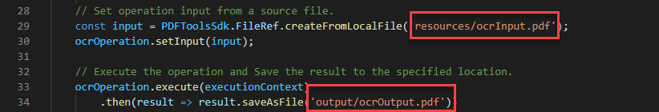

# Uso de la API de servicios de Adobe PDF para archivos del PDF de OCR

Con OCR (reconocimiento óptico de caracteres) puede desbloquear PDF digitalizados para extraer texto y crear archivos que se puedan buscar. Gracias a nuestras potentes API basadas en la nube, integra OCR en cualquier flujo de trabajo de documento para obtener la solución perfecta para archivar, copiar texto y crear índices de documentos en los que se pueden realizar búsquedas. Cree archivos en los que se puedan realizar búsquedas desde repositorios de PDF analizados para desbloquear información importante y ahorrar tiempo con la capacidad de búsqueda rápida. O bien aplica OCR a tus PDF desde las digitalizaciones cargadas para permitir que se editen para su uso en flujos de trabajo de incorporación.

Los desarrolladores pueden empezar en solo unos minutos con los archivos de muestra listos para ejecutar proporcionados para OCR.

En este tutorial se describen los conceptos básicos sobre cómo ejecutar la primera operación de OCR de la API de Servicios de PDF mediante archivos de ejemplo para los idiomas Node.js, Java y .Net.

## Paso 1: Cree sus credenciales y configure su entorno

Utilice los siguientes tutoriales de introducción para crear credenciales de API, descargar archivos de muestra y configurar el entorno.

[Introducción a la API de servicios de PDF y Java](gettingstartedjava.md)
[Introducción a la API de servicios de PDF y .Net](gettingstartednet.md)
[Introducción a la API de servicios de PDF y Node.js](createpdffromhtml.md)

## Ejecute el ejemplo de OCR proporcionado en los archivos de muestra

Nuestra operación de OCR permite la configuración regional en inglés de forma predeterminada, pero también proporciona compatibilidad con alemán, francés, danés y [otros idiomas](https://opensource.adobe.com/pdftools-sdk-docs/release/latest/howtos.html#ocr-with-explicit-language). El valor predeterminado es la configuración regional en-us.

Al pasar opciones con la operación de OCR, incluida una configuración regional específica, el método también acepta el parámetro &#39;type&#39;, que tiene dos opciones:

* SEARCHABLE_IMAGE: Modifica la imagen original durante el proceso de limpieza (por ejemplo, la escribe) antes de colocar una capa de texto invisible sobre ella. Este tipo elimina artefactos no deseados y puede dar como resultado un documento más legible en algunos casos.

* SEARCHABLE_IMAGE_EXACT: Garantiza que el texto se pueda buscar y seleccionar. Esta opción mantiene la imagen original y coloca sobre ella una capa de texto invisible. Recomendada para casos que requieran máxima fidelidad a la imagen original.

**Java**

1. Abra un símbolo del sistema.

1. Cambie los directorios en el directorio de código de ejemplo.

   Por ejemplo, C:\Temp\PDFToolsAPI\adobe-dc-pdf-tools-sdk-java-samples>.

1. Ejecute el siguiente comando::

   `mvn -f pom.xml exec:java -Dexec.mainClass=com.adobe.platform.operation.samples.ocrpdf.OcrPDF`

El PDF se creará en el directorio src/main/resources.

**.Net**

1. Abra un símbolo del sistema.

1. Cambie los directorios en el directorio de código de ejemplo.

   Por ejemplo, C:\Temp\PDFToolsAPI\adobe-dc-pdf-tools-sdk-NetSamples

1. Vuelva a cambiar los directorios en el directorio OcrPDF.

1. Ejecute el siguiente comando::

   `dotnet run OcrPDF.csproj`

El PDF se creará en el mismo directorio.

**Node.js**

1. Abra un símbolo del sistema.

1. Cambie los directorios en el directorio de código de ejemplo.

   Por ejemplo, C:\Temp\PDFToolsAPI\adobe-dc-pdf-tools-sdk-node-samples

1. Ejecute el siguiente comando::

   `node src/ocr/ocr-pdf.js`

El PDF se creará en la ubicación designada en la salida, que de forma predeterminada es el directorio de salida.

## Pensamientos finales

Con estos sencillos pasos utilizando los archivos de muestra, debería tener un ejemplo funcional en el que pueda basarse. Además del ejemplo de OCR que hemos utilizado en este tutorial, hay otro ejemplo de OCR que utiliza las opciones de configuración regional y de tipo compatibles descritas anteriormente.

A partir de aquí, puede reemplazar los archivos de entrada y salida ubicados en la muestra para utilizar su propio PDF y finalizar la prueba de concepto para su propio caso de uso.

## Recursos y pasos siguientes

* Para obtener ayuda y asistencia adicionales, visite el Adobe [[!DNL Acrobat Services] API](https://community.adobe.com/t5/document-cloud-sdk/bd-p/Document-Cloud-SDK?page=1&amp;sort=latest_replies&amp;filter=all) foro de la comunidad

* API de servicios de PDF [Documentación](https://www.adobe.com/go/pdftoolsapi_doc)

* [FAQ](https://community.adobe.com/t5/document-cloud-sdk/faq-for-document-services-pdf-tools-api/m-p/10726197) para preguntas de API de servicios de PDF

* [Contacte con nosotros](https://www.adobe.com/go/pdftoolsapi_requestform) para preguntas sobre licencias y precios
