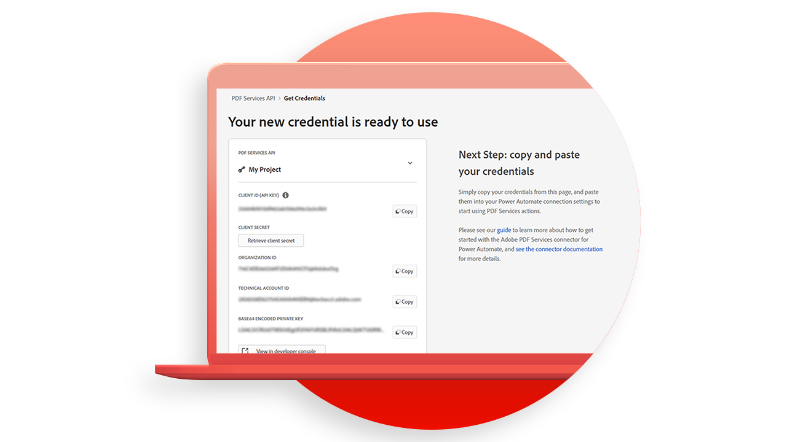
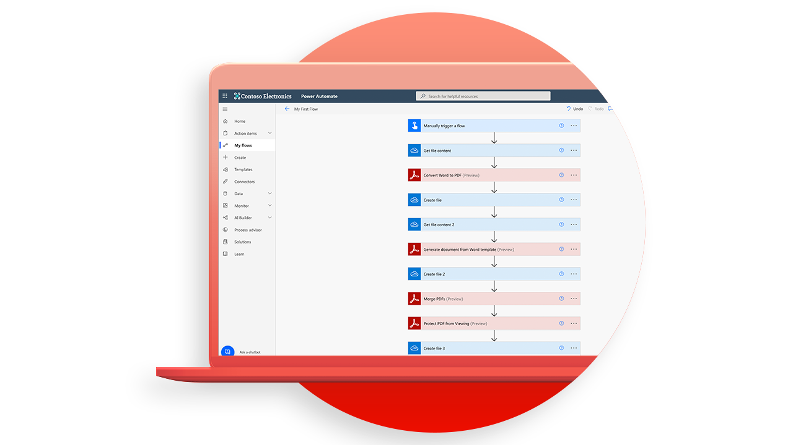

# Tutoriales de la API de Adobe PDF Services

<table style="table-layout:fixed">
<tr>
 <td>
   
    

   <a href="https://experienceleague.adobe.com/docs/adobe-developers-live-events/events/2021/oct2021/pdf-services-api.html"><strong>Introducción a la API de servicios de PDF</strong></a>
    

    <em>La API de servicios de PDF de Adobe permite a los desarrolladores crear, combinar, exportar y extraer datos de los PDF a través de potentes y flexibles API basadas en la nube</em>
     
  </td>
  <td>
   
    

   <a href="getting-credentials-power-automate.md"><strong>Obtención de credenciales para [!DNL Microsoft Power Automate]</strong></a>
    

    <em>Obtenga información sobre cómo obtener credenciales para empezar a usar o probar [!DNL Adobe PDF Services]</em>
     
  </td>
  <td>
   
    

   <a href="create-workflow-power-automate.md"><strong>Cree su primer flujo de trabajo en [!DNL Microsoft Power Automate]</strong></a>
    

    <em>Aprenda a utilizar [!DNL Adobe PDF Services] conector en [!DNL Microsoft Power Automate]</em>
     
  </td>
  <td>
   
    

   <a href="createpdffromhtml.md"><strong>Crear un PDF desde un HTML o [!DNL MS Office] en unos minutos con la API de servicios de PDF y Node.js</strong></a>
    

    <em>[!DNL Adobe PDF Services API] lo que proporciona a los desarrolladores libertad para elegir entre varios potentes servicios de manipulación de PDF para satisfacer las necesidades de complicados flujos de trabajo empresariales</em>
     
  </td>
</tr>
<tr>
  <td>
   
    

   <a href="exportpdf.md"><strong>Apalancamiento [!DNL PDF Services API] para exportar el PDF a [!DNL Word], [!DNL PowerPoint]y mucho más</strong></a>
    

    <em>Obtenga información sobre cómo ejecutar el [!DNL PDF Services API] operación de exportación con archivos de muestra para los lenguajes Node.js, Java y .Net</em>
     
  </td>
   <td>
   
    

   <a href="gettingstartedjava.md"><strong>Introducción a la API de servicios de Adobe PDF y Java</strong></a>
    

    <em>Los desarrolladores pueden empezar en solo unos minutos con los archivos de muestra listos para ejecutar que se proporcionan para acceder a todos los servicios web disponibles</em>
     
  </td>
   <td>
   
    

   <a href="ocr.md"><strong>Uso [!DNL Adobe PDF Services API] a archivos de PDF de OCR</strong></a>
    

    <em>Con OCR (reconocimiento óptico de caracteres), puede desbloquear PDF digitalizados para extraer texto y crear archivos que se puedan buscar</em>
     
  </td>
  <td>
   
    

   <a href="gettingstartednet.md"><strong>Introducción a [!DNL Adobe PDF Services API] y .Net</strong></a>
    

    <em>[!DNL Adobe PDF Services API] lo que proporciona a los desarrolladores libertad para elegir entre varios potentes servicios de manipulación de PDF para satisfacer las necesidades de complicados flujos de trabajo empresariales</em>
     
  </td>
</tr>
</table>
