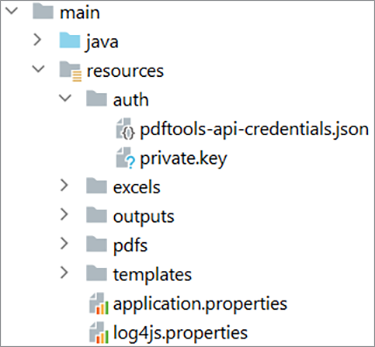
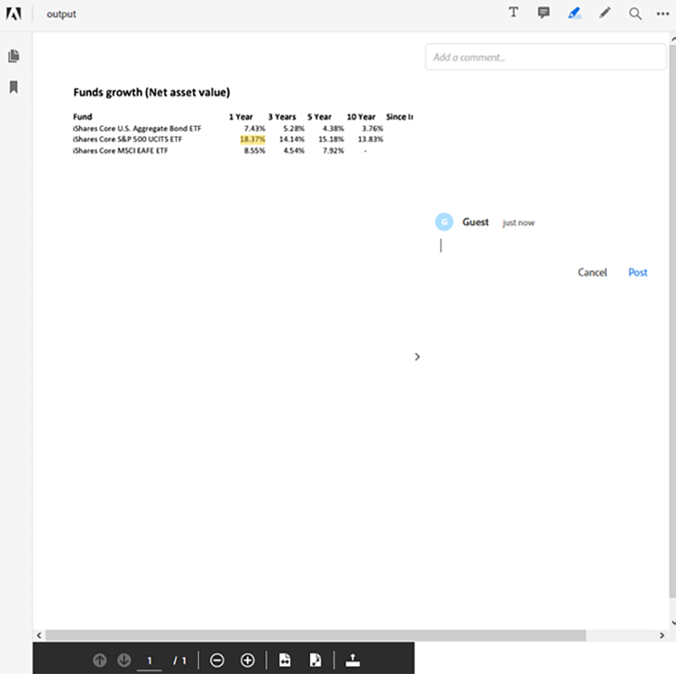

# Administración de flujos de trabajo de documentos financieros en Java


El sector financiero utiliza archivos de PDF de forma exhaustiva para intercambiar datos, ya que ayuda a mantener el formato, el diseño y la estructura de los documentos. Este formato robusto permite a los analistas y asesores financieros ayudar a sus clientes a tomar decisiones bien informadas.

Sin embargo, el formato PDF puede resultar complicado de procesar y automatizar, especialmente cuando se combinan varias fuentes de datos, un caso práctico común en el sector financiero. Crear una solución personalizada para procesar documentos de PDF es una opción, pero no es necesario invertir demasiado tiempo y dinero en software e infraestructura. [!DNL Adobe Acrobat Services] proporciona todas las herramientas, servicios y funciones necesarios para procesar y extraer datos de los documentos del PDF.

## Lo que puedes aprender

En este tutorial práctico, aprenda a utilizar [!DNL Adobe Acrobat Services] API para [!DNL Java Spring Boot] aplicaciones. Se crea una aplicación de controlador de vista de modelo (MVC) que extrae contenido de los documentos del PDF, lo convierte a otros formatos de datos como Excel, combina varios PDF y protege los recursos mediante contraseña. En este tutorial se explica cómo procesar documentos de PDF y mostrarlos en sus sitios web mediante el Adobe [API de incrustación de PDF](https://www.adobe.io/apis/documentcloud/dcsdk/pdf-embed.html).

## API y recursos relevantes

* [API de servicios de PDF](https://opensource.adobe.com/pdftools-sdk-docs/release/latest/index.html)

* [API de incrustación de PDF](https://www.adobe.com/devnet-docs/dcsdk_io/viewSDK/index.html)

* [Ejemplos de proyecto](https://github.com/adobe/pdftools-java-sdk-samples)

## Configuración

[!DNL Adobe Acrobat Services] utiliza un sistema de autenticación para controlar el acceso a los recursos. Para acceder a los servicios, debe solicitar una clave de API de Adobe para su organización o aplicación. Si tiene una clave de API, continúe con la sección siguiente. Para crear una nueva clave de API, visite [Procedimientos iniciales](https://www.adobe.io/apis/documentcloud/dcsdk/gettingstarted.html) en el [!DNL Acrobat Services] sitio. Puede crear una clave con su prueba gratuita, que proporciona 1000 transacciones de documento que se pueden utilizar durante un máximo de seis meses.

Para seguir los pasos de este tutorial, necesita dos conjuntos de claves de API:

* Servicios de Adobe PDF: se utilizan para procesar el documento del PDF

* API Adobe PDF Embed

Después de crear las credenciales, copie las credenciales de la API de servicios de PDF y la clave privada en el [!DNL Spring Boot] dentro de la sección recursos. Más información sobre la [Bibliotecas y dependencias Maven y Gradle](https://www.adobe.io/apis/documentcloud/dcsdk/docs.html?view=services) en la [!DNL Adobe Acrobat Services] sitio web. Asegúrese de configurar todos los paquetes y bibliotecas necesarios antes de continuar.



Para configurar los servicios de registro, visite [Documentación de Adobe](https://www.adobe.io/apis/documentcloud/dcsdk/docs.html?view=services) y desplácese a la sección Registro.

>[!NOTE]
>
> En el entorno de producción, no guarde las claves privadas en el sistema de control de versiones. Utilice siempre una caja fuerte secreta o un servicio de inyección de claves para evitar el uso no autorizado de credenciales.

Ahora que tu [!DNL Spring Boot] Si la aplicación está configurada, puede continuar procesando los PDF y generando informes para los clientes.

## Enviar los datos del informe

Para utilizar la API de servicios de Adobe PDF, primero configure una `ExecutionContext` que consume las credenciales proporcionadas. Puesto que tiene las credenciales en su aplicación, puede leerlas en el archivo y crear el contexto de la siguiente manera:

```
Credentials credentials = Credentials.serviceAccountCredentialsBuilder()
    .fromFile(AUTH_FILE_PATH)
    .build();

ExecutionContext executionContext = ExecutionContext.create(credentials);
```

A continuación, obtenga el contexto para procesar los documentos del PDF. Estas son las acciones que puede realizar:

* Convertir los documentos de PDF (a Excel, Word o a un tipo de gráfico)

* Cree los documentos de PDF (desde HTML, Excel, Word, etc.)

* Combinar varios documentos de PDF

* Protect y desproteja los documentos del PDF (debe tener la contraseña)

* Optimizar los documentos del PDF para su entrega en redes

Todas estas muestras están disponibles en la [Ejemplos de GitHub](https://github.com/adobe/pdfservices-java-sdk-samples/tree/master/src/main/java/com/adobe/pdfservices/operation/samples) repositorio.

Siguiente, en [!DNL Spring Boot], puede obtener un archivo mediante la ruta String o el objeto Stream en el que se carga el archivo. Cada operación que realice debe inicializarse y debe establecerse una ruta de acceso al archivo de entrada. Para este tutorial, puede utilizar los informes de PDF disponibles públicamente de [Blackrock](https://www.blackrock.com/us/individual/products/investment-funds). Puede utilizar cualquier otra fuente, incluidos sus propios informes.

Empieza por capturar el [FileRef](https://opensource.adobe.com/pdfservices-java-sdk-samples/apidocs/latest/com/adobe/pdfservices/operation/io/FileRef.html) del archivo. Para simplificar, céntrese en los archivos por ruta de cadena. A continuación, se crea una operación para convertir un archivo de la ruta de PDF a Excel:

```
ExecutionContext executionContext = ExecutionContext.create(credentials);
ExportPDFOperation exportOperation = ExportPDFOperation.createNew(ExportPDFTargetFormat.XLSX);

// Create the input source
FileRef inputPdf = FileRef.createFromLocalFile(INPUT_PDF);
exportOperation.setInput(inputPdf);
```

Después de este paso, el programa está listo para ejecutar la primera operación en el PDF. A continuación, ejecute la operación y obtenga el resultado en la hoja de Excel:

```
try {
    FileRef output = exportOperation.execute(executionContext);
    output.saveAs(OUTPUT_EXCEL);
} catch (ServiceApiException e) {
    e.printStackTrace();
}
```

En este escenario, solo se gestiona un archivo de PDF. También puede empezar con varios archivos de PDF y combinarlos en un solo archivo. El uso de varios archivos es común en los informes de datos financieros porque debe procesar fondos de varios orígenes para proporcionar un informe completo.

## Generación del informe

[!DNL Adobe Acrobat Services] no permite procesar documentos de Excel de forma instantánea, pero puede seguir utilizando marcos de trabajo y bibliotecas de la comunidad para procesar el contenido.

Por ejemplo, puede utilizar la [Apache POI](https://poi.apache.org/) para procesar documentos de Excel (u otros documentos de Microsoft) en su [!DNL Java Spring Boot] o puede realizar otras tareas manuales o automatizadas en el archivo de Excel.

En este ejemplo, a partir de los documentos de PDF, se extrae el valor neto del activo de los tres fondos y se muestran en una tabla. También puede obtener otra información, como gráficos y tablas, según sus necesidades y los datos disponibles. Incluso puedes incorporar datos de otras fuentes.

Una vez generado el informe, en este ejemplo en formato Excel, puede utilizar las operaciones de los Servicios de Adobe PDF para volver a convertir el informe en un documento de PDF y protegerlo.

Para convertir el informe del formato de Excel a un documento de PDF, utilice la siguiente operación:

```
ExecutionContext executionContext = ExecutionContext.create(credentials);
CreatePDFOperation exportOperation = CreatePDFOperation.createNew();

// Create the input source
FileRef inputPdf = FileRef.createFromLocalFile(INPUT_EXCEL);
exportOperation.setInput(inputPdf);

try {
    FileRef output = exportOperation.execute(executionContext);
    output.saveAs(OUTPUT_PDF);
} catch (ServiceApiException e) {
    e.printStackTrace();
}
```

>[!TIP]
>
> Para evitar tener que recrear el objeto cada vez que se presente una solicitud, utilice la inyección de dependencia de Spring para inyectar la `ExecutionContext` objeto.

Este código genera un documento de PDF a partir del informe en formato Excel.

Antes de entregar este PDF a sus clientes, puede protegerlo con una contraseña. Crear otra operación que gestione esta protección por usted, [ProtectPDFOperation](https://opensource.adobe.com/pdfservices-java-sdk-samples/apidocs/latest/com/adobe/pdfservices/operation/pdfops/ProtectPDFOperation.html)y, a continuación, utilice [ProtectPDFOptions](https://opensource.adobe.com/pdfservices-java-sdk-samples/apidocs/latest/com/adobe/pdfservices/operation/pdfops/options/protectpdf/package-summary.html) para agregar la contraseña al documento.

```
ProtectPDFOptions options = ProtectPDFOptions.passwordProtectOptionsBuilder()
                    .setUserPassword("p@55w0rd")
                    .setEncryptionAlgorithm(EncryptionAlgorithm.AES_256)
                    .build();
ProtectPDFOperation operation = ProtectPDFOperation.createNew(options);
```

A continuación, especifique la entrada y ejecute la operación. El archivo resultante debe tener una contraseña para evitar el acceso no autorizado.

## Visualización del informe

Ahora que se ha generado el informe de PDF, puede mostrarlo en el sitio web mediante la API Adobe PDF Embed. Esta API de JavaScript permite a los desarrolladores web cargar y procesar los documentos de PDF de forma nativa dentro del navegador web.

>[!NOTE]
>
> En este momento, necesita el segundo token de credencial, el ID de cliente.

En su [!DNL Spring Boot] , añada el siguiente fragmento de HTML donde desee procesar el informe de PDF:

```
<div id="pdf-viewer"></div>
<script src="https://documentcloud.adobe.com/view-sdk/main.js"></script>
<script type="text/javascript">
    document.addEventListener("adobe_dc_view_sdk.ready", function()
    {
        var adobeDCView = new AdobeDC.View({ clientId: "<your-client-id-here>", divId: "pdf-viewer" });
        adobeDCView.previewFile(
        {
            content: {
                location: {
                    url: "<your-document.pdf>"
                }
            },
            metaData: {
                fileName: "<document-name.pdf>"
            }
        });
    });
</script>
```

Esta secuencia de comandos carga el documento del PDF y permite a los usuarios realizar anotaciones y comentarios en los documentos. Esta es la vista de esta API incrustada como se muestra en Firefox:



La API de incrustación de PDF proporciona todas las herramientas necesarias para obtener una vista previa del PDF y realizar anotaciones en el informe.

## Pasos siguientes

En este tutorial práctico se ha explorado la [[!DNL Adobe Acrobat Services]](https://www.adobe.io/apis/documentcloud/dcsdk/) API y se ha analizado cómo utilizar estos servicios para procesar datos de PDF y generar informes para la toma de decisiones financieras. En él se mostraba cómo integrar las API en los sistemas mediante [!DNL Java Spring Boot] como ejemplo, para mostrar lo fácil que es procesar rápidamente documentos de PDF.

Explorar [[!DNL Adobe Acrobat Services]](https://www.adobe.io/apis/documentcloud/dcsdk/) y descubre lo que los servicios de Adobe PDF pueden hacer por tu empresa. Para obtener más información sobre las funciones disponibles en el SDK, consulte la [Repositorio de GitHub](https://github.com/adobe/pdftools-java-sdk-samples) para ver los ejemplos y descubrir cómo [API de incrustación de PDF](https://www.adobe.io/apis/documentcloud/dcsdk/pdf-embed.html) puede ayudarle a mostrar rápidamente a los PDF dentro de sus aplicaciones.

Para combinar y manipular documentos fácilmente, creando informes de PDF útiles para tus clientes financieros, empieza registrándote en tu [cuenta de desarrollador de Adobe](https://www.adobe.io/apis/documentcloud/dcsdk/) hoy.
