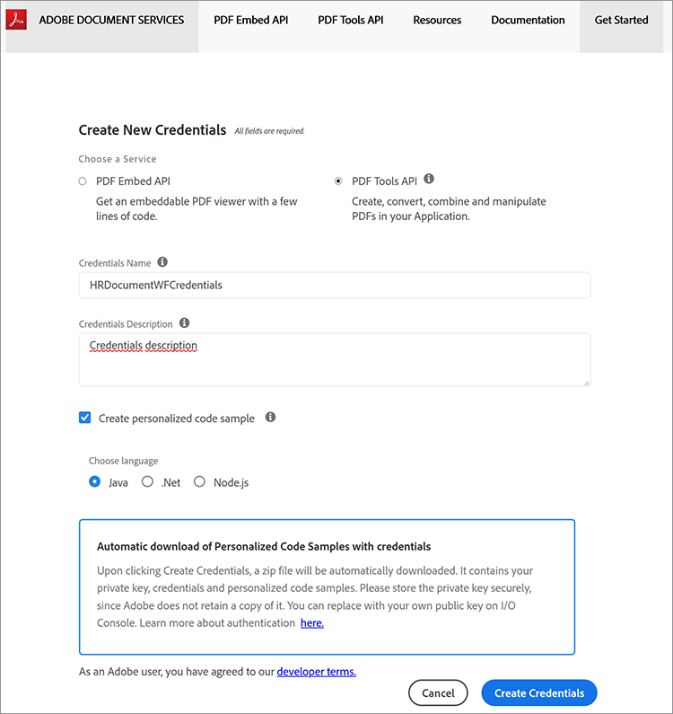
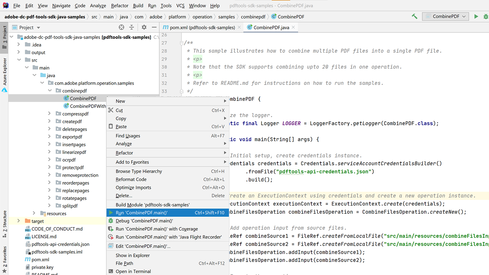
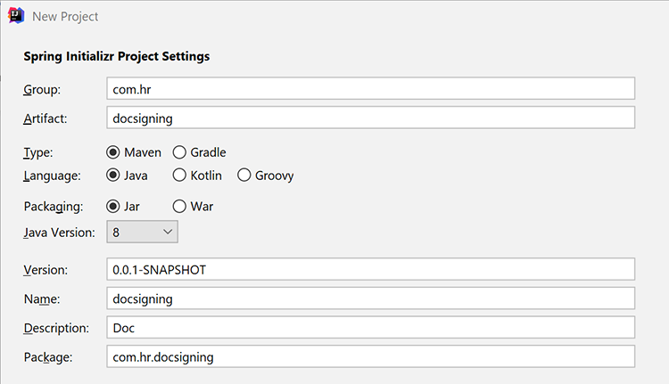
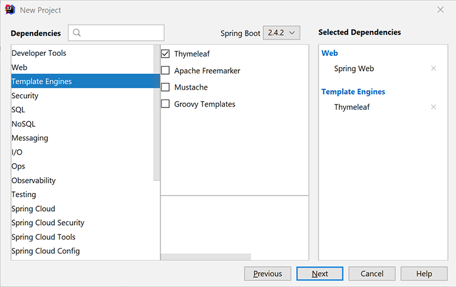
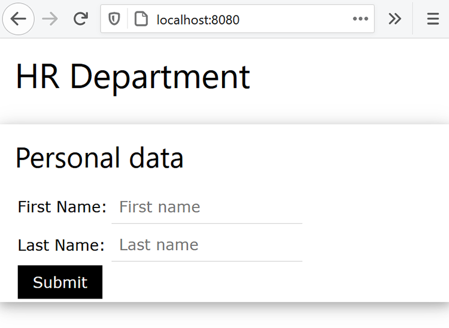
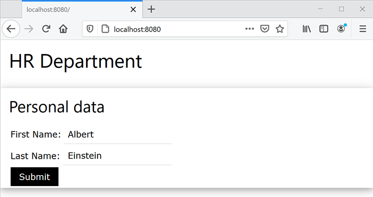
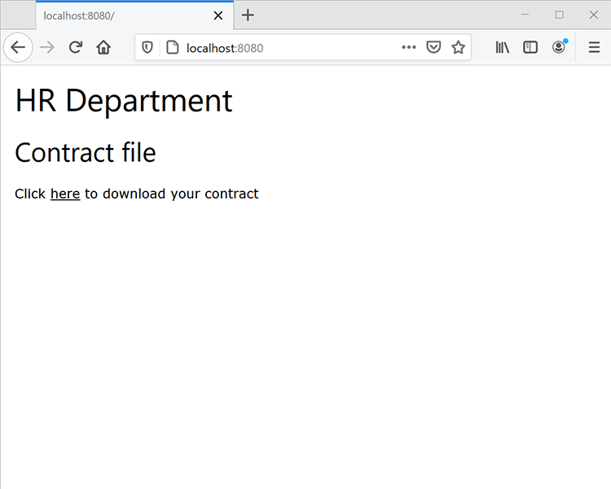
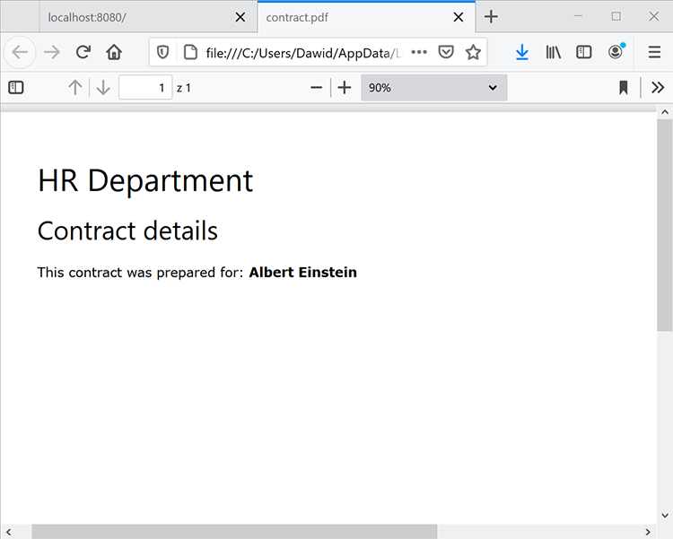

# Flujos de trabajo de documentos de HR en Java


Muchas empresas requieren documentación sobre una nueva contratación, como acuerdos laborales para empleados que trabajan desde casa. Tradicionalmente, las empresas administraban estos documentos físicamente en formularios difíciles de administrar y almacenar. Al cambiar a documentos electrónicos, los archivos de PDF son una opción ideal porque son más seguros y menos modificables que otros tipos de archivo. Además, son compatibles con las firmas digitales.

## Lo que puedes aprender

En este tutorial práctico, aprenderá a implementar un formulario de RR. HH. basado en la web que guarde un acuerdo en el lugar de trabajo para el PDF con la firma en una aplicación Java Spring MVC simple.

## API y recursos relevantes

* [API de servicios de PDF](https://opensource.adobe.com/pdftools-sdk-docs/release/latest/index.html)

* [API de Adobe Sign](https://www.adobe.io/apis/documentcloud/sign.html)

* [Código del proyecto](https://github.com/dawidborycki/adobe-sign)

## Generación de credenciales de API

Para empezar, regístrate para obtener la versión de prueba gratuita de la API de servicios de Adobe PDF. Vaya a la [Adobe](https://www.adobe.io/apis/documentcloud/dcsdk/gettingstarted.html?ref=getStartedWithServicesSDK) [sitio web](https://www.adobe.io/apis/documentcloud/dcsdk/gettingstarted.html?ref=getStartedWithServicesSDK) y haga clic en el *Introducción* botón situado debajo *Crear nuevas credenciales*. La prueba gratis proporciona 1000 transacciones de documentos que se pueden utilizar durante seis meses. En la siguiente página (consulte a continuación), elija el servicio (API de Servicios de PDF), establezca el nombre de las credenciales (por ejemplo, HRDocumentWFCredentials) e introduzca una descripción.

Seleccione el idioma (Java para este ejemplo) y marque *Crear ejemplos de código personalizados*. El último paso garantiza que los ejemplos de código ya contengan el archivo pdftools-api-credentials.json rellenado previamente que utilice, junto con la clave privada para autenticar su aplicación dentro de la API.

Por último, haga clic en *Crear credenciales* botón. Esto genera las credenciales y los ejemplos comienzan a descargarse automáticamente.



Para asegurarse de que las credenciales funcionan, abra los ejemplos descargados. Aquí, está utilizando IntelliJ IDEA. Cuando se abre el código fuente, el entorno de desarrollo integrado (IDE) solicita el motor de generación. Maven se utiliza en esta muestra, pero también puede trabajar con Gradle, según sus preferencias.

A continuación, ejecute la `mvn clean install` Objetivo Maven para construir los archivos jar.

Por último, ejecute el ejemplo CombinePDF , como se muestra a continuación. El código genera el PDF en la carpeta de resultados.



## Creación de la aplicación Spring MVC

Dadas las credenciales, cree la aplicación. En este ejemplo se utiliza Spring Initializer.

En primer lugar, configure los ajustes del proyecto para utilizar el empaquetado de Java 8 y Jar (consulte la captura de pantalla siguiente).



En segundo lugar, agregue Spring Web (desde Web) y Thymeleaf (desde los motores de plantillas):



Después de crear el proyecto, vaya al archivo pom.xml y complemente la sección de dependencias con pdftools-sdk y log4j-slf4j-impl:

```
<dependencies>
    <dependency>
        <groupId>org.springframework.boot</groupId>
        <artifactId>spring-boot-starter-thymeleaf</artifactId>
    </dependency>
    <dependency>
        <groupId>org.springframework.boot</groupId>
        <artifactId>spring-boot-starter-web</artifactId>
    </dependency>

    <dependency>
        <groupId>org.springframework.boot</groupId>
        <artifactId>spring-boot-starter-test</artifactId>
        <scope>test</scope>
    </dependency>

</dependencies>
```

A continuación, complemente la carpeta raíz del proyecto con dos archivos que haya descargado con el código de ejemplo:

* pdftools-api-credentials.json

* private.key

## Representación de un formulario web

Para procesar el formulario web, modifique la aplicación con el controlador que procesa el formulario de datos personales y controle la publicación del formulario. Por lo tanto, modifique primero la aplicación con la clase de modelo PersonForm:

```
package com.hr.docsigning;
import javax.validation.constraints.NotNull;
import javax.validation.constraints.Size;

public class PersonForm {
    @NotNull
    @Size(min=2, max=30)
    private String firstName;

    @NotNull
    @Size(min=2, max=30)
    private String lastName;

    public String getFirstName() {
            return this.firstName;
    }


    public void setFirstName(String firstName) {
            this.firstName = firstName;
    }

    public String getLastName() {
           return this.lastName;
    }

    public void setLastName(String lastName) {
            this.lastName = lastName;
    }

    public String GetFullName() {
           return this.firstName + " " + this.lastName;
    }
}
```

Esta clase contiene dos propiedades: `firstName` y `lastName`. Además, utilice esta validación simple para comprobar si se encuentran entre dos y 30 caracteres.

Dada la clase de modelo, puede crear el controlador (vea PersonController.java desde el código complementario):

```
package com.hr.docsigning;
import org.springframework.stereotype.Controller;
import org.springframework.validation.BindingResult;
import org.springframework.web.bind.annotation.GetMapping;
import org.springframework.web.bind.annotation.PostMapping;
import javax.validation.Valid;


@Controller
public class PersonController {
    @GetMapping("/")
    public String showForm(PersonForm personForm) {
        return "form";
    }
}
```

El controlador sólo tiene un método: showForm. Se encarga de procesar el formulario mediante la plantilla de HTML ubicada en resources/templates/form.html:

```
<html>
<head>
    <link rel="stylesheet" href="https://www.w3schools.com/w3css/4/w3.css">
</head>
 
<body>
<div class="w3-container">
    <h1>HR Department</h1>
</div>
 
<form class="w3-panel w3-card-4" action="#" th:action="@{/}"
        th:object="${personForm}" method="post">
    <h2>Personal data</h2>
    <table>
        <tr>
            <td>First Name:</td>
            <td><input type="text" class="w3-input"
                placeholder="First name" th:field="*{firstName}" /></td>
            <td class="w3-text-red" th:if="${#fields.hasErrors('firstName')}"
                th:errors="*{firstName}"></td>
        </tr>
        <tr>
            <td>Last Name:</td>
            <td><input type="text" class="w3-input"
                placeholder="Last name" th:field="*{lastName}" /></td>
            <td class="w3-text-red" th:if="${#fields.hasErrors('lastName')}"
                th:errors="*{lastName}"></td>
        </tr>
        <tr>
            <td><button class="w3-button w3-black" type="submit">Submit</button></td>
        </tr>
    </table>
</form>
</body>
</html>
```

Para procesar contenido dinámico, se utiliza el motor de procesamiento de plantillas Thymeleaf. Por lo tanto, después de ejecutar la aplicación, debería ver lo siguiente:



## Generación del PDF con contenido dinámico

A continuación, genere el documento del PDF que contiene el contrato virtual rellenando dinámicamente los campos seleccionados después de procesar el formulario de datos personales. Específicamente, debe incluir los datos de la persona en el contrato creado previamente.

Aquí, para simplificar, sólo tiene un encabezado, un subencabezado y una constante de cadena que dice: &quot;Este contrato se preparó para \&lt;full name=&quot;&quot; of=&quot;&quot; the=&quot;&quot; person=&quot;&quot;>&quot;.

Para lograr este objetivo, comience con la [Crear un PDF desde un HTML dinámico](https://opensource.adobe.com/pdftools-sdk-docs/release/latest/howtos.html#create-a-pdf-from-dynamic-html) ejemplo. Al analizar ese código de ejemplo, observa que el proceso de rellenado de campos de HTML dinámico funciona como se indica a continuación.

En primer lugar, debe preparar la página HTML, que tiene contenido estático y dinámico. La parte dinámica se actualiza mediante JavaScript. Es decir, la API de servicios de PDF inyecta el objeto JSON en el HTML.

A continuación, obtendrá las propiedades JSON mediante la función JavaScript que se invoca cuando se carga el documento de HTML. Esta función de JavaScript actualiza los elementos DOM seleccionados. A continuación se muestra el ejemplo que rellena el elemento span, que contiene los datos de la persona (consulte src\\main\\resources\\contract\\index.html del código complementario):

```
<html>
<head>
    <link rel="stylesheet" href="https://www.w3schools.com/w3css/4/w3.css">
</head>
 
<body onload="updateFullName()">
    <script src="./json.js"></script>
    <script type="text/javascript">
        function updateFullName()
        {
            var document = window.document;
            document.getElementById("personFullName").innerHTML = String(
                window.json.personFullName);
        }
    </script>
 
    <div class="w3-container ">
        <h1>HR Department</h1>
 
        <h2>Contract details</h2>
 
        <p>This contract was prepared for:
            <strong><span id="personFullName"></span></strong>
        </p>
    </div>
</body>
</html>
```

A continuación, debe comprimir el HTML con todos los archivos JavaScript y CSS dependientes. La API de servicios de PDF no acepta archivos de HTML. En su lugar, requiere un archivo zip como entrada. En este caso, almacenará el archivo comprimido en src\\main\\resources\\contract\\index.zip.

Después, puede complementar la `PersonController` con otro método que gestiona las solicitudes de los POST:

```
@PostMapping("/")
public String checkPersonInfo(@Valid PersonForm personForm,
    BindingResult bindingResult) {
    if (bindingResult.hasErrors()) {
        return "form";
    }
 
    CreateContract(personForm);
 
    return "contract-actions";
}
```

El método anterior crea un contrato de PDF utilizando los datos personales proporcionados y procesa la vista de acciones de contrato. Este último proporciona vínculos al PDF generado y para firmar el PDF.

Ahora, vamos a ver cómo el `CreateContract` funciona (el listado completo está abajo). El método se basa en dos campos:

* `LOGGER`, de log4j, para depurar información sobre excepciones

* `contractFilePath`, que contiene la ruta del archivo al PDF generado

La `CreateContract` configura las credenciales y crea el PDF a partir del HTML. Para pasar y rellenar los datos de la persona en el contrato, utilice el `setCustomOptionsAndPersonData` Ayudante. Este método recupera los datos de la persona del formulario y, a continuación, los envía al PDF generado a través del objeto JSON explicado anteriormente.

Además, `setCustomOptionsAndPersonData` muestra cómo controlar la apariencia del PDF deshabilitando el encabezado y el pie de página. Una vez completados estos pasos, guarde el archivo de PDF en output/contract.pdf y, finalmente, elimine el archivo generado anteriormente.

```
private static final Logger LOGGER = LoggerFactory.getLogger(PersonController.class);
private String contractFilePath = "output/contract.pdf"; 
private void CreateContract(PersonForm personForm) {
    try {
        // Initial setup, create credentials instance.
        Credentials credentials = Credentials.serviceAccountCredentialsBuilder()
                .fromFile("pdftools-api-credentials.json")
                .build();

        //Create an ExecutionContext using credentials 
       //and create a new operation instance.
        ExecutionContext executionContext = ExecutionContext.create(credentials);
        CreatePDFOperation htmlToPDFOperation = CreatePDFOperation.createNew();

        // Set operation input from a source file.
        FileRef source = FileRef.createFromLocalFile(
           "src/main/resources/contract/index.zip");
       htmlToPDFOperation.setInput(source);

        // Provide any custom configuration options for the operation
        // You pass person data here to dynamically fill out the HTML
        setCustomOptionsAndPersonData(htmlToPDFOperation, personForm);

        // Execute the operation.
        FileRef result = htmlToPDFOperation.execute(executionContext);

        // Save the result to the specified location. Delete previous file if exists
        File file = new File(contractFilePath);
        Files.deleteIfExists(file.toPath());

        result.saveAs(file.getPath());

    } catch (ServiceApiException | IOException | 
             SdkException | ServiceUsageException ex) {
        LOGGER.error("Exception encountered while executing operation", ex);
    }
}
 
private static void setCustomOptionsAndPersonData(
    CreatePDFOperation htmlToPDFOperation, PersonForm personForm) {
    //Set the dataToMerge field that needs to be populated 
    //in the HTML before its conversion
    JSONObject dataToMerge = new JSONObject();
    dataToMerge.put("personFullName", personForm.GetFullName());
 
    // Set the desired HTML-to-PDF conversion options.
    CreatePDFOptions htmlToPdfOptions = CreatePDFOptions.htmlOptionsBuilder()
        .includeHeaderFooter(false)
        .withDataToMerge(dataToMerge)
        .build();
    htmlToPDFOperation.setOptions(htmlToPdfOptions);
}
```

Al generar el contrato, también puede fusionar los datos dinámicos específicos de la persona con términos fijos del contrato. Para ello, siga las instrucciones [Crear un PDF desde un HTML estático](https://opensource.adobe.com/pdftools-sdk-docs/release/latest/howtos.html#create-a-pdf-from-dynamic-html) ejemplo. También puede [combinar dos PDF](https://opensource.adobe.com/pdftools-sdk-docs/release/latest/howtos.html#create-a-pdf-from-static-html).

## Presentación del archivo de PDF para su descarga

Ahora puede presentar el vínculo al PDF generado para que el usuario lo descargue. Para ello, cree primero el archivo contract-actions.html (consulte resources/templates contract-actions.html del código complementario):

```
<html>
<head>
    <link rel="stylesheet" href="https://www.w3schools.com/w3css/4/w3.css">
</head>
 
<div class="w3-container ">
    <h1>HR Department</h1>
 
    <h2>Contract file</h2>
 
    <p>Click <a href="/pdf">here</a> to download your contract</p>
</div>
</body>
</html>
```

A continuación, implemente el `downloadContract` dentro de la `PersonController` de la siguiente manera:

```
@RequestMapping("/pdf")
public void downloadContract(HttpServletResponse response)
{
    Path file = Paths.get(contractFilePath);
 
    response.setContentType("application/pdf");
    response.addHeader(
        "Content-Disposition", "attachment; filename=contract.pdf");

    try
    {
        Files.copy(file, response.getOutputStream());
        response.getOutputStream().flush();
    }
    catch (IOException ex) 
    {
        ex.printStackTrace();
    }
}
```

Después de ejecutar la aplicación, obtendrá el siguiente flujo. La primera pantalla muestra el formulario de datos personales. Para realizar la prueba, rellénela con cualquier valor comprendido entre 2 y 30 caracteres:



Después de hacer clic en *Enviar* , el formulario se valida y el PDF genera basándose en el HTML (resources/contract/index.html). La aplicación muestra otra vista (detalles del contrato) en la que puede descargar el PDF:



El PDF, después de procesar en el navegador web, tiene el siguiente aspecto. Es decir, los datos personales introducidos se propagan al PDF:



## Activación de las firmas y la seguridad

Cuando el acuerdo está listo, Adobe Sign puede añadir firmas digitales que representen la aprobación. La autenticación de Adobe Sign funciona de manera un poco diferente a OAuth. Ahora veremos cómo integrar la aplicación con Adobe Sign. Para ello, debe preparar el token de acceso para la aplicación. A continuación, se escribe el código de cliente mediante Adobe Sign Java SDK.

Para obtener un token de autorización, debe realizar varios pasos:

En primer lugar, registre un [cuenta de desarrollador](https://acrobat.adobe.com/es/es/sign/developer-form.html).

Cree la aplicación CLIENTE en el [Portal de Adobe Sign](https://www.adobe.io/apis/documentcloud/sign/docs.html#!adobedocs/adobe-sign/master/gstarted/create_app.md).

Configure OAuth para la aplicación tal y como se describe [aquí](https://www.adobe.io/apis/documentcloud/sign/docs.html#!adobedocs/adobe-sign/master/gstarted/configure_oauth.md) y [aquí](https://secure.eu1.adobesign.com/public/static/oauthDoc.jsp). Anote su identificador de cliente y secreto de cliente. A continuación, puede utilizar `https://www.google.com` como URI de redirección y los siguientes ámbitos:

* user_login: self

* agreement_read: cuenta

* agreement_write: cuenta

* agreement_send: cuenta

Prepare una dirección URL de la siguiente manera utilizando su ID de cliente en lugar de \&lt;client_id>:

```
https://secure.eu1.adobesign.com/public/oauth?redirect_uri=https://www.google.com
&response_type=code
&client_id=<CLIENT_ID>
&scope=user_login:self+agreement_read:account+agreement_write:account+agreement_send:account
```

Escriba la URL anterior en el navegador web. Se le redirige a google.com y el código se muestra en la barra de direcciones como código=\&lt;your_code>, por ejemplo:

```
https://www.google.com/?code=<YOUR_CODE>&api_access_point=https://api.eu1.adobesign.com/&web_access_point=https://secure.eu1.adobesign.com%2F
```

Anote los valores dados para \&lt;your_code> y api_access_point.

Para enviar una solicitud de POST HTTP que le proporcione el token de acceso, utilice el identificador de cliente, \&lt;your_code>y los valores de api_access_point. Puede utilizar [Postman](https://helpx.adobe.com/sign/kb/how-to-create-access-token-using-postman-adobe-sign.html) o cURL:

```
curl --location --request POST "https://**api.eu1.adobesign.com**/oauth/token"
\\

\--data-urlencode "client_secret=**\<CLIENT_SECRET\>**" \\

\--data-urlencode "client_id=**\<CLIENT_ID\>**" \\

\--data-urlencode "code=**\<YOUR_CODE\>**" \\

\--data-urlencode "redirect_uri=**https://www.google.com**" \\

\--data-urlencode "grant_type=authorization_code"
```

El ejemplo de respuesta es el siguiente:

```
{
    "access_token":"3AAABLblqZhByhLuqlb-…",
    "refresh_token":"3AAABLblqZhC_nJCT7n…",
    "token_type":"Bearer",
    "expires_in":3600
}
```

Anote su token de acceso. Lo necesita para autorizar su código de cliente.

## Uso del SDK de Adobe Sign Java

Una vez que tenga el token de acceso, puede enviar llamadas de la API REST a Adobe Sign. Para simplificar este proceso, utilice Adobe Sign Java SDK. El código fuente está disponible en la [Repositorio de GitHub de Adobe](https://github.com/adobe-sign/AdobeSignJavaSdk).

Para integrar este paquete con su aplicación, debe clonar el código. A continuación, cree el paquete Maven (paquete mvn) e instale los siguientes archivos en el proyecto (puede encontrarlos en el código complementario de la carpeta adobe-sign-sdk):

* target/swagger-java-client-1.0.0.jar

* target/lib/gson-2.8.1.jar

* target/lib/gson-fire-1.8.0.jar

* target/lib/hamcrest-core-1.3.jar

* target/lib/junit-4.12.jar

* target/lib/logging-interceptor-2.7.5.jar

* target/lib/okhttp-2.7.5.jar

* target/lib/okio-1.6.0.jar

* target/lib/swagger-annotations-1.5.15.jar

En IntelliJ IDEA, puede agregar esos archivos como dependencias mediante *Estructura del proyecto* (Estructura de archivo/proyecto).

## Enviar al PDF para que firme

Ya puede enviar el acuerdo para su firma. Para ello, primero añada el archivo contract-details.html con otro hipervínculo a la solicitud de envío:

```
<html>
<head>
    <link rel="stylesheet" href="https://www.w3schools.com/w3css/4/w3.css">
</head>
 
<div class="w3-container ">
    <h1>HR Department</h1>
 
    <h2>Contract file</h2>
 
    <p>Click <a href="/pdf"> here</a> to download your contract</p>
 
    
</div>
</body>
</html>
```

A continuación, agregue otro controlador, `AdobeSignController`, en la que se implementa `sendContractMethod` (consulte código de acompañamiento). El método funciona de la siguiente manera:

En primer lugar, utiliza `ApiClient` para obtener el punto final de la API.

```
ApiClient apiClient = new ApiClient();

//Default baseUrl to make GET /baseUris API call.
String baseUrl = "https://api.echosign.com/";
String endpointUrl = "/api/rest/v6";
apiClient.setBasePath(baseUrl + endpointUrl);

// Provide an OAuth Access Token as "Bearer access token" in authorization
String authorization = "Bearer ";

// Get the baseUris for the user and set it in apiClient.
BaseUrisApi baseUrisApi = new BaseUrisApi(apiClient);
BaseUriInfo baseUriInfo = baseUrisApi.getBaseUris(authorization);
apiClient.setBasePath(baseUriInfo.getApiAccessPoint() + endpointUrl);
```

A continuación, el método utiliza el archivo contract.pdf para crear el documento transitorio:

```
// Get PDF file
String filePath = "output/";
String fileName = "contract.pdf";
File file = new File(filePath + fileName);
String mimeType = "application/pdf";
 
//Get the id of the transient document.
TransientDocumentsApi transientDocumentsApi =
    new TransientDocumentsApi(apiClient);
TransientDocumentResponse response = transientDocumentsApi.createTransientDocument(authorization,
    file, null, null, fileName, mimeType);
String transientDocumentId = response.getTransientDocumentId();
```

A continuación, debe crear un acuerdo. Para ello, utilice el archivo contract.pdf y defina el estado del acuerdo en IN_PROCESS para enviar el archivo inmediatamente. Además, puede elegir la firma electrónica:

```
// Create AgreementCreationInfo
AgreementCreationInfo agreementCreationInfo = new AgreementCreationInfo();
 
// Add file
FileInfo fileInfo = new FileInfo();
fileInfo.setTransientDocumentId(transientDocumentId);
agreementCreationInfo.addFileInfosItem(fileInfo);
 
// Set state to IN_PROCESS, so the agreement is be sent immediately
agreementCreationInfo.setState(AgreementCreationInfo.StateEnum.IN_PROCESS);
agreementCreationInfo.setName("Contract");
agreementCreationInfo.setSignatureType(AgreementCreationInfo.SignatureTypeEnum.ESIGN);
```

A continuación, añada los destinatarios del acuerdo de la siguiente manera. Aquí va a agregar dos destinatarios (consulte las secciones Empleado y Responsable):

```
// Provide emails of recipients to whom agreement is be sent
// Employee
ParticipantSetInfo participantSetInfo = new ParticipantSetInfo();
ParticipantSetMemberInfo participantSetMemberInfo = new ParticipantSetMemberInfo();
participantSetMemberInfo.setEmail("");
participantSetInfo.addMemberInfosItem(participantSetMemberInfo);
participantSetInfo.setOrder(1);
participantSetInfo.setRole(ParticipantSetInfo.RoleEnum.SIGNER);
agreementCreationInfo.addParticipantSetsInfoItem(participantSetInfo);
 
// Manager
participantSetInfo = new ParticipantSetInfo();
participantSetMemberInfo = new ParticipantSetMemberInfo();
participantSetMemberInfo.setEmail("");
participantSetInfo.addMemberInfosItem(participantSetMemberInfo);
participantSetInfo.setOrder(2);
participantSetInfo.setRole(ParticipantSetInfo.RoleEnum.SIGNER);
agreementCreationInfo.addParticipantSetsInfoItem(participantSetInfo);
```

Por último, envíe el acuerdo mediante la `createAgreement` del SDK de Adobe Sign Java:

```
// Create agreement using the transient document.
AgreementsApi agreementsApi = new AgreementsApi(apiClient);
AgreementCreationResponse agreementCreationResponse = agreementsApi.createAgreement(
    authorization, agreementCreationInfo, null, null);
 
System.out.println("Agreement sent, ID: " + agreementCreationResponse.getId());
```

Después de ejecutar este código, recibirá un correo electrónico (a la dirección especificada en el código como `<email_address>)` con la solicitud de firma del acuerdo. El correo electrónico contiene el hipervínculo, que dirige a los destinatarios al portal de Adobe Sign para realizar la firma. Verá el documento en el portal de desarrolladores de Adobe Sign (consulte la figura siguiente) y también podrá realizar un seguimiento del proceso de firma mediante programación mediante el [getAgreementInfo](https://github.com/adobe-sign/AdobeSignJavaSdk/blob/master/docs/AgreementsApi.md#getAgreementInfo) método.

Por último, también puede proteger con contraseña a su PDF mediante la API de servicios de PDF, como se muestra en estos [ejemplos](https://github.com/adobe/pdfservices-java-sdk-samples/tree/master/src/main/java/com/adobe/pdfservices/operation/samples/protectpdf).


## Pasos siguientes

Como puede ver, al aprovechar los inicios rápidos, puede implementar un formulario web sencillo para crear un PDF aprobado en Java con la API de Adobe PDF Services. Las API de Adobe PDF se integran a la perfección en las aplicaciones cliente existentes.

Llevando el ejemplo más allá, puedes crear formularios que los destinatarios puedan firmar de forma remota y segura. Cuando se requieren varias firmas, incluso se pueden enviar formularios automáticamente a una serie de personas de un flujo de trabajo. La incorporación de empleados se ha mejorado y el departamento de RR. HH. te va a encantar.

Retirar [[!DNL Adobe Acrobat Services]](https://www.adobe.io/apis/documentcloud/dcsdk/) para añadir multitud de funciones de PDF a tus aplicaciones hoy mismo.
