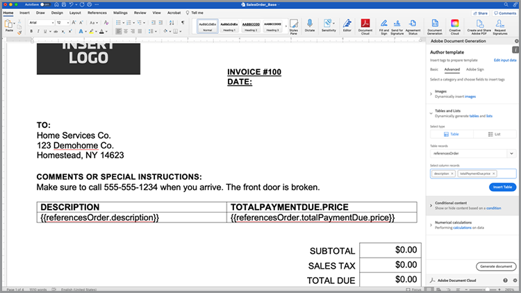

# Agiliza tu proceso de ventas


Desde informes técnicos hasta contratos y acuerdos, se necesitan numerosos documentos durante el proceso de compra. En este tutorial, aprende cómo [[!DNL Adobe Acrobat Services]](https://developer.adobe.com/document-services/) Puedes integrar experiencias con documentos a lo largo de este recorrido para ayudar a acelerar las ventas.

## Generar acuerdos y pedidos de ventas a partir de datos

Los acuerdos de venta, los contratos y otros documentos pueden variar mucho según criterios específicos. Por ejemplo, un acuerdo de venta solo puede incluir determinados términos basados en criterios únicos, como estar en un país o estado específico, o incluir determinados productos como parte del acuerdo. La creación manual de estos documentos o el mantenimiento de muchas variaciones de plantillas diferentes pueden aumentar considerablemente los costes legales asociados a la revisión manual de los cambios.

[API de generación de documentos de Adobe](https://developer.adobe.com/document-services/apis/doc-generation/) le permite tomar datos de su CRM u otro sistema de datos para generar dinámicamente documentos de ventas basados en esos datos.

## Obtener credenciales

Empiece registrándose para obtener las credenciales gratuitas de los servicios de Adobe PDF:

1. Navegar [aquí](https://documentcloud.adobe.com/dc-integration-creation-app-cdn/main.html) para registrar sus credenciales.
1. Inicie sesión con su Adobe ID.
1. Defina el nombre de la credencial (p. ej., Demostración de acuerdos de venta).

   

1. Elija un idioma para descargar el código de ejemplo (por ejemplo, Node.js).
1. Marque para aceptar **[!UICONTROL términos para desarrolladores]**.
1. Seleccionar **[!UICONTROL Crear credenciales]**.
Se descarga un archivo en el equipo con un archivo ZIP que contiene los archivos de ejemplo pdfservices-api-credentials.json y private.key para la autenticación.

   

1. Seleccionar **[!UICONTROL Obtener complemento de Microsoft Word]** o vaya a [AppSource](https://appsource.microsoft.com/en-cy/product/office/WA200002654) para instalar.

   >[!NOTE]
   >
   >La instalación del complemento de Word requiere que tenga permiso para instalar complementos en Microsoft 365. Si no tiene permiso, póngase en contacto con el administrador de Microsoft 365.

## Tus datos

Si extrae datos de un sistema de datos específico, debe generarlos como datos JSON o generar su propio esquema. Este escenario utiliza el siguiente conjunto de datos de ejemplo creado previamente:

```
{
    "salesOrder": {
        "comment": "Make sure to call 555-555-1234 when you arrive. The front door is broken."
    },
    "company": {
        "name":"Home Services Co.",
        "address": {
            "city": "Homestead",
            "state": "NY",
            "zip": "14623",
            "streetAddress": "123 Demohome Street"
        }
    },
    "customer": {
        "address": {
            "city": "Seattle",
            "state": "WA",
            "zip": "98052",
            "streetAddress": "20341 Whitworth Institute 405 N. Whitworth"
        },
        "email": "mailto:jane-doe@xyz.edu",
        "jobTitle": "Professor",
        "name": "Jane Doe",
        "telephone": "(425) 123-4567",
        "url": "http://www.janedoe.com"
    },
    "tax": {
        "state":"WA",
        "rate": 0.08
    },
    "referencesOrder": [
        {
            "description": "Carpet Cleaning Service - 3BR 2BA",
            "totalPaymentDue": {
                "price": 359.54
            },
            "orderedItem": {
                "description": "Carpet Cleaning Service"
            }
        },
        {
            "description": "Home Cleaning Service - 3BR 2BA",
            "totalPaymentDue": {
                "price": 299.99
            },
            "orderedItem": {
                "description": "House Cleaning Service"
            }
        }
    ]
}
```

## Añadir etiquetas básicas al documento

Este escenario utiliza un documento de pedido de venta, que se puede descargar [aquí](https://github.com/benvanderberg/adobe-document-generation-samples/blob/main/SalesOrder/Exercise/SalesOrder_Base.docx?raw=true).


1. Abra el *SalesOrder.docx* documento de muestra en Microsoft Word.
1. Si el plugin de generación de documentos está instalado, seleccione **[!UICONTROL Generación de documentos]** en la cinta de opciones. Si no ve Generación de documentos en la cinta, siga estas instrucciones.
1. Seleccionar **[!UICONTROL Introducción]**.
1. Copie los datos de ejemplo JSON escritos anteriormente en el *Datos JSON* campo.

   

A continuación, vaya al panel Etiquetador de generación de documentos para colocar etiquetas en el documento.

1. Seleccione el texto que desea reemplazar (p. ej., *NOMBRE DE EMPRESA*).
1. En la *Etiquetador de generación de documentos* , busque &quot;name&quot;.
1. En la lista de etiquetas, seleccione nombre en empresa.
1. Seleccionar **[!UICONTROL Insertar texto]**.

   

   Este proceso coloca una etiqueta denominada {{company.name}} porque la etiqueta está debajo de la ruta en el JSON.

   ```
   {
   …
   "company": {
       "name":"Home Services Co.",
       …
   },
   …
   }
   ```

Repita estas acciones para algunas de las etiquetas adicionales del documento, como DIRECCIÓN, CIUDAD, ESTADO, ZIP, etc.

## Vista previa del documento generado

Directamente en Microsoft Word, puede obtener una vista previa del documento generado en función de los datos JSON de ejemplo.

1. En la *Etiquetador de generación de documentos* panel, seleccionar **[!UICONTROL Generar documento]**. La primera vez que se le solicite iniciar sesión con su Adobe ID. Seleccionar **[!UICONTROL Iniciar sesión]** y complete las indicaciones para iniciar sesión con sus credenciales.

   

1. Seleccionar **[!UICONTROL Ver documento]**.

   

1. Se abrirá una ventana del navegador que le permitirá previsualizar los resultados del documento.

   

Puede ver las etiquetas del documento que se reemplazaron por los datos de los datos de ejemplo originales.


## Agregar una tabla a una plantilla

En el siguiente escenario, agregue una lista de productos a una tabla del documento.

1. Inserte el cursor donde debe colocarse la tabla.
1. En la *Etiquetador de generación de documentos* panel, seleccionar **[!UICONTROL Avanzado]**.
1. Expandir **[!UICONTROL Tablas y listas]**.
1. En la *Registros de tabla* , seleccione *referencesOrder*, que es una matriz que enumera todos los elementos de producto.
1. En el campo Seleccionar registros de columna, escriba para incluir *descripción* y *totalPaymentDue.price* campo.
1. Seleccionar **[!UICONTROL Insertar tabla]**.

   

Edite la tabla para realizar ajustes de estilos, tamaños y otros parámetros como lo haría con cualquier otra tabla de Microsoft Word.

## Añadir cálculo numérico

Los cálculos numéricos permiten calcular sumas y otros cálculos basados en una colección de datos, como una matriz. En este escenario, agregue un campo para calcular el subtotal.

1. Seleccione la *$0,00* junto al título del subtotal.
1. En la *[!UICONTROL Etiquetador de generación de documentos]* panel, expandir **[!UICONTROL Cálculos numéricos]**.
1. Bajo *[!UICONTROL Seleccionar tipo de cálculo]*, elija **[!UICONTROL Agregación]**.
1. Bajo *[!UICONTROL Seleccionar tipo]*, elija **[!UICONTROL Suma]**.
1. Bajo *[!UICONTROL Seleccionar registros]*, elija **[!UICONTROL ReferencesOrder]**.
1. En *[!UICONTROL Seleccionar elemento para realizar la agregación]**, elija **[!UICONTROL totalPaymentsDue.price]**.
1. Seleccionar **[!UICONTROL Insertar cálculo]**.

Este proceso inserta una etiqueta de cálculo que proporciona la suma de valores. Se pueden realizar cálculos más avanzados utilizando cálculos JSONata. Por ejemplo:

* Subtotal: `${{expr($sum(referencesOrder.totalPaymentDue.price))}}`
Calcula la suma de las referenciasOrder.totalPaymentDue.price.

* Impuesto de ventas: `${{expr($sum(referencesOrder.totalPaymentDue.price)*0.08)}}`
Calcula el precio y multiplica por 8% para calcular el impuesto.

* Vencimiento total: `${{expr($sum(referencesOrder.totalPaymentDue.price)*1.08)}}`
Calcula el precio y múltiplos de 1,08 para calcular el subtotal + impuestos.

## Añadir condiciones

Las secciones condicionales permiten incluir solo una oración o un párrafo cuando se cumple una determinada condición. En este escenario, solo se incluye una sección si coincide con un determinado estado.

1. En el documento, busque la sección denominada *DECLARACIONES DE PRIVACIDAD DE CALIFORNIA*.
1. Seleccione la sección con el cursor.

   

1. En la *[!UICONTROL Etiquetador de generación de documentos]*, seleccione **[!UICONTROL Avanzado]**.
1. Expandir **[!UICONTROL Contenido condicional]**.
1. En la *[!UICONTROL Seleccionar registros]* campo, buscar y seleccionar **[!UICONTROL customer.address.state]**.
1. En la *[!UICONTROL Seleccionar operador]* , seleccione **=**.
1. En la *[!UICONTROL Campo Valor]*, tipo *CA*.
1. Seleccionar **[!UICONTROL Insertar condición]**.

La sección California solo aparece en el documento generado si customer.address.state = CA.

A continuación, seleccione la sección de DECLARACIONES DE PRIVACIDAD DE WASHINGTON y repita los pasos anteriores, reemplazando el valor CA por WA.

## Añadir una imagen dinámica

La API de generación de documentos permite insertar imágenes dinámicamente a partir de datos. Esto resulta útil cuando tiene diferentes submarcas y desea cambiar logotipos, imágenes de retratos o imágenes para que sean más relevantes para un sector determinado.

Las imágenes se pueden pasar por una dirección URL en los datos o contenido base64. En este ejemplo se utiliza una dirección URL.

1. Coloque el cursor donde desee incluir una imagen.
1. En la *[!UICONTROL Etiquetador de generación de documentos]* panel, seleccionar **[!UICONTROL Avanzado]**.
1. Expandir **[!UICONTROL Imágenes]**.
1. En la *[!UICONTROL Seleccionar etiquetas]* , elija **[!UICONTROL logotipo]**.
1. En la *[!UICONTROL Texto alternativo opcional]* , proporcione una descripción (es decir, un logotipo). Este proceso inserta un marcador de posición de imagen que tiene el siguiente aspecto:

   

Sin embargo, desea definir la imagen dinámicamente en una imagen que ya está en el diseño, lo que puede hacer de la siguiente manera:

1. Haga clic con el botón derecho en la imagen del marcador de posición insertada.

   

1. Seleccionar **[!UICONTROL Editar texto alternativo]**.
1. En el panel, copie el texto que tenga este aspecto:
   `{ "location-path": "logo", "image-props": { "alt-text": "Logo" }}`
1. Selecciona otra imagen del documento que quieras que sea dinámica.

   

1. Haga clic con el botón derecho en la imagen y seleccione **[!UICONTROL Editar texto alternativo]**.
1. Pegue el valor en el panel.

Este proceso reemplaza la imagen por una imagen que se encuentra en la variable de logotipo de los datos.

## Añadir etiquetas para Acrobat Sign

Adobe Acrobat Sign le permite capturar firmas electrónicas en sus documentos. Acrobat Sign proporciona una forma sencilla de arrastrar y soltar campos en la interfaz web, pero también puede controlar la colocación de los campos de firma y otros campos mediante una etiqueta de texto. Con el etiquetador de generación de documentos de Adobe, puede colocar fácilmente estos campos de etiquetas de texto.

1. Desplácese hasta donde se requiera una firma en el documento de muestra.
1. Inserte el cursor donde se necesite la firma.
1. En la *[!UICONTROL Etiquetador de generación de documentos de Adobe]* panel, seleccionar **[!UICONTROL Adobe Sign]**.
1. En la *[!UICONTROL Especificar el número de destinatarios]* , defina el número de destinatarios (en este ejemplo es uno).
1. En la *[!UICONTROL Destinatarios]* , seleccione **[!UICONTROL Signer-1]**.
1. En la *[!UICONTROL Campo]* escriba, seleccione **[!UICONTROL Firma]**.
1. Seleccionar **[!UICONTROL Insertar etiqueta de texto de Adobe Sign]**.

Se inserta una etiqueta en el documento.


Acrobat Sign proporciona otros tipos de campos que puede colocar, como los campos de fecha.
1. En la *Campo* escriba, seleccione **[!UICONTROL Fecha]**.
1. Mueva el cursor por encima de la ubicación Fecha en el documento.
1. Seleccionar **[!UICONTROL Insertar etiqueta de texto de Adobe Sign]**.


## Generar el acuerdo

Ya ha etiquetado el documento y ya está listo. En la siguiente sección se explica cómo generar un documento utilizando los ejemplos de la API de generación de documentos para Node.js, aunque estos funcionarán en cualquier idioma.

Abra el archivo pdfservices-node-sdk-samples-master que se descargó al registrar sus credenciales. Los archivos pdfservices-api-credentials.json y private.key deben incluirse en estos archivos.

1. Abra un Terminal para instalar dependencias mediante npm install.
1. Copie el archivo data.json de ejemplo en la carpeta de recursos.
1. Copie la plantilla de Word en la carpeta de recursos.
1. Cree un nuevo archivo en el directorio raíz de la carpeta samples denominada generate-salesOrder.js.

```
const PDFServicesSdk = require('@adobe/pdfservices-node-sdk');
const fs = require('fs');
const path = require('path');

var dataFileName = path.join('resources', '<INSERT JSON FILE');
var outputFileName = path.join('output', 'salesOrder_'+Date.now()+".pdf");
var inputFileName = path.join('resources', '<INSERT DOCX>');

//Loads credentials from the file that you created.
const credentials =  PDFServicesSdk.Credentials
    .serviceAccountCredentialsBuilder()
    .fromFile("pdfservices-api-credentials.json")
    .build();

// Setup input data for the document merge process
const jsonString = fs.readFileSync(dataFileName),
jsonDataForMerge = JSON.parse(jsonString);

// Create an ExecutionContext using credentials
const executionContext = PDFServicesSdk.ExecutionContext.create(credentials);

// Create a new DocumentMerge options instance
const documentMerge = PDFServicesSdk.DocumentMerge,
documentMergeOptions = documentMerge.options,
options = new documentMergeOptions.DocumentMergeOptions(jsonDataForMerge, documentMergeOptions.OutputFormat.PDF);

// Create a new operation instance using the options instance
const documentMergeOperation = documentMerge.Operation.createNew(options)

// Set operation input document template from a source file.
const input = PDFServicesSdk.FileRef.createFromLocalFile(inputFileName);
documentMergeOperation.setInput(input);

// Execute the operation and Save the result to the specified location.
documentMergeOperation.execute(executionContext)
.then(result => result.saveAsFile(outputFileName))
.catch(err => {
    if(err instanceof PDFServicesSdk.Error.ServiceApiError
        || err instanceof PDFServicesSdk.Error.ServiceUsageError) {
        console.log('Exception encountered while executing operation', err);
    } else {
        console.log('Exception encountered while executing operation', err);
    }
});
```

1. Reemplazar `<INSERT JSON FILE>` con el nombre del archivo JSON en /resources.
1. Reemplazar `<INSERT DOCX>` con el nombre del archivo DOCX.
1. Para ejecutar, utilice Terminal para ejecutar el nodo generate-salesOrder.js.

El archivo de salida debe estar en la carpeta /output con el documento generado correctamente.

## Más opciones

Una vez generado el documento, puede realizar acciones adicionales como:

* Proteger documento con una contraseña
* Comprimir el PDF si hay imágenes grandes
* Capturar firmas electrónicas en el documento

Para obtener más información sobre otras acciones disponibles, consulte los scripts de la carpeta /src en los archivos de ejemplo. También puede obtener más información revisando la documentación de las diferentes acciones.

## Casos de uso adicionales

[!DNL Adobe Acrobat Services] puede ayudar a optimizar muchas partes de un ciclo de ventas con flujos de trabajo de documentos digitales:

* Utiliza la API Adobe PDF Embed para insertar informes técnicos y otro contenido en sitios web, al tiempo que mide y recopila análisis del público
* Usar Acrobat Sign para capturar firmas electrónicas en los acuerdos generados
* Extraer datos del acuerdo de los documentos del PDF mediante la API Adobe PDF Extract

## Formación continua

¿Te interesa saber más? Echa un vistazo a algunas formas adicionales de usar [!DNL Adobe Acrobat Services]:

* Más información sobre [documentación](https://developer.adobe.com/document-services/docs/overview/)
* Ver más tutoriales sobre Adobe Experience League
* Utilice las secuencias de comandos de ejemplo de la carpeta /src para ver cómo puede aprovechar PDF
* Seguir [Blog de tecnología de Adobe](https://medium.com/adobetech/tagged/adobe-document-cloud) para conocer los últimos consejos y trucos
* Suscribirse a [Clips de papel (transmisión en directo mensual)](https://www.youtube.com/playlist?list=PLcVEYUqU7VRe4sT-Bf8flvRz1XXUyGmtF) para obtener más información sobre la automatización con [!DNL Adobe Acrobat Services]. ======
* Más información sobre [documentación](https://developer.adobe.com/document-services/docs/overview/)
* Ver más tutoriales sobre Adobe Experience League
* Utilice las secuencias de comandos de ejemplo de la carpeta /src para ver cómo puede aprovechar PDF
* Seguir [Blog de tecnología de Adobe](https://medium.com/adobetech/tagged/adobe-document-cloud) para conocer los últimos consejos y trucos
* Suscribirse a [Clips de papel (transmisión en directo mensual)](https://www.youtube.com/playlist?list=PLcVEYUqU7VRe4sT-Bf8flvRz1XXUyGmtF) para obtener más información sobre la automatización con [!DNL Adobe Acrobat Services]
