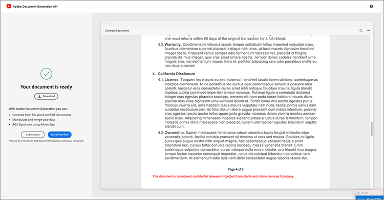
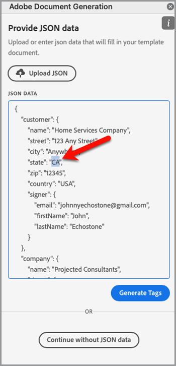
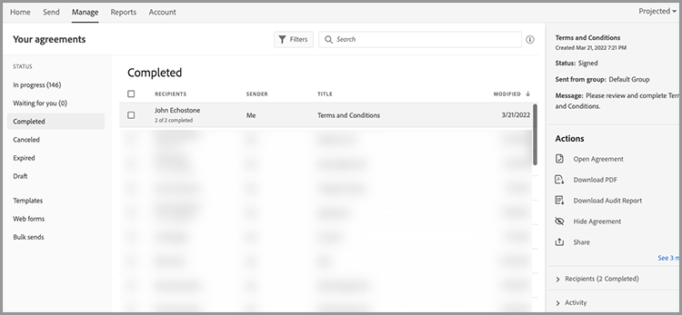

# Automatiza los flujos de trabajo legales


En un escenario ideal, los términos del acuerdo se aceptan sin ninguna modificación. Sin embargo, a menudo los acuerdos requieren una personalización que requiere una revisión legal. Las revisiones legales crean costes significativos y ralentizan el proceso de entrega de las condiciones del acuerdo. El uso de plantillas predefinidas que cambian según el idioma aprobado ayuda a los equipos legales a gestionar y ejecutar de forma más segura los términos del acuerdo.

Este tutorial utiliza un acuerdo legal que varía de un estado a otro. Para abordar estas variaciones, se crea una plantilla de acuerdo con secciones condicionales, que solo se incluyen cuando se cumplen ciertos criterios. El documento generado puede ser un documento de Word o de PDF. También puede conocer algunas de las formas de proteger el documento mediante la API de servicios de Adobe PDF o Acrobat Sign.

## Obtener credenciales

Empiece registrándose para obtener las credenciales gratuitas de los servicios de Adobe PDF:

1. Navegar [aquí](https://documentcloud.adobe.com/dc-integration-creation-app-cdn/main.html) para registrar sus credenciales.
1. Inicie sesión con su Adobe ID.
1. Defina el nombre de la credencial.

   

1. Elija un idioma para descargar el código de ejemplo (por ejemplo, Node.js).
1. Marque para aceptar **[!UICONTROL términos de desarrollador]**.
1. Seleccionar **[!UICONTROL Crear credenciales]**.
Se descarga un archivo en el equipo con un archivo ZIP que contiene los archivos de ejemplo pdfservices-api-credentials.json y private.key para la autenticación.

   

1. Seleccionar **[!UICONTROL Obtener complemento de Microsoft Word]** o vaya a [AppSource](https://appsource.microsoft.com/en-cy/product/office/WA200002654) para instalar.

   >[!NOTE]
   >
   >La instalación del complemento de Word requiere que tenga permiso para instalar complementos en Microsoft 365. Si no tiene permiso, póngase en contacto con el administrador de Microsoft 365.

## Tus datos

En este escenario, se pasa información para ayudar a generar el documento e informar si se deben incluir o no determinadas secciones:

```
{
    "customer": {
        "name": "Home Services Company",
        "street": "123 Any Street",
        "city": "Anywhere",
        "state": "CA",
        "zip": "12345",
        "country":"USA",
        "signer": {
            "email": "johnnyechostone@gmail.com",
            "firstName": "John",
            "lastName": "Echostone"
        }
    },
    "company": {
        "name": "Projected Consultants",
        "signer": {
            "email": "maryburostone@gmail.com",
            "firstName": "Mary",
            "lastName": "Burostone"
        }
    },
    "conditions": {
        "includeGeneralTerms": true,
        "includeConsumerDiscloure": true
    }
}
```

En los datos, hay información sobre el cliente, su nombre, quién firma, el estado en el que se encuentra, etc. Además, hay secciones para obtener información sobre la empresa que genera el acuerdo y los indicadores de condición que se utilizan para incluir determinadas secciones del acuerdo.

## Añadir etiquetas básicas al documento

En este escenario se utiliza un documento de términos y condiciones, que se puede descargar [aquí](https://github.com/benvanderberg/adobe-document-generation-samples/blob/main/Agreement/exercise/TermsAndConditions_Sample.docx?raw=true).


1. Abra el *TermsAndConditions.docx* documento de muestra en Microsoft Word.
1. Si el [Generación de documentos](https://appsource.microsoft.com/en-cy/product/office/WA200002654) el plugin está instalado, seleccione **[!UICONTROL Generación de documentos]** en la cinta de opciones. Si no ve Generación de documentos en la cinta, siga estas instrucciones.
1. Seleccionar **[!UICONTROL Introducción]**.
1. Copie los datos de ejemplo JSON escritos anteriormente en el campo Datos JSON.

   

Vaya a la *Etiquetador de generación de documentos* para colocar etiquetas en el documento.

## Insertar el nombre de la empresa

1. Seleccione el texto que desea reemplazar. En este caso, va a reemplazar la opción EMPRESA en la sección de apertura del documento.
1. En *Etiquetador de generación de documentos*, busque &quot;name&quot;.
1. En empresa, elija *name*.

   

1. Seleccionar **[!UICONTROL Insertar texto]**.

Esto coloca una etiqueta denominada `{{company.name}}` porque la etiqueta está debajo de esa ruta en el JSON.

```
{
    "company": {
        "name": "Projected Consultants",
        ...
    }
    ...
}
```

A continuación, repita este paso en la sección de apertura del texto CUSTOMER. Repetir **pasos 1-4**, sustituyendo CLIENTE por &quot;nombre&quot; en cliente. El resultado debe ser `{{customer.name}}`, lo que refleja que el texto procede de debajo del objeto de cliente.

La API de generación de documentos de Adobe también permite incluir etiquetas en los encabezados y pies de página, así como en el extremo en el que se deben incluir los títulos de las firmas.

Repita este proceso de nuevo con **pasos 1-4** para el texto EMPRESA y CLIENTE en el pie de página.


Por último, tienes que **repita los pasos 1-4** para reemplazar NOMBRE y APELLIDO en la sección Cliente de la página de firma por las etiquetas de `{{customer.signer.firstName}}` y `{{customer.signer.lastName}}` respectivamente. No se preocupe si la etiqueta es larga y se reajusta a la línea siguiente porque la etiqueta se reemplaza cuando se genera el documento.

El principio del documento y el pie de página deben tener un aspecto similar al siguiente:

* Sección inicial:


* Pie:


* Página de firma:


Ahora que las etiquetas se han colocado en el documento, ya puede obtener una vista previa del acuerdo generado.

## Vista previa del documento generado

Directamente en Microsoft Word, puede obtener una vista previa del documento generado en función de los datos JSON de ejemplo.

1. En *Etiquetador de generación de documentos*, seleccione **[!UICONTROL Generar documento]**.
1. La primera vez que se le solicite iniciar sesión con su Adobe ID. Seleccionar **[!UICONTROL Iniciar sesión]** y complete las indicaciones para iniciar sesión con sus credenciales.

   

1. Seleccionar **[!UICONTROL Ver documento]**.

   

1. Se abrirá una ventana del navegador, que le permitirá obtener una vista previa de los resultados del documento.

   

## Agregar términos condicionales para cada estado

En la siguiente sección, se establecen sólo determinadas secciones que se incluirán en función de determinados criterios de datos de entrada. En el documento de muestra, las secciones 4 y 5 solo se refieren a un estado específico. En este escenario, solo se deben incluir las condiciones específicas del estado cuando un cliente reside en ese estado. Además, la numeración de Microsoft Word no debería incluir esa sección si se elimina. Utilice la función Contenido condicional de la API de generación de documentos para etiquetarlo.


1. En el documento, seleccione la sección Divulgación de California y todas las subviñetas.

   

1. En *[!UICONTROL Etiquetador de generación de documentos]*, seleccione **[!UICONTROL Avanzado]**.
1. Expandir **[!UICONTROL Contenido condicional]**.
1. En *[!UICONTROL Seleccionar registros]* campo, buscar y seleccionar **[!UICONTROL customer.state]**.
1. En *[!UICONTROL Seleccionar operador]* , seleccione **=**.
1. En *[!UICONTROL Valor]* campo, tipo *CA*.
1. Seleccionar **[!UICONTROL Insertar condición]**.

Ahora, la sección se envuelve con algunas etiquetas denominadas etiquetas de sección condicional. Al añadir las etiquetas, es posible que haya añadido la etiqueta de sección condicional como una línea numerada. Puede eliminarla colocando un espaciado hacia atrás delante de la etiqueta; de lo contrario, numerará los elementos como si la etiqueta no estuviera allí cuando se genere el documento. La sección que es condicional termina con la `` etiqueta.


**Repita los pasos 1-7** para el *Divulgación de Washington* , reemplazar la sección *CA* valorar con *WA* para representar que la sección solo se muestra si el estado del cliente es Washington.


## Pruebas con secciones condicionales

Una vez establecidas las secciones condicionales, puede obtener una vista previa del documento seleccionando **Generar documento**.

Al generar el documento, observe que la sección que se incluye es únicamente la que cumple los criterios de datos. En el ejemplo siguiente, dado que el estado era igual a CA, solo se incluye la sección California.



Otro cambio notable es que la numeración de la sección posterior, Uso de los Servicios y el Software, tiene el número 5. Esto significa que cuando se omite la sección de Washington, la numeración continúa.


Para comprobar si la plantilla se comporta correctamente cuando el cliente se encuentra en el estado de Washington en lugar de en California, cambie los datos de ejemplo de la plantilla:

1. En *Etiquetador de generación de documentos*, seleccione **[!UICONTROL Editar datos de entrada]**.

   

1. Seleccionar **[!UICONTROL Editar]**.

1. En los datos JSON, cambie *CA* para *WA*.

   

1. Seleccionar **[!UICONTROL Generar etiquetas]**.
1. Seleccionar **[!UICONTROL Generar documento]** para volver a generar el documento.

Observe que el documento solo incluye la sección del estado de Washington.


## Adición de una oración condicional

Al igual que las secciones condicionales, también puede tener frases específicas que se incluyen cuando se cumplen ciertas condiciones. Para este ejemplo, la política de devoluciones es diferente entre California y Washington.

1. En la sección 3.1, seleccione la primera frase &quot;Cuando compre en el estado de Washington, uno debe ser devuelto por CORREO dentro de los 30 días de la transacción original para un reembolso completo.&quot;
1. En *[!UICONTROL Etiquetador de generación de documentos]*, seleccione **[!UICONTROL Avanzado]**.
1. Expandir **[!UICONTROL Contenido condicional]**.
1. Debajo *[!UICONTROL Tipo de contenido]*, seleccione **[!UICONTROL Frase]**.
1. En *[!UICONTROL Seleccionar registros]* campo, buscar y seleccionar **[!UICONTROL customer.state]**.
1. En *[!UICONTROL Seleccionar operador]* , seleccione **=**.
1. En *[!UICONTROL Valor]* campo, tipo *CA*.
1. Seleccionar **[!UICONTROL Insertar condición]**.

Aunque el nombre de la etiqueta es el mismo, la principal diferencia entre Phrase y Section es que una frase tiene la sección que no incluye nuevas líneas. Las etiquetas condition-section y -end-section deben estar en el mismo párrafo.


## Añadir etiquetas para Acrobat Sign

Acrobat Sign le permite enviar acuerdos para su firma o incrustarlos en la experiencia web para que alguien los vea y firme fácilmente. El etiquetador de generación de documentos de Adobe en Microsoft Word le permite preetiquetar fácilmente los documentos antes de que se envíen con Acrobat Sign, de modo que las firmas siempre se colocan en la ubicación correcta. En este escenario, hay dos firmantes que necesitan un lugar para firmar y fechar el documento.

1. Vaya a la ubicación donde debe firmar el cliente.
1. Sitúe el cursor donde debe ir la firma.

   

1. En *[!UICONTROL Etiquetador de generación de documentos]*, seleccione **[!UICONTROL Adobe Sign]**.
1. En *[!UICONTROL Especificar el número de destinatarios]* , establezca el número de destinatarios (en este ejemplo se utiliza 2).
1. En *[!UICONTROL Destinatarios]* , seleccione **[!UICONTROL Signer-1]**.
1. En *[!UICONTROL Campo]* escriba, seleccione **[!UICONTROL Firma]**.
1. Seleccionar **[!UICONTROL Insertar etiqueta de texto de Adobe Sign]**.

   

>[!NOTE]
>
>Si el **Insertar etiqueta de texto de Adobe Sign** parece que falta el botón, desplácese hacia abajo.

Esto coloca un campo de firma donde el primer firmante debe firmar.


A continuación, coloque un campo de datos para el firmante que se rellena automáticamente al firmar.

1. Mueva el cursor donde se debe colocar la fecha.

   

1. Establezca Tipo de campo en Fecha.
1. Seleccionar **[!UICONTROL Insertar etiqueta de texto de Adobe Sign]**.

La etiqueta de fecha que se coloca es bastante larga: `{{Date 3_es_:signer1:date:format(mm/dd/yyyy):font(size=Auto)}}`. La etiqueta de texto de Acrobat Sign debe permanecer en la misma línea, que es diferente de las etiquetas de generación de documentos. La `:format()` y `font()` los parámetros son opcionales, por lo que en este escenario podemos acortar la etiqueta a `{{Date 3_es_:signer1:date}}`.

Repita los pasos anteriores al *Firma de la empresa* sección. Al hacerlo, debe cambiar el campo Destinatarios a **Signer-2**, de lo contrario, todos los campos de firma se asignan a la misma persona.

## Generar el acuerdo

Ya ha etiquetado el documento y ya está listo. En la siguiente sección, aprenda a generar un documento utilizando los ejemplos de la API de generación de documentos para Node.js. Estos ejemplos funcionan en cualquier idioma.

Abra el archivo pdfservices-node-sdk-samples-master que descargó al registrar sus credenciales. Estos archivos incluyen los archivos pdfservices-api-credentials.json y private.key.

1. Abra el **[!UICONTROL Terminal]** para instalar dependencias mediante `npm install`.
1. Copiar la muestra *data.json* en el *resources* carpeta.
1. Copie la plantilla de Word que ha creado en el *resources* carpeta.
1. Cree un nuevo archivo en el directorio raíz de la carpeta samples denominada *generate-salesOrder.js*.

   ```
   const PDFServicesSdk = require('@adobe/pdfservices-node-sdk').
   const fs = require('fs');
   const path = require('path');
   
   var dataFileName = path.join('resources', '<INSERT JSON FILE');
   var outputFileName = path.join('output', 'salesOrder_'+Date.now()+".pdf");
   var inputFileName = path.join('resources', '<INSERT DOCX>');
   
   //Loads credentials from the file that you created.
   const credentials =  PDFServicesSdk.Credentials
      .serviceAccountCredentialsBuilder()
      .fromFile("pdfservices-api-credentials.json")
      .build();
   
   // Setup input data for the document merge process
   const jsonString = fs.readFileSync(dataFileName),
   jsonDataForMerge = JSON.parse(jsonString);
   
   // Create an ExecutionContext using credentials
   const executionContext = PDFServicesSdk.ExecutionContext.create(credentials);
   
   // Create a new DocumentMerge options instance
   const documentMerge = PDFServicesSdk.DocumentMerge,
   documentMergeOptions = documentMerge.options,
   options = new documentMergeOptions.DocumentMergeOptions(jsonDataForMerge, documentMergeOptions.OutputFormat.PDF);
   
   // Create a new operation instance using the options instance
   const documentMergeOperation = documentMerge.Operation.createNew(options)
   
   // Set operation input document template from a source file.
   const input = PDFServicesSdk.FileRef.createFromLocalFile(inputFileName);
   documentMergeOperation.setInput(input);
   
   // Execute the operation and Save the result to the specified location.
   documentMergeOperation.execute(executionContext)
   .then(result => result.saveAsFile(outputFileName))
   .catch(err => {
      if(err instanceof PDFServicesSdk.Error.ServiceApiError
         || err instanceof PDFServicesSdk.Error.ServiceUsageError) {
         console.log('Exception encountered while executing operation', err);
      } else {
         console.log('Exception encountered while executing operation', err);
      }
   });
   ```

1. Reemplazar `<JSON FILE>` con el nombre del archivo JSON en /resources.
1. Reemplazar `<INSERT DOCX>` con el nombre del archivo DOCX.
1. Para ejecutar, utilice **[!UICONTROL Terminal]** para ejecutar el nodo `generate-salesOrder.js`.

El archivo de salida se encuentra en la carpeta /output y el documento se ha generado correctamente.

Puede cambiar el formato cambiando la línea de abajo. El formato DOCX es útil si este documento se va a enviar para que alguien lo edite en Word o para que revise el contrato.

PDF:

```
options = new documentMergeOptions.DocumentMergeOptions(jsonDataForMerge,
documentMergeOptions.OutputFormat.PDF);
```

Word:

```
options = new documentMergeOptions.DocumentMergeOptions(jsonDataForMerge, documentMergeOptions.OutputFormat.DOCX);
```

También debe cambiar el nombre del archivo de salida a .pdf o .docx para el formato de salida PDF o DOCX, respectivamente:

```
var outputFileName = path.join('output', 'salesOrder_'+Date.now()+".docx");
```

## Enviar acuerdo para firmar

[Adobe Acrobat Sign](https://www.adobe.com/es/sign.html_es) permite enviar acuerdos a uno o varios destinatarios para que estos puedan ver y firmar documentos. Junto con una experiencia de usuario fácil de usar para enviar un documento para firmar, hay disponibles API REST que le permiten usar Word, PDF, HTML y otros formatos y enviarlos para firmar.

En el ejemplo siguiente se explica cómo utilizar la página de documentación de la API REST para realizar el documento generado anteriormente y enviarlo para su firma. En primer lugar, aprende cómo puedes hacerlo a través de la interfaz web de Acrobat Sign y, a continuación, cómo hacerlo con la API REST.

## Obtener una cuenta de Acrobat Sign

Si no tiene una cuenta de Acrobat Sign, regístrese para obtener una cuenta de desarrollador y consulte la documentación [aquí](https://developer.adobe.com/adobesign-api/)y seleccione **Registro de cuenta de desarrollador**. Se le pedirá que rellene un formulario y reciba un correo electrónico de verificación. Una vez hecho esto, se le dirigirá a un sitio web para que establezca su contraseña y su cuenta, donde podrá iniciar sesión en Acrobat Sign.

## Enviar un acuerdo desde la interfaz web

1. Seleccionar **[!UICONTROL Enviar]** desde la barra de navegación.

   

1. En *Destinatarios* , especifique dos direcciones de correo electrónico. Se recomienda utilizar una dirección de correo electrónico que no esté asociada a su cuenta de Acrobat Sign.

   

1. Establecer un **[!UICONTROL Nombre del acuerdo]** y **[!UICONTROL Mensaje]**.
1. Seleccionar **[!UICONTROL Agregar archivos]** y cargue el archivo generado desde su equipo.
1. Seleccione **[!UICONTROL Campos Vista previa y Agregar firma]**.
1. Seleccione **[!UICONTROL Siguiente]**.
1. Al desplazarse hacia abajo hasta la página de firma, puede ver los campos de firma colocados en función de las etiquetas.

   

1. Seleccione **[!UICONTROL Enviar]**.
1. En su correo electrónico, aparece un mensaje con un vínculo para ver y firmar.

   

1. Seleccionar **[!UICONTROL Revisar y firmar]**.
1. Seleccionar **[!UICONTROL Continuar]** para aceptar las condiciones de uso.
1. Seleccionar **[!UICONTROL Inicio]** para ir adonde tienes que firmar.

   

1. Seleccionar **[!UICONTROL Haga clic aquí para firmar]**.

   

1. Escriba su firma.

   

1. Seleccionar **[!UICONTROL Aplicar]**.
1. Seleccionar **[!UICONTROL Clic para firmar]**.

Se enviará un correo electrónico al siguiente firmante. Repita los pasos del 9 al 16 para ver y firmar para el segundo firmante.

Una vez completado el acuerdo, se envía una copia firmada del mismo por correo electrónico a cada una de las partes. Además, se puede recuperar un acuerdo firmado desde la interfaz web de Acrobat Sign en el **Gestionar** página.



A continuación, obtenga información sobre cómo hacer el mismo escenario a través de la documentación de la API REST.

## Obtener credenciales

1. Vaya a [Documentación de Acrobat Sign REST](https://secure.na1.adobesign.com/public/docs/restapi/v6).
1. Expandir *transientDocuments* y el [POST /transientDocuments](https://benprojecteddemo.na1.adobesign.com/public/docs/restapi/v6#!/transientDocuments/createTransientDocument).
1. Seleccionar **[!UICONTROL TOKEN DE ACCESO DE OAUTH]**.

   

1. Compruebe los permisos de OAUTH para *agreement_write*, *agreement_sign*, *widget_write*, y *library_write*.
1. Seleccionar **[!UICONTROL Autorizar]**.
1. Se le pedirá mediante una ventana emergente que inicie sesión con su cuenta de Acrobat Sign. Usuario de inicio de sesión: nombre de usuario y contraseña del administrador.
1. Se le solicitará que permita el acceso a la documentación de REST. Seleccionar **[!UICONTROL Permitir acceso]**.

A continuación, se añade un token de portador al **Autorización** campo.

Para obtener más información sobre cómo crear un token de autorización para Acrobat Sign, puede seguir el paso descrito [aquí](https://opensource.adobe.com/acrobat-sign/developer_guide/helloworld.html).

## Cargar un documento transitorio

Como el token de autorización se añade a partir de los pasos anteriores, debe cargar un documento para realizar la llamada de API:

1. En *Archivo* , cargue el documento de PDF generado en los pasos anteriores.

   

1. Seleccionar **[!UICONTROL ¡Pruébalo!]**.
1. En **[!UICONTROL Cuerpo de respuesta]**, copie el *transientDocumentId* valor.

La *transientDocumentId* se utiliza para hacer referencia a un documento que está almacenado temporalmente en Acrobat Sign, de modo que se pueda hacer referencia a él en llamadas de API posteriores.

## Enviar para firmar

Una vez cargado un documento, debe enviar el acuerdo para su firma.

1. Expanda la sección del acuerdo y las secciones del acuerdo del POST.
1. En la *AgreementInfo* , rellénelo con el siguiente JSON:

   ```
   {
   "fileInfos": [
      {
         "transientDocumentId": "3AAABLblqZhAJeoswpyslef8_toTGT1WgBLk3TlhfJXy_uSLlKyre2hjF0-J1meBDn0PlShk0uQy6JghlqEoqXNnskq7YawteF6QWtHefP9wN2CW_Xbt0O9kq1tkpznG0a5-mEm4bYAV1FGOnD1mt_ooYdzKxm7KzTB11DLX2-81Zbe2Z1suy7oXiWNR3VSb-zMfIb5D4oIxF8BiNfN0q08RwT108FcB1bx4lekkATGld3nRbf8ApVPhB72VNrAIF0F1rAFBWTtfgvBKZaxrYSyZq73R_neMdvZEtxWTk5fii_bLVe7VdNZMcO55sofH61eQC_QIIsoYswZP4rw6dsTa68ZRgKUNs"
      }
   ],
   "name": "Terms and Conditions",
   "participantSetsInfo": [
      {
         "memberInfos": [
         {
            "email": "adobesigndemo+customer@outlook.com"
         }
         ],
         "order": 1,
         "role": "SIGNER"
      },
      {
         "memberInfos": [
            {
               "email": "adobesigndemo+company@outlook.com"
            }
         ],
         "order": 1,
         "role": "SIGNER"
         }
   ],
   "signatureType": "ESIGN",
   "state": "IN_PROCESS"
   }
   ```

1. Seleccionar **[!UICONTROL ¡Pruébalo!]**.

**API de acuerdos de POST** devuelve un identificador para el acuerdo. Para obtener una plantilla para el esquema del modelo JSON, seleccione **Esquema de modelo mínimo**. Hay disponible una lista completa de parámetros en el **Esquema de modelo completo** sección.

## Comprobar el estado del acuerdo

Una vez que tenga un ID de acuerdo, puede enviar el estado de un acuerdo.

1. Expandir **[!UICONTROL GET /acuerdos/{agreementId}]**.
1. Debido a que puede necesitar un ámbito de OAUTH adicional, seleccione **[!UICONTROL OAUTH-ACCESS-TOKEN]** otra vez.
1. Copie el agreementId de la respuesta de llamada de API anterior en el campo agreementId.
1. Seleccionar **[!UICONTROL ¡Pruébalo!]**.

Ahora tiene información sobre ese acuerdo.

```
{
    "id": "CBJCHBCAABAAc6LyP4SVuKXP_pNstzIzyripanRdz4IB",
    "name": "Terms and Conditions",
    "groupId": "CBJCHBCAABAAoyMb1yIgczAGhBuJeHf99mglPtM7ElEu",
    "type": "AGREEMENT",
    "participantSetsInfo": [
      {
        "id": "CBJCHBCAABAAzZE-IcHHkt05-AVbxas4Jz7DUl3oEBO6",
        "memberInfos": [
          {
            "email": "adobesigndemo+customer@outlook.com",
            "id": "CBJCHBCAABAAyWgMMReqbxUFM7ctI5xz16c2kOmEy-IQ",
            "securityOption": {
              "authenticationMethod": "NONE"
            }
          }
        ],
        "role": "SIGNER",
        "order": 1
      },
      {
        "id": "CBJCHBCAABAAaRHz3gY2W0w5n_6pj1GMMuZAfhBihc1j",
        "memberInfos": [
          {
            "email": "adobesigndemo+company@outlook.com",
            "id": "CBJCHBCAABAAOZQwjPwJXFiX8YDKPYtzMpftsmxYrIo9",
            "securityOption": {
              "authenticationMethod": "NONE"
            }
          }
        ],
        "role": "SIGNER",
        "order": 1
      }
    ],
    "senderEmail": "adobesigndemo+new@outlook.com",
    "createdDate": "2022-03-22T02:59:36Z",
    "lastEventDate": "2022-03-22T02:59:41Z",
    "signatureType": "ESIGN",
    "locale": "en_US",
    "status": "OUT_FOR_SIGNATURE",
    "documentVisibilityEnabled": true,
    "hasFormFieldData": false,
    "hasSignerIdentityReport": false,
    "documentRetentionApplied": false
  }
```

El método más eficaz para obtener notificaciones cuando se cambian las actualizaciones es a través de Webhooks, sobre los que puede obtener más información [aquí](https://opensource.adobe.com/acrobat-sign/developer_guide/webhookapis.html.

## Almacenar un documento firmado

Una vez firmado el documento, se puede recuperar mediante el archivo GET /agreements/combinedDocument.

1. Expandir **[!UICONTROL GET /acuerdos/{agreementId}/combinedDocument]**.
1. Conjunto **[!UICONTROL agreementId]** a la *agreementId* proporcionada por la llamada de API anterior.
1. Seleccionar **[!UICONTROL ¡Pruébalo!]**.

Los parámetros adicionales para adjuntar un informe de auditoría o documentos complementarios se pueden definir mediante los parámetros attachSupportingDocuments y attachAuditReport.

En la **Cuerpo de respuesta**, se puede descargar en el equipo y almacenarse donde desee.

## Más opciones

Además de generar un documento y enviarlo para su firma, hay disponibles acciones adicionales.

Por ejemplo, si el documento no tiene una firma, la API de servicios de Adobe PDF ofrece muchas formas de transformar los documentos después de generar el acuerdo, como:

* Proteger documento con una contraseña
* Comprimir el PDF si hay imágenes grandes
* Para obtener más información sobre otras acciones disponibles, consulte las secuencias de comandos de la carpeta /src en los archivos de ejemplo de la API de Adobe PDF Services. También puede obtener más información revisando la documentación de las diferentes acciones que se pueden utilizar.

Además, Acrobat Sign ofrece varias funciones adicionales, como:

* Incrustar la experiencia de firma en una aplicación
* Añadir métodos de verificación de la identidad para los firmantes
* Configurar notificaciones por correo electrónico
* Descargar documentos individuales independientes como parte de un acuerdo

## Formación continua

¿Te interesa saber más? Echa un vistazo a algunas formas adicionales de usar [!DNL Adobe Acrobat Services]:

* Más información sobre [documentación](https://developer.adobe.com/document-services/docs/overview/)
* Ver más tutoriales sobre Adobe Experience League
* Utilice las secuencias de comandos de ejemplo de la carpeta /src para ver cómo puede utilizar PDF
* Seguir [Blog de tecnología de Adobe](https://medium.com/adobetech/tagged/adobe-document-cloud) para conocer los últimos consejos y trucos
* Suscribirse a [Clips de papel (transmisión en directo mensual)](https://www.youtube.com/playlist?list=PLcVEYUqU7VRe4sT-Bf8flvRz1XXUyGmtF) para obtener más información sobre la automatización con [!DNL Adobe Acrobat Services].
