# Publicación de documentos digitales


Los documentos electrónicos están por todas partes; de hecho, probablemente los haya [billones de PDF](https://itextpdf.com/en/blog/technical-notes/do-you-know-how-many-pdf-documents-exist-world) globalmente, y esa cifra aumenta cada día. Al incrustar un visor de PDF en las páginas web, permite a los usuarios ver documentos sin tener que rediseñar el HTML y el CSS, ni obstruir el acceso al sitio web.

Vamos a explorar un escenario popular. Publicaciones de una empresa [whitepapers en su sitio web](https://www.adobe.io/apis/documentcloud/dcsdk/digital-content-publishing.html)
para proporcionar contexto a sus aplicaciones y servicios. El responsable de marketing del sitio web quiere entender mejor cómo los usuarios interactúan con su contenido basado en PDF e incorporarlo a su página web y marca. Han decidido publicar los informes técnicos como [contenido cerrado](https://whatis.techtarget.com/definition/gated-content-ungated-content#:~:text=Gated%20content%20is%20online%20materials,about%20their%20jobs%20and%20organizations.), controlando quién puede descargarlos.

## Lo que puedes aprender

En este tutorial práctico, aprenda a mostrar documentos de PDF incrustados en páginas web con [API Adobe PDF Embed](https://www.adobe.io/apis/documentcloud/dcsdk/pdf-embed.html), que es gratis y fácil de usar. En estos ejemplos se utilizan JavaScript, Node.js, Express.js, HTML y CSS. Puede ver el código completo del proyecto en [GitHub](https://www.google.com/url?q=https://github.com/marcelooliveira/EmbedPDF/tree/main/pdf-app&amp;sa=D&amp;source=editors&amp;ust=1617129543031000&amp;usg=AOvVaw2rzSwYuJ_JI7biVIgbNMw1).

## API y recursos relevantes

* [API de incrustación de PDF](https://www.adobe.com/devnet-docs/dcsdk_io/viewSDK/index.html)

* [API de servicios de PDF](https://opensource.adobe.com/pdftools-sdk-docs/release/latest/index.html)

* [Código del proyecto](https://www.google.com/url?q=https://github.com/marcelooliveira/EmbedPDF/tree/main/pdf-app&amp;sa=D&amp;source=editors&amp;ust=1617129543031000&amp;usg=AOvVaw2rzSwYuJ_JI7biVIgbNMw1)

## Crear una aplicación Web de nodos

Empecemos creando un sitio usando Node.js y Express que usa una plantilla bonita y ofrece varios PDF para descargar.

Primero, [descargar e instalar Node.js](https://nodejs.org/en/download/).

Para crear fácilmente un proyecto Node.js con una estructura de aplicación web mínima, instale la herramienta generador de aplicaciones `` `express-generator` ``.

```
npm install express-generator -g
```

A continuación, cree la nueva aplicación Express denominada pdf-app, eligiéndola como motor de visualización.

```
express pdf-app --view=ejs
```

A continuación, vaya al directorio \\pdf-app e instale todas las dependencias del proyecto.

```
cd pdf-app
npm install
```

A continuación, inicie el servidor web local y ejecute la aplicación.

```
npm start
```

Por último, abra el sitio web en <http://localhost:3000>.

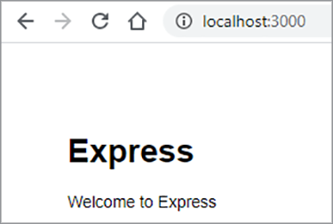

Ahora tiene un sitio web básico.

## Representación de datos del informe técnico

Para publicar artículos técnicos en el sitio web, los datos del informe técnico se definen y preparan en el sitio web para mostrar estos documentos. En primer lugar, cree una nueva carpeta \\data en la raíz del proyecto. La información sobre los documentos técnicos disponibles procede de un nuevo archivo denominado [data.json](https://github.com/marcelooliveira/EmbedPDF/blob/main/pdf-app/data/data.json), que se coloca en la carpeta de datos.

Para dar a la aplicación web un aspecto atractivo y de gran calidad, instale el [Bootstrap](https://getbootstrap.com/) y [Font Awesome](https://fontawesome.com/) bibliotecas front-end.

```
npm install bootstrap
npm install font-awesome
```

Abra el archivo app.js e incluya estos directorios como orígenes de archivos estáticos, colocándolos después de los existentes `` `express.static` `` línea.

```
app.use(express.static(path.join(__dirname, '/node_modules/bootstrap/dist')));
app.use(express.static(path.join(__dirname, '/node_modules/font-awesome')));
```

Para incluir los documentos de PDF, cree una carpeta denominada \\pdfs en la carpeta \\public del proyecto. En lugar de crear los PDF y las miniaturas por sí mismo, puede copiarlos de este [Carpeta del repositorio de GitHub](https://github.com/marcelooliveira/EmbedPDF/tree/main/pdf-app/public) a las carpetas \\pdfs y \\image.

La carpeta \\public\\pdfs contiene ahora los documentos del PDF:

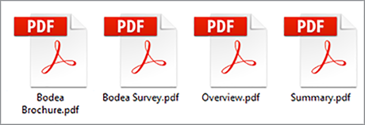

Mientras que la carpeta \\public\\images debe contener las miniaturas de cada uno de los documentos del PDF:

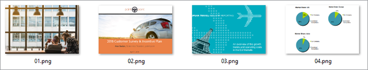

A continuación, abra el archivo \\paths\\index.js, que contiene la lógica para enrutar la página principal. Para utilizar los datos del informe técnico del archivo data.json, debe cargar el módulo Node.js responsable de acceder al sistema de archivos e interactuar con él. A continuación, declare el `fs` en la primera línea del archivo \\paths\\index.js, como se indica a continuación:

```
const fs = require('fs');
```

A continuación, lea y analice el archivo data.json y almacénelo en la variable papers :

```
let rawdata = fs.readFileSync('data/data.json');
let papers = JSON.parse(rawdata);
```

Ahora modifique la línea para invocar el método render de la vista de índice, pasando la colección papers como modelo de la vista de índice.

```
res.render('index', { title: 'Embedding PDF', papers: papers });
```

Para representar la colección de documentos técnicos en la página principal, abra el archivo \\views\\index.ejs y sustituya el código existente por el código del proyecto [fichero índice](https://github.com/marcelooliveira/EmbedPDF/blob/main/pdf-app/views/index.ejs).

Ahora, vuelva a ejecutar npm start y open <http://localhost:3000> para ver la colección de documentos técnicos disponibles.

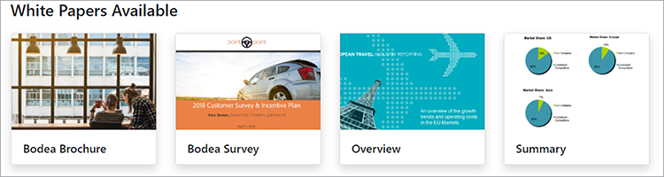

En las siguientes secciones se incluye la mejora del sitio web y el uso de [API de incrustación de PDF](https://www.adobe.io/apis/documentcloud/dcsdk/pdf-embed.html) para mostrar los documentos del PDF en la página web. La API PDF Embed es de uso gratuito; solo tiene que obtener una credencial de API.

## Obtención de una credencial de API de incrustación de PDF

Para obtener una credencial de API incrustada de PDF gratuita, visite la [Introducción](https://www.adobe.io/apis/documentcloud/dcsdk/gettingstarted.html) después de registrarse para una nueva cuenta o iniciar sesión en su cuenta existente.

Haga clic en **Crear nuevas credenciales** y luego **Introducción:**

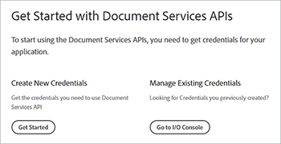

En este punto, se le pedirá que se registre para obtener una cuenta gratuita si no tiene una.

Seleccionar **API de incrustación de PDF**, escriba el nombre de las credenciales y el dominio de aplicación. Utilice la **localhost** debido a la prueba local de la aplicación web.

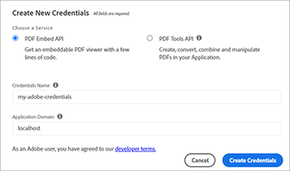

Haga clic en **Crear credenciales** para acceder a sus credenciales de PDF y obtener el ID de cliente (clave de API).

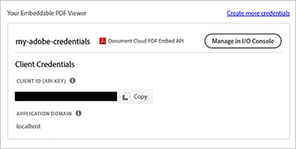

En el proyecto Node.js, cree un archivo denominado .ENV en la carpeta raíz de la aplicación y declare la variable de entorno para el ID de cliente incrustado por el PDF con el valor de la credencial API KEY del paso anterior.

```
PDF_EMBED_CLIENT_ID=**********************************************
```

Después, utilice este ID de cliente para acceder a la API de incrustación de PDF. Instale el paquete dotenv para acceder a esta variable de entorno mediante el código Node.js.

```
npm install dotenv
```

Ahora, abra el archivo app.js y agregue la siguiente línea en la parte superior del archivo para que Node.js pueda cargar el módulo dotenv:

```
require('dotenv').config();
```

## Visualización de PDF en la aplicación web

Ahora utilice la API de incrustación de PDF para mostrar PDF en el sitio. Abrir el directo [Demostración de API de incrustación de PDF](https://documentcloud.adobe.com/view-sdk-demo/index.html#/view/FULL_WINDOW/Bodea%20Brochure.pdf).

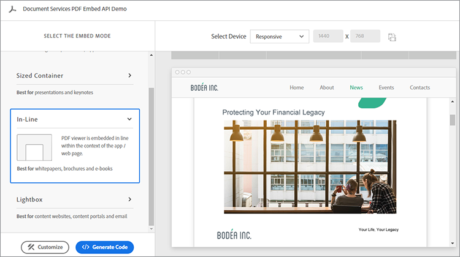

En el panel izquierdo, puede elegir el modo de incrustación que mejor se adapte a las necesidades de su sitio web:

* **Ventana completa**: el PDF cubre todo el espacio de la página web

* **Contenedor de tamaño**: el PDF muestra dentro de la página web, una página cada vez, en una div de tamaño limitado

* **En Línea**: todo el PDF se muestra en una div dentro de la página web

* **Lightbox**: el PDF se muestra como una capa en la parte superior de la página web

Se recomienda utilizar el modo de incrustación en línea para documentos técnicos y el generador de código más adelante para incrustar un PDF en la aplicación.

## Creación de una página en modo de incrustación en línea

Para incrustar un visor de PDF en la página web y mostrar todas las páginas simultáneamente, cree una nueva página utilizando el modo de incrustación en línea.

Cree una nueva vista en el archivo \\views\\in-line.ejs mediante el motor de visualización de EJS.

```
<! html DOCTYPE >
<html>
<head>
<title>
<%= title %>
</title>
<link rel='stylesheet' href='/stylesheets/style.css' />
<link rel='stylesheet' href='/css/bootstrap.min.css'/>
<link rel='stylesheet' href='/css/font-awesome.min.css' />
<style type="text/css">
p {
font-family: 'Gill Sans', 'Gill Sans MT', Calibri, 'Trebuchet MS', sans-serif
}
</style>
</head>
<body class="m-0">
<div>
<main>
<div class="row">
<div class="col-sm-3"></div>
<div class="col-sm-6">
<h3>
<p class="text-center">Grow your business, establish your brand,<br
/>
```

Y pon a tus clientes en primer lugar.

```
</p>
</h3>
<div>
<p class="text-center">Lorem ipsum dolor sit amet, consectetur adipiscing elit, sed do<br />
eiusmod tempor incididunt ut labore et dolore</p>
</div>
</div>
</main>
<footer>
<div class="row">
<div class="col-sm-3"></div>
<div class="col-sm-6">
<p class="text-center">Bodea Inc. Your trusted partner since 2008</p>
</div>
</div>
</footer>
</div>
</div>
</body>
</html>
```

A continuación, modifique \\vistas\\index.ejs para crear un botón que abra la vista en línea.

```
<div class="card-body">
<h5 class="card-title">
<span>
<%= paper.title %>
</span>
</h5>
<p>
<a class="btn btn-sm btn btn-danger" href="/in-line/<%=
paper.id %>">
<span type="button"></span>
<span class="fa fa-file-pdf-o"></span>&nbsp;View Document</button>
</a>
</p>
</div>
```

Abra el archivo app.js y declare un nuevo enrutador después de la declaración indexRouter:

```
var indexRouter = require('./routes/index');
var inLineRouter = require('./routes/in-line');
```

Luego agregue este código después de app.use(&#39;/&#39;, indexRouter); para asociar la vista del modo de incrustación en línea a su enrutador:

```
app.use('/', indexRouter);
app.use('/in-line', inLineRouter);
```

A continuación, cree un nuevo archivo in-line.js en \\route para crear una nueva lógica de enrutador. Incluya Express, un módulo de nodo que habilita un motor de aplicación web.

```
var express = require('express');
const fs = require('fs');
var router = express.Router();
```

A continuación, cree un punto final que gestione las solicitudes de GET de un ID de informe técnico específico y procese la vista in-line.ejs.

```
router.all('/:id', function(req, res, next) {
let rawdata = fs.readFileSync('data/data.json');
let papers = JSON.parse(rawdata);
let paper = papers.filter(p => p.id == parseInt(req.params.id))[0];
res.render('in-line', { title: paper.title, paper: paper });
});
module.exports = router;
```

Mira de nuevo el [demostración en directo](https://documentcloud.adobe.com/view-sdk-demo/index.html#/view/FULL_WINDOW/Bodea%20Brochure.pdf) para generar automáticamente el código de API de incrustación del PDF. Haga clic en **En Línea** en el panel izquierdo:


Haga clic en **Generar código** para ver el código de HTML necesario para mostrar un visor de PDF de contenedor de tamaño.

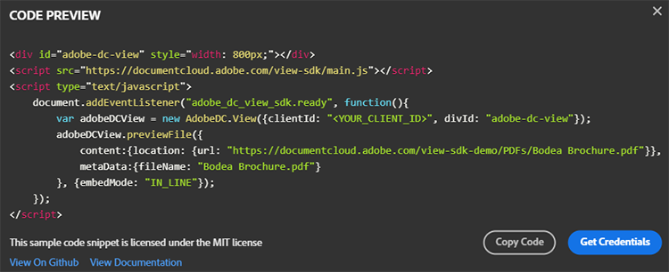

Haga clic en **Copiar código** y pegue el código en el archivo in-line.ejs.

```
<div>
<p class="text-center">Lorem ipsum dolor sit amet, consectetur adipiscing elit, sed do<br />
eiusmod tempor incididunt ut labore et dolore</p>
</div>
<div class="row align-items-center border border-primary">
<div id="adobe-dc-view" style="width: 800px;"></div>
<script src="https://documentcloud.adobe.com/view-sdk/main.js"></script>
<script type="text/javascript">
document.addEventListener("adobe_dc_view_sdk.ready", function(){
var adobeDCView = new AdobeDC.View({clientId: "<YOUR_CLIENT_ID>", divId: "adobe-dc-view"});
adobeDCView.previewFile({
content:{location: {url: "https://documentcloud.adobe.com/view-sdk-demo/PDFs/Bodea Brochure.pdf"}},
metaData:{fileName: "Bodea Brochure.pdf"}
}, {embedMode: "IN_LINE"});
});
</script>
</div>
```

Sin embargo, los parámetros del documento siguen codificados. Vamos a reemplazarlos con la sintaxis de corchetes EJS (\&lt;%= someValue %\>) para representar la página según los datos del modelo del informe técnico.

```
<div id="adobe-dc-view" style="width: 800px;"></div>
<script src="https://documentcloud.adobe.com/view-sdk/main.js"></script>
<script type="text/javascript">
document.addEventListener("adobe_dc_view_sdk.ready", function () {
var adobeDCView = new AdobeDC.View({ clientId: "<%=process.env.PDF_EMBED_CLIENT_ID %>", divId: "adobe-dc-view" });
adobeDCView.previewFile({
content: { location: { url: "<%= paper.pdf %>" } },
metaData: { fileName: "<%= paper.fileName %>" }
}, {
embedMode: "IN_LINE"
});
});
</script>
```

Ahora ejecute la aplicación con el comando npm start y abra el sitio web en <http://localhost:3000>.

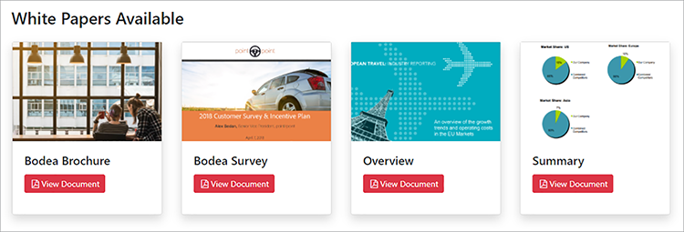

Por último, elige un artículo técnico y haz clic **Ver documento** para abrir una nueva página con el PDF incrustado en línea:


Observe cómo están presentes las opciones Descargar PDF y Imprimir PDF.

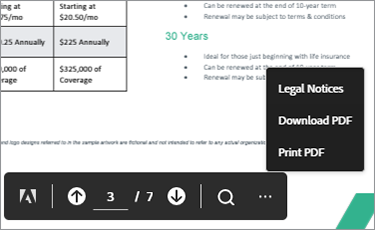

Desea controlar estos indicadores en el back-end. Más adelante puede implementar controles de autorización basados en la identidad del usuario y restringir el acceso según las reglas de su empresa. Esta complejidad no es necesaria en este caso, así que modificemos \\paths\\in-line.js para incluir las propiedades authenticated y permissions en el objeto modelo.

```
let authenticated = false;
res.render('in-line', {
title: paper.title,
paper: paper,
authenticated: authenticated,
permissions: {
showDownloadPDF: true,
showPrintPDF: true,
showFullScreen: true
}
});
```

A continuación, modifique \\views\\in-line.ejs para que la página web pueda representar los valores de indicador procedentes del motor.

```
embedMode: "IN_LINE",
showDownloadPDF: <%= permissions.showDownloadPDF %>,
showPrintPDF: <%= permissions.showPrintPDF %>,
showFullScreen: <%= permissions.showFullScreen %>
Now, open the in-line.js route file and modify it to disallow the printing, downloading, and full-screen controls.
permissions: {
showDownloadPDF: false,
showPrintPDF: false,
showFullScreen: false
}
```

A continuación, vuelva a ejecutar la aplicación para ver cómo se refleja este cambio en el Visor del PDF.


## Creación de contenido cerrado

Según el escenario de usuario final, el responsable de marketing del sitio web de la empresa desea conocer mejor cómo los usuarios interactúan con su contenido basado en PDF e incorporar el contenido con el resto de su página web y marca.

Nuestro enfoque está en la incrustación de PDF, por lo que no está creando una función de autenticación de usuario. En su lugar, solo tienes que implementar un paywall simple y falso utilizando un formulario web que acepte cierta información del usuario y luego muestre el documento del PDF una vez que el usuario envíe el formulario.

Reemplace el archivo \\paths\\in-line.js por el siguiente contenido para proporcionar información de usuario al modelo de vista:

```
var express = require('express');
const fs = require('fs');
var router = express.Router();
router.all('/:id', function(req, res, next) {
let rawdata = fs.readFileSync('data/data.json');
let papers = JSON.parse(rawdata);
let paper = papers.filter(p => p.id == parseInt(req.params.id))[0];
let authenticated = false;
let user = {};
if (req.body.firstName) {
user = {
firstName: req.body.firstName,
lastName: req.body.lastName,
jobTitle: req.body.jobTitle,
email: req.body.email,
};
authenticated = true;
}
res.render('in-line', {
title: paper.title,
paper: paper,
user: user,
authenticated: authenticated,
permissions: {
showDownloadPDF: false,
showPrintPDF: false,
showFullScreen: false
}
});
});
module.exports = router;
```

A continuación, sustituya el contenido de \\views\\in-line.ejs por el código siguiente. Muestra el formulario de datos de usuario o el visor del PDF, dependiendo de si se trata de un usuario autenticado.

```
<!DOCTYPE html>
<html>
<head>
<title>
<%= title %>
</title>
<link rel='stylesheet' href='/css/bootstrap.min.css'/>
<link rel='stylesheet' href='/css/font-awesome.min.css' />
<style type="text/css">
p {
font-family: 'Gill Sans', 'Gill Sans MT', Calibri, 'Trebuchet MS', sans-serif
}
</style>
</head>
<body class="m-0">
<% if (authenticated) { %>
<header class="bg-dark text-white">
<div class="text-right mr-4">Hello, <%= user.firstName %> <%= user.lastName%></div>
</header>
<% } %>
<div>
<main>
<div class="row">
<div class="col-sm-3"></div>
<div class="col-sm-6">
<h3>
<p class="text-center">Grow your business, establish your brand,<br
/>
```

Y pon a tus clientes en primer lugar.

```
</p>
</h3>
<div>
<p class="text-center">Lorem ipsum dolor sit amet, consectetur adipiscing elit, sed do<br />
eiusmod tempor incididunt ut labore et dolore</p>
</div>
<% if (!authenticated) { %>
<div class="row">
<form method="POST" class="center-panel text offset-md-3 col-md-6 border">
<fieldset class="offset-md-1">
<legend>Submit your info to<br/>access the whitepaper</legend>
<p><input name="firstName" placeholder="first name"/></p>
<p><input name="lastName" placeholder="last name"/></p>
<p><input name="jobTitle" placeholder="job title"/></p>
<p><input name="email" placeholder="email"/></p>
<p><button type="submit" class="btn btn-sm btn btn-primary">Submit</button></p>
</fieldset>
</form>
</div>
<% } %>
<% if (authenticated) { %>
<div class="row align-items-center border border-primary">
<div id="adobe-dc-view" style="width: 800px;"></div>
<script src="https://documentcloud.adobe.com/view-sdk/main.js"></script>
<script type="text/javascript">
document.addEventListener("adobe_dc_view_sdk.ready", function () {
var adobeDCView = new AdobeDC.View({ clientId: "<%=process.env.PDF_EMBED_CLIENT_ID %>", divId: "adobe-dc-view" });
adobeDCView.previewFile({
content: { location: { url: "<%= paper.pdf %>" } },
metaData: { fileName: "<%= paper.fileName %>" }
}, {
embedMode: "IN_LINE",
showDownloadPDF: <%= permissions.showDownloadPDF %>,
showPrintPDF: <%= permissions.showPrintPDF %>,
showFullScreen: <%= permissions.showFullScreen %>
});
});
</script>
<% } %>
</div>
</div>
</main>
<footer>
<div class="row">
<div class="col-sm-3"></div>
<div class="col-sm-6">
<p class="text-center">Bodea Inc. Your trusted partner since 2008</p>
</div>
</div>
</footer>
</div>
</div>
</body>
</html>
```

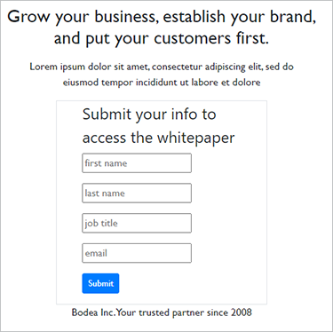

Los visitantes del sitio ahora solo pueden acceder a los PDF después de enviar su información:

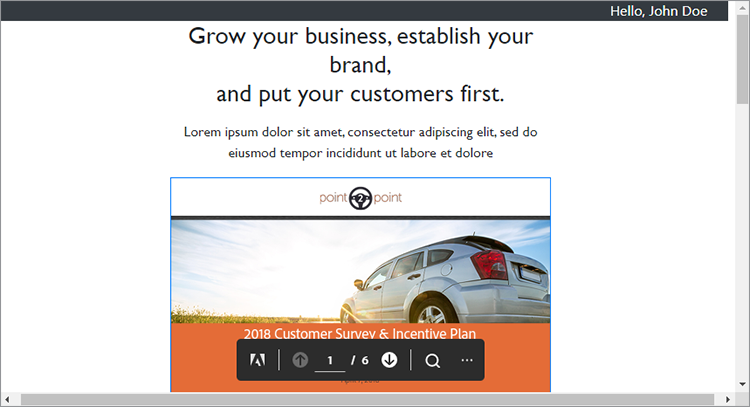

## Activación de eventos

Veamos cómo integrar fácilmente los eventos del visualizador del PDF con su aplicación para recopilar datos de análisis para el responsable de marketing. Para extender el visor mediante PDF EmbedAPI, agregue las siguientes líneas de código después de declarar la variable adobeDCView y antes de llamar al método previewFile:

```
var adobeDCView = new AdobeDC.View({ clientId: "<%=process.env.PDF_EMBED_CLIENT_ID %>", divId: "adobe-dc-view" });
adobeDCView.registerCallback(
AdobeDC.View.Enum.CallbackType.EVENT_LISTENER,
function(event) {
console.log(event);
},
{ enablePDFAnalytics: true }
);
```

A continuación, vuelva a ejecutar la aplicación y abra las herramientas del desarrollador del navegador web para ver los datos del evento.

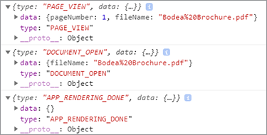

Puede enviar estos datos a [Adobe Analytics](https://www.adobe.io/apis/documentcloud/dcsdk/docs.html?view=view) u otras herramientas de análisis.

## Pasos siguientes

[!DNL Acrobat Services] Las API ayudan a los desarrolladores a solucionar fácilmente los desafíos de la publicación digital mediante un flujo de trabajo centrado en el PDF. Ha visto cómo crear una aplicación web Node de ejemplo para mostrar una colección de documentos técnicos. A continuación, adquiera un [credencial de API gratuita](https://www.adobe.io/apis/documentcloud/dcsdk/gettingstarted.html) y restringió el acceso a los informes técnicos, que se pueden mostrar en uno de los cuatro [modos de incrustación](https://documentcloud.adobe.com/view-sdk-demo/index.html#/view/FULL_WINDOW/Bodea%20Brochure.pdf).

La unión de este flujo de trabajo ayuda al [hipotético responsable de marketing](https://www.adobe.io/apis/documentcloud/dcsdk/digital-content-publishing.html) recopila información de contacto de clientes potenciales a cambio de descargas del informe técnico y consulta estadísticas sobre quién interactúa con los PDF. Puede incorporar estas funciones en su sitio web para impulsar y supervisar la participación de los usuarios.

Si eres desarrollador de Angular o React, puede que te guste probar [muestras adicionales](https://github.com/adobe/pdf-embed-api-samples) que presenta cómo integrar la API de PDF Embed con proyectos de React y Angular.

Adobe te permite crear tu experiencia de cliente integral con soluciones innovadoras. Retirar [API Adobe PDF Embed](https://www.adobe.io/apis/documentcloud/viesdk) gratis. Para descubrir qué más puede hacer, pruebe la API de servicios de Adobe PDF con [pay-as-you-gopr](https://www.adobe.io/apis/documentcloud/dcsdk/pdf-pricing.html)[glaseado](https://www.adobe.io/apis/documentcloud/dcsdk/pdf-pricing.html).

[Primeros pasos](https://www.adobe.io/apis/documentcloud/dcsdk/gettingstarted.html) con [!DNL Adobe Acrobat Services] API actuales.
