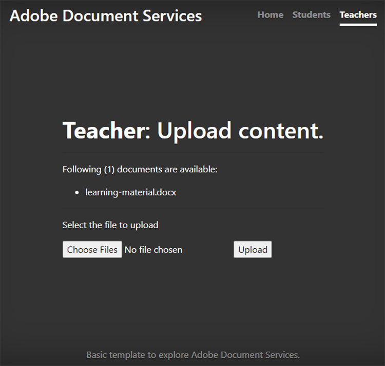
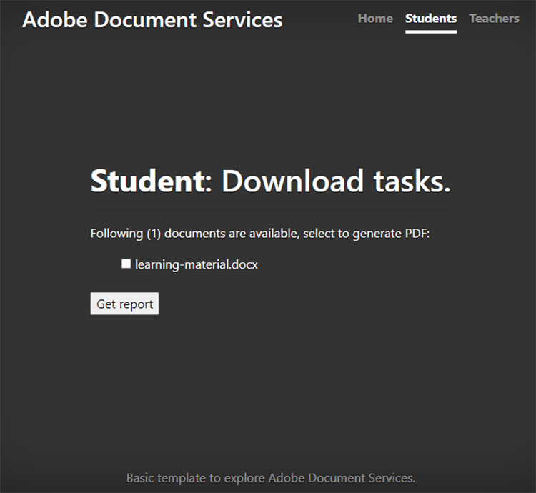
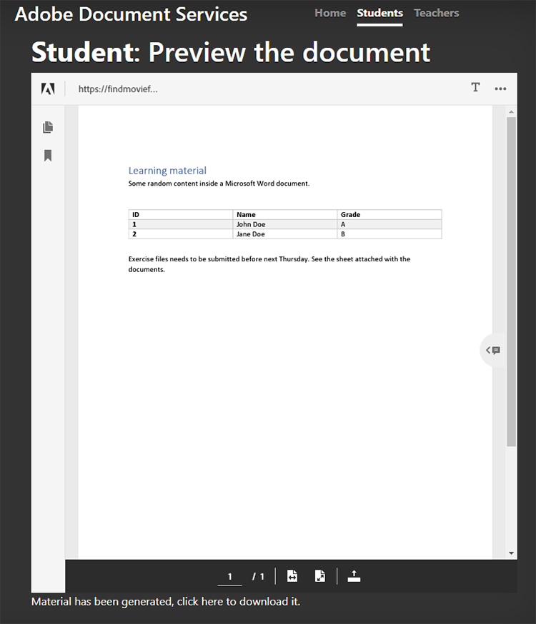
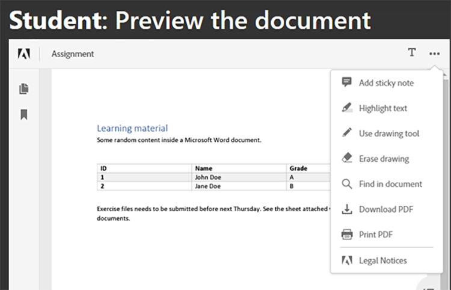
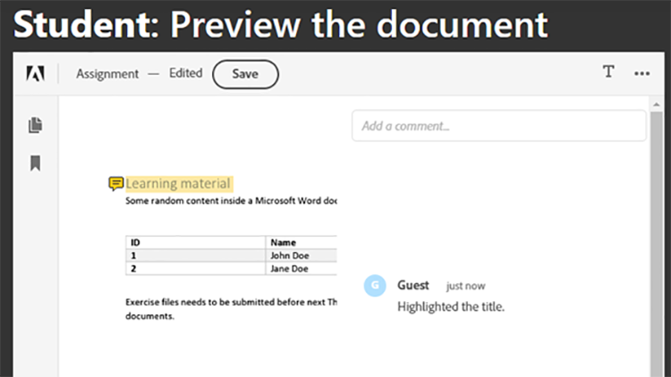
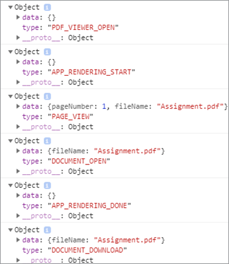

# Colaboración entre estudiantes y profesores


Los institutos educativos utilizan documentos de PDF para compartir el material de aprendizaje con los estudiantes. Los PDF proporcionan un formato de documento intercambiable para los profesores.

Integración [API de servicios de Adobe PDF](https://www.adobe.io/apis/documentcloud/dcsdk/pdf-tools.html) y [API Adobe PDF Embed](https://www.adobe.io/apis/documentcloud/dcsdk/pdf-embed.html) into an app ofrece a profesores y estudiantes una única plataforma para enseñar y aprender. Por ejemplo, la aplicación puede permitir que los estudiantes hagan preguntas sobre sus tareas y tarjetas de presentación, y colaboren en las tareas en grupo.

Existe un SDK oficial para que las aplicaciones Node.js accedan a la API de servicios de PDF. Esto le permite convertir documentos como Microsoft Word o Microsoft Excel a PDF. Además, puede realizar operaciones más avanzadas, como combinar varios informes, reorganizar las páginas y proteger a los PDF. Para obtener más información, consulte [documentación del producto](https://www.adobe.io/apis/documentcloud/dcsdk/).

## Lo que puedes aprender

En este tutorial práctico, aprenderá a crear una plataforma de aprendizaje en línea que [permite a profesores y estudiantes compartir fácilmente recursos](https://www.adobe.io/apis/documentcloud/dcsdk/student-teacher-collaboration.html) en PDF. En este tutorial se utiliza un [portal de aprendizaje](https://github.com/afzaal-ahmad-zeeshan/adobe-pdf-tools-for-teachers) creado mediante el tiempo de ejecución de JavaScript Node.js (Node.js) y los servicios de PDF.

El portal de aprendizaje tiene las siguientes funciones:

* Permite a los profesores cargar recursos

* Permite a los estudiantes seleccionar varios documentos para convertirlos en PDF

* Permite convertir documentos a PDF

* Proporciona una vista previa de PDF para los alumnos en un explorador Web y les permite anotar los documentos sin software adicional

* Permite a los estudiantes dejar comentarios y descargarlos en sus equipos

Descubre cómo [!DNL Adobe Acrobat Services] proporcione una experiencia rica a sus estudiantes con PDF. [!DNL Acrobat Services] Las API se integran a la perfección en tus aplicaciones existentes, para que los estudiantes puedan cargar, convertir y ver archivos, y luego realizar y guardar comentarios, y todo ello dentro de tu configuración actual.

## API y recursos relevantes

* [API de incrustación de PDF](https://www.adobe.com/devnet-docs/dcsdk_io/viewSDK/index.html)

* [API de servicios de PDF](https://opensource.adobe.com/pdftools-sdk-docs/release/latest/index.html)

* [Código del proyecto](https://github.com/afzaal-ahmad-zeeshan/adobe-pdf-tools-for-teachers)

## Carga de recursos en el portal de aprendizaje

En la sección para profesores del portal de aprendizaje, los profesores pueden cargar documentos como asignaciones y pruebas. Los documentos pueden estar en cualquier formato, como Microsoft Word, Microsoft Excel, HTML, varios formatos de imagen, etc.



Los documentos cargados se almacenan y se presentan a los estudiantes cuando abren su página web.

Para obtener información sobre cómo la aplicación carga los archivos, consulte la [código del proyecto](https://github.com/afzaal-ahmad-zeeshan/adobe-pdf-tools-for-teachers).

## Conversión de documentos en PDF

Los estudiantes pueden convertir documentos individuales o múltiples de cualquier tipo en PDF, como Microsoft Word, Excel y PowerPoint, así como otros tipos de archivos de imagen y texto populares. El portal de aprendizaje utiliza los Servicios de PDF para convertir los archivos en PDF.

Para crear su propio portal de aprendizaje, primero debe crear sus propias credenciales. [Regístrate](https://www.adobe.io/apis/documentcloud/dcsdk/gettingstarted.html) para utilizar la API de servicios de PDF de forma gratuita durante seis meses y hasta 1000 transacciones de documentos. Después de eso, [de pago por uso](https://www.adobe.io/apis/documentcloud/dcsdk/pdf-pricing.html) a sólo \$0.05 por transacción de documento a medida que la clase aumenta sus asignaciones.

Cuando un alumno selecciona un documento del tablero, ve lo siguiente:



El estudiante simplemente selecciona los documentos para la conversión y hace clic **Obtener informe**.

El portal de aprendizaje convierte los documentos en PDF y muestra una página del informe, junto con una vista previa del archivo del PDF.

Este es el código de ejemplo para este paso:

```
async function createPdf(rawFile, outputPdf) {
    try {
            // configurations
            const credentials =  adobe.Credentials
            .serviceAccountCredentialsBuilder()
            .fromFile("./src/pdftools-api-credentials.json")
            .build();
 
            // Capture the credential from app and show create the context
            const executionContext = adobe.ExecutionContext.create(credentials),
            operation = adobe.CreatePDF.Operation.createNew();
 
            // Pass the content as input (stream)
            const input = adobe.FileRef.createFromLocalFile(rawFile);
            operation.setInput(input);
 
            // Async create the PDF
            let result = await operation.execute(executionContext);
            await result.saveAsFile(outputPdf);
    } catch (err) {
            console.log('Exception encountered while executing operation', err);
    }
}
```

El código de ejemplo llama al `createPdf` dentro del controlador de rutas rápidas para generar el PDF.

Para obtener información sobre cómo se llama a este método, vea [el código del proyecto](https://github.com/afzaal-ahmad-zeeshan/adobe-pdf-tools-for-teachers/blob/master/src/helpers/pdf.js).

## Vista previa de recursos de aprendizaje

La interfaz de usuario utiliza la API PDF Embed para procesar PDF en un navegador web. Esta API está disponible de forma gratuita.

La API de incrustación de PDF utiliza una credencial diferente a la API de servicios de PDF, por lo que debe [crear una credencial](https://www.adobe.io/apis/documentcloud/dcsdk/gettingstarted.html)
antes de que puedas usarlo. A continuación, puede utilizar PDF Embed de forma totalmente gratuita.

Asegúrese de introducir la dirección URL del sitio web correcta en el token. De lo contrario, es posible que no pueda procesar los PDF con el distintivo.

La interfaz de usuario utiliza la [Manillar](https://handlebarsjs.com/) lenguaje de plantillas. Muestra el PDF en un navegador web.

Este es el código para este paso:

```
<div id="adobe-dc-view" style="height: 750px; width: 700px;"></div>
<script src="https://documentcloud.adobe.com/view-sdk/main.js"></script>
<script type="text/javascript">
    document.addEventListener("adobe_dc_view_sdk.ready", function () {
        var adobeDCView = new AdobeDC.View({ clientId: "<your-credentials-here>", divId: "adobe-dc-view" });
        adobeDCView.previewFile(
            {
                content: {
                    location: { url: "<file-url>" }
                },
                    metaData: { fileName: "<file-name>" }
            },
           );
    });
</script>
 
<p>Material has been generated, <a href="/students/download/{{filename}}" target="_blank">click here</a> to download it.
</p>
```

Este código muestra la salida del PDF y el vínculo para descargar el informe del PDF, como se muestra en la captura de pantalla siguiente:



Los estudiantes deben poder descargar el informe o trabajar en el material aquí.

## Anotación de documentos del PDF

Una plataforma de aprendizaje debe admitir anotaciones, comentarios y discusiones básicas en los PDF. La API PDF Embed proporciona todas estas funciones. Activa la compatibilidad con anotaciones mediante `showAnnotationTools`, permitiendo a profesores y estudiantes comentar sobre los documentos y archivar comentarios como parte del PDF.

Para habilitar anotaciones en documentos de PDF, sólo tiene que pasar el argumento `showAnnotationTools` : fiel a la `previewFile` método. Esto muestra la herramienta de anotaciones en el previsualizador del PDF. Acceda a esta herramienta desde el menú de tres puntos situado en la esquina superior derecha de la previsualización.



En los documentos cargados por los profesores, los estudiantes pueden resaltar texto, agregar comentarios, etc.



En la captura de pantalla anterior, el usuario tiene la etiqueta &quot;Invitado&quot;, pero puede configurar perfiles para usuarios, como estudiantes y profesores.

Cuando un alumno aplica una anotación, la API de incrustación de PDF muestra una **Guardar** en el banner superior. Al guardar, se añaden las anotaciones al archivo. Pruebe a hacer clic **Guardar** para ver cómo se guarda el archivo con la anotación incrustada en el informe.

Los estudiantes pueden usar anotaciones para hacer preguntas o compartir sus comentarios sobre el material de aprendizaje.

## Seguimiento del uso del documento

Es importante que los profesores y los centros educativos vean cómo los estudiantes utilizan las plataformas en línea. Esto ayuda a los profesores a apoyar a sus estudiantes con recursos que les ayudan a desempeñarse mejor en sus tareas. La API PDF Embed se integra con análisis que puede utilizar para medir todos los eventos que tienen lugar, como cuando los usuarios abren, leen y cierran documentos. Con la API de servicios de PDF, los profesores también pueden desactivar la impresión, la descarga y la modificación de archivos para ayudar a mantener la integridad académica.

Si tiene una [Adobe Analytics](https://www.adobe.io/apis/experiencecloud/analytics.html) licencia, puede utilizar su [integración inmediata...](https://experienceleague.adobe.com/docs/document-services/tutorials/pdfembed/controlpdfexperience.html?lang=en#adobe-analytics). De lo contrario, utilice devoluciones de llamada para integrar los Servicios de PDF con otros proveedores de análisis, como [Google](https://experienceleague.adobe.com/docs/document-services/tutorials/pdfembed/controlpdfexperience.html?lang=en#google-analytics).

Para permitir la medición de eventos de documento, adjunte los controladores de eventos mediante el comando `registerCallback` con la instancia de Adobe DC View. Puede mostrar métricas básicas, como abrir un documento o leer una página, en la consola. También puede guardar las métricas en un registro o publicarlas en otras tiendas de análisis.

A continuación se muestra el código de ejemplo para adjuntar los controladores de eventos:

```
adobeDCView.registerCallback(
    AdobeDC.View.Enum.CallbackType.EVENT_LISTENER,
    function(event) {
           console.log(event);
    },
    {
           enablePDFAnalytics: true
    }
);
```

Los profesores pueden ver cuántos estudiantes han visto la tarea, cuántos han revisado todas las páginas de sus notas y otros detalles valiosos.

A continuación se muestra una captura de pantalla de la consola del navegador web:



Esta captura de pantalla muestra que el alumno abrió el archivo de asignación, leyó la primera página (no se desplazó a páginas adicionales o el documento solo tenía una página) y después descargó el archivo. Puedes recopilar estas métricas para realizar análisis y estudiar el comportamiento de tus estudiantes.

Además, [Adobe Analytics](https://business.adobe.com/products/analytics/adobe-analytics.html) está integrado con la API de PDF Embed, por lo que si se suscribe al conjunto de aplicaciones de Adobe Analytics, podrá publicar sus métricas en su suscripción. Para publicar las métricas en Adobe Analytics, solo necesita pasar su ID de suite al constructor de API de incrustación de PDF. (Tenga en cuenta que debe utilizar las credenciales de la API de incrustación de PDF, no las credenciales de la API de servicios de PDF).

A continuación se muestra un código de ejemplo que muestra cómo pasar el ID de conjunto al constructor de la API PDF Embed:

```
var adobeDCView = new AdobeDC.View({
    clientId: "<your-adobe-dc-credential>",
    divId: "<#element>"
    reportSuiteId: <your-id-here>,
}); 
```

## Pasos siguientes

En este tutorial práctico se ha revisado la forma de utilizar la API de servicios de PDF y la API de PDF Embed para crear un portal de aprendizaje, lo que facilita la creación de [colaboración entre estudiantes y profesores](https://www.adobe.io/apis/documentcloud/dcsdk/student-teacher-collaboration.html). Con este portal, los profesores pueden cargar material de aprendizaje en cualquier formato y convertirlo en PDF mediante la API de servicios de PDF. Los estudiantes pueden previsualizar estos PDF mediante la API de incrustación de PDF.

Ahora que ya sabe cómo anotar informes de PDF, archivar las anotaciones y realizar un seguimiento del uso de los informes de PDF, puede empezar a implementar estas soluciones en sus propios proyectos.

Puede utilizar [!DNL Adobe Acrobat Services] API para crear experiencias de PDF interactivas y fáciles de usar en tu sitio web. Disfruta de usar la API de servicios de Adobe PDF gratis durante seis meses y, luego, por solo [de pago por uso](https://www.adobe.io/apis/documentcloud/dcsdk/pdf-pricing.html) (a través de AWS o de un acuerdo directo) por solo \$0,05 por transacción de documento. Usa Adobe PDF Embed gratis sin límite de tiempo. Crear una cuenta gratuita para [introducción](https://www.adobe.com/go/dcsdks_credentials) hoy.
