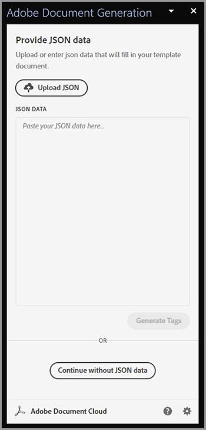

# Modernización de la incorporación de empleados


En una organización grande, la incorporación de empleados puede ser un proceso grande y lento. Normalmente, hay una mezcla de documentación personalizada junto con material repetitivo que debe presentar y firmar un nuevo empleado. Esta mezcla de materiales personalizados y repetitivos requiere varios pasos, lo que supone una pérdida de tiempo para las personas que participan en el proceso. [!DNL Adobe Acrobat Services] y Acrobat Sign pueden modernizar y automatizar este enfoque, liberando al personal de RR. HH. para las tareas más importantes. Echemos un vistazo a cómo se logra esto.

## ¿Qué son [!DNL Adobe Acrobat Services]?

[[!DNL Adobe Acrobat Services]](https://developer.adobe.com/document-services/homepage) son un conjunto de API relacionadas con el trabajo con documentos (y no solo con PDF). En términos generales, este conjunto de servicios se divide en tres categorías principales:

* Primero están los [Servicios de PDF](https://developer.adobe.com/document-services/apis/pdf-services/) conjunto de herramientas. Se trata de métodos &quot;útiles&quot; para trabajar con PDF y otros documentos. Los servicios incluyen cosas como la conversión a y desde PDF, la realización de OCR y optimización, la fusión y división de PDF, etc. Es el conjunto de herramientas de las funciones de procesamiento de documentos.
* [API de PDF Extract](https://developer.adobe.com/document-services/apis/pdf-extract/) utiliza potentes técnicas de inteligencia artificial y aprendizaje automático para analizar a un PDF y proporcionar una increíble cantidad de detalles sobre su contenido. Esto incluye el texto, el estilo y la información de posición, y también puede devolver datos tabulares en formato CSV/XLS, así como recuperar imágenes.
* Por último, [API de generación de documentos](https://developer.adobe.com/document-services/apis/doc-generation/) permite a los desarrolladores utilizar Microsoft Word como una &quot;plantilla&quot;, mezclar con sus datos (de cualquier origen) y generar documentos dinámicos y personalizados (PDF y Word).

Los desarrolladores pueden [inscribirse](https://documentcloud.adobe.com/dc-integration-creation-app-cdn/main.html) y prueba todos estos servicios con una prueba gratis. La [!DNL Acrobat Services] La plataforma utiliza una API basada en REST, pero también admite SDK para Node, Java, .NET y Python (solo Extract en este momento).

Aunque no es una API, los desarrolladores también pueden utilizar la [API de incrustación de PDF](https://developer.adobe.com/document-services/apis/pdf-embed/), que proporciona una experiencia de visualización coherente y flexible de los documentos con sus páginas web.

## ¿Qué es Acrobat Sign?

[Acrobat Sign](https://www.adobe.com/es/sign.html_es) es líder mundial en servicios de firma electrónica. Puede enviar documentos para su firma mediante distintos flujos de trabajo, incluidas varias firmas. Acrobat Sign también admite flujos de trabajo que requieren firmas e información adicional. Todas estas funciones están respaldadas por un potente panel con un sistema de creación flexible.

Al igual que [!DNL Acrobat Services], Acrobat Sign tiene un [prueba gratis](https://www.adobe.com/sign.html#sign_free_trial) que permite a los desarrolladores probar el proceso de firma tanto a través del panel como con una API basada en REST fácil de usar.

## Un escenario de incorporación

Consideremos un escenario del mundo real que muestre cómo los servicios de Adobe pueden ayudar. Cuando un nuevo empleado se une a una empresa, necesita información personalizada adaptada a su función. Además, también necesitan material para toda la empresa. Por último, deben demostrar la aceptación de las políticas empresariales firmando los documentos. Vamos a desglosar esto en pasos concretos:

* En primer lugar, se necesita una carta de presentación personalizada que salude al nuevo empleado por su nombre. La carta debe contener información sobre el nombre, rol, salario y ubicación del empleado.
* La carta personalizada debe combinarse con un PDF que contenga información básica de toda la empresa (piense en varias políticas de RR. HH., beneficios, etc.)
* Se debe incluir un documento final en el que se solicite la firma y la fecha del empleado.
* Todo lo anterior debe presentarse como un documento que se envía al empleado para que lo firme.

Vamos a entrar en detalles sobre cómo hacer esto.

## Generación de documentos dinámicos

Adobe&#39;s [Generación de documentos](https://developer.adobe.com/document-services/apis/doc-generation/) La API permite a los desarrolladores crear documentos dinámicos utilizando Microsoft Word y un sencillo lenguaje de plantillas, como base para generar PDF y documentos de Word. Este es un ejemplo de cómo funciona esto.

Empecemos con un documento de Word que tenga valores codificados. El documento se puede aplicar cualquier estilo que desee, incluir gráficos, tablas, etc. Aquí está el documento inicial.


La generación de documentos funciona añadiendo &quot;tokens&quot; a un documento de Word que se sustituyen por sus datos. Aunque estos tokens se pueden introducir manualmente, hay una [Complemento de Microsoft Word](https://developer.adobe.com/document-services/docs/overview/document-generation-api/wordaddin/) eso hace que esto sea más fácil de hacer. Abrirlo proporciona una herramienta para que los autores definan etiquetas o conjuntos de datos que se pueden utilizar en el documento.



Puede cargar información JSON desde un archivo local, copiarla en texto JSON o seleccionar continuar con los datos iniciales. Si lo hace, podrá definir sus etiquetas de forma ad hoc en función de sus necesidades particulares. En este ejemplo, sólo se necesita una etiqueta para el nombre, la función, el salario y la ubicación. Esto se hace mediante el uso del **Crear etiqueta** botón:


Después de definir la primera etiqueta, puede seguir definiendo tantas como necesite:


Una vez definidas las etiquetas, seleccione el texto del documento y sustitúyalo por las etiquetas donde corresponda. En este ejemplo, se agregan etiquetas para el nombre, la función y el salario.


La generación de documentos no solo admite etiquetas simples, sino también expresiones lógicas. El segundo párrafo del documento tiene texto que solo se aplica a las personas en Louisiana. Puede agregar una expresión condicional yendo a la ficha Avanzado del etiquetador de documentos y definiendo una condición. A continuación se describe cómo definir una condición de igualdad simple, pero tenga en cuenta que también se admiten las comparaciones numéricas y otros tipos de comparación.


A continuación, se puede insertar y envolver alrededor del párrafo:


Para probar cómo funciona esto, seleccione **Generar documento**. La primera vez que hagas esto, debes iniciar sesión con un Adobe ID. Después de iniciar sesión, se muestra un JSON predeterminado que se puede editar manualmente.


Se genera un PDF que se puede ver o descargar.


Aunque Document Tagger le permite diseñar y probar rápidamente, una vez hecho y en producción, puede utilizar uno de los SDK para automatizar este proceso. Aunque el código real difiere según las necesidades específicas, a continuación se muestra un ejemplo de cómo se ve este código en Node.js:

```js
 const PDFServicesSdk = require('@adobe/pdfservices-node-sdk');

const credentials =  PDFServicesSdk.Credentials
    .serviceAccountCredentialsBuilder()
    .fromFile("pdfservices-api-credentials.json")
    .build();

// Data would be dynamic...
let data = {
    "name":"Raymond Camden",
    "role":"Lead Developer",
    "salary":9000,
    "location":"Louisiana"
}

// Create an ExecutionContext using credentials.
const executionContext = PDFServicesSdk.ExecutionContext.create(credentials);

// Create a new DocumentMerge options instance.
const documentMerge = PDFServicesSdk.DocumentMerge,
    documentMergeOptions = documentMerge.options,
    options = new documentMergeOptions.DocumentMergeOptions(jsonDataForMerge, documentMergeOptions.OutputFormat.PDF);

// Create a new operation instance using the options instance.
const documentMergeOperation = documentMerge.Operation.createNew(options);

// Set operation input document template from a source file.
const input = PDFServicesSdk.FileRef.createFromLocalFile('documentMergeTemplate.docx');
documentMergeOperation.setInput(input);

// Execute the operation and Save the result to the specified location.
documentMergeOperation.execute(executionContext)
    .then(result => result.saveAsFile('documentOutput.pdf'))
    .catch(err => {
        if(err instanceof PDFServicesSdk.Error.ServiceApiError
            || err instanceof PDFServicesSdk.Error.ServiceUsageError) {
            console.log('Exception encountered while executing operation', err);
        } else {
            console.log('Exception encountered while executing operation', err);
        }
    });
```

En resumen, el código configura credenciales, crea un objeto de operación y establece la entrada y las opciones, y después llama a la operación. Por último, guarda el resultado como un PDF. (Los resultados también se pueden generar como Word.)

La generación de documentos admite casos de uso mucho más complejos, incluida la capacidad de disponer de tablas e imágenes totalmente dinámicas. Consulte la [documentación](https://developer.adobe.com/document-services/docs/overview/document-generation-api/) para obtener más información.

## Realización de operaciones de PDF

La [API de servicios de PDF](https://developer.adobe.com/document-services/apis/pdf-services/) proporciona un gran conjunto de operaciones &quot;utilitarias&quot; para trabajar con PDF. Estas operaciones incluyen:

* Crear PDF a partir de documentos de Office
* Exportar PDF a documentos de Office
* Combinar y dividir PDF
* Aplicación de OCR a PDF
* Configuración, eliminación y modificación de la protección de los PDF
* Eliminación, inserción, reordenación y rotación de páginas
* Optimización de PDF mediante compresión o linealización
* Obtención de propiedades de PDF

En este escenario, el resultado de la llamada de generación de documentos debe combinarse con un PDF estándar. Esta operación es bastante simple con los SDK. A continuación se muestra un ejemplo de en Node.js:

```js
const PDFServicesSdk = require('@adobe/pdfservices-node-sdk');
 
// Initial setup, create credentials instance.
const credentials = PDFServicesSdk.Credentials
    .serviceAccountCredentialsBuilder()
    .fromFile("pdfservices-api-credentials.json")
    .build();
 
// Create an ExecutionContext using credentials and create a new operation instance.
const executionContext = PDFServicesSdk.ExecutionContext.create(credentials),
    combineFilesOperation = PDFServicesSdk.CombineFiles.Operation.createNew();
 
// Set operation input from a source file.
const combineSource1 = PDFServicesSdk.FileRef.createFromLocalFile('documentOutput.pdf'),
      combineSource2 = PDFServicesSdk.FileRef.createFromLocalFile('standardCorporate.pdf');

combineFilesOperation.addInput(combineSource1);
combineFilesOperation.addInput(combineSource2);
 
// Execute the operation and Save the result to the specified location.
combineFilesOperation.execute(executionContext)
    .then(result => result.saveAsFile('combineFilesOutput.pdf'))
    .catch(err => {
        if (err instanceof PDFServicesSdk.Error.ServiceApiError
            || err instanceof PDFServicesSdk.Error.ServiceUsageError) {
            console.log('Exception encountered while executing operation', err);
        } else {
            console.log('Exception encountered while executing operation', err);
        }
    });
```

Este código toma los dos PDF, los combina y guarda el resultado en un nuevo PDF. ¡Sencillo y fácil! Consulte la [docs](https://developer.adobe.com/document-services/docs/overview/pdf-services-api/) para ver ejemplos de lo que se puede hacer.

## El proceso de firma

En la etapa final del proceso de incorporación, el empleado debe firmar un acuerdo que indique que ha leído y está de acuerdo con todas las políticas definidas en. [Acrobat Sign](https://www.adobe.com/es/sign.html_es) admite muchos flujos de trabajo e integraciones diferentes, incluido uno automatizado a través de una [API](https://opensource.adobe.com/acrobat-sign/developer_guide/index.html). En términos generales, la parte final del escenario puede completarse de la siguiente manera:

En primer lugar, diseñe el documento que incluya el formulario que debe firmarse. Hay varias formas de hacerlo, incluida una imagen diseñada en el panel de usuario de Adobe Sign. Otra opción es utilizar el complemento Word Generación de documentos para insertar las etiquetas automáticamente. En este ejemplo se solicita una firma y una fecha.


Este documento se puede guardar como PDF y, utilizando el mismo método descrito anteriormente, se puede unir a todos los documentos. Este proceso crea un paquete cohesivo que contiene un saludo personalizado, documentación corporativa estándar y una página final adecuada para firmar.

La plantilla se puede cargar en el panel de Acrobat Sign y luego utilizarse para nuevos acuerdos. Mediante la API REST, este documento se puede enviar al posible empleado para solicitar su firma.


## Experiméntala tú mismo

Todo lo que se describe en este artículo se puede probar ahora mismo. La [!DNL Adobe Acrobat Services] API [prueba gratis](https://documentcloud.adobe.com/dc-integration-creation-app-cdn/main.html) actualmente le ofrece 1000 solicitudes gratuitas durante un período de seis meses. Acrobat Sign [prueba gratis](https://www.adobe.com/sign.html#sign_free_trial) le permite enviar acuerdos con marca de agua para realizar pruebas.

¿Tiene alguna pregunta? La [foro de asistencia](https://community.adobe.com/t5/document-services-apis/ct-p/ct-Document-Cloud-SDK) es monitoreado por los desarrolladores de Adobes y la gente de apoyo todos los días. Por último, para inspirarte más, asegúrate de coger la siguiente [Clips de papel](https://www.youtube.com/playlist?list=PLcVEYUqU7VRe4sT-Bf8flvRz1XXUyGmtF) episodio. Se celebran periódicamente reuniones en directo con los clientes, así como demostraciones y charlas.
