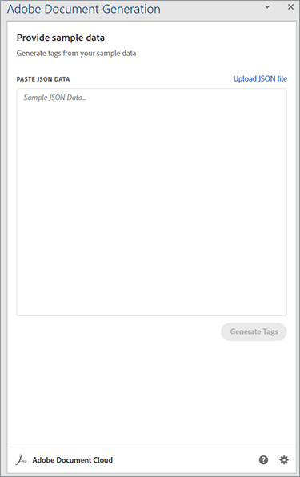
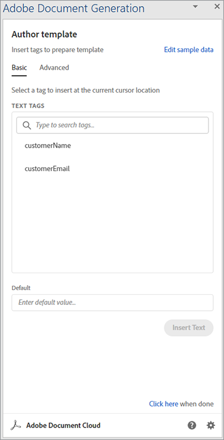
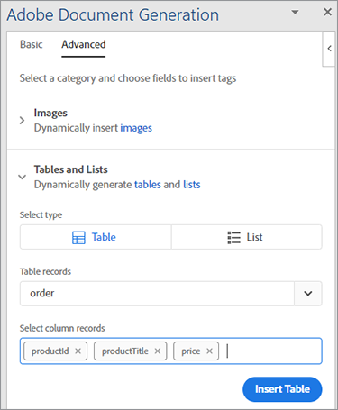
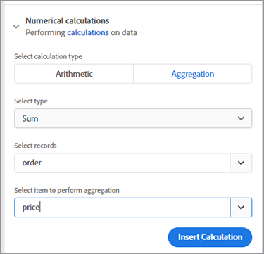
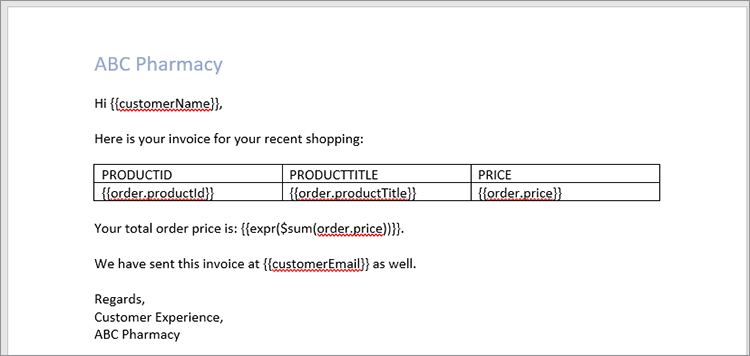
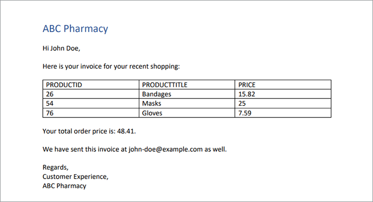

# Gestión de facturas


Es genial cuando el negocio está en auge, pero la productividad se resiente cuando llega el momento de preparar todas esas facturas. Generar facturas manualmente lleva mucho tiempo, además de correr el riesgo de cometer un error, perder dinero o enojar a un cliente con una cantidad incorrecta.

Piensa en Danielle, por ejemplo, trabajando en el [departamento contabilidad](https://www.adobe.io/apis/documentcloud/dcsdk/invoices.html) [de una empresa de suministros médicos](https://www.adobe.io/apis/documentcloud/dcsdk/invoices.html). Es fin de mes, así que está extrayendo información de varios sistemas diferentes, comprobando su precisión y formateando las facturas. Después de todo ese trabajo, por fin está lista para convertir los documentos a PDF (para que cualquiera pueda verlos sin comprar un software específico) y enviar a cada cliente su factura personalizada.

Incluso cuando la facturación mensual está completa, Danielle no puede escapar de esas facturas. Algunos clientes tienen ciclos de facturación no mensuales, por lo que siempre está creando una factura para alguien. A veces, un cliente edita su factura y paga menos. Danielle entonces pasa tiempo solucionando este desajuste de factura. A este ritmo, ella necesita contratar a un asistente para mantenerse al día con todo el trabajo!

Lo que Danielle necesita es una forma de generar facturas de forma rápida y precisa, tanto por lotes a final de mes como ad hoc en otros momentos. Lo ideal sería que, si pudiera proteger estas facturas de las ediciones, no tuviera que preocuparse por la solución de problemas de importes no coincidentes.

## Lo que puedes aprender

En este tutorial práctico, aprenderá a utilizar la API de generación de documentos de Adobe para generar facturas automáticamente, proteger con contraseña a los PDF y entregar una factura a cada cliente. Todo lo que se necesita es un poco de conocimiento de Node.js, JavaScript, Express.js, HTML y CSS.

El código completo de este proyecto es [disponible en GitHub](https://github.com/afzaal-ahmad-zeeshan/adobe-pdf-invoice-generation). Debe configurar el directorio público con su plantilla y las carpetas de datos sin procesar. En la producción, debe obtener los datos de una API externa. También puede explorar esta versión archivada de la aplicación que contiene los recursos de plantilla.

## API y recursos relevantes

* [API de servicios de PDF](https://opensource.adobe.com/pdftools-sdk-docs/release/latest/index.html)

* [API de generación de documentos de Adobe](https://www.adobe.io/apis/documentcloud/dcsdk/doc-generation.html)

* [API de Adobe Sign](https://www.adobe.io/apis/documentcloud/sign.html)

* [Código del proyecto](https://github.com/afzaal-ahmad-zeeshan/adobe-pdf-invoice-generation)

## Preparación de los datos

Este tutorial no examina cómo se importan los datos de los almacenes de datos. Los pedidos de los clientes pueden estar en una base de datos, una API externa o un software personalizado. La API de generación de documentos de Adobe espera un documento JSON que contenga los datos de facturación, como la información de su plataforma de gestión de relaciones con el cliente (CRM) o de comercio electrónico. En este tutorial se supone que los datos ya están en formato JSON.

Para simplificar, utilice la siguiente estructura JSON para la facturación:

```
{ 
    "customerName": "John Doe", 
    "customerEmail": "john-doe@example.com", 
    "order": [ 
        { 
            "productId": 26, 
            "productTitle": "Bandages", 
            "price": 15.82 
        }, 
        { 
            "productId": 54, 
            "productTitle": "Masks", 
            "price": 25 
        }, 
        { 
            "productId": 76, 
            "productTitle": "Gloves", 
            "price": 7.59 
        } 
    ] 
} 
```

El documento JSON contiene los detalles del cliente, así como la información del pedido. Utilice este documento estructurado para generar la factura y mostrar los elementos en formato de PDF.

## Creación de una plantilla de factura

La API de generación de documentos de Adobe espera una plantilla basada en Microsoft Word y un documento JSON para crear un PDF dinámico o un documento de Word. Cree una plantilla de Microsoft Word para la aplicación de facturación y utilice el [complemento gratuito etiquetador de generación de documentos](https://opensource.adobe.com/pdftools-sdk-docs/docgen/latest/wordaddin.html#add-in-demo) para generar las etiquetas de plantilla. Instale el complemento y abra la ficha en Microsoft Word.



Una vez que haya pegado el contenido JSON en el complemento, como se muestra anteriormente, haga clic en Generar etiquetas. Ahora, este plugin muestra el formato de su objeto. La plantilla básica puede utilizar el nombre y el correo electrónico del cliente, pero no muestra la información del pedido. La información del pedido se explica más adelante en este tutorial.



En el documento de Microsoft Word, empiece a escribir la plantilla de factura. Deje el cursor donde debe insertar datos dinámicos y, a continuación, seleccione la etiqueta en la ventana del complemento de Adobe. Haga clic en **Insertar texto** para que el complemento etiquetador de generación de documentos de Adobe pueda generar e insertar las etiquetas. Para la personalización, vamos a insertar el nombre y el correo electrónico del cliente.

Ahora, pase a los datos que cambian con cada nueva factura. Seleccione la **Avanzado** del complemento. Para ver las opciones disponibles para generar una tabla dinámica basada en los productos que ha pedido un cliente, haga clic en **Tablas y listas** .

Seleccionar **Orden** desde el primer menú desplegable. En el segundo menú desplegable, seleccione las columnas de esta tabla. En este tutorial, seleccione las tres columnas del objeto para procesar la tabla.



La API de generación de documentos también puede realizar operaciones complejas como agregar elementos dentro de una matriz. En la **Avanzado** , seleccione **Cálculos numéricos**, y en el **Agregación** , seleccione el campo donde desea aplicar el cálculo.



Haga clic en **Insertar cálculo** para insertar esta etiqueta donde sea necesario dentro del documento. El siguiente texto aparece ahora en su archivo de Microsoft Word:



Este ejemplo de factura contiene información del cliente, los productos pedidos y el importe total adeudado.

## Generación de una factura mediante la API de generación de documentos de Adobe

Use el kit de desarrollo de software (SDK) de Adobe PDF Services Node.js para combinar los documentos de Microsoft Word y JSON. Cree una aplicación Node.js para crear la factura mediante la API de generación de documentos.

La API de servicios de PDF incluye el servicio de generación de documentos, por lo que puede utilizar las mismas credenciales para ambos. Disfruta de una [prueba gratis de seis meses](https://www.adobe.io/apis/documentcloud/dcsdk/pdf-pricing.html), luego paga solo $0.05 por transacción de documento.

Este es el código para combinar el PDF:

```
async function compileDocFile(json, inputFile, outputPdf) { 
    try { 
        // configurations 
        const credentials =  adobe.Credentials 
            .serviceAccountCredentialsBuilder() 
            .fromFile("./src/pdftools-api-credentials.json") 
            .build(); 

        // Capture the credential from app and show create the context 
        const executionContext = adobe.ExecutionContext.create(credentials); 
  
        // create the operation 
        const documentMerge = adobe.DocumentMerge, 
            documentMergeOptions = documentMerge.options, 
            options = new documentMergeOptions.DocumentMergeOptions(json, documentMergeOptions.OutputFormat.PDF);

        const operation = documentMerge.Operation.createNew(options); 
  
        // Pass the content as input (stream) 
        const input = adobe.FileRef.createFromLocalFile(inputFile); 
        operation.setInput(input); 
  
        // Async create the PDF 
        let result = await operation.execute(executionContext); 
        await result.saveAsFile(outputPdf); 
    } catch (err) { 
        console.log('Exception encountered while executing operation', err); 
    } 
} 
```

Este código toma información del documento JSON de entrada y del archivo de plantilla de entrada. A continuación, crea una operación de combinación de documentos para combinar los archivos en un único informe de PDF. Por último, ejecuta la operación con sus credenciales de API. Si aún no los tiene, [crear credenciales](https://opensource.adobe.com/pdftools-sdk-docs/release/latest/index.html#getting-credentials) (La API de generación de documentos y servicios de PDF utilizan las mismas credenciales).

Utilice este código dentro del enrutador Express para controlar la solicitud del documento:

```
// Create one report and send it back
try {
    console.log(\`[INFO] generating the report...\`);
    const fileContent = fs.readFileSync(\`./public/documents/raw/\${vendor}\`,
    'utf-8');
    const parsedObject = JSON.parse(fileContent);

    await pdf.compileDocFile(parsedObject,
    \`./public/documents/template/Adobe-Invoice-Sample.docx\`,
    \`./public/documents/processed/output.pdf\`);

    await pdf.applyPassword("p@55w0rd", './public/documents/processed/output.pdf',
    './public/documents/processed/output-secured.pdf');

    console.log(\`[INFO] sending the report...\`);
    res.status(200).render("preview", { page: 'invoice', filename: 'output.pdf' });
} catch(error) {
    console.log(\`[ERROR] \${JSON.stringify(error)}\`);
    res.status(500).render("crash", { error: error });
}
```

Una vez que se ejecuta este código, proporciona un documento de PDF que contiene la factura generada dinámicamente en función de los datos proporcionados. Con los datos JSON de ejemplo (proporcionados anteriormente), el resultado de este código es:



Esta factura incluye los datos dinámicos del documento JSON.

## Proteger facturas con contraseña

Como Danielle, la contadora, está preocupada por los clientes que modifiquen la factura, aplique una contraseña para restringir la edición. [API de servicios de PDF](https://opensource.adobe.com/pdftools-sdk-docs/release/latest/index.html) puede aplicar automáticamente una contraseña a los documentos. En este caso, se utiliza Adobe PDF Services SDK para proteger los documentos con una contraseña. El código es:

```
async function applyPassword(password, inputFile, outputFile) {
    try {
        // Initial setup, create credentials instance.
        const credentials = adobe.Credentials
        .serviceAccountCredentialsBuilder()
        .fromFile("./src/pdftools-api-credentials.json")
        .build();

        // Create an ExecutionContext using credentials
        const executionContext = adobe.ExecutionContext.create(credentials);
        // Create new permissions instance and add the required permissions
        const protectPDF = adobe.ProtectPDF,
        protectPDFOptions = protectPDF.options;
        // Build ProtectPDF options by setting an Owner/Permissions Password, Permissions,
        // Encryption Algorithm (used for encrypting the PDF file) and specifying the type of content to encrypt.
        const options = new protectPDFOptions.PasswordProtectOptions.Builder()
        .setOwnerPassword(password)
        .setEncryptionAlgorithm(protectPDFOptions.EncryptionAlgorithm.AES_256)
        .build();

        // Create a new operation instance.
        const protectPDFOperation = protectPDF.Operation.createNew(options);

        // Set operation input from a source file.
        const input = adobe.FileRef.createFromLocalFile(inputFile);
        protectPDFOperation.setInput(input);

        // Execute the operation and Save the result to the specified location.
        let result = await protectPDFOperation.execute(executionContext);

        result.saveAsFile(outputFile);
    } catch (err) {
        console.log('Exception encountered while executing operation', err);
    }
}
```

Cuando utiliza este código, protege su documento con una contraseña y carga una nueva factura al sistema. Para obtener más información sobre cómo se utiliza este código o probarlo, consulte la [ejemplo de código](https://github.com/afzaal-ahmad-zeeshan/adobe-pdf-invoice-generation).

Una vez que haya terminado con la factura, es posible que desee enviarla automáticamente por correo electrónico al cliente. Hay varias formas de conseguir que los clientes envíen correos electrónicos de forma automática. La forma más rápida es utilizar una API de correo electrónico de terceros junto con una biblioteca auxiliar como [sendgrid-nodejs](https://github.com/sendgrid/sendgrid-nodejs). Como alternativa, si ya tiene acceso a un servidor SMTP, puede utilizar [correo electrónico](https://www.npmjs.com/package/nodemailer) para enviar correos electrónicos mediante SMTP.

## Pasos siguientes

En este tutorial práctico, has creado una aplicación sencilla para ayudar a Danielle en la contabilidad con [facturación](https://www.adobe.io/apis/documentcloud/dcsdk/invoices.html). Con la API de servicios de PDF y el SDK de generación de documentos, ha rellenado una plantilla de Microsoft Word con información de pedidos de clientes de un documento JSON, creando una factura de PDF. A continuación, proteja con contraseña cada documento mediante los servicios de protección con contraseña de [API de servicios de PDF](https://opensource.adobe.com/pdftools-sdk-docs/release/latest/index.html).

Como Danielle puede generar facturas automáticamente y no tiene que preocuparse de que los clientes editen sus facturas, no necesitará contratar a un asistente que le ayude con todo el trabajo manual. Ella puede usar su tiempo extra para encontrar ahorros de costos en los archivos de cuentas por pagar.

Ahora que ya ves lo fácil que es, puedes expandir esta sencilla aplicación usando otras herramientas de Adobe para insertar facturas en tu sitio web. Por ejemplo, para que los clientes puedan ver sus facturas o saldo en cualquier momento. [API Adobe PDF Embed](https://www.adobe.io/apis/documentcloud/dcsdk/pdf-embed.html) es de uso gratuito. Incluso puedes pasar al departamento de recursos humanos o ventas, lo que te ayuda a automatizar sus acuerdos y recopilar firmas electrónicas.

Para explorar todas las posibilidades y empezar a crear su propia aplicación práctica, cree una [[!DNL Adobe Acrobat Services]](https://www.adobe.io/apis/documentcloud/dcsdk/gettingstarted.html) para empezar hoy mismo. Disfruta de una prueba gratis de seis meses entonces [de pago por uso](https://www.adobe.io/apis/documentcloud/dcsdk/pdf-pricing.html)
a solo $0.05 por transacción de documento a medida que se amplía tu negocio.
