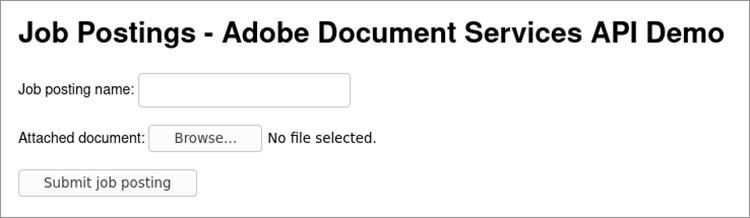
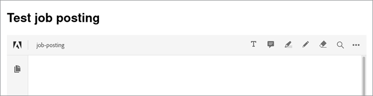

# Registro de trabajos


Al operar un sitio web con varios usuarios, es crucial diseñar una experiencia que garantice una experiencia fluida para todos.

Imagine el siguiente escenario: tiene un sitio web que permite a los empleadores [cargar registros de trabajos](https://www.adobe.io/apis/documentcloud/dcsdk/job-posting.html). Para quienes buscan trabajo, es conveniente ver fácilmente todos los documentos relacionados con una publicación en un formato coherente. Sin embargo, es conveniente que los empleadores adjunten información en cualquier formato de archivo que tengan. Para ofrecer comodidad a ambos tipos de usuarios, puede convertir automáticamente todos los documentos cargados en PDF e incorporarlos en línea en la publicación.

## Lo que puedes aprender

Este tutorial práctico muestra un ejemplo de Node.js que utiliza [!DNL Adobe Acrobat Services] y sus [Node.js SDK](https://www.npmjs.com/package/@adobe/documentservices-pdftools-node-sdk) para agregar estas capacidades a un sitio de publicación de trabajos. Esto crea un sitio web que es más fácil de usar y más atractivo para los empleadores y los solicitantes de empleo por igual. Aquí está el [completo](https://github.com/contentlab-io/adobe_job_posting) [código del proyecto](https://github.com/contentlab-io/adobe_job_posting), en caso de que quieras seguir mientras lees.

Para comenzar, configure una aplicación web sencilla basada en Express Node.js. [Express](https://expressjs.com/) es un marco de trabajo de aplicaciones web minimalista que ofrece funciones como el enrutamiento y las plantillas. El código de la aplicación está disponible en [GitHub](https://github.com/contentlab-io/adobe_job_posting). Además, instale el [Base de datos PostgreSQL](https://www.postgresql.org/) y configurarlo para almacenar el PDF.

## Pertinente [!DNL Acrobat Services] API

* [API de incrustación de PDF](https://www.adobe.com/devnet-docs/dcsdk_io/viewSDK/index.html)

* [API de servicios de PDF](https://opensource.adobe.com/pdftools-sdk-docs/release/latest/index.html)

## Creación de credenciales de API de Adobe

Primero, debes [crear credenciales](https://www.adobe.com/go/dcsdks_credentials) para la API Adobe PDF Embed (gratuita) y la API Adobe PDF Services (gratuita durante seis meses) [pago por uso](https://www.adobe.io/apis/documentcloud/dcsdk/pdf-pricing.html) por solo \$0,05 por transacción de documento). Al crear credenciales para la API de servicios de PDF, seleccione la opción &quot;Crear ejemplo de código personalizado&quot;. Guarde el archivo ZIP y extraiga pdftools-api-credentials.json y private.key en el directorio raíz del proyecto Node.js Express.

También necesita una clave de API para la API embed disponible gratuitamente. Desde [Proyectos](https://console.adobe.io/projects), vaya al proyecto que ha creado. A continuación, haga clic en **Agregar al proyecto** y seleccione **API**. Por último, haga clic en **API de incrustación de PDF**.

Especifique el dominio para la API de incrustación de PDF. La clave de API debe ser pública (búsquela en el código ejecutado por el navegador). Al especificar un dominio, se garantiza que otra persona de un dominio diferente no pueda utilizar la clave de API.

No puede utilizar &quot;localhost&quot; como dominio. Especifique un dominio, como &quot;testing.local&quot;, y edite el archivo de hosts de su ordenador para redirigir ese dominio a 127.0.0.1, que es su ordenador. A continuación, en lugar de probar la aplicación en localhost:3000, puede probarla en testing.local:3000. Cuando termine, busque la clave de API para la API incrustada de PDF en la página del proyecto.

## Agregar un formulario de carga y un controlador

Con una aplicación Express operativa y credenciales de API, también necesita un formulario que permita a los usuarios cargar sus documentos en el sitio web. Edite la plantilla index.jade para este propósito.

Cree un campo de entrada para el nombre del registro del trabajo cargado y para un documento que contenga más información.

Dentro del bloque de contenido de la plantilla, agregue el siguiente formulario:

```
extends layout

block content
  h1= title

  form(action="/upload", enctype="multipart/form-data", method="POST")
    label Job posting name:&nbsp;
    input(type="text", name="name", required="required")
    br
    br
    label Describing document:&nbsp;
    input(type="file", name="attachment", required="required")
    br
    br
    input(type="submit", value="Submit job posting")
```

A continuación, agregue un controlador para la solicitud del POST a la acción /upload. A continuación, agregue una ruta para /upload al archivo routes/index.js. Puede crear un nuevo archivo para esta ruta, pero tendrá que actualizar el archivo app.js para que refleje el nuevo archivo. Dentro de este controlador de rutas, puede tener acceso al nombre especificado y al archivo cargado.

```
router.post('/upload', async function (req, res, next) {
    const name = req.body.name;
    const fileContents = req.files.attachment.data;

    // code to work with the uploaded document
  });
```

La función es asíncrona, por lo que puede utilizar la palabra clave await en la función, lo que resulta útil cuando se llama a los métodos que realizan llamadas a la API.



## Uso de la API de servicios de PDF

Antes de utilizar la API de servicios de PDF, debe añadir las siguientes importaciones a la parte superior del archivo de rutas:

```
const PDFToolsSdk = require('@adobe/documentservices-pdftools-node-sdk');
  const { Readable } = require('stream');
```

Justo debajo de las importaciones, puede cargar credenciales de API y crear una [contenido de ejecución](https://www.javascripttutorial.net/javascript-execution-context/). Dado que puede reutilizar un contexto de ejecución para diferentes operaciones, tiene sentido hacerlo una sola vez.

```
  const credentials = PDFToolsSdk.Credentials
  .serviceAccountCredentialsBuilder()
  .fromFile("pdftools-api-credentials.json")
  .build();

  const executionContext = PDFToolsSdk.ExecutionContext.create(credentials);
```

A continuación, vuelva a escribir código en el controlador de solicitudes en el comentario de `router.post` Bloque. Para empezar, convierta el documento a PDF.

```
  const createPdfOperation = PDFToolsSdk.CreatePDF.Operation.createNew();

  const input = PDFToolsSdk.FileRef.createFromStream(Readable.from(fileContents),
  req.files.attachment.mimetype);

  createPdfOperation.setInput(input);

  let result = await createPdfOperation.execute(executionContext);

  result.saveAsFile('output-pdf' + new Date().getTime() + '.pdf');
  return res.send('success!');
```

La mayoría de las operaciones siguen los mismos cuatro pasos. En primer lugar, inicialice el tipo de operación mediante el método createNew de la clase adecuada. A continuación, cree la entrada para la operación, que es FileRef. Las operaciones posteriores pueden omitir este paso porque el resultado de una operación también es FileRef. Para esta operación inicial, cree un FileRef a partir de los bytes del archivo cargado. En tercer lugar, debe asignar la entrada a la operación. Por último, se ejecuta la operación, con el contexto de ejecución como parámetro en el método execute. Este método devuelve Promise para que pueda esperar el resultado.

El código guarda el PDF devuelto en un archivo y envía una simple respuesta de &quot;éxito&quot; al navegador. La parte &quot;Fecha&quot; del nombre de archivo garantiza un nombre de archivo único. SaveAsFile devuelve un error si el archivo de destino existe.

## Conversión de imágenes en texto y compresión del PDF

A continuación, utilice el reconocimiento óptico de caracteres (OCR) para convertir imágenes en texto y comprimir el resultado. Para ello, utilice las operaciones OCR y CompressPDF similares a la operación CreatePDF. Agregue lo siguiente al archivo de rutas, en `router.post`:

```
  const name = req.body.name;
  const fileContents = req.files.attachment.data;

  const createPdfOperation = PDFToolsSdk.CreatePDF.Operation.createNew();
  const input = PDFToolsSdk.FileRef.createFromStream(Readable.from(fileContents),
  req.files.attachment.mimetype);
  createPdfOperation.setInput(input);

  let result = await createPdfOperation.execute(executionContext);

  const ocrOperation = PDFToolsSdk.OCR.Operation.createNew();
  ocrOperation.setInput(result);
  result = await ocrOperation.execute(executionContext);

  const compressPdfOperation = PDFToolsSdk.CompressPDF.Operation.createNew();
  compressPdfOperation.setInput(result);
  result = await compressPdfOperation.execute(executionContext);

  result.saveAsFile('output-pdf' + new Date().getTime() + '.pdf');
  return res.send('success!');
```

Solo es necesario realizar esta operación una vez porque el resultado es un FileRef, que el código puede pasar a setInput.

Hay una alternativa mejor que guardar el archivo en un disco duro y devolver una respuesta HTTP sobresimplificada. En su lugar, almacene el PDF en una base de datos y muestre una página web que incruste el PDF mediante la API gratuita de incrustación de PDF de Adobe. De esta manera, la publicación de trabajo o folleto del empleador es visible en el sitio web para que los solicitantes de empleo encuentren y vean, con logotipos de la empresa y otros elementos de diseño.

## Almacenar el PDF en una base de datos

Almacenar los PDF en una base de datos PostgreSQL. Obtenga el paquete node-postgres para conectarse a Postgres en Node.js. Instale el paquete stream-buffers porque, en algún momento, debe almacenar el contenido del PDF en un búfer y FileRef solo funciona con secuencias. Por lo tanto, utilice el paquete stream-buffers para escribir el contenido en un búfer.

```
npm install pg stream-buffers
```

Ahora cree una tabla de base de datos para la contabilización de trabajos. Necesita una columna para un identificador único, una columna para un nombre y una columna para el PDF adjunto. Puede crear una tabla de base de datos desde la interfaz de línea de comandos (CLI) de Postgres:

```
CREATE TABLE job_postings (id TEXT PRIMARY KEY, name TEXT NOT NULL, attachment
BYTEA NOT NULL);
```

Vuelva a los archivos Node.js. Añada algunas importaciones en la parte superior del archivo:

```
  const { Client } = require('pg');
  const streamBuffers = require('stream-buffers');
```

Para almacenar el PDF en la tabla de base de datos, modifique la función de carga. Reemplace las dos últimas líneas (saveAsFile y send) por este fragmento de código:

```
  const pgClient = new Client();
  pgClient.connect();

  const id = Math.random().toString(36).substr(2, 6); // not securely random at all,
  but serves the purpose for this demo

  const writableStream = new streamBuffers.WritableStreamBuffer();
  writableStream.on("finish", async () => {    
    await pgClient.query("INSERT INTO job_postings VALUES ($1, $2, $3)", [
      id,
      name,
      writableStream.getContents()
    ]);
    res.redirect(`/job/${id}`);
  })
  result.writeToStream(writableStream);
```

Para escribir el contenido, cree un objeto WritableStreamBuffer. Con el evento finish, es hora de ejecutar la consulta SQL. El paquete node-postgres convierte automáticamente el parámetro Buffer al formato BYTEA. La consulta redirige al usuario a /job/{id}, un punto final creado más tarde.

Para la API de incrustación de PDF, también necesita un extremo que devuelva solo el contenido del PDF:

```
  router.get('/pdf/:id', async function (req, res, next) {
    const id = req.params.id;
 
    const pgClient = new Client();
    pgClient.connect();

  const pgResult = await pgClient.query("SELECT attachment FROM job_postings WHERE id
  = $1", [id]);
  const buffer = pgResult.rows[0].attachment;
  res.type('pdf');
    return res.send(buffer);
  });
```

## Incorporación del PDF

A continuación, cree la carpeta /job/{id} extremo, que representa una plantilla que contiene el nombre del registro de trabajo solicitado y un PDF incrustado.

```
router.get('/job/:id', async function(req, res, next) {
    const id = req.params.id;

    const pgClient = new Client();
    pgClient.connect();

    const pgResult = await pgClient.query("SELECT name FROM job_postings WHERE id =
  $1", [id]);
    const name = pgResult.rows[0].name;

    res.render('job', { pdf_url: `/pdf/${id}`, name });
  });
```

En el directorio views/, cree un archivo job.jade con este contenido:

```
  extends layout

  block content
    h1= name
    div(id='adobe-dc-view')
    script(src='https://documentcloud.adobe.com/view-sdk/main.js')
    script.
      window.embedUrl = "!{pdf_url}";
    script(src='/javascripts/embed-pdf.js')
```

El primer script es View SDK de Adobe, lo que facilita la inserción del PDF. La segunda secuencia de comandos es una línea de una línea que establece el valor de window.embedUrl en la dirección URL del PDF proporcionada por el controlador de rutas Express. Cree el tercer script de la siguiente manera:

```
  document.addEventListener("adobe_dc_view_sdk.ready", function () {
    var adobeDCView = new AdobeDC.View({ clientId: "YOUR API KEY HERE", divId:
   "adobe-dc-view" });
    adobeDCView.previewFile({
      content: { location: { url: '//' + window.location.host + window.embedUrl }
         },
      metaData: { fileName: "Job posting" }
    });
  });
```

Ahora, puede probar todo el proceso de cargar un documento, redirigirlo a la página /job/id y ver el PDF incrustado. Los usuarios siguen los mismos pasos para añadir una publicación de trabajo u otro documento a su sitio web.



Para ver una incrustación en línea en acción, echa un vistazo a esto [demostración en directo](https://documentcloud.adobe.com/view-sdk-demo/index.html#/view/IN_LINE/Bodea%20Brochure.pdf).

## Pasos siguientes

Este tutorial práctico le enseñó a utilizar Node.js con [!DNL Acrobat Services] para convertir un [registro de trabajo](https://www.adobe.io/apis/documentcloud/dcsdk/job-posting.html) en varios formatos a un PDF. El PDF resultante se incrusta en una página web. Ahora puedes añadir la misma función a tu sitio web, lo que facilita a los empleadores cargar descripciones de trabajos, folletos y mucho más para que los solicitantes de empleo los encuentren. Estas capacidades ayudan a todos a obtener la información necesaria para encontrar el trabajo de sus sueños.

[!DNL Acrobat Services] le ayuda a añadir funciones clave de gestión de documentos a su sitio web o aplicación. Si desea profundizar en lo que estas API pueden hacer, consulte la siguiente documentación de inicio rápido:

* [API de incrustación de PDF](https://www.adobe.com/devnet-docs/dcsdk_io/viewSDK/index.html)

* [API de servicios de PDF](https://opensource.adobe.com/pdftools-sdk-docs/release/latest/index.html)

Para empezar a añadir funciones de gestión de documentos fáciles de usar a su sitio web, [regístrate para obtener una prueba gratis](https://www.adobe.io/apis/documentcloud/dcsdk/gettingstarted.html). La API Adobe PDF Embed siempre es gratuita y la API Adobe PDF Services es gratuita durante seis meses; en ese caso, solo cuesta \$0,05 por cada transacción del documento para que puedas [pago por uso](https://www.adobe.io/apis/documentcloud/dcsdk/pdf-pricing.html) a medida que crece tu negocio.
