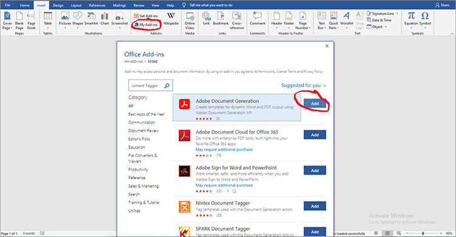
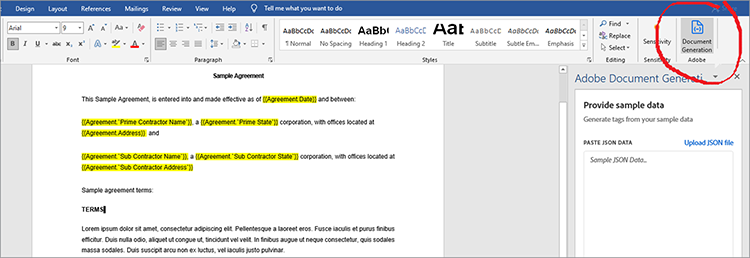
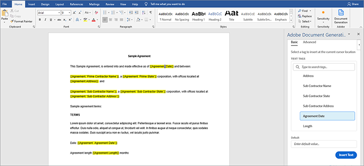
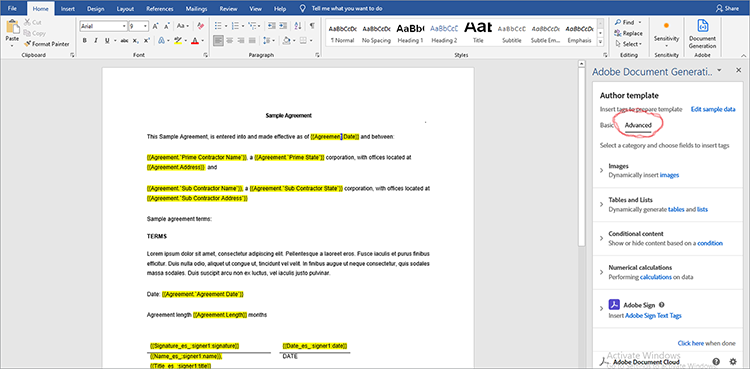
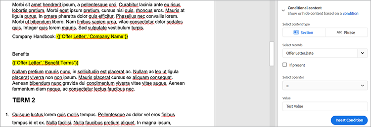
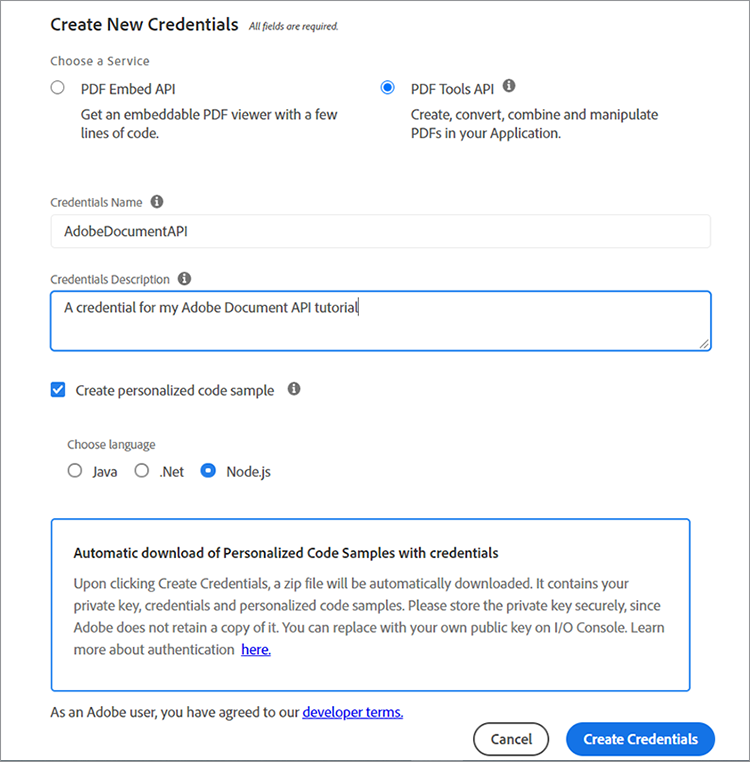
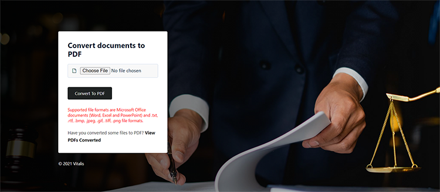

# Gestión de contratos legales


La digitalización conlleva desafíos Hoy en día, la mayoría de las organizaciones tienen muchos tipos de [contratos legales](https://www.adobe.io/apis/documentcloud/dcsdk/legal-contracts.html) que deben crear, editar, aprobar y que han firmado distintas partes. Estos contratos legales a menudo requieren una personalización y una construcción de marca únicas. Las organizaciones también pueden tener que guardarlos en un formato protegido una vez firmados para mantenerlos seguros. Para ello, necesitan una solución sólida de generación y gestión de documentos.

Muchas soluciones ofrecen cierta generación de documentos, pero no pueden personalizar las entradas de datos y la lógica condicional, como cláusulas que se aplican únicamente a escenarios específicos. La actualización manual de las plantillas legales de una empresa es difícil y propensa a errores a medida que estos documentos se amplían. La necesidad de automatizar estos procesos es considerable.

## Lo que puedes aprender

En este tutorial práctico, explora las funciones de [[!DNL Adobe Acrobat Services] API](https://www.adobe.io/apis/documentcloud/dcsdk/doc-generation.html) en la generación de campos de entrada personalizados en los documentos. Además, explora cómo convertir fácilmente estos documentos generados a un formato de documento portátil (PDF) protegido para evitar la manipulación de datos.

Este tutorial incluye un poco de programación a la hora de explorar la conversión de contratos en PDF. Para seguir adelante con eficacia, [Microsoft Word](https://www.microsoft.com/en-us/download/office.aspx) y [Node.js](https://nodejs.org/) debe estar instalado en el equipo. Conocimientos básicos de Node.js y [Sintaxis ES6](https://www.w3schools.com/js/js_es6.asp) también se recomienda.

## API y recursos relevantes

* [API de generación de documentos de Adobe](https://www.adobe.io/apis/documentcloud/dcsdk/doc-generation.html)

* [API de incrustación de PDF](https://www.adobe.com/devnet-docs/dcsdk_io/viewSDK/index.html)

* [API de Adobe Sign](https://www.adobe.io/apis/documentcloud/sign.html)

* [Código del proyecto](https://github.com/agavitalis/adobe_legal_contracts.git)

## Creación de un documento de plantilla

Puede crear documentos legales utilizando la aplicación Microsoft Word o descargando la [plantillas de Word de muestra](https://www.adobe.io/apis/documentcloud/dcsdk/doc-generation.html#sample-blade). Aun así, no es fácil personalizar las entradas y firmar digitalmente estos documentos sin utilizar algunas herramientas auxiliares como [Complemento Etiquetador de generación de documentos de Adobe](https://www.adobe.io/apis/documentcloud/dcsdk/docs.html?view=docgen-addin) para Microsoft Word.

El etiquetador de generación de documentos es un complemento de Microsoft Word, creado para que la personalización de documentos sea perfecta mediante etiquetas. Permite la creación de campos dinámicos en plantillas de documento que se rellenan dinámicamente mediante datos JSON.



Para ilustrar el uso del etiquetador de generación de documentos, instale este complemento y, a continuación, cree un modelo de datos JSON, que se utiliza en el etiquetado de un documento de contrato legal simple.

Instalar el etiquetador de generación de documentos en Word haciendo clic en el icono **Insertar** y, en el grupo Complementos, haga clic en **Mis complementos**. En el menú Complementos de Office, busque &quot;Generación de documentos de Adobe&quot; y haga clic en **Añadir** y sigue el proceso. Puede ver estos pasos en la captura de pantalla anterior.

Después de instalar el etiquetador de generación de documentos para el complemento de Word, cree un modelo de datos JSON simple para etiquetar el documento legal.

Para continuar, abra cualquier editor de su elección, cree un archivo llamado Agreement.json y, a continuación, pegue el fragmento de código siguiente en el archivo JSON que creó.

```
{
"Agreement": {
"Date": "1/24/2021",
"Prime Contractor Name": "Ogbonna Vitalis Corp",
"Prime State": "Lagos",
"Address": "Maryland Ave, Lagos State, Ng",
"Sub Contractor Name": "Vivvaa Soln",
"Sub Contractor State": "California",
"Sub Contractor Address": "Molusi Avenue, Dallas Texas, CA",
"Agreement Date": "1/24/2021",
"Length": 5
}
}
```

Después de guardar este documento JSON, impórtelo al complemento etiquetador de generación de documentos. Importe el documento haciendo clic en **Generación de documentos** en el grupo de Adobes de la parte superior derecha de la pantalla de Word, como se muestra en la captura de pantalla a continuación.



Esto muestra un vídeo para guiarte. Puede verlo o ir directamente al campo de etiquetado haciendo clic en **Introducción**. Después de hacer clic **Introducción**, aparece un formulario de carga. Haga clic en **Cargar archivo JSON** y seleccione el archivo JSON que acaba de crear. Cuando haya finalizado la importación, haga clic en **Generar etiqueta** para generar las etiquetas.

Después de importar y generar etiquetas, puede agregarlas al documento. Para añadirlas, coloque el cursor en el punto exacto en el que desea que aparezca la etiqueta. A continuación, seleccione una etiqueta de la API de generación de documentos y haga clic en **Insertar texto**. La captura de pantalla siguiente describe este procedimiento.



Además de las etiquetas básicas creadas con el modelo de datos JSON importado, también puede utilizar funciones avanzadas para obtener más opciones, como imágenes, lógica condicional, cálculos, elementos repetidos y frases condicionales. Puede acceder a estas funciones haciendo clic en **Avanzado** en el panel Etiquetador de generación de documentos. Puede ver esto en la captura de pantalla a continuación.



Estas funciones avanzadas no son diferentes de las etiquetas básicas. Para incluir lógica condicional, seleccione la parte del documento que desea rellenar. A continuación, configure la regla que determina la inserción de la etiqueta.

Para ilustrar mejor, por ejemplo, el acuerdo, hay una sección que desea incluir, solo de forma condicional. En el campo Seleccionar tipo de contenido, seleccione **Sección.** En el campo Seleccionar registros, elija la opción que determina si se muestra la sección condicional. Seleccione el operador condicional que desee y establezca el valor para el que vaya a realizar la prueba en el campo Valor. A continuación, haga clic **Insertar condición.** La captura de pantalla siguiente ilustra este proceso.



Para los cálculos, seleccione Aritmética o Agregación y, a continuación, incluya el primer registro, el operador y el segundo registro que desee utilizar en función de las etiquetas de plantilla disponibles. A continuación, haga clic **Insertar cálculo**.

Además, los contratos legales a menudo requieren firmas de las partes involucradas. Puede insertar una firma electrónica utilizando las etiquetas de texto de Adobe Sign que se encuentran justo debajo de la sección &quot;Cálculos numéricos&quot;. Para incluir la firma electrónica, debe especificar el número de destinatarios y seleccionar **Firmante** y el tipo de campo de las listas desplegables, según corresponda. Una vez hecho esto, haga clic en **Insertar etiqueta de texto de Adobe Sign** para finalizar el proceso.

Para garantizar la integridad de los datos, guarde los documentos legales en un formato protegido. Con [!DNL Acrobat Services] API, puede transformar rápidamente documentos en formato de PDF. Puede crear una aplicación sencilla Express Node.js, integrar la API de generación de documentos en ella y utilizar esta aplicación sencilla para convertir el documento etiquetado de Word al formato de PDF.

## Configuración del proyecto

En primer lugar, configure la estructura de carpetas para la aplicación Node.js. En este ejemplo, llame a esta aplicación sencilla AdobeLegalContractAPI. Puede recuperar el código fuente [aquí](https://github.com/agavitalis/adobe_legal_contracts.git).

### Estructura de directorios

Cree una carpeta denominada AdobeLegalContractAPI y ábrala en el editor que desee. Cree una aplicación Node.js básica con el ```npm init``` mediante la siguiente estructura de carpetas:

```
###Directory Structure
AdobeLegalContractAPI
-----config
----------default.json
-----controllers
----------createPDFController.js
----------previewController.js
-----models
----------document.js
-----routes
----------web.js
-----services
-----------upload.js
-----uploads
-----views
-----index.js
```

Arriba se muestra una estructura de aplicación Node.js simple para su aplicación. Ahora proceda con la instalación de los paquetes npm necesarios.

### Instalación de paquetes

Instale los paquetes requeridos usando el comando npm install como se muestra en el fragmento de código a continuación:

```
npm install express body-parser morgan multer hbs path config mongoose
```

Después de instalar los paquetes, asegúrese de que el contenido del archivo package.json sea similar al fragmento de código siguiente:

```
###package.json
{
"name": "adobelegalcontractapi",
"version": "1.0.0",
"description": "",
"main": "index.js",
"directories": {
"test": "test"
},
"dependencies": {
"body-parser": "^1.19.0",
"config": "^3.3.6",
"express": "^4.17.1",
"hbs": "^4.1.1",
"mongoose": "^5.12.1",
"morgan": "^1.10.0",
"multer": "^1.4.2",
"path": "^0.12.7"
},
"devDependencies": {},
"scripts": {
"start": "node index.js"
},
"repository": {
"type": "git",
"url": "https://github.com/agavitalis/adobe_legal_contracts.git"
},
"author": "Ogbonna Vitalis",
"license": "ISC",
"bugs": {
"url": "https://github.com/agavitalis/adobe_legal_contracts/issues"
},
"homepage": "https://github.com/agavitalis/adobe_legal_contracts#readme"
}
```

En estos fragmentos de código, instaló las dependencias de la aplicación, incluido el motor de plantillas de Handlebars para la vista.

El objetivo principal de este tutorial es utilizar [[!DNL Acrobat Services] API](https://www.adobe.io/apis/documentcloud/dcsdk/) para convertir documentos a PDF. Por lo tanto, no hay un proceso paso a paso de cómo generar esta aplicación Node.js. Sin embargo, puede recuperar el código de aplicación Node.js completo en funcionamiento en [GitHub](https://github.com/agavitalis/adobe_legal_contracts.git).

## Integración [!DNL Adobe Acrobat Services] API en una aplicación Node.js

[!DNL Adobe Acrobat Services] Las API son servicios fiables basados en la nube y diseñados para la manipulación perfecta de documentos. Ofrece tres API:

* API de servicios de Adobe PDF

* API Adobe PDF Embed

* API de generación de documentos de Adobe

Necesita credenciales para utilizar [!DNL Acrobat Services] API (distintas de las credenciales de API de incrustación de PDF). Si no tiene credenciales válidas, [registrar](https://www.adobe.com/go/dcsdks_credentials?ref=getStartedWithServicesSDK) y complete el flujo de trabajo como se muestra en la captura de pantalla a continuación. Disfruta de una [prueba gratis de seis meses y pago en función de las necesidades](https://www.adobe.io/apis/documentcloud/dcsdk/pdf-pricing.html), solo $0.05 por transacción de documento.



Una vez completado el proceso de registro, se descarga automáticamente un ejemplo de código en su equipo para ayudarle a comenzar. Puede extraer este ejemplo de código y seguirlo. No olvide copiar los archivos pdftools-api-credentials.json y private.key del ejemplo de código extraído al directorio raíz del proyecto Node.js. Las credenciales son necesarias para poder acceder a [!DNL Acrobat Services] Terminales de API. También puede descargar ejemplos de SDK con sus credenciales personalizadas para no tener que actualizar la clave en el código de ejemplo.

Ahora, instale el SDK del nodo de servicios de Adobe PDF ejecutando el ```npm install \--save @adobe/documentservices-pdftools-node-sdk``` mediante el terminal del directorio raíz de la aplicación. Si se instala correctamente, puede utilizar [!DNL Acrobat Services] API para manipular documentos en la aplicación.

## Creación de un documento de PDF

[!DNL Acrobat Services] Las API permiten crear PDF a partir de documentos de Microsoft Office (Word, Excel y PowerPoint) y otros [formatos de archivo compatibles](https://opensource.adobe.com/pdftools-sdk-docs/release/latest/howtos.html#create-a-pdf) como .txt, .rtf, .bmp, .jpeg, gif, .tiff y .png. Puedes convertir fácilmente contratos legales de cualquier otro formato de archivo a PDF mediante las API de servicios de Acrobat.

La API de generación de documentos de Adobe permite convertir a un archivo o PDF de Word. Por ejemplo, puede utilizar una plantilla de Word para generar un contrato, incluida la modificación para marcar el texto editado. Luego, conviértalo en un PDF y usa la API de servicios de PDF para proteger el documento con una contraseña, enviarlo para que se firme y mucho más.

Para implementar la creación de documentos de PDF a partir de los formatos de archivo compatibles disponibles, existe un formulario para cargar un documento para transformarlo mediante [!DNL Acrobat Services].

El formulario de carga diseñado aparece en la captura de pantalla que aparece a continuación y puede acceder a los archivos de HTML y CSS en [GitHub](https://github.com/agavitalis/adobe_legal_contracts.git).



Ahora, agregue los siguientes fragmentos de código al archivo /createPDFController.js de controladores. Este código recupera el documento cargado y lo transforma en PDF. [!DNL Acrobat Services] guarda el archivo cargado original y el archivo transformado en diferentes carpetas.

```
###controllers/createPDFController.js
const PDFToolsSdk = require('@adobe/documentservices-pdftools-node-sdk');
const Document = require('../models/document');
/*
* GET / route to show the createPDF form.
*/
function createPDF(req, res) {
//catch any response on the url
let response = req.query.response
res.render('index', { response })
}
/*
* POST /createPDF to create a new PDF File.
*/
function createPDFPost(req, res) {
let filePath = req.file.path;
let fileName = req.file.filename;
try {
// Initial setup, create credentials instance.
const credentials = PDFToolsSdk.Credentials
.serviceAccountCredentialsBuilder()
.fromFile("pdftools-api-credentials.json")
.build();
// Create an ExecutionContext using credentials and create a new operation instance.
const executionContext = PDFToolsSdk.ExecutionContext.create(credentials),
createPdfOperation = PDFToolsSdk.CreatePDF.Operation.createNew();
// Set operation input from a source file.
const input = PDFToolsSdk.FileRef.createFromLocalFile(filePath);
createPdfOperation.setInput(input);
// Execute the operation and Save the result to the specified location.
createPdfOperation.execute(executionContext)
.then(async(result) => {
let newFileName = `createPDFFromDOCX-${Math.random() * 171}.pdf`
let newFilePath = require('path').resolve('./') + `\\output\\${newFileName}`
await result.saveAsFile(`views/output/${newFileName}`)
//Creates a new document
let newDocument = new Document({
documentName: newFileName,
url: newFilePath
});
//Save it into the DB.
newDocument.save((err, docs) => {
if (err) {
res.send(err);
}
else {
res.redirect('/?response=PDF Successfully created')
}
});
})
.catch(err => {
if (err instanceof PDFToolsSdk.Error.ServiceApiError
|| err instanceof PDFToolsSdk.Error.ServiceUsageError) {
console.log('Exception encountered while executing operation', err);
} else {
console.log('Exception encountered while executing operation', err);
}
});
} catch (err) {
console.log('Exception encountered while executing operation', err);
}
}
//export all the functions
module.exports = { createPDF, createPDFPost };
```

El fragmento de código anterior requería el modelo de documento y [!DNL Acrobat Services] SDK de nodo que instaló anteriormente. Hay dos funciones:

* createPDF muestra el formulario de carga de documento.

* createPDFPost transforma el documento cargado en un PDF.

Las funciones guardan los documentos de PDF transformados en el directorio de vistas/salida, donde puede descargarlos en su PC.

También puede obtener una vista previa del archivo de PDF transformado mediante la API gratuita PDF Embed. Mediante la API de incrustación de PDF, puede generar credenciales de Adobe [aquí](https://www.adobe.com/go/dcsdks_credentials) (diferente de su [!DNL Acrobat Services] y registrar los dominios permitidos para acceder a la API. Siga el proceso y genere las credenciales de la API embed de PDF para su aplicación. También puede ver la demostración [aquí](https://documentcloud.adobe.com/view-sdk-demo/index.html#/view/FULL_WINDOW/Bodea%20Brochure.pdf), desde el que puede generar fácilmente códigos para comenzar rápidamente.

De vuelta a la aplicación, cree los archivos list.hbs y preview.hbs en la carpeta view de la aplicación y pegue el fragmento de código siguiente en los archivos list.hbs y preview.hbs, respectivamente.

```
###views/list.hbs
<!DOCTYPE html>
<html lang="en">
<head>
<title>Adobe Legal Contract</title>
<!-- Meta tags -->
<meta charset="UTF-8">
<meta name="viewport" content="width=device-width,
initial-scale=1.0">
<meta http-equiv="X-UA-Compatible" content="ie=edge">
<!-- //Meta tags -->
<link
href=".min.css" rel="stylesheet" integrity="sha384-eOJMYsd53ii+scO/
bJGFsiCZc+5NDVN2yr8+0RDqr0Ql0h+rP48ckxlpbzKgwra6" crossorigin="anonymous">
<link rel="stylesheet" href="css/style.css" type="text/css"
media="all" /><!-- Style-CSS -->
<link href="css/font-awesome.css" rel="stylesheet" /><!--
font-awesome-icons -->
</head>
<body>
<section>
<div class="form-36-mian section-gap">
<div class="wrapper">
<div class="container">
<div class="row">
{{#each documents}}
<div class="col-md-4 mb-2">
<div class="card" style="width:
18rem;">

<div class="card-body">
<h5
class="card-title">{{documentName}}</h5>
<a
href="/downloadPDF/{{_id}}" class="btn btn-primary"><i class="fa
fa-download" aria-hidden="true"></i> Download</a>
<a
href="/previewPDF/{{_id}}" class="btn btn-info"><i class="fa fa-eye"
aria-hidden="true"></i> Preview</a>
</div>
</div>
</div>
{{/each}}
</div>
</div>
<!-- copyright -->
<div class="copy-right">
<p>(c) 2021 Vitalis</p>
</div>
<!-- //copyright -->
</div>
</div>
</section>
</body>
</html>
###views/preview.hbs
<!DOCTYPE html>
<html lang="en">
<head>
<title>[!DNL Adobe Acrobat Services] PDF Embed API</title>
<meta charset="utf-8" />
<meta http-equiv="X-UA-Compatible" content="IE=edge,chrome=1" />
<meta id="viewport" name="viewport" content="width=device-width,
initial-scale=1" />
</head>
<body style="margin: 0px">
<input type="hidden" id="pdfDocumentName"
value={{document.documentName}} />
<input type="hidden" id="pdfDocumentUrl" value={{document.url}} />
<div id="adobe-dc-view"></div>
<script
src="https://documentcloud.adobe.com/view-sdk/main.js"></script>
<script type="text/javascript">
let pdfDocumentName =
document.getElementById("pdfDocumentName").value;
let pdfDocumentUrl =
document.getElementById("pdfDocumentUrl").value;
document.addEventListener("adobe_dc_view_sdk.ready", function
() {
var adobeDCView = new AdobeDC.View({ clientId:
"XXXXXXXXXXXXXXXX", divId: "adobe-dc-view" });
adobeDCView.previewFile({
content: { location: { url:
`http://localhost:5000/output/${pdfDocumentName}` } },
metaData: { fileName: pdfDocumentName }
}, {});
});
</script>
</body>
</html>
```

Además, cree un archivo controller/previewController.js y pegue en él los fragmentos de código siguientes.

```
const Document = require('../models/document');
/*
* GET /listFiles route to show PDF file lists.
*/
async function listFiles(req, res) {
let documents = await Document.find({});
res.render('lists', { documents })
}
/*
* GET /previewPDF route to show PDF file in AdobeEmbedAPI.
*/
async function previewPDF(req, res) {
//catch any response on the url
let documentId = req.params.documentId
let document = await Document.findOne({_id:documentId});
res.render('preview', { document })
}
/*
* GET /downloadPDF To Download PDF Documents.
*/
async function downloadPDF(req, res) {
let documentId = req.params.documentId
let document = await Document.findOne({_id:documentId});
res.download(document.url);
}
//export all the functions
module.exports = {listFiles, previewPDF, downloadPDF };
```

En el archivo de controlador anterior, hay tres funciones: listFiles, previewPDF y downloadPDF. La función listFiles enumera todos los archivos de PDF generados hasta el momento mediante [!DNL Acrobat Services] API. La función previewPDF permite previsualizar los archivos del PDF mediante la API PDF Embed, mientras que la función downloadPDF permite descargar el archivo del PDF generado en el equipo. La captura de pantalla siguiente muestra una muestra de la vista previa del PDF mediante la API de PDF Embed.


## Resumen

En este tutorial práctico, etiquetó un documento con el complemento Word de Microsoft Document Generation Tagger. A continuación, integrada [!DNL Acrobat Services] Las API en una aplicación Node.js y convertía un documento etiquetado a un formato de PDF descargable, aunque también podía haber creado el contrato legal directamente al PDF. Por último, ha utilizado la API Adobe PDF Embed para obtener una vista previa del PDF generado para su verificación y firma.

La aplicación completada hace que sea mucho más fácil etiquetar [plantillas de contrato legal](https://www.adobe.io/apis/documentcloud/dcsdk/legal-contracts.html) con campos dinámicos, conviértalos a PDF, previsualícelos y fírmelos con [!DNL Acrobat Services] API. En lugar de perder tiempo creando un contrato único, tu equipo puede enviar automáticamente el contrato correcto a cada cliente y luego dedicar más tiempo al crecimiento de tu negocio.

Las organizaciones utilizan [!DNL Adobe Acrobat Services] API por su integridad y facilidad de uso. Lo mejor de todo es que puedes disfrutar de un [prueba gratis de seis meses y pago en función de las necesidades](https://www.adobe.io/apis/documentcloud/dcsdk/pdf-pricing.html). Sólo pagas por lo que usas. Además, la API PDF Embed siempre es gratuita.

¿Todo listo para aumentar la productividad mejorando el flujo de documentos? [Introducción](https://www.adobe.io/apis/documentcloud/dcsdk/gettingstarted.html) hoy.
