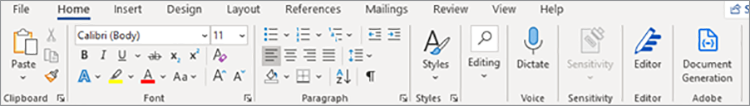
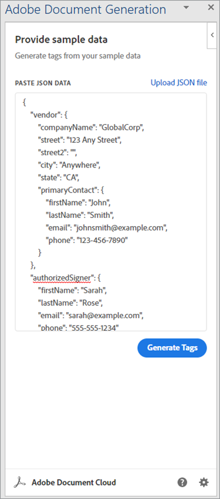
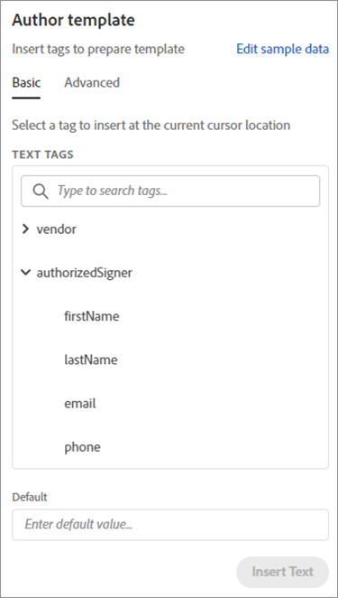
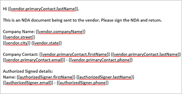
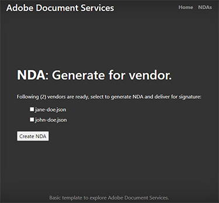
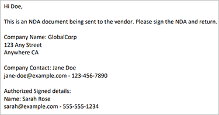

# Creación de un acuerdo de confidencialidad


Las organizaciones colaboran con colaboradores externos para crear sus servicios y productos. Un acuerdo de confidencialidad (NDA) es un elemento importante de estas colaboraciones. Impide a todas las partes revelar cualquier información confidencial que pueda perjudicar a cualquiera de las entidades.

El formato de acuerdo de confidencialidad más utilizado es un documento de PDF. Las organizaciones preparan un acuerdo de confidencialidad y lo envían a todas las partes. Luego, una vez que todos han firmado, inician el contrato. En un equipo de gran velocidad, la creación manual de PDF ralentiza el progreso.

## Lo que puedes aprender

Este tutorial práctico explica cómo crear una plantilla especializada de acuerdo de confidencialidad de Word de Microsoft para su empresa. Complemento gratuito de Adobe para Microsoft Word, [Etiquetador de generación de documentos de Adobe](https://opensource.adobe.com/pdftools-sdk-docs/docgen/latest/wordaddin.html#add-in-demo), inserta &quot;tags&quot; para introducir los valores dinámicos. Aprenda a pasar los datos JSON a la plantilla y a crear un PDF dinámico. El PDF resultante puede enviarse por correo electrónico o mostrarse a sus colaboradores en su navegador, en función de los requisitos y objetivos de su empresa. Para seguir los pasos, solo necesitas un poco de experiencia con Node.js, JavaScript, Express.js, HTML y CSS.

## API y recursos relevantes

Con [!DNL Adobe Acrobat Services]Además, puedes generar documentos de PDF sobre la marcha utilizando datos dinámicos. [!DNL Acrobat Services] ofrece un conjunto de herramientas de PDF, incluida la API de generación de documentos de Adobe para automatizar [Creación de acuerdo de confidencialidad](https://www.adobe.io/apis/documentcloud/dcsdk/nda-creation.html).

* [API de generación de documentos de Adobe](https://www.adobe.io/apis/documentcloud/dcsdk/doc-generation.html)

* [API de Adobe Sign](https://www.adobe.io/apis/documentcloud/sign.html)

* [Etiquetador de generación de documentos de Adobe](https://opensource.adobe.com/pdftools-sdk-docs/docgen/latest/wordaddin.html#add-in-demo)

* [Código del proyecto](https://github.com/afzaal-ahmad-zeeshan/adobe-docugen-sample)

* [[!DNL Acrobat Services] teclas](https://opensource.adobe.com/pdftools-sdk-docs/release/latest/index.html#getcred)

## Creación del modelo JSON

La plantilla de Microsoft Word depende del modelo JSON, por lo que debe crearla primero. Para el tutorial, se utiliza una estructura JSON básica que contiene los detalles de la empresa, como la información de contacto.

```
{
"vendor": {
"companyName": "GlobalCorp",
"street": "123 Any Street",
"street2": "",
"city":"Anywhere",
"state":"CA",
"primaryContact": {
"firstName":"John",
"lastName":"Doe",
"email":"john-doe@example.com",
"phone":"123-456-7890"
}
},
"authorizedSigner": {
"firstName": "Sarah",
"lastName": "Rose",
"email": "sarah@example.com",
"phone":"555-555-1234"
}
}
```

Esta estructura se utiliza dentro de Microsoft Word para generar una plantilla. Estos datos pueden proceder de cualquier origen de datos, siempre que estén en formato JSON. Para simplificar, se crean varios archivos dentro de la aplicación Node.js, pero el caso de uso puede requerir una conexión a base de datos para obtener información del proveedor.

## Crear la plantilla de Microsoft Word

Cree la plantilla de acuerdo de confidencialidad en un documento de Microsoft Word. La API de servicios de Adobe PDF espera que el documento de Microsoft Word contenga etiquetas en las que el servicio pueda insertar valores de documentos JSON. Aunque la plantilla es la misma para todas las solicitudes de Adobe, los datos dinámicos en JSON cambian. Estas etiquetas ayudan a crear documentos de PDF para cada proveedor en este caso, utilizando una única plantilla de Microsoft Word y acelerando el proceso automatizando la generación de documentos de acuerdo de confidencialidad.

Puede instalar el [complemento gratuito etiquetador de generación de documentos](https://opensource.adobe.com/pdftools-sdk-docs/docgen/latest/wordaddin.html#add-in-demo) a Microsoft Word. Si forma parte de una organización, puede solicitar al administrador de Microsoft Office que instale el complemento gratuito para todos los usuarios.

Una vez instalado el complemento, puede encontrarlo en la ficha Inicio, en la categoría Adobe. Para abrir la ficha, seleccione **Generación de documentos**:



Dentro de la pestaña, puede cargar el documento JSON de muestra. Este documento puede ser un ejemplo porque sólo se utiliza para crear una plantilla de Microsoft Word.



Seleccionar **Generar etiquetas** para ver los elementos que puede utilizar en la plantilla. Estas son las propiedades extraídas de la estructura JSON, listas para su uso en la plantilla:



Estas son las funciones de la `authorizedSigner` campo. Se ajustan otros campos y puede expandir la vista en Microsoft Word. El complemento también ofrece opciones de datos avanzadas, como tablas, listas, valores calculados y mucho más.

## Creación de etiquetas

No dude en crear una plantilla o importar un [plantilla existente](https://www.adobe.io/apis/documentcloud/dcsdk/doc-generation.html#sample-blade) en Microsoft Word. Una vez que haya configurado el documento, agregue etiquetas a cada campo haciendo clic en los tokens correspondientes del complemento.

La siguiente plantilla en un archivo de Microsoft Word:



Este archivo contiene varias etiquetas. Al ejecutar el programa, estos campos se rellenan con la información del proveedor.

Document Generation Tagger se integra con la API de Adobe Sign. Gracias a esta integración, puede crear automáticamente etiquetas de texto de Sign para que el documento generado pueda enviarse a Adobe Sign para su firma.

## Generación del acuerdo de confidencialidad para proveedores

Dentro de la aplicación de ejemplo, ha preparado carpetas para los datos de entrada y salida. Como se ha mencionado anteriormente, puede utilizar archivos JSON, de modo que haya dos archivos que muestren los proveedores disponibles en el sistema. Los archivos se muestran dentro de un formulario que se imprime en el explorador:

```
<h1><b>NDA</b>: Generate for vendor.</h1>
<hr />
<p>Following ({{files.length}}) vendors are ready, select to generate NDA and deliver for signature:</p>
<form method="POST">
<ul>
{{#each files }}
<li><input type="checkbox" name="vendor" value="{{this}}" id="file-{{@index}}" /> <label for="file-{{@index}}">{{this}}</label></li>
{{/each}}
</ul>
<input type="submit" value="Create NDA" />
</form>
```

Este código genera la siguiente interfaz de usuario en el explorador:



Cuando el administrador selecciona a una persona, la aplicación utiliza los servicios de Adobe PDF para generar el acuerdo de confidencialidad sobre la marcha.

```
async function compileDocFile(json, inputFile, outputPdf) {
try {
// configurations
const credentials = adobe.Credentials
.serviceAccountCredentialsBuilder()
.fromFile("./src/pdftools-api-credentials.json")
.build();
// Capture the credential from app and show create the context
const executionContext = adobe.ExecutionContext.create(credentials);
// create the operation
const documentMerge = adobe.DocumentMerge,
documentMergeOptions = documentMerge.options,
options = new documentMergeOptions.DocumentMergeOptions(json, documentMergeOptions.OutputFormat.PDF);
const operation = documentMerge.Operation.createNew(options);
// Pass the content as input (stream)
const input = adobe.FileRef.createFromLocalFile(inputFile);
operation.setInput(input);
// Async create the PDF
let result = await operation.execute(executionContext);
await result.saveAsFile(outputPdf);
} catch (err) {
console.log('Exception encountered while executing operation', err);
}
}
```

Utilice este código dentro del enrutador Express:

```
// Create one report and send it back
try {
console.log(`[INFO] generating the report...`);
const fileContent = fs.readFileSync(`./public/documents/raw/${vendor}`, 'utf-8');
const parsedObject = JSON.parse(fileContent);
await pdf.compileDocFile(parsedObject, `./public/documents/template/Adobe-NDA-Sample.docx`, `./public/documents/processed/output.pdf`);
console.log(`[INFO] sending the report...`);
res.status(200).render("preview", { page: 'nda', filename: 'output.pdf' });
} catch(error) {
console.log(`[ERROR] ${JSON.stringify(error)}`);
res.status(500).render("crash", { error: error });
}
```

Puede ver [el código de ejemplo completo](https://github.com/afzaal-ahmad-zeeshan/adobe-docugen-sample) en GitHub.

Este código utiliza un documento JSON y la plantilla de Microsoft Word en la llamada de API a la [!DNL Adobe Acrobat Services] SDK. En la respuesta, recibirá la salida y la guardará en el sistema de archivos de la aplicación. Puede reenviar el documento generado a sus clientes por correo electrónico o mostrarles una vista previa en el navegador usando la [API Adobe PDF Embed](https://www.adobe.io/apis/documentcloud/dcsdk/pdf-embed.html).

Esta llamada crea el siguiente documento de acuerdo de confidencialidad:



[!DNL Adobe Acrobat Services] Las API insertan contenido para crear un documento de PDF. Sin estas herramientas, es posible que tenga que escribir el código para procesar documentos de Office y trabajar con formatos de archivo de PDF sin procesar. Con la ayuda de los servicios de Adobe PDF, puede realizar todos estos pasos con una sola llamada de API.

Ahora utilice [API de Adobe Sign](https://www.adobe.io/apis/documentcloud/sign.html) para solicitar firmas en los acuerdos de confidencialidad y entregar el documento final firmado a todas las partes. Adobe Sign le notifica [uso de un webhook](https://www.adobe.io/apis/documentcloud/sign/docs.html#!adobedocs/adobe-sign/master/webhooks.md). Al escuchar este webhook, puede obtener el estado del acuerdo de confidencialidad.

Para obtener una explicación más detallada del proceso de Adobe Sign, [consultar la documentación](https://www.adobe.io/apis/documentcloud/sign/docs.html) o lee esta entrada de blog detallada.

## Pasos siguientes

En este tutorial práctico, el etiquetador de generación de documentos de Adobe se utilizó para generar dinámicamente documentos de PDF mediante plantillas de Microsoft Word y archivos de datos JSON. El complemento ayudó a [crear acuerdos de confidencialidad automáticamente](https://www.adobe.io/apis/documentcloud/dcsdk/nda-creation.html) personalizado para cada parte y, a continuación, recopilar firmas mediante la API de Sign.

Puedes usar estas técnicas para crear dinámicamente tus propios acuerdos de confidencialidad u otros documentos, lo que libera el tiempo de tu equipo para centrarte en el trabajo productivo. Explorar [[!DNL Adobe Acrobat Services]](https://www.adobe.io/apis/documentcloud/dcsdk/pdf-tools.html) para encontrar API y SDK para el lenguaje y el tiempo de ejecución que prefiera, de modo que pueda agregar funciones de PDF directamente a las aplicaciones para crear rápidamente documentos de PDF. [Introducción](https://www.adobe.io/apis/documentcloud/dcsdk/gettingstarted.html) con una prueba gratis de seis meses
[de pago por uso](https://www.adobe.io/apis/documentcloud/dcsdk/pdf-pricing.html) por solo $0.05 por transacción de documento.
