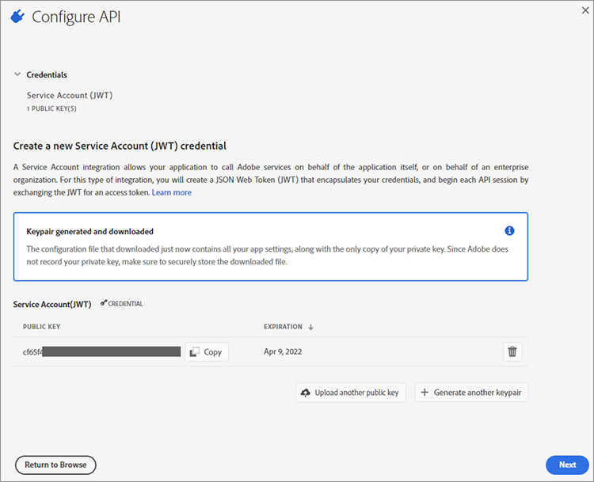
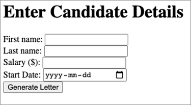
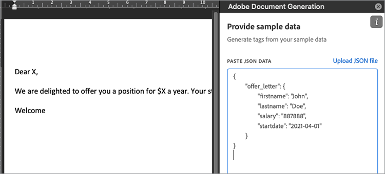

# Administrar cartas de oferta de empleados


Las cartas de oferta de los empleados son una de las primeras experiencias que tienen los empleados con tu organización. Como resultado, desea asegurarse de que las cartas de oferta sean de la marca, pero no desea tener que crear una carta en el procesador de textos desde cero cada vez. [!DNL Adobe Acrobat Services] Las API ofrecen una forma rápida, fácil y eficaz de gestionar las partes clave de [generación y entrega de cartas de oferta a los nuevos empleados](https://www.adobe.io/apis/documentcloud/dcsdk/employee-offer-letters.html).

## Lo que puedes aprender

Este tutorial práctico le guiará en la configuración de un proyecto de Node Express que muestra un formulario web para que un usuario lo rellene con los detalles de los empleados. Estos detalles utilizan [!DNL Acrobat Services] a través de la web para generar una carta de oferta como PDF que se pueda enviar a un cliente para que la firme mediante la API de Adobe Sign.

## API y recursos relevantes

* [API de servicios de PDF](https://opensource.adobe.com/pdftools-sdk-docs/release/latest/index.html)

* [API de generación de documentos de Adobe](https://www.adobe.io/apis/documentcloud/dcsdk/doc-generation.html)

* [API de Adobe Sign](https://www.adobe.io/apis/documentcloud/sign.html)

* [Complemento Word del etiquetador de generación de documentos](https://www.adobe.io/apis/documentcloud/dcsdk/docs.html?view=docgen-addin)

* [Ejemplo de proyecto](https://www.adobe.io/apis/documentcloud/dcsdk/employee-offer-letters.html)

## Introducción

[Node.js](https://nodejs.org/) es la plataforma de programación. Viene con un enorme conjunto de bibliotecas, como el servidor web Express. [Descargar Node.js](https://nodejs.org/en/download/) y siga los pasos para instalar este gran entorno de desarrollo de código abierto.

Para utilizar la API de generación de documentos de Adobe en Node.js, vaya al [API de generación de documentos](https://www.adobe.io/apis/documentcloud/dcsdk/doc-generation.html) para acceder a su cuenta o registrarse para obtener una nueva. Tu cuenta es [gratis durante seis meses y luego de pago por uso](https://www.adobe.io/apis/documentcloud/dcsdk/pdf-pricing.html) por solo 0,05 USD por transacción de documento, para que puedas probarlo sin riesgos y solo pagarlo a medida que crezca tu empresa.

Después de iniciar sesión en el [Adobe Developer Console](https://console.adobe.io/), haga clic en **[!UICONTROL Crear nuevo proyecto]**. El proyecto se denomina &quot;Proyecto 1&quot; de forma predeterminada. Haga clic en **[!UICONTROL Editar proyecto]** y cambie el nombre a &quot;Generador de cartas de oferta&quot;. En el centro de la pantalla hay una **[!UICONTROL Empezar Con El Nuevo Proyecto]** sección. Para activar la seguridad en el proyecto, siga estos pasos:

Haga clic en **Añadir API**. Verá una serie de API entre las que elegir. En la **[!UICONTROL Filtrar por producto]** , seleccione **[!UICONTROL Document Cloud]**, haga clic en **[!UICONTROL Siguiente]**.

Ahora, genere credenciales para acceder a la API. Las credenciales tienen el formato de un token web JSON ([JWT](https://jwt.io/)): un estándar abierto para una comunicación segura. Si está familiarizado con JWT y ya ha generado claves, puede cargar su clave pública aquí. Como alternativa, seleccione **Opción 1** para que Adobe genere las claves automáticamente.



Haga clic en **[!UICONTROL Generar par de claves]** botón. Se obtiene un archivo config.zip para descargar. Descomprima el archivo de almacenamiento. Contiene dos archivos: certificate_pub.crt y private.key. Asegúrese de que esta última se mantenga segura, ya que contiene sus credenciales privadas y puede utilizarse para generar documentos falsos si está fuera de su control.

Haga clic en **[!UICONTROL Siguiente]**. No, habilita el acceso a la API de generación de PDF. En la **[!UICONTROL Seleccionar perfiles de producto]** pantalla, comprobar **[!UICONTROL Desarrollador de servicios de PDF empresarial]** y haga clic en el **[!UICONTROL Guardar API configurada]** botón. Ahora ya puede empezar a utilizar la API.

## Configuración del proyecto

Configure un proyecto Node para ejecutar el código. En este ejemplo se utiliza [Visual Studio Code](https://code.visualstudio.com/) (VS Code) como editor. Haga una carpeta llamada &quot;letter-generator&quot; y ábrala en VS Code. Desde el **[!UICONTROL Archivo]** menú, seleccionar **[!UICONTROL Terminal]** \> **[!UICONTROL Nuevo terminal]** para abrir un shell en esta carpeta. Compruebe que Node está instalado y en su ruta introduciendo lo siguiente:

```
node -v
```

Debería ver la versión de Node que instaló.

Ahora que ya tiene instalado el entorno de desarrollo, puede continuar y crear el proyecto.

En primer lugar, inicialice el proyecto mediante el Administrador de paquetes de nodos (npm). Escriba lo siguiente:

```
npm init
```

Se le harán algunas preguntas sobre su proyecto Node. Puede omitir la mayoría de estas preguntas, pero asegúrese de que el nombre del proyecto sea &quot;generador de letras&quot; y que el punto de entrada sea **index.js**. Seleccionar **Sí** para completar la inicialización del proyecto.

Ahora tiene un archivo package.json. Node utiliza este archivo para organizar el proyecto. Antes de crear index.js, debe agregar bibliotecas de Adobes con el siguiente comando:

```
npm install --save @adobe/documentservices-pdftools-node-sdk
```

Debe haber una nueva carpeta llamada node_modules añadida a su proyecto. En esta carpeta es donde se descargan todas las bibliotecas (denominadas dependencias en el nodo). El archivo package.json también se actualiza con una referencia a los servicios de Adobe PDF.

Ahora desea instalar Express como su framework web ligero. Introduzca el siguiente comando:

```
npm install express –save
```

Como antes, la sección de dependencias de package.json se actualiza en consecuencia.

## Creación de una plantilla de carta de oferta

Ahora, en la raíz del proyecto, cree un archivo llamado &quot;app.js&quot;. Vamos a poner el siguiente código de inicio:

```
const express = require('express');
const bodyParser = require('body-parser');
const PDFToolsSdk = require('@adobe/documentservices-pdftools-node-sdk')
const path = require('path');
const app = express();
const port = 8000;
app.use(bodyParser.urlencoded({ extended: true }));
app.get('/', (req, res) => {
res.sendFile(path.join(__dirname + '/index.html'));
});
app.post('/', (req, res) => {
console.log('Got body:', req.body);
res.sendStatus(200);
});
app.listen(port, () => {
console.log(`Candidate offer letter app listening on port ${port}!`)
});
```

Observe que la ruta de obtención devuelve un **index.html** archivo. Vamos a crear un archivo de HTML con ese nombre y el siguiente formato simple. Puede añadir estilos CSS y otros elementos de diseño más adelante como considere oportuno. Este formulario toma los detalles básicos del candidato para generar una carta de bienvenida:

```
<!DOCTYPE html>
<html lang="en">
<head>
<meta charset="UTF-8">
<meta http-equiv="X-UA-Compatible" content="IE=edge">
<meta name="viewport" content="width=device-width, initial-scale=1.0">
<title>Offer Letter Generator</title>
</head>
<body>
<h1>Enter Candidate Details</h1>
<form action="" method="post">
<div>
<label for="firstname">First name: </label>
<input type="text" name="firstname" id="firstname" required>
</div>
<div>
<label for="lastname">Last name: </label>
<input type="text" name="lastname" id="lastname" required>
</div>
<div>
<label for="salary">Salary ($): </label>
<input type="number" name="salary" id="salary" required>
</div>
<div>
<label for="startdate">Start Date: </label>
<input type="date" name="startdate" id="startdate" required>
</div>
<div>
<input type="submit" value="Generate Letter">
</div>
</form>
</body>
</html>
```

Ejecute el servidor web con el siguiente comando:

```
node app.js
```

Debería ver el mensaje &quot;Candidate offer letter app listener on port 8000&quot;. Si abre el navegador para <http://localhost:8000/>, el formulario debe tener el aspecto siguiente:



Observe que el formulario se envía a sí mismo. Si rellena los datos y hace clic en **Generar carta,** debería ver la siguiente información en la consola:

```
Got body: { firstname: 'John',
lastname: 'Doe',
salary: '887888',
startdate: '2021-04-01' }
```

Reemplace este registro de consola por una llamada de servicio web a [!DNL Acrobat Services]. En primer lugar, debe crear un modelo de la información basado en JSON. El formato de este modelo es similar al siguiente:

```
{
    "offer_letter": {
    "firstname": "John",
    "lastname": "Doe",
    "salary": "887888",
    "startdate": "2021-04-01"
    }
}
```

Puedes hacer este modelo más elaborado si lo deseas, pero para este tutorial, sigue con este sencillo ejemplo. No hay validación en este formulario porque está fuera del ámbito de este artículo. Para convertir el cuerpo del formulario al modelo de datos descrito anteriormente, cambie el método controlador app.post para que tenga el código siguiente:

```
app.post('/', (req, res) => {
const docModel = {'offer_letter': req.body};
generateLetter(docModel);
res.sendStatus(200);
});
```

La primera línea coloca los datos JSON en el formato deseado. Ahora pasa estos datos a una función generateLetter. Detenga el servidor y pegue el siguiente código al final de app.js. Este código toma un documento de Word como plantilla y rellena los marcadores de posición con información de un documento JSON.

```
// Letter generation function
function generateLetter(jsonDataForMerge) {
try {
// Initial setup, create credentials instance.
const credentials = PDFToolsSdk.Credentials
.serviceAccountCredentialsBuilder()
.fromFile("pdftools-api-credentials.json")
.build();
// Create an ExecutionContext using credentials
const executionContext = PDFToolsSdk.ExecutionContext.create(credentials);
// Create a new DocumentMerge options instance
const documentMerge = PDFToolsSdk.DocumentMerge,
documentMergeOptions = documentMerge.options,
options = new documentMergeOptions.DocumentMergeOptions(jsonDataForMerge,
documentMergeOptions.OutputFormat.PDF);
// Create a new operation instance using the options instance
const documentMergeOperation = documentMerge.Operation.createNew(options)
// Set operation input document template from a source file.
const input = PDFToolsSdk.FileRef.createFromLocalFile(
'resources/OfferLetter-Template.docx');
documentMergeOperation.setInput(input);
// Execute the operation and Save the result to the specified location.
documentMergeOperation.execute(executionContext)
.then(result => result.saveAsFile('output/OfferLetter.pdf'))
.catch(err => {
if(err instanceof PDFToolsSdk.Error.ServiceApiError
|| err instanceof PDFToolsSdk.Error.ServiceUsageError) {
console.log(
'Exception encountered while executing operation', err);
} else {
console.log(
'Exception encountered while executing operation', err);
}
});
} catch (err) {
console.log('Exception encountered while executing operation', err);
}
}
```

Hay mucho código que descomprimir allí. Vamos a tomar la parte principal primero: la `documentMergeOperation`. En esta sección se toman los datos JSON y se combinan con una plantilla de documento de Word. Puede utilizar la [ejemplo en el sitio de Adobe](https://www.adobe.io/apis/documentcloud/dcsdk/doc-generation.html#sample-blade) como referencia, pero vamos a hacer tu propio ejemplo simple. Abra Word y cree un nuevo documento en blanco. Puedes personalizarlo todo lo que quieras, pero al menos tienes algo como esto:

Estimado/a X:

Nos complace ofrecerle un puesto por $X al año. La fecha de inicio será X.

Bienvenida

Guarde el documento como &quot;OfferLetter-Template.docx&quot; en una carpeta denominada &quot;resources&quot; en la raíz del proyecto. Observe las tres X del documento. Esas X son marcadores de posición temporales para su información JSON. Aunque podría utilizar una sintaxis especial para reemplazar estos marcadores de posición, Adobe proporciona un complemento de Word que simplifica esta tarea. Para instalar el complemento, vaya al Adobe [Complemento Word del etiquetador de generación de documentos](https://www.adobe.io/apis/documentcloud/dcsdk/docs.html?view=docgen-addin) sitio.

En su plantilla de carta de oferta, haga clic en el botón **Generación de documentos** botón. Se abre un panel lateral. Haga clic en **Empezar**. Se le proporciona un área de texto para pegar en los datos JSON de ejemplo. Copie el fragmento de &quot;offer-data&quot; de JSON desde arriba en el área de texto. Debería tener el siguiente aspecto:



Haga clic en **Generar etiquetas** botón. Se obtiene un menú desplegable de etiquetas para insertar en los puntos apropiados del documento. Resalte la primera X del documento y seleccione **[!UICONTROL nombre]**. Haga clic en **[!UICONTROL Insertar texto]** y &quot;Estimado X&quot; se cambia a &quot;Estimado ```{{`offer_letter`.firstname}}```,&quot;. Esta etiqueta tiene el formato correcto para `documentMergeOperation`. Continúe y agregue las tres etiquetas restantes en el Xs apropiado. No olvide guardar OfferLetter-template.docx. Debería tener este aspecto:

Estimado/a ```{{`offer_letter`.firstname}} {{`offer_letter`.lastname}}```:

Estamos encantados de ofrecerle un puesto por $ ```{{`offer_letter`.salary}}``` un año. La fecha de inicio será la siguiente ```{{`offer_letter`.startdate}}```.

Bienvenida

Ahora la plantilla de Word tiene un marcado que coincide con el formato JSON. Por ejemplo, ```{{`offer_letter`.`firstname`}}``` al principio del documento de Word se reemplaza por el valor de la sección &quot;firstname&quot; de los datos JSON.

Volver a tu `generateLetter` función. Para proteger la llamada REST, cree un nuevo archivo llamado pdftools-api-credentials.json en la raíz del proyecto. Pegue los siguientes datos JSON y ajústelos con los detalles de la sección Cuenta de servicio (JWT) de su [Developer Console](https://console.adobe.io/).

```
{
"client_credentials": {
"client_id": "<YOUR_CLIENT_ID>",
"client_secret": "<YOUR_CLIENT_SECRET>"
},
"service_account_credentials": {
"organization_id": "<YOUR_ORGANIZATION_ID>",
"account_id": "<YOUR_TECHNICAL_ACCOUNT_ID>",
"private_key_file": "<PRIVATE_KEY_FILE_PATH>"
}
}
```

* El ID de cliente, el secreto de cliente y el ID de organización se pueden copiar directamente desde el **[!UICONTROL Detalles de credencial]** de la consola.

* El ID de cuenta es el **ID de cuenta técnica**.

* Copie el archivo private.key generado anteriormente en el proyecto e introduzca su nombre en la sección private_key_file del archivo pdftools-api-credentials.json . Si lo desea, puede poner una ruta al archivo de clave privada aquí. Recuerde mantenerlo seguro ya que puede ser mal utilizado una vez fuera de su control.

Para generar un PDF con los datos JSON rellenados, vuelva a su **[!UICONTROL Introducir detalles del candidato]** formulario web y publicar algunos datos. Lleva un poco de tiempo ya que el documento debe descargarse desde Adobe, pero deberías tener un archivo llamado OfferLetter.pdf en una nueva carpeta llamada output.

## Pasos siguientes

¡Eso es todo! Esto es solo el comienzo. Si estudia la sección Avanzado de la ficha Generación de documentos del complemento de Word, observará que no todos los marcadores de posición proceden de los datos JSON asociados. También puede añadir etiquetas de firma. Estas etiquetas le permiten tomar el documento resultante y cargarlo en [Adobe Sign](https://acrobat.adobe.com/ca/en/sign.html) para la entrega y la firma al nuevo empleado. Consulte Introducción a la API de Adobe Sign para obtener información sobre cómo hacerlo. Este proceso es similar porque está utilizando llamadas REST protegidas con un token JWT.

El ejemplo de documento único proporcionado anteriormente se puede utilizar como base para una solicitud cuando una organización debe [mejora de la contratación estacional](https://www.adobe.io/apis/documentcloud/dcsdk/employee-offer-letters.html) de empleados en varias ubicaciones. Como se ha demostrado, el flujo principal consiste en tomar los datos de los candidatos a través de una aplicación en línea. Los datos se utilizan para rellenar los campos de una carta de oferta y enviarla para su firma electrónica.

[!DNL Adobe Acrobat Services] es gratuito durante seis meses, y [de pago por uso](https://www.adobe.io/apis/documentcloud/dcsdk/pdf-pricing.html) a solo 0,05 USD por transacción de documento, para que puedas probarlo y escalar el flujo de trabajo de cartas de oferta a medida que crece tu empresa. Para [introducción](https://www.adobe.io/apis/documentcloud/dcsdk/gettingstarted.html)
crear sus propias plantillas, [registra tu cuenta de desarrollador](https://www.adobe.io/).
