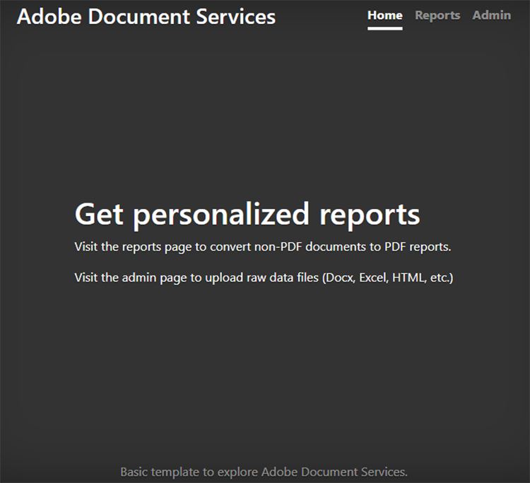
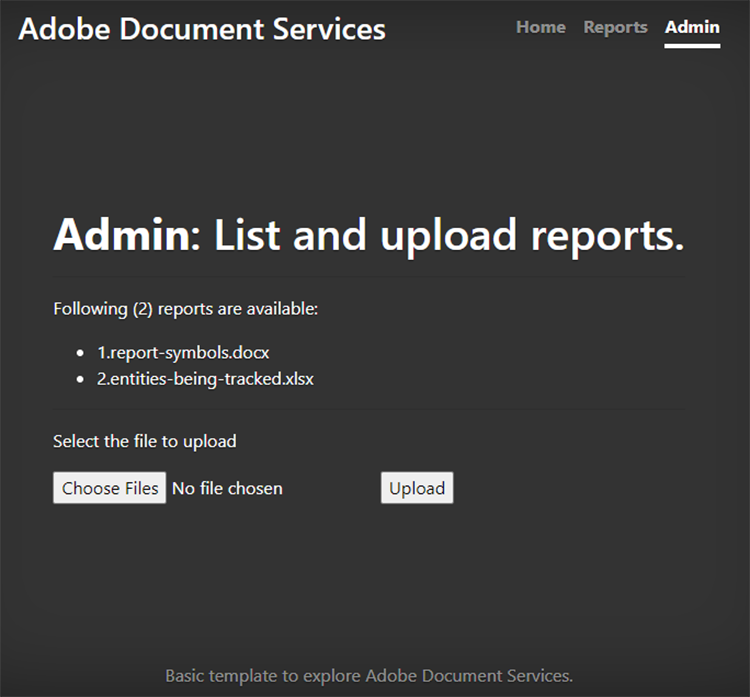
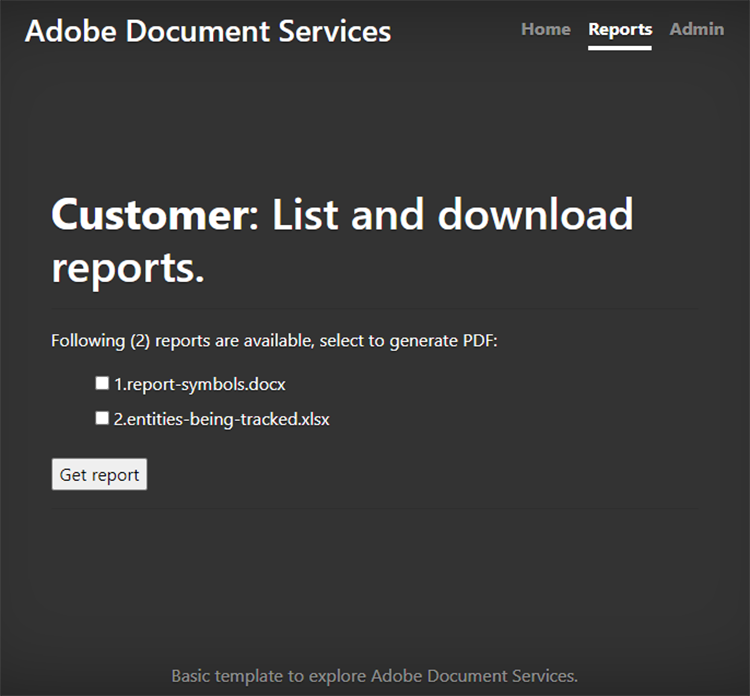
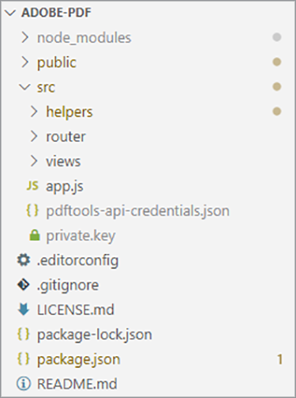
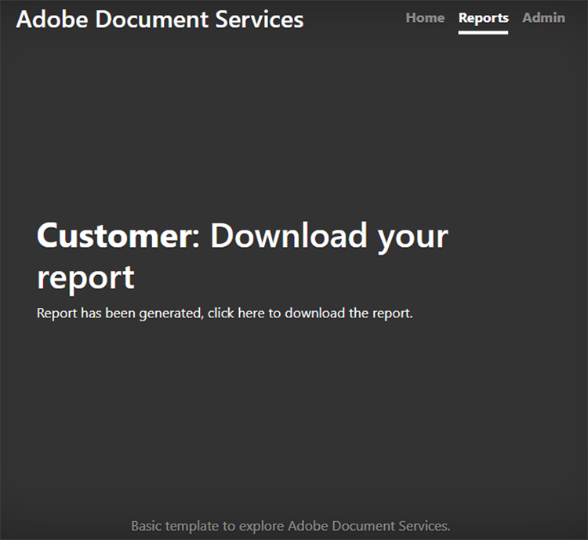
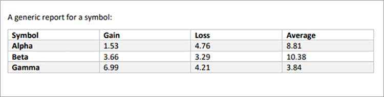

# Creación y edición de informes


Las finanzas, la educación, el marketing y otros sectores utilizan a los PDF para compartir datos con sus clientes y partes interesadas. Los PDF facilitan el uso compartido de documentos sofisticados, con tablas, gráficos y contenido interactivo, en un formato que todos puedan ver. [!DNL Adobe Acrobat Services] Las API ayudan a estas empresas a generar informes de PDF que se pueden compartir desde Microsoft Word, Microsoft Excel, gráficos y otros formatos de documento diversos.

Decid vosotros [dirigir una empresa de seguimiento de redes sociales](https://www.adobe.io/apis/documentcloud/dcsdk/on-demand-report-creation.html). Tus clientes inician sesión en una parte de tu sitio protegida con contraseña para ver el análisis de sus campañas. A menudo, quieren compartir estas estadísticas con sus ejecutivos, accionistas, donantes u otras partes interesadas. Los documentos descargables de PDF son una excelente forma de que tus clientes compartan números, gráficas y mucho más.

Mediante la incorporación [API de servicios de PDF](https://www.adobe.io/apis/documentcloud/dcsdk/pdf-tools.html) en tu sitio web, puedes generar informes de PDF sobre la marcha para cada cliente. Puedes crear PDF y luego combinarlos en un único y práctico informe para que tus clientes lo descarguen y lo envíen a sus responsables de departamento.

## Lo que puedes aprender

En este tutorial práctico, aprenderá a utilizar el SDK de Servicios de PDF en un entorno Node.js y Express.js (con solo algo de JavaScript, HTML y CSS) para añadir rápida y fácilmente funcionalidad orientada al PDF a un sitio web existente. Este sitio web tiene una página donde los administradores cargan informes, un área donde los clientes ven una lista de informes disponibles y seleccionan documentos para convertirlos al PDF, y puntos finales útiles para descargar PDF generados por el sistema.

## API y recursos relevantes

* [API de servicios de PDF](https://opensource.adobe.com/pdftools-sdk-docs/release/latest/index.html)

* [API de incrustación de PDF](https://www.adobe.com/devnet-docs/dcsdk_io/viewSDK/index.html)

## Panel de informes de campañas para clientes

>[!NOTE]
>
>Este tutorial no trata de las prácticas recomendadas de Node.js ni de cómo proteger las aplicaciones web. Algunas áreas del sitio web se exponen para uso público, y la asignación de nombres de documentos podría no ser compatible con la producción. Para analizar el mejor enfoque posible para diseñar un sistema como este, consulte a sus arquitectos e ingenieros.

Aquí tiene una aplicación web básica de Express.js que tiene un área de informes de clientes y una sección de administradores. Esta aplicación puede mostrar informes para campañas de redes sociales. Por ejemplo, puede mostrar el número de veces que se hace clic en un anuncio.



Puede descargar este proyecto desde la [Repositorio de GitHub](https://github.com/afzaal-ahmad-zeeshan/express-adobe-pdf-tools).

Ahora, vamos a explorar cómo publicar los informes.

## Cargar informes

Para que resulte más sencillo, utiliza únicamente el proceso y la carga basados en el sistema de archivos que se encuentran aquí. En Express.js, puede utilizar el módulo fs para mostrar todos los archivos disponibles en un directorio.

En la misma página, permita que el administrador cargue archivos de informes en el servidor para que los clientes los vean. Estos archivos pueden estar en muchos formatos diferentes, como Microsoft Word, Microsoft Excel, HTML y [otros formatos de datos]https://opensource.adobe.com/pdftools-sdk-docs/release/latest/howtos.html#create-a-pdf), incluidos los archivos de gráficos. La página de administración tiene el siguiente aspecto:



>[!NOTE]
>
>Protege con contraseña tus URL o usa el paquete passport de npm para proteger tu aplicación detrás de la capa de autenticación y autorización.

Cuando el administrador selecciona y carga un archivo, se traslada a un repositorio público donde otras personas pueden acceder a él. Utilice el mismo repositorio para publicar documentos desde la página de administración y enumerar los informes de marketing disponibles para los clientes. Este código es:

```
router.get('/', (req, res) => {
try {
let files = fs.readdirSync('./public/documents/raw') // read the files
res.status(200).render("reports", { page: 'reports', files: files });
} catch (error) {
res.status(500).render("crash", { error: error });
}
});
```

Este código enumera todos los archivos y representa una vista de la lista de archivos.

## Selección de informes

En el lado del usuario, tienes un formulario para que los clientes seleccionen los documentos que desean incluir en su informe de campaña de redes sociales. Para simplificar, en la página de ejemplo, muestre solo el nombre del documento y una casilla de verificación para seleccionarlo. Los clientes pueden seleccionar uno o varios informes para combinarlos en un único documento de PDF.

Para obtener una interfaz de usuario más avanzada, también puede mostrar una vista previa del informe aquí.



## Generación de un informe de PDF

Utilice el SDK de Servicios de PDF para crear los informes de PDF a partir de los datos introducidos. Los datos (como se muestra en las capturas de pantalla anteriores) pueden proceder de diversos formatos de datos como Microsoft Word, Microsoft Excel, HTML, gráficos, etc. Empiece instalando el paquete npm para el SDK de Servicios de PDF.

```
$ npm install --save @adobe/documentservices-pdftools-node-sdk
```

Antes de comenzar, debe tener credenciales de API, [libre de Adobe](https://opensource.adobe.com/pdftools-sdk-docs/release/latest/index.html#getcred). Utiliza tus [!DNL Acrobat Services] cuenta [gratis durante seis meses y luego de pago por uso](https://www.adobe.io/apis/documentcloud/dcsdk/pdf-pricing.html) por solo \$0,05 por transacción de documento.

Descargue el archivo de almacenamiento y extraiga el archivo JSON para las credenciales y la clave privada. En el proyecto de ejemplo, coloque el archivo en el directorio src.



Ahora que ha configurado las credenciales, puede escribir la tarea de conversión de PDF. Para esta demostración, tiene dos operaciones que debe realizar en la aplicación:

* Convertir documentos sin procesar en archivos de PDF

* Combinar varios archivos de PDF en un solo informe

El procedimiento general es similar para ejecutar cualquier operación. La única diferencia es el servicio que utiliza. En el código siguiente, convierta el documento sin formato en un archivo de PDF:

```
async function createPdf(rawFile, outputPdf) {
try {
// configurations
const credentials = adobe.Credentials
.serviceAccountCredentialsBuilder()
.fromFile("./src/pdftools-api-credentials.json")
.build();
// Capture the credential from app and show create the context
const executionContext = adobe.ExecutionContext.create(credentials),
operation = adobe.CreatePDF.Operation.createNew();
// Pass the content as input (stream)
const input = adobe.FileRef.createFromLocalFile(rawFile);
operation.setInput(input);
// Async create the PDF
let result = await operation.execute(executionContext);
await result.saveAsFile(outputPdf);
} catch (err) {
console.log('Exception encountered while executing operation', err);
}
}
```

En el código anterior, puede leer las credenciales y crear el contexto de ejecución. PDF Services SDK requiere el contexto de ejecución para autenticar las solicitudes.

A continuación, ejecute la operación Crear PDF, que convierte los documentos sin procesar al formato de PDF. Por último, utilice el `outputPdf` para copiar el informe del PDF. En el ejemplo de código, encontrará este código en el archivo src/helpers/pdf.js. Más adelante en este tutorial, importará el módulo PDF y llamará a este método.

Como se ha demostrado en la sección anterior, los clientes pueden ir a la página siguiente para seleccionar los informes que desean convertir en PDF:


Cuando un cliente selecciona uno o varios de estos informes, se crea el archivo de PDF.

En primer lugar, vamos a ver un único archivo de PDF en acción. Cuando el usuario selecciona un solo informe, solo tiene que convertirlo al PDF y proporcionar el vínculo de descarga.

```
try {
console.log(`[INFO] generating the report...`);
await pdf.createPdf(`./public/documents/raw/${reports}`, `./public/documents/processed/output.pdf`);
console.log(`[INFO] sending the report...`);
res.status(200).render("download", { page: 'reports', filename: 'output.pdf' });
} catch(error) {
console.log(`[ERROR] ${JSON.stringify(error)}`);
res.status(500).render("crash", { error: error });
}
```

Este código crea un informe y comparte la URL de descarga con el cliente. Esta es la página web de salida:



Y aquí está el PDF de salida:



Los clientes pueden seleccionar varios archivos para generar un informe combinado. Cuando el cliente selecciona más de un documento, se realizan dos operaciones: la primera crea un PDF parcial para cada documento y la segunda lo combina en un único informe de PDF.

```
async function combinePdf(pdfs, outputPdf) {
try {
// configurations
const credentials = adobe.Credentials
.serviceAccountCredentialsBuilder()
.fromFile("./src/pdftools-api-credentials.json")
.build();
// Capture the credential from app and show create the context
const executionContext = adobe.ExecutionContext.create(credentials),
operation = adobe.CombineFiles.Operation.createNew();
// Pass the PDF content as input (stream)
for (let pdf of pdfs) {
const source = adobe.FileRef.createFromLocalFile(pdf);
operation.addInput(source);
}
// Async create the PDF
let result = await operation.execute(executionContext);
await result.saveAsFile(outputPdf);
} catch (err) {
console.log('Exception encountered while executing operation', err);
}
}
```

Este método está disponible en el archivo src/helpers/pdf.js y se muestra como parte de la exportación del módulo.

```
try {
console.log(`[INFO] creating a batch report...`);
// Create a batch report and send it back
let partials = [];
for (let index in reports) {
const name = `partial-${index}-${reports[index]}`;
await pdf.createPdf(`./public/documents/raw/${reports[index]}`, `./public/documents/processed/${name}`);
partials.push(`./public/documents/processed/${name.replace('docx', 'pdf').replace('xlsx', 'pdf')}`);
}
await pdf.combinePdf(partials, `./public/documents/processed/output.pdf`);
console.log(`[INFO] sending the combined report...`);
res.status(200).render("download", { page: 'reports', filename: 'output.pdf' });
} catch(error) {
console.log(`[ERROR] ${JSON.stringify(error)}`);
res.status(500).render("crash", { error: error });
}
```

Este código genera un informe compilado para varios documentos de entrada. La única función añadida es la `combinePdf` que toma una lista de nombres de ruta de acceso de archivo de PDF y devuelve un único PDF de resultados.

Ahora, los clientes del panel de redes sociales pueden seleccionar informes relevantes de su cuenta y descargarlos como un PDF útil. Este panel les permite mostrar a la administración y a otras partes interesadas el éxito de sus campañas con datos, tablas y gráficos en un formato universalmente fácil de abrir.

## Pasos siguientes

Este tutorial práctico le enseñó a utilizar la API de servicios de PDF para ayudar a los clientes a descargar informes relevantes como PDF fáciles de compartir. Ha creado una aplicación Node.js para mostrar la potencia de la API de servicios de PDF para los servicios de lectura y creación de informes de PDF. En la aplicación se mostraba cómo tus clientes podían descargar un único documento de informe o combinar y fusionar varios documentos en un único informe de PDF.

Esta aplicación impulsada por Adobe ayuda a su [clientes del panel de redes sociales](https://www.adobe.io/apis/documentcloud/dcsdk/on-demand-report-creation.html) obtenga y comparta los informes que necesiten, sin preocuparse de si todos los destinatarios tienen instalado Microsoft Office u otro software en su dispositivo. Puede utilizar las mismas técnicas en su propia aplicación para ayudar a los usuarios a ver, combinar y descargar documentos. O bien, consulta las muchas otras API de Adobe para añadir firmas y realizar su seguimiento, y mucho más.

Para empezar, solicita tu [[!DNL Adobe Acrobat Services]](https://www.adobe.io/apis/documentcloud/dcsdk/gettingstarted.html) y, a continuación, crea experiencias de creación de informes atractivas para tus empleados y clientes. Disfruta de tu cuenta gratis durante seis meses [de pago por uso](https://www.adobe.io/apis/documentcloud/dcsdk/pdf-pricing.html) a medida que se amplían tus esfuerzos de marketing, solo \$0,05 por transacción de documento.
