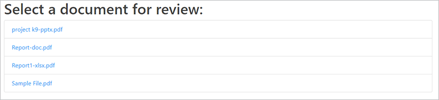

# Revisiones y aprobaciones


La colaboración remota entre equipos se hizo necesaria para muchas empresas durante la pandemia de COVID-19, [compartir y revisar documentos digitales](https://www.adobe.io/apis/documentcloud/dcsdk/review-and-approval.html) presenta una serie de desafíos para los equipos y los recursos multifuncionales.

Estos desafíos incluyen compartir documentos en diferentes formatos de archivo, revisar y comentar eficazmente el contenido, y sincronizar con las ediciones más recientes. [!DNL Adobe Acrobat Services] Las API están diseñadas para permitir a los desarrolladores de aplicaciones resolver estos desafíos para sus usuarios.

## Lo que puedes aprender

Este tutorial práctico muestra cómo crear un flujo de trabajo de revisión y aprobación de documentos en una aplicación web Node.js y Express. Para seguir con este tutorial, necesitas experiencia con Node.js.

La aplicación tiene las siguientes funciones:

* Conversión de diferentes tipos de archivo a PDF

* Habilitar cargas de archivos

* Permite a los usuarios añadir comentarios y anotaciones

* Mostrar los PDF junto con esos comentarios

* Permitir a los perfiles de usuario identificar autores de comentarios

* Combinar archivos en un PDF final que los usuarios puedan descargar

## API y recursos relevantes

* [API de servicios de PDF](https://opensource.adobe.com/pdftools-sdk-docs/release/latest/index.html)

* [API de incrustación de PDF](https://www.adobe.com/devnet-docs/dcsdk_io/viewSDK/index.html)

* [Código del proyecto](https://github.com/contentlab-io/adobe_reviews_and_approvals)

## Creación de credenciales de API de Adobe

Antes de iniciar el código, debe [crear credenciales](https://www.adobe.com/go/dcsdks_credentials) para las API Adobe PDF Embed y Adobe PDF Services. La API PDF Embed es de uso gratuito. La API de servicios de PDF es gratuita durante seis meses y, a continuación, puede cambiar a una [plan de pago por uso](https://www.adobe.io/apis/documentcloud/dcsdk/pdf-pricing.html) a sólo \$0,05 por transacción de documento.

Al crear credenciales para la API de servicios de PDF, seleccione la **Crear ejemplo de código personalizado** y seleccione Node.js para el idioma. Guarde el archivo ZIP y extraiga pdftools-api-credentials.json y private.key en el directorio raíz del proyecto Node.js Express.

## Configuración de un proyecto y dependencias

Configure los proyectos Node.js y Express para que sirvan archivos estáticos desde una carpeta denominada &quot;public&quot;. Puede configurar el proyecto de distintas formas, según sus preferencias. Para ponerse en marcha rápidamente, puede utilizar la [Generador de aplicaciones Express](https://expressjs.com/en/starter/generator.html). O si quieres mantener las cosas simples, puedes [empezar desde cero](https://expressjs.com/en/starter/hello-world.html) y mantener el código en un único archivo JavaScript. En el proyecto de ejemplo vinculado anteriormente, está utilizando el enfoque de un solo archivo y manteniendo todo el código en index.js.

Copie el `pdftools-api-credentials.json` y `private.key` desde el ejemplo de código personalizado hasta el directorio raíz del proyecto. Además, añádalos al archivo .gitignore, si dispone de uno, para que los archivos de credenciales no se envíen accidentalmente a un repositorio.

A continuación, corre `npm install @adobe/documentservices-pdftools-node-sdk` para instalar el SDK de Node.js para Servicios de PDF. Importe este módulo y cree el objeto de credenciales de API dentro del código (index.js en el proyecto de ejemplo), después de que el resto de la dependencia importe de la siguiente manera:

```
  const PDFToolsSdk = require( "@adobe/documentservices-pdftools-node-sdk" );

  // Create Credentials
  const credentials =  PDFToolsSdk.Credentials
      .serviceAccountCredentialsBuilder()
      .fromFile( "pdftools-api-credentials.json" )
      .build();
```

El código de inicio debe tener este aspecto:

```
  
  const express = require( "express" );
  const PDFToolsSdk = require( "@adobe/documentservices-pdftools-node-sdk" );

  // Create Credentials
  const credentials =  PDFToolsSdk.Credentials
      .serviceAccountCredentialsBuilder()
      .fromFile( "pdftools-api-credentials.json" )
      .build();

  const app = express();

  app.use( express.static( "public" ) );

  app.listen( 8889, function() {
      console.log( "Server started on port", 8889 );
  } );
```

Ahora ya puedes trabajar con [!DNL Acrobat Services] API.

## Conversión de un archivo en PDF

Para la primera parte del flujo de trabajo de documentos, el usuario final debe cargar documentos para compartirlos. Para activar esta función, añada una función de carga y consolide los diferentes formatos de archivo de documento en PDF para prepararlos para el proceso de revisión.

Para empezar, cree una función para convertir documentos en PDF en función de la [fragmento de ejemplo para la API de servicios de PDF](https://www.adobe.io/apis/documentcloud/dcsdk/pdf-tools.html). En este ejemplo también se muestran fragmentos de muchas otras características vitales, como el reconocimiento óptico de caracteres (OCR), la protección y eliminación de contraseñas, y la compresión.

```
function fileToPDF( filename, outputFilename, callback ) {
      // Create an ExecutionContext using credentials and create a new operation
  instance.
      const executionContext = PDFToolsSdk.ExecutionContext.create( credentials ),
          createPdfOperation = PDFToolsSdk.CreatePDF.Operation.createNew();

      // Set operation input from a source file.
      const input = PDFToolsSdk.FileRef.createFromLocalFile( filename );
      createPdfOperation.setInput( input );

      // Execute the operation and Save the result to the specified location.
      createPdfOperation.execute( executionContext )
          .then( result => {
              result.saveAsFile( outputFilename );
              callback( outputFilename );
          } );
  }
```

Ahora puede utilizar esta función para crear PDF a partir de documentos cargados.

## Gestión de cargas de archivos

A continuación, el servidor necesita un extremo de carga de archivos en el servidor web para recibir y procesar los documentos.

En primer lugar, cree una carpeta dentro de una carpeta uploads y asígnele el nombre &quot;draft&quot;. Los archivos cargados y los archivos convertidos del PDF se almacenan aquí. A continuación, corre `npm install express-fileupload` para instalar el módulo Express-FileUpload y añadir el middleware a Express en el código:

```
const fileUpload = require( "express-fileupload" );
app.use( fileUpload() );
```

Ahora, agregue un `/upload `y guarde el archivo cargado en la carpeta borradores con el mismo nombre de archivo. A continuación, llame a la función que escribió anteriormente para crear un archivo de PDF del mismo documento si aún no está en formato de PDF. Puede generar un nombre de archivo para el nuevo archivo de PDF basado en el nombre del documento cargado original:

```
// Create a PDF file from an uploaded file
app.post( "/upload", ( req, res ) => {
    if( !req.files || Object.keys( req.files ).length === 0 ) {
        return res.status( 400 ).send( "No files were uploaded." );
    }
    
    // Create PDF from the uploaded file
    let file = req.files.myFile;
    file.mv( __dirname + "/uploads/drafts/" + file.name, ( err ) => {
        if( err ) {
            return res.status( 500 ).send( err );
        }
        if( file.name.endsWith( ".pdf" ) ) {
            res.redirect( "/" );
        }
        else {
            // Convert to PDF
            fileToPDF( __dirname + "/uploads/drafts/" + file.name, __dirname + "/uploads/drafts/" + file.name.replace( /\./g, "-" ) + ".pdf", ( file ) => {
                res.redirect( "/" );
            } );
        }
    });
} );
```

## Creación de una página de carga

Ahora, para cargar archivos desde la aplicación web, cree un `index.html` dentro de la carpeta uploads. En la página, agregue un formulario de carga de archivos que envíe el archivo al punto final /upload:

```
<form ref="uploadForm" 
      action="/upload"
      method="post" 
      encType="multipart/form-data">
      <input type="file" name="myFile" accept=".doc,.docx,.ppt,.pptx,.xls,.xlsx,.txt,.rtf,.bmp,.jpg,.gif,.tiff,.png">
      <input type="submit" value="Upload File" />
  </form>
```


Ahora puede cargar documentos en el servidor Node.js. El servidor guarda el archivo dentro de la carpeta uploads/draft y crea una versión de formato PDF junto a ella.

Ya puede incrustar los documentos cargados, por lo que puede utilizar la API de incorporación de PDF para permitir a los usuarios agregar comentarios y anotaciones a los documentos fácilmente.

## Enumeración de archivos de PDF

Como un flujo de trabajo de documento típico puede incluir varios documentos, debe mostrar una lista de documentos y vincularlos a una nueva página de revisión de documentos en la aplicación.

En primer lugar, dentro del código del servidor, agregue un extremo /files que obtenga y devuelva una lista de todos los archivos del PDF almacenados en la carpeta uploads/draft:

```
const fs = require( "fs" );

app.get( "/files", ( req, res ) =\> {

fs.readdir( \_\_dirname + "/uploads/drafts/", ( err, files ) =\> {

if( err ) {

return res.status( 500 ).send( err );using

}

return res.json( files.filter( f =\> f.endsWith( ".pdf" ) ) );

} );

} );
```

Agregar un `/download/:file` ruta que proporciona acceso al archivo de PDF cargado para incrustarlo en la página web.

>[!NOTE]
>
>En una aplicación de producción, debe agregar autenticación y autorización para asegurarse de que la solicitud proviene de un usuario válido y de que el usuario tiene permiso para acceder al documento.

```
app.get( "/download/:file", function( req, res ){
    // Note: In production code, this should check authentication and user access permissions
    res.download( __dirname + "/uploads/drafts/" + req.params[ "file" ] );
});
```

Actualice la página index.html con un elemento de lista de archivos que se rellene durante la carga. Cada elemento puede vincularse a una página web draft.html y se pasa el nombre de archivo a la página utilizando parámetros de cadena de consulta.

>[!NOTE]
>
>Se utiliza jQuery para anexar cada elemento, por lo que debe cargar la biblioteca jQuery en la página web o anexar el elemento con un método diferente.

```
  <ul id="filelist">
      <li>Loading documents...</li>
  </ul>

  ...

  <script>
      // Load current files
      fetch( "/files" )
      .then( r => r.json() )
      .then( files => {
          if( files && files.length > 0 ) {
              $( "#filelist" ).empty();
              files.forEach( file => {
                  $( "#filelist" ).append( `<li><a
  href="/draft.html?file=${file}">${file}</a></li>` );
              })
          } else {
                  $("#filelist").append("<div>No documents found.</div>");
                }
      });
  </script>
```



## Incorporación de un PDF

Ya puede incrustar y mostrar archivos de PDF en su aplicación web.

Cree una página web llamada &quot;draft.html&quot; y añada un elemento div en la página para el PDF incrustado:

```
  <div id="adobe-dc-view"></div>
```

Incluya el [!DNL Acrobat Services] biblioteca:

```
  <script src="https://documentcloud.adobe.com/view-sdk/main.js"></script>
```

Dentro de una etiqueta de script personalizada, analice el nombre de archivo de los parámetros de cadena de consulta para saber qué archivo desea incrustar en la página:

```
  <script type="text/javascript">
          let params = new URLSearchParams( window.location.search );
          let filename = params.get( "file" );
  </script>
```

Agregue un agente de escucha de eventos de documento para el evento adobe_dc_view_sdk.ready que carga el archivo de PDF especificado en una vista incrustada dentro del elemento div. Utilice el ID de cliente de las credenciales de API de incrustación de PDF. Si desea habilitar comentarios y anotaciones, incruste la vista en modo FULL_WINDOW y establezca la opción showAnnotationsTools en true.

```
  document.addEventListener( "adobe_dc_view_sdk.ready", () => { 
      var adobeDCView = new AdobeDC.View( { 
          clientId: "YOUR CLIENT ID HERE",
          divId: "adobe-dc-view",
          locale: "en-US",
      } );
      adobeDCView.previewFile( {
          content: { location: { url: "download/" + filename } },
          metaData: { fileName: "Draft Version.pdf" }
      }, {
          embedMode: "FULL_WINDOW",
          showAnnotationTools: true,
          showPageControls: true
      } );
  });
```

## Crear un perfil de usuario

De forma predeterminada, los comentarios y anotaciones se muestran como &quot;Invitado&quot; en esta vista. Puede establecer el nombre del revisor actual para los comentarios y anotaciones registrando una devolución de llamada de perfil de usuario en el código de página en la vista PDF. El siguiente es un perfil de ejemplo. En una aplicación completa que incluya autenticación de usuario, la información de perfil de la sesión de usuario iniciada se puede establecer de esta manera para identificar a cada comentarista del documento en el flujo de trabajo de revisión.

```
  adobeDCView.registerCallback(
      AdobeDC.View.Enum.CallbackType.GET_USER_PROFILE_API,
      () => {
          return new Promise( ( resolve, reject ) => {
              resolve({
                  code: AdobeDC.View.Enum.ApiResponseCode.SUCCESS,
                  data: {
                      userProfile: {
                          name: "YOUR NAME",
                          firstName: "FIRST",
                          lastName: "LAST",
                          email: "document.editor@adobe.com"
                      }
                  }
              });
          });
      }
  );
```

Su perfil le identifica como un usuario específico cuando ve y anota cualquier documento cargado utilizando esta página web.

## Guardar comentarios del documento

Después de que un usuario comente un documento, hace clic en **Ahorra un.** De forma predeterminada, al hacer clic en **Guardar** descarga el archivo de PDF actualizado. Cambie esta acción para actualizar el archivo de PDF actual en el servidor.

Agregar un `/save` extremo al código del servidor que sobrescribe el archivo de PDF en la carpeta uploads/draft:

```
  // Overwrite the PDF file with latest PDF changes and annotations
  app.post( "/save", ( req, res ) => {
      if( !req.files || Object.keys( req.files ).length === 0 ) {
          return res.status( 400 ).send( "No files were uploaded." );
      }

      let file = req.files.pdf;
      file.mv( __dirname + "/uploads/drafts/" + file.name, ( err ) => {
          if( err ) {
              return res.status( 500 ).send( err );
          }
          res.send( "File uploaded" );
      });
  } );
```

Registre una devolución de llamada de vista del PDF para SAVE_API que cargue el contenido en el punto final de /save. Puede cambiar el valor autoSaveFrequency para permitir que la aplicación guarde automáticamente los cambios en un temporizador e incluya metadatos adicionales en el archivo incrustado actualmente al finalizar, si lo desea.

```
  adobeDCView.registerCallback(
      AdobeDC.View.Enum.CallbackType.SAVE_API,
      ( metaData, content, options ) => {
          return new Promise( ( resolve, reject ) => {
              let formData = new FormData();
              formData.append( "pdf", new Blob( [ content ] ), "drafts/" + filename
  );
              fetch( "/save", {
                  method: "POST",
                  body: formData
              }).then( resp => {
                  resolve({
                      code: AdobeDC.View.Enum.ApiResponseCode.SUCCESS,
                      data: {
                          /* Updated file metadata after successful save operation */
                          metaData: Object.assign( metaData, {} )
                      }
                  });
              });
          });
      },
      {
          autoSaveFrequency: 0,
          enableFocusPolling: false,
          showSaveButton: true
      }
  );
```

Los comentarios y anotaciones en los borradores de documentos ahora se guardan en el servidor. Puedes [más información sobre cómo las devoluciones de llamada](https://www.adobe.com/devnet-docs/dcsdk_io/viewSDK/howtos_ui.html#callbacks-workflows) encaja en tu flujo de trabajo. Por ejemplo, [devoluciones de llamada de estado](https://www.adobe.com/devnet-docs/dcsdk_io/viewSDK/howtos_ui.html#status-callback) ayuda a gestionar los conflictos de archivos si varias personas desean revisar y comentar el mismo documento simultáneamente.

En el paso final, combine todos los documentos editados en un archivo de PDF mediante la API de servicios de PDF.

## Combinar archivos de PDF

El código de combinación del PDF es similar al código de creación del PDF, pero utiliza la operación CombinarArchivos y agrega cada archivo como entrada.

```
  function combineFilesToPDF( files, outputFilename, callback ) {
      // Create an ExecutionContext using credentials and create a new operation
  instance.
      const executionContext = PDFToolsSdk.ExecutionContext.create( credentials ),
          combineFilesOperation = PDFToolsSdk.CombineFiles.Operation.createNew();

      // Set operation inputs from source files.
      files.forEach( file => {
          const input = PDFToolsSdk.FileRef.createFromLocalFile( file );
          combineFilesOperation.addInput( input );
      } );

      // Execute the operation and Save the result to the specified location.
      combineFilesOperation.execute( executionContext )
          .then( result => {
              result.saveAsFile( outputFilename );
              callback( outputFilename );
          } );
 }
```

## Descarga del PDF final

Agregue un extremo denominado /finalize que llame a la función para combinar todos los archivos de PDF dentro del `uploads/drafts` en una carpeta `Final.pdf` y, a continuación, lo descarga.

```
  app.get( "/finalize", ( req, res ) => {
      fs.readdir( __dirname + "/uploads/drafts/", ( err, files ) => {
          if( err ) {
              return res.status( 500 ).send( err );
          }
          combineFilesToPDF(
              files.filter( f => f.endsWith( ".pdf" ) ).map( f => __dirname + 
  "/uploads/drafts/" + f ),
              __dirname + "/uploads/Final.pdf", ( file ) => {
              res.download( file );
          } );
      } );
  } );
```

Por último, añada un vínculo en la página web principal index.html a este punto final /finalize. Este vínculo permite a los usuarios descargar el resultado del flujo de trabajo del documento.

```
<a href="/finalize">Download final PDF</a>
```


## Pasos siguientes

Este tutorial práctico mostró cómo [!DNL Acrobat Services] Las API integran un [flujo de trabajo de uso compartido y revisión de documentos](https://www.adobe.io/apis/documentcloud/dcsdk/review-and-approval.html) en una aplicación web. La aplicación permite a los trabajadores remotos compartir archivos y colaborar con sus compañeros de equipo, lo que resulta especialmente útil para los empleados y contratistas que trabajan desde casa.

Puede utilizar estas técnicas para habilitar la colaboración en su aplicación o explorar [Ejemplos de SDK del nodo de PDF Services](https://github.com/adobe/pdftools-node-sdk-samples) y [Ejemplos de API de PDF Embed](https://github.com/adobe/pdf-embed-api-samples) en GitHub para obtener inspiración sobre cómo utilizar las API de Adobe.

¿Preparado para habilitar el uso compartido de documentos y la revisión en su propia aplicación? Regístrate en tu [[!DNL Adobe Acrobat Services]](https://www.adobe.io/apis/documentcloud/dcsdk/gettingstarted.html) cuenta de desarrollador. Accede a Adobe PDF Embed de forma gratuita y disfruta de una prueba gratuita de seis meses del resto de las API. Después de la versión de prueba, puedes [de pago por uso](https://www.adobe.io/apis/documentcloud/dcsdk/pdf-pricing.html) por solo \$0.05 por transacción de documento a medida que crece tu negocio.
