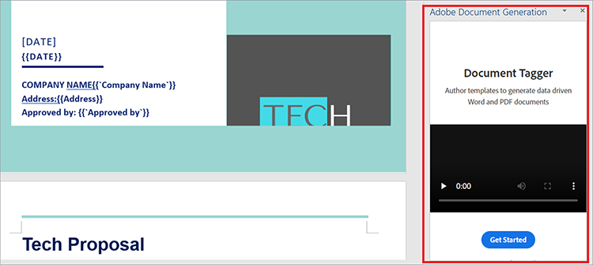
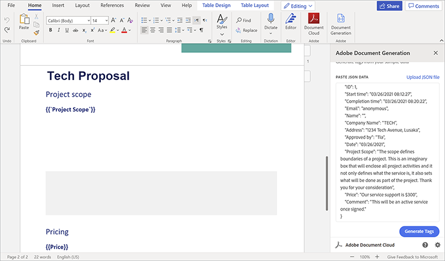
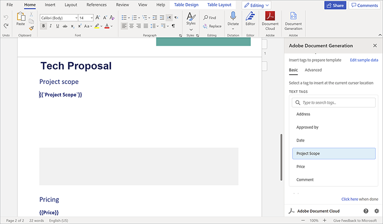
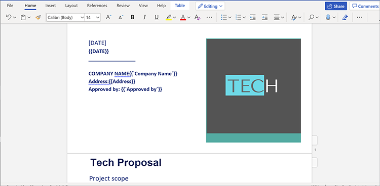
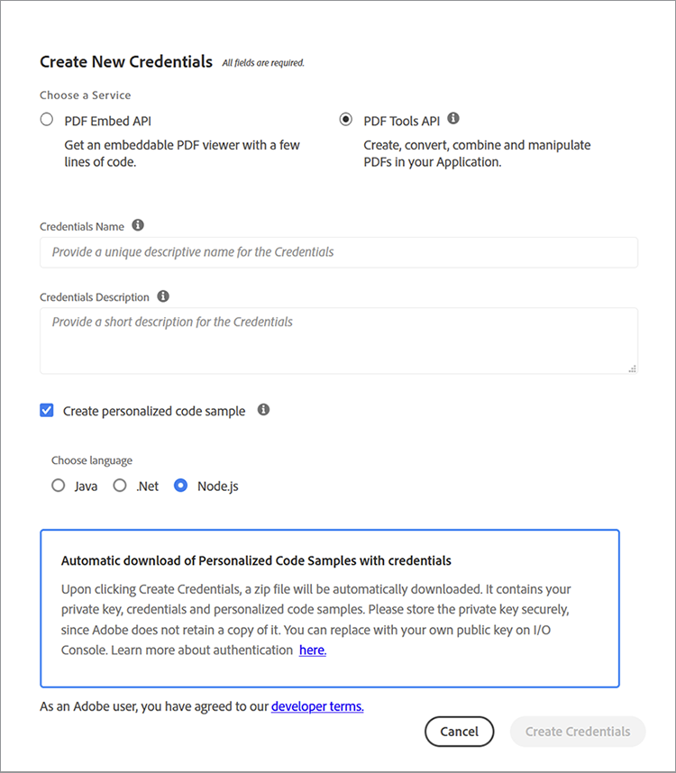

# Gestión de propuestas de ventas y contratos


Las propuestas de ventas son el primer paso en el camino de una empresa hacia la adquisición de clientes. Como con todo, las primeras impresiones duran. Por lo tanto, su primera interacción con los clientes establece sus expectativas para su negocio. Su propuesta debe ser concisa, precisa y conveniente.

Los contratos y las propuestas contienen diferentes tipos de datos dentro de su estructura de documentos. Contienen datos dinámicos (nombre del cliente, cantidad de presupuesto, etc.) y datos estáticos (texto repetitivo como capacidades firmes, perfiles de equipo y términos estándar de SOW). La creación de documentos de plantilla, como las propuestas de ventas, a menudo implica tareas monótonas, como reemplazar manualmente los detalles del proyecto en una plantilla repetitiva. En este tutorial, utilizará flujos de trabajo y datos dinámicos para crear un proceso eficaz para [crear propuestas de ventas](https://www.adobe.io/apis/documentcloud/dcsdk/sales-proposals-and-contracts.html).

## Lo que puedes aprender

En este tutorial práctico, aprenderá a implementar datos y flujos de trabajo dinámicos mediante varias herramientas, las más importantes de las cuales son [!DNL Adobe Acrobat Services] API. Estas API se utilizan para que las propuestas de ventas y los contratos sean más cómodos para ti y para tu empresa. Este tutorial muestra técnicas prácticas para mostrar cómo crear, combinar y mostrar documentos de PDF automáticamente. La realización manual de estas tareas lleva mucho tiempo y es tediosa. Aprovechando las ventajas de [!DNL Acrobat Services] API, puede reducir el tiempo dedicado a estas tareas.

## API y recursos relevantes

* [Microsoft Word](https://www.office.com/)

* [Node.js](https://nodejs.org/en/)

* [npm](https://www.npmjs.com/get-npm)

* [[!DNL Acrobat Services] API](https://www.adobe.io/apis/documentcloud/dcsdk/)

* [API de generación de documentos de Adobe](https://www.adobe.io/apis/documentcloud/dcsdk/doc-generation.html)

* [API de Adobe Sign](https://www.adobe.io/apis/documentcloud/sign.html)

* [Etiquetador de generación de documentos de Adobe](https://opensource.adobe.com/pdftools-sdk-docs/docgen/latest/wordaddin.html#add-in-demo)

## Resolver el problema

Ahora que ya tiene las herramientas instaladas, puede empezar a resolver el problema. Las propuestas tienen tanto contenido estático como contenido dinámico exclusivo para cada cliente. Los cuellos de botella se producen porque ambos tipos de datos son necesarios cada vez que se hace una propuesta. Introducir el texto estático lleva mucho tiempo, por lo que lo automatizarás y solo tratarás manualmente los datos dinámicos de cada cliente.

Primero, cree un formulario de captura de datos en [Microsoft Forms](https://www.office.com/launch/forms?auth=1) (o su creador de formularios preferido). Este formulario es para los datos dinámicos de los clientes que se agregan a una propuesta de ventas. Rellene este formulario con preguntas para obtener los detalles que necesita de los clientes; por ejemplo, nombre de la empresa, fecha, dirección, ámbito del proyecto, precios y comentarios adicionales. Para crear el tuyo propio, usa esto [forma](https://forms.office.com/Pages/ShareFormPage.aspx id=DQSIkWdsW0yxEjajBLZtrQAAAAAAAAN__rtiGj5UNElTR0pCQ09ZNkJRUlowSjVQWDNYUEg2RC4u&amp;sharetoken=1AJeMavBAzzxuISRKmUy). El objetivo es que los clientes potenciales rellenen el formulario y, a continuación, exporten sus respuestas como archivos JSON, que pasan a la siguiente parte del flujo de trabajo.

Algunos creadores de formularios solo permiten exportar datos como archivos CSV. Por lo tanto, puede resultarle útil [convertir](http://csvjson.com/csv2json) el archivo CSV generado en un archivo JSON.

Los datos estáticos se reutilizan en todas las propuestas de ventas. Por lo tanto, puede utilizar una plantilla de propuesta de ventas en Microsoft Word para proporcionar el texto estático. Puedes usar esto [plantilla](https://1drv.ms/w/s!AiqaN2pp7giKkmhVu2_2pId9MiPa?e=oeqoQ2), pero puede crear los suyos propios o utilizar un [plantilla de Adobe](https://www.adobe.io/apis/documentcloud/dcsdk/doc-generation.html).

Ahora, necesita algo que tome tanto los datos dinámicos de los clientes en formato JSON como el texto estático en la plantilla de Microsoft Word para hacer una propuesta de ventas única para un cliente. La [!DNL Acrobat Services] Las API se utilizan para combinar las dos y generar un PDF que se pueda firmar.

Para que esto funcione, se utilizan etiquetas. Las etiquetas son cadenas fáciles de usar que pueden representar números, palabras, matrices o incluso objetos complejos. Las etiquetas actúan como un marcador de posición para los datos dinámicos, que en este caso son datos de cliente introducidos en el formulario. Una vez que inserte etiquetas en la plantilla, puede asignar campos de formulario del archivo JSON a la plantilla de Word.

## Uso de etiquetas

Abra la plantilla de propuesta de ventas y seleccione la **Insertar** . En la **Complementos** grupo, seleccione **Obtener complementos**. A continuación, seleccione **Complemento De Generación De Documentos De Adobe** para añadirlo. Una vez añadido, verá el etiquetador de generación de documentos en la **Inicio** en la pestaña **Adobe** grupo.

En la **Inicio** en la pestaña **Adobe** grupo, seleccione **Generación de documentos** para empezar a etiquetar el documento. Aparece un útil vídeo de demostración en un panel en el lado derecho de la ventana.



Seleccionar **Introducción**. A continuación, se le pedirá que proporcione datos de ejemplo. Pegue o cargue el archivo JSON de respuesta del formulario como se muestra a continuación.



Seleccionar **Generar etiquetas** para obtener una lista de campos del archivo JSON que ha pegado o cargado. Las etiquetas se muestran a continuación, en la barra lateral derecha.



Después de generar las etiquetas, puede insertarlas en el documento. Las etiquetas se agregan al documento en la ubicación del cursor. Como se muestra anteriormente, debe agregar el **Ámbito del proyecto** situado justo debajo de la **Ámbito del proyecto** subtítulo. De esta manera, cuando un cliente entra en el ámbito del proyecto en el formulario, su respuesta va por debajo del **Ámbito del proyecto** , reemplazando la etiqueta que acaba de añadir. Cuando haya terminado de añadir etiquetas, parte del documento debería parecerse a la captura de pantalla que se muestra a continuación.



## Uso de las API

Vaya a la [!DNL Acrobat Services] API [homepage](https://www.adobe.io/apis/documentcloud/dcsdk/doc-generation.html). Para empezar a utilizar [!DNL Acrobat Services] API, necesita credenciales para su aplicación. Desplácese hacia abajo todo el recorrido y seleccione **Iniciar prueba gratis** para crear credenciales. Puede utilizar estos servicios [gratis durante seis meses y, a continuación, con pago por uso](https://www.adobe.io/apis/documentcloud/dcsdk/pdf-pricing.html) por solo $0.05 por transacción de documento, para que solo pagues por lo que necesitas.

Seleccionar **API de servicios de PDF** como su servicio de elección y rellene los otros detalles como se muestra a continuación.



Una vez creadas las credenciales, se obtienen algunos ejemplos de código. Seleccione su idioma preferido (este tutorial utiliza Node.js). Sus credenciales de API se encuentran en un archivo zip. Extraiga los archivos en PDFToolsSDK-Node.jsSamples.

Para empezar, cree una carpeta vacía llamada auto-doc\*\*.\*\* En la carpeta, ejecute el siguiente comando para inicializar un proyecto Node.js: `npm init`. Asigne al proyecto el nombre &quot;auto-doc&quot;*.*

En la carpeta ./PDFToolsSDK-Node.jsSamples/adobe-dc-pdf-tools-sdk-node-samples, hay un archivo llamado pdftools-api-credentials.json. Mueva y private.key a la carpeta auto-doc. Contiene sus credenciales de API. Además, en la carpeta de documentos automáticos, cree una subcarpeta llamada &quot;resources&quot;. Contiene los datos con formato JSON recibidos de los clientes cada vez que se genera una propuesta de ventas. En la misma carpeta, guarde la plantilla de propuesta de ventas de Microsoft Word.

¡Ahora estás listo para hacer un poco de magia! Dado que está utilizando Node.js en este tutorial, debe instalar Node.js [!DNL Acrobat Services] SDK. Para ello, en la carpeta auto-doc, ejecute yarn add @adobe/documentservices-pdftools-node-sdk.

Ahora cree un archivo llamado merge.js y pegue el siguiente código en él.

```
javascript
const PDFToolsSdk = require('@adobe/documentservices-pdftools-node-sdk'),
fs = require('fs');
try {
// Initial setup, create credentials instance.
const credentials = PDFToolsSdk.Credentials
.serviceAccountCredentialsBuilder()
.fromFile("pdftools-api-credentials.json")
.build();
// Setup input data for the document merge process
const jsonString = fs.readFileSync('resources/Proposal.json'),
jsonDataForMerge = JSON.parse(jsonString);
// Create an ExecutionContext using credentials
const executionContext = PDFToolsSdk.ExecutionContext.create(credentials);
// Create a new DocumentMerge options instance
const documentMerge = PDFToolsSdk.DocumentMerge,
documentMergeOptions = documentMerge.options,
options = new documentMergeOptions.DocumentMergeOptions(jsonDataForMerge, documentMergeOptions.OutputFormat.PDF);
// Create a new operation instance using the options instance
const documentMergeOperation = documentMerge.Operation.createNew(options)
// Set operation input document template from a source file.
const input = PDFToolsSdk.FileRef.createFromLocalFile('resources/Proposal.docx');
documentMergeOperation.setInput(input);
// Execute the operation and Save the result to the specified location.
documentMergeOperation.execute(executionContext)
.then(result => result.saveAsFile('output/Proposal.pdf'))
.catch(err => {
if (err instanceof PDFToolsSdk.Error.ServiceApiError
|| err instanceof PDFToolsSdk.Error.ServiceUsageError) {
console.log('Exception encountered while executing operation', err);
} else {
console.log('Exception encountered while executing operation', err);
}
});
} catch (err) {
console.log('Exception encountered while executing operation', err);
}
```

Este código obtiene el archivo JSON del formulario Microsoft Forms con la ayuda de las etiquetas creadas con [!DNL Acrobat Services]. A continuación, combina los datos con la plantilla de propuesta de ventas creada en Microsoft Word para generar un nuevo PDF. El PDF se guarda en el archivo recién creado ./output.

Además, el código utiliza [API de Adobe Sign](https://www.adobe.io/apis/documentcloud/sign.html) para que ambas empresas firmen la propuesta de ventas generada. Echa un vistazo a esta entrada de blog para obtener una explicación detallada de esta API.

## Pasos siguientes

Empezaste con un proceso ineficiente y tedioso que necesitaba automatización. Pasaste de crear documentos manualmente para cada cliente a crear un flujo de trabajo optimizado para automatizar y simplificar [el proceso de propuesta de ventas](https://www.adobe.io/apis/documentcloud/dcsdk/sales-proposals-and-contracts.html).

Con Microsoft Forms, obtienes datos importantes de tus clientes que encajarían en sus propuestas únicas. Ha creado una plantilla de propuesta de ventas en Microsoft Word para proporcionar el texto estático que no desea volver a crear cada vez. Después utilizó [!DNL Acrobat Services] API para combinar los datos del formulario y la plantilla para crear un PDF de propuestas de ventas para sus clientes de una manera más eficaz.

Este tutorial práctico es solo un vistazo de las posibilidades con estas API. Para descubrir más soluciones, visite la [[!DNL Adobe Acrobat Services]](https://www.adobe.io/apis/documentcloud/dcsdk/gettingstarted.html) página de API. El uso de todas estas herramientas es gratis durante seis meses. A continuación, paga solo 0,05 USD por transacción de documento en el [de pago por uso](https://www.adobe.io/apis/documentcloud/dcsdk/pdf-pricing.html) de forma que solo pagues a medida que tu equipo añada más clientes potenciales a tu canal de ventas.
