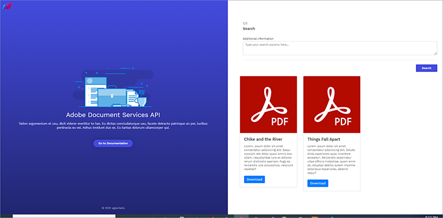

# Búsqueda e indexación


Las organizaciones a menudo deben digitalizar sus documentos impresos y archivos escaneados. Consideremos esto [situación](https://docs.google.com/document/d/11jZdVQAw-3fyE3Y-sIqFFTlZ4m02LsCC/edit). Un bufete de abogados tiene miles de contratos legales que han escaneado para crear archivos digitales. Desean determinar si alguno de esos contratos jurídicos tiene una cláusula o un suplemento particular que deben revisar. La precisión es necesaria a efectos de cumplimiento. La solución consiste en realizar un inventario de los documentos digitales, hacer que el texto se pueda buscar y crear un índice para encontrar esta información.

El reto de crear archivos digitales para recuperar información para editarla o realizar operaciones posteriores es una pesadilla para la mayoría de las organizaciones.

## Lo que puedes aprender

Este tutorial práctico analiza cómo [!DNL Adobe Acrobat Services] Las funciones de las API se pueden utilizar fácilmente para archivar y digitalizar documentos. Para explorar estas características, cree una aplicación Express NodeJS y, a continuación, integre [!DNL Acrobat Services] API para archivado, digitalización y transformación de documentos.

Para seguir, necesitas [Node.js](https://nodejs.org/) instalado y una comprensión básica de Node.js y [Sintaxis ES6](https://www.w3schools.com/js/js_es6.asp).

## API y recursos relevantes

* [API de servicios de PDF](https://opensource.adobe.com/pdftools-sdk-docs/release/latest/index.html)

* [Código del proyecto](https://github.com/agavitalis/AdobeDocumentServicesAPIs.git)

## Configuración del proyecto

En primer lugar, configure la estructura de carpetas de la aplicación. Puede recuperar el código fuente [aquí](https://github.com/agavitalis/AdobeDocumentAPI.git).

## Estructura de directorios

Cree una carpeta denominada AdobeDocumentServicesAPIs y ábrala en el editor que desee. Cree una aplicación NodeJS básica con el `npm init` mediante esta estructura de carpetas:

```
AdobeDocumentServicesAPIs
config
default.json
controllers
createPDFController.js
makeOCRController.js
searchController.js
models
document.js
output
.gitkeep
routes
web.js
services
upload.js
views
index.hbs
ocr.hbs
search.hbs
index.js
```

Está utilizando MongoDB como base de datos para esta aplicación. Por lo tanto, para configurarlo, coloque las configuraciones de base de datos predeterminadas en la carpeta config/, pegando el fragmento de código siguiente en el archivo default.json de esta carpeta y, a continuación, agregue la dirección URL de la base de datos.

```
### config/default.json and config/dev.json
{ "DBHost": "YOUR_DB_URI" }
```

## Instalación de paquetes

Ahora, instale algunos paquetes usando el comando npm install como se muestra en el fragmento de código a continuación:

```
{
    "name": "adobedocumentservicesapis",
    "version": "1.0.0",
    "description": "",
    "main": "index.js",
    "directories": {
    "test": "test"
    },
    "dependencies": {
    "body-parser": "^1.19.0",
    "config": "^3.3.6",
    "express": "^4.17.1",
    "hbs": "^4.1.1",
    "mongoose": "^5.12.1",
    "morgan": "^1.10.0",
    "multer": "^1.4.2",
    "path": "^0.12.7"
    },
    "devDependencies": {},
    "scripts": {
    "start": "set NODE_ENV=dev && node index.js"
    },
    "repository": {
    "type": "git",
    "url": "git+https://github.com/agavitalis/AdobeDocumentServicesAPIs.git"
    },
    "author": "Ogbonna Vitalis",
    "license": "ISC",
    "bugs": {
    "url": "https://github.com/agavitalis/AdobeDocumentServicesAPIs/issues"
    },
    "homepage": "https://github.com/agavitalis/AdobeDocumentServicesAPIs#readme"
}
```

```
###bash
npm install express mongoose config body-parser morgan multer hbs path pdf-parse
Ensure that the content of your package.json file is similar to this code snippet:
###package.json
{
```

Estos fragmentos de código instalan las dependencias de la aplicación, incluido el motor de plantillas Handlebars para la vista. En la etiqueta scripts, configure los parámetros de tiempo de ejecución de la aplicación.

## Integración [!DNL Acrobat Services] API

[!DNL Acrobat Services] incluye tres API:

* API de servicios de Adobe PDF

* API Adobe PDF Embed

* API de generación de documentos de Adobe

Estas API automatizan la generación, manipulación y transformación del contenido de los PDF a través de un conjunto de servicios web basados en la nube.

Para obtener las credenciales que necesita [registrar](https://www.adobe.com/go/dcsdks_credentials?ref=getStartedWithServicesSDK) y complete el flujo de trabajo. La API PDF Embed es de uso gratuito. Las API de servicios de PDF y la API de generación de documentos son gratuitas durante seis meses. Cuando finalice la versión de prueba, podrá [pago por uso](https://www.adobe.io/apis/documentcloud/dcsdk/pdf-pricing.html) a solo $0.05 por transacción de documento. Solo pagas a medida que tu empresa crece y procesa más contratos.


Una vez que haya completado el registro, se descargará un ejemplo de código en su equipo que contendrá sus credenciales de API. Extraiga este ejemplo de código y coloque los archivos private.key y pdftools-api-credentials.json en el directorio raíz de la aplicación.

Ahora, instalar [SDK de PDF Services Node.js](https://www.npmjs.com/package/@adobe/documentservices-pdftools-node-sdk) ejecutando el ` npm install --save @adobe/documentservices-pdftools-node-sdk ` mediante el terminal del directorio raíz de la aplicación.

## Creación de un PDF

[!DNL Acrobat Services] permite crear PDF a partir de documentos de Microsoft Office (Word, Excel y PowerPoint) y otros [formatos de archivo compatibles](https://opensource.adobe.com/pdftools-sdk-docs/release/latest/howtos.html#create-a-pdf) como .txt, .rtf, .bmp, .jpg, .gif, .tiff y .png.

Para crear documentos de PDF a partir de los formatos de archivo admitidos, utilice este formulario para cargar los documentos. Puede acceder al HTML y a los archivos CSS del formulario en [GitHub](https://github.com/agavitalis/AdobeDocumentServicesAPIs.git).


Ahora, agregue los siguientes fragmentos de código al archivo controllers/createPDFController.js. Este código recupera el documento y lo transforma en un PDF.

Los archivos originales y el archivo transformado se guardan en una carpeta dentro de la aplicación.

```
const PDFToolsSdk = require('@adobe/documentservices-pdftools-node-sdk');
/*
* GET / route to show the createPDF form.
*/
function createPDF(req, res) {
//catch any response on the url
let response = req.query.response
res.render('index', { response })
}
/*
* POST /createPDF to create a new PDF File.
*/
function createPDFPost(req, res) {
let filePath = req.file.path;
let fileName = req.file.filename;
try {
// Initial setup, create credentials instance.
const credentials = PDFToolsSdk.Credentials
.serviceAccountCredentialsBuilder()
.fromFile("pdftools-api-credentials.json")
.build();
// Create an ExecutionContext using credentials and create a new operation
instance.
const executionContext = PDFToolsSdk.ExecutionContext.create(credentials),
createPdfOperation = PDFToolsSdk.CreatePDF.Operation.createNew();
// Set operation input from a source file.
const input = PDFToolsSdk.FileRef.createFromLocalFile(filePath);
createPdfOperation.setInput(input);
// Execute the operation and Save the result to the specified location.
createPdfOperation.execute(executionContext)
.then((result) => {
result.saveAsFile('output/createPDFFromDOCX.pdf')
//download the file
res.redirect('/?response=PDF Successfully created')
})
.catch(err => {
if (err instanceof PDFToolsSdk.Error.ServiceApiError
|| err instanceof PDFToolsSdk.Error.ServiceUsageError) {
console.log('Exception encountered while executing operation',
err);
} else {
console.log('Exception encountered while executing operation',
err);
}
});
} catch (err) {
console.log('Exception encountered while executing operation', err);
}
}
//export all the functions
module.exports = { createPDF, createPDFPost };
```

Este fragmento de código requiere [SDK de PDF Services Node.js](https://www.npmjs.com/package/@adobe/documentservices-pdftools-node-sdk). Utilice las funciones siguientes:

* createPDF, que muestra el formulario de carga del documento

* createPDFPost, que transforma el documento cargado en un PDF

Los documentos de PDF transformados se guardan en el directorio de salida, mientras que el archivo original se guarda en el directorio uploads.

## Uso del reconocimiento de texto

El reconocimiento óptico de caracteres (OCR) convierte imágenes y documentos escaneados en archivos en los que se pueden realizar búsquedas. Puede convertir [!DNL Acrobat Services] API, imágenes y documentos escaneados para PDF en los que se pueden realizar búsquedas. Después de realizar una operación de OCR, el archivo se puede editar y buscar. Puede almacenar el contenido del archivo en un almacén de datos para indexación y otros usos.

Recuerda que la búsqueda e indexación de documentos escaneados es fundamental para muchas organizaciones en las que la gestión de archivos y el procesamiento de información son esenciales. La función OCR elimina estos desafíos.

Para implementar esta función, debe diseñar un formulario de carga similar al anterior. Esta vez, puede restringir el formulario a los archivos de PDF, ya que solo puede utilizar la función OCR en documentos de PDF.

Este es el formulario de carga de este ejemplo:


Ahora, para manipular el PDF cargado y realizar algunas operaciones de OCR, agregue el fragmento de código siguiente al archivo controllers/makeOCRController.js. Este código implementa el proceso de OCR en un archivo cargado y, a continuación, guarda el archivo en el sistema de archivos de la aplicación.

```
const fs = require('fs')
const pdf = require('pdf-parse');
const mongoose = require('mongoose');
const Document = require('../models/document');
const PDFToolsSdk = require('@adobe/documentservices-pdftools-node-sdk');
/*
* GET /makeOCR route to show the makeOCR form.
*/
function makeOCR(req, res) {
//catch any response on the url
let response = req.query.response
res.render('ocr', { response })
}
/*
* POST /makeOCRPost to create a new PDF File.
*/
function makeOCRPost(req, res) {
let filePath = req.file.path;
let fileName = req.file.filename;
try {
// Initial setup, create credentials instance.
const credentials = PDFToolsSdk.Credentials
.serviceAccountCredentialsBuilder()
.fromFile("pdftools-api-credentials.json")
.build();
// Create an ExecutionContext using credentials and create a new operation
instance.
const executionContext = PDFToolsSdk.ExecutionContext.create(credentials),
ocrOperation = PDFToolsSdk.OCR.Operation.createNew();
// Set operation input from a source file.
const input = PDFToolsSdk.FileRef.createFromLocalFile(filePath);
ocrOperation.setInput(input);
// Execute the operation and Save the result to the specified location.
ocrOperation.execute(executionContext)
.then(async (result) => {
let newFileName = `createPDFFromDOCX-${Math.random() * 171}.pdf`;
await result.saveAsFile(`output/${newFileName}`);
let documentContent = fs.readFileSync(
require("path").resolve("./") + `\\output\\${newFileName}`
);
pdf(documentContent)
.then(function (data) {
//Creates a new document
var newDocument = new Document({
documentName: fileName,
documentDescription: description,
documentContent: data.text,
url: require("path").resolve("./") + `\\output\\${newFileName}`
});
//Save it into the DB.
newDocument.save((err, docs) => {
if (err) {
res.send(err);
} else {
//If no errors, send it back to the client
res.redirect(
"/makeOCR?response=OCR Operation Successfully performed on
the PDF File"
);
}
});
})
.catch(function (error) {
// handle exceptions
console.log(error);
});
})
.catch(err => {
if (err instanceof PDFToolsSdk.Error.ServiceApiError
|| err instanceof PDFToolsSdk.Error.ServiceUsageError) {
console.log('Exception encountered while executing operation',
err);
} else {
console.log('Exception encountered while executing operation',
err);
}
});
} catch (err) {
console.log('Exception encountered while executing operation', err);
}
}
//export all the functions
module.exports = { makeOCR, makeOCRPost };
```

Necesitas el [!DNL Acrobat Services] Node SDK y los módulos mongoose, pdf-parse y fs, así como el esquema del modelo de documento. Estos módulos son necesarios para guardar el contenido del archivo transformado en una base de datos MongoDB.

Ahora cree dos funciones: makeOCR para mostrar el formulario cargado y, a continuación, makeOCRPost para procesar el documento cargado. Guarde el formulario original en una base de datos y, a continuación, guarde el formulario transformado en la carpeta de resultados de la aplicación.

Las credenciales proporcionadas por el Adobe desde el archivo pdftools-api-credentials.json se cargan en cada caso antes de transformar el archivo.

>[!NOTE]
>
>La función OCR solo admite documentos de PDF.

Además, añada el fragmento de código siguiente al archivo Modes/Document.js de su aplicación.

En el fragmento de código, defina un modelo de mangosta y, a continuación, describa las propiedades del documento que se van a guardar en la base de datos. Además, indexe el campo documentContent para que la búsqueda de textos sea fácil y eficaz.

```
const mongoose = require("mongoose");
const Schema = mongoose.Schema;
//Document schema definition
var DocumentSchema = new Schema(
{
documentName: { type: String, required: false },
documentDescription: { type: String, required: false },
documentContent: { type: String, required: false },
url: { type: String, required: false },
status: {
type: String,
enum : ["active","inactive"],
default: "active"
}
},
{ timestamps: true }
);
//for text search
DocumentSchema.index({
documentContent: "text",
});
//Exports the DocumentSchema for use elsewhere.
module.exports = mongoose.model("document", DocumentSchema);
```

## Búsqueda de textos

Ahora implementa una función de búsqueda simple para permitir a los usuarios realizar algunas búsquedas de texto simples. También puede añadir la funcionalidad de descarga para habilitar la descarga de archivos de PDF.

Esta funcionalidad requiere un formulario simple y tarjetas para mostrar el resultado de la búsqueda. Puede encontrar los diseños del formulario y las tarjetas en [GitHub](https://github.com/agavitalis/AdobeDocumentServicesAPIs.git).

La captura de pantalla siguiente ilustra la función de búsqueda y los resultados de la búsqueda. Puede descargar cualquiera de los resultados de búsqueda.



Para implementar la función de búsqueda, cree un archivo searchController.js dentro de la carpeta del controlador de la aplicación y pegue el fragmento de código siguiente:

```
const fs = require('fs')
const mongoose = require('mongoose');
const Document = require('../models/document');
/*
* GET / route to show the search form.
*/
function search(req, res) {
//catch any response on the url
let response = req.query.response
res.render('search', { response })
}
/*
* POST /searchPost to search the contents of your saved file.
*/
function searchPost(req, res) {
let searchString = req.body.searchString;
Document.aggregate([
{ $match: { $text: { $search: searchString } } },
{ $sort: { score: { $meta: "textScore" } } },
])
.then(function (documents) {
res.render('search', { documents })
})
.catch(function (error) {
let response = error
res.render('search', { response })
});
}
//export all the functions
module.exports = { search, searchPost, downloadPDF };
```

Ahora implemente una función de descarga para permitir la descarga de los documentos devueltos por la búsqueda del usuario.

## Descargar documentos

Implementar una función de descarga es similar a lo que ya ha hecho. Agregue el siguiente fragmento de código después de la función searchPost en el archivo controllers/earchController.js:

```
/*
* POST /downloadPDF To Download PDF Documents.
*/
async function downloadPDF(req, res) {
console.log("here")
let documentId = req.params.documentId
let document = await Document.findOne({_id:documentId});
res.download(download.link);
}
```

## Pasos siguientes

En este tutorial práctico, ha integrado [!DNL Acrobat Services] Las API se convierten en una aplicación Node.js y también se utiliza para implementar una transformación de documento que convierte los archivos en PDF. Has añadido una función de OCR que permite buscar imágenes y archivos digitalizados. A continuación, guardó los archivos en una carpeta para que se puedan descargar.

A continuación, ha añadido una función de búsqueda para buscar los documentos convertidos en texto mediante OCR. Por último, ha implementado una función de descarga para facilitar la descarga de esos archivos. La aplicación completada facilita mucho a las empresas jurídicas la localización y el procesamiento de textos específicos.

Uso [!DNL Acrobat Services] para la transformación de documentos es altamente recomendable por su robustez y facilidad de uso en comparación con otros servicios. Puede crear una cuenta rápidamente para empezar a disfrutar de las funciones de [!DNL Acrobat Services] API para la transformación y gestión de documentos.

Ahora que ya sabes muy bien cómo usar [!DNL Acrobat Services] API, puede mejorar sus habilidades con la práctica. Puede clonar el repositorio utilizado en este tutorial y experimentar con algunas de las habilidades que acaba de aprender. Aún mejor, puede intentar reconstruir esta aplicación mientras explora las posibilidades ilimitadas de [!DNL Acrobat Services] API.

¿Preparado para habilitar el uso compartido de documentos y la revisión en su propia aplicación? Regístrate para tu [[!DNL Adobe Acrobat Services]](https://www.adobe.io/apis/documentcloud/dcsdk/gettingstarted.html)
cuenta de desarrollador. Disfruta de una prueba gratis de seis meses, después [pago por uso](https://www.adobe.io/apis/documentcloud/dcsdk/pdf-pricing.html) por solo \$0.05 por transacción de documento a medida que crece tu negocio.
